---
## Author
author:
  name: Богомолова
  degrees: студент
  orcid: 1032253562
  email: 103223562@rudn.ru
  affiliation:
    - name: Российский университет дружбы народов
      country: Российская Федерация
      postal-code: 117198
      city: Москва
      address: ул. Миклухо-Маклая, д. 6

## Title
title: "Лабораторная работа 1"
subtitle: "Отчет"
license: "Богомолова Полина Петровна"
---

# Цель работы
Целью данной работы является приобретение практических навыков установки операционной системы на виртуальную машину, настройки минимально необходимых для дальнейшей работы сервисов.

# Задание

Установить линукс федора свэй на виртуальную машину, провести настройку виртуальной машины

# Теоретическое введение

Линукс федора свэй это официальный дистридбутив федора линукс, использующий легкий и быстрый тайлинговый оконный менеджер свэй

# Выполнение лабораторной работы

1) Настраиваю виртуальную машину

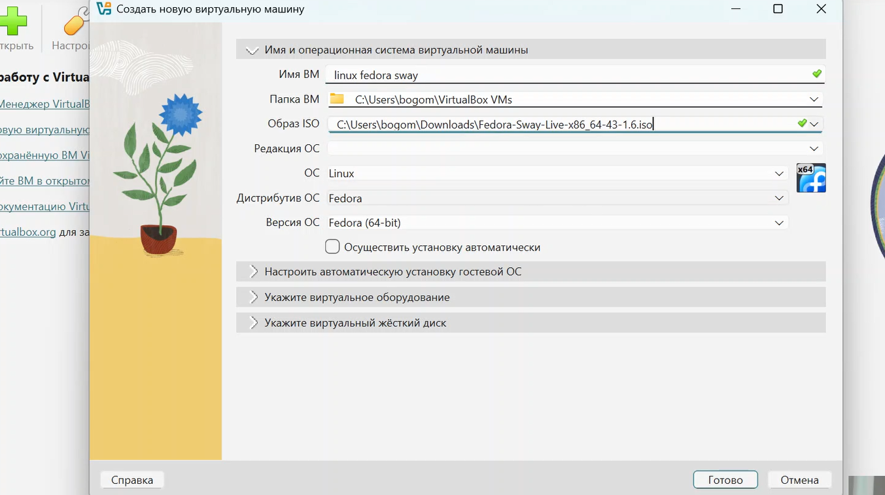{#fig-001 width=70%}

2)liveinst установка
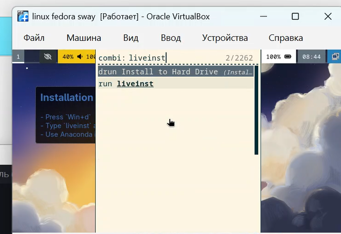{#fig-002 width=70%}

3)установка dkms
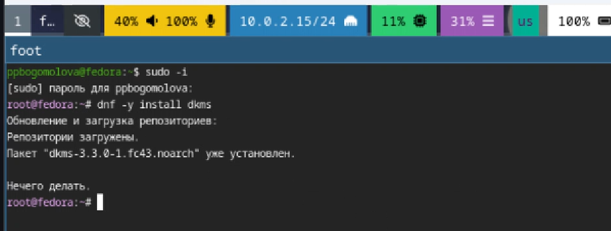{#fig-003 width=70%}

4)монтирование
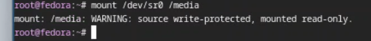{#fig-004 width=70%}

5)Guest additions
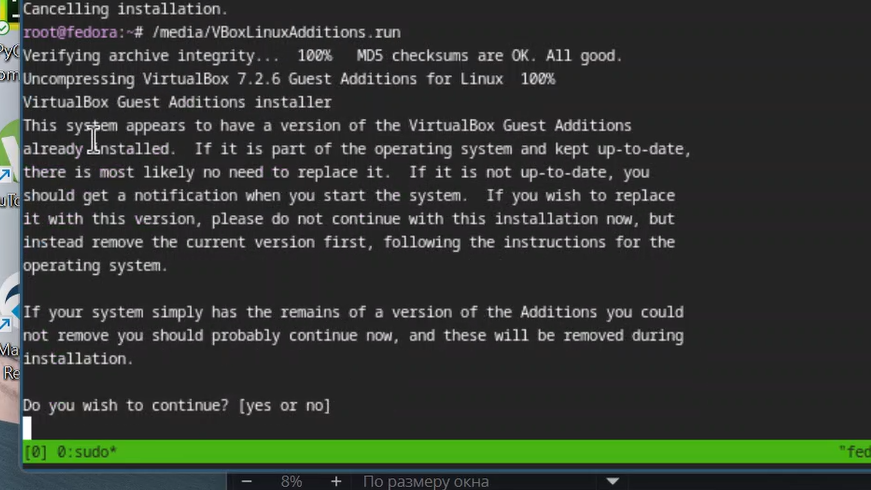{#fig-005 width=70%}

6)Перезагрузка системы
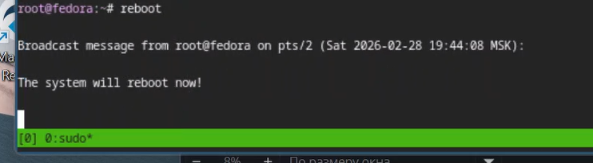{#fig-006 width=70%}

7)Добавление пользователя в группу vboxsf
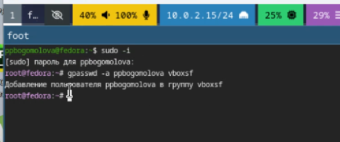{#fig-007 width=70%}

8)Установка мс
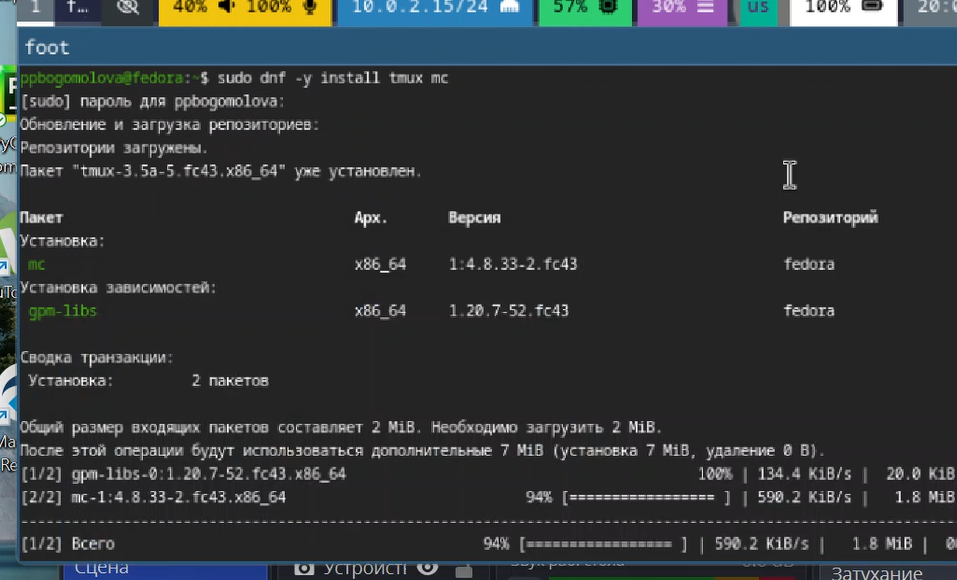{#fig-009 width=70%}

9)Устанавливаем автоматическое обновление
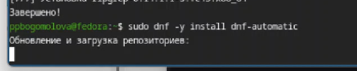{#fig-010 width=70%}
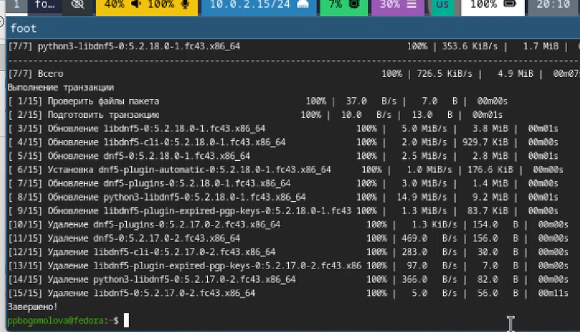{#fig-011 width=70%}
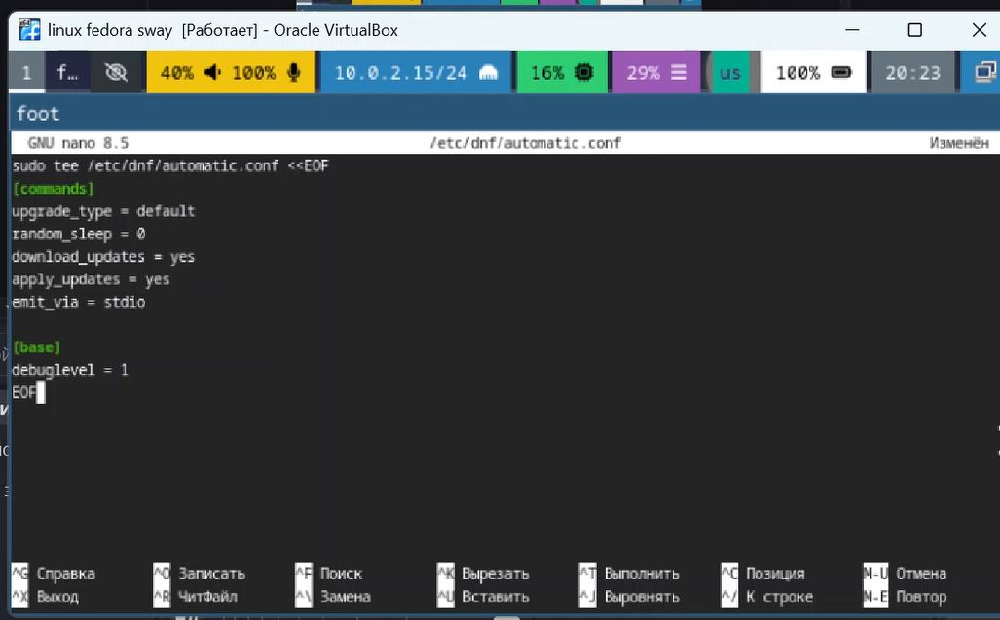{#fig-012 width=70%}

10)Дорабатываем автоматическое обновление уже в терминале и заходим в файл selinux, чтобы его отключить
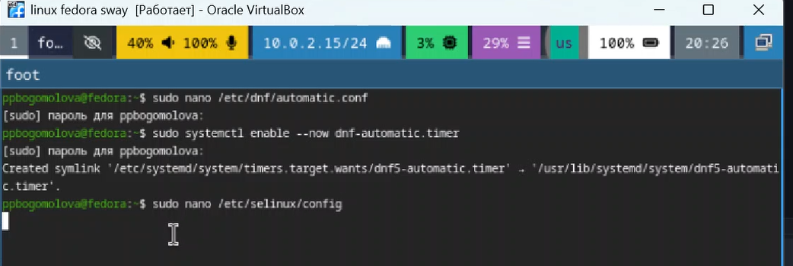{#fig-013 width=70%}
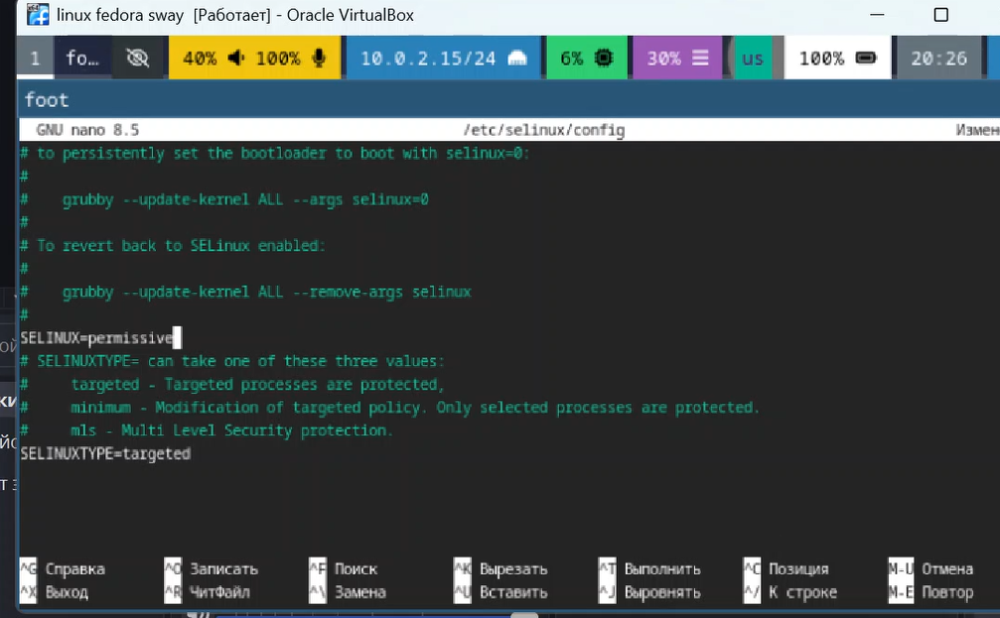{#fig-014 width=70%}

11) Настраиваем клавиатуру, ее раскладку и переключение раскладок
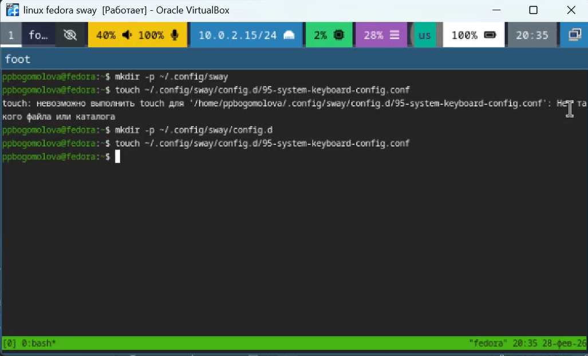{#fig-015 width=70%}
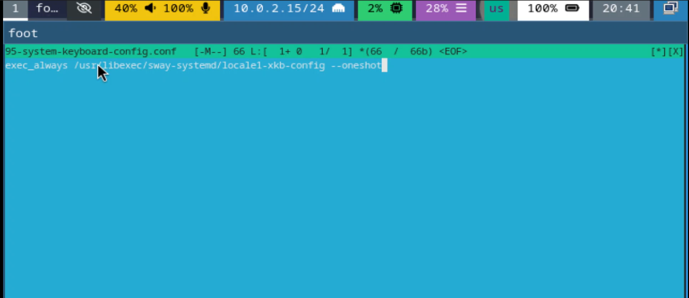{#fig-016 width=70%}
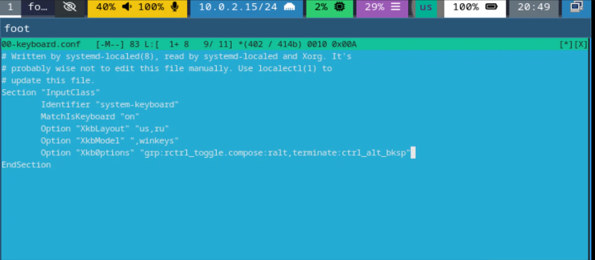{#fig-017 width=70%}

12) Установка pandoc
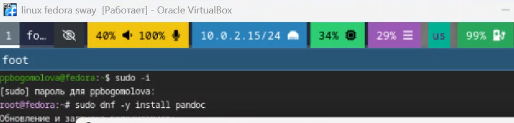{#fig-018 width=70%}
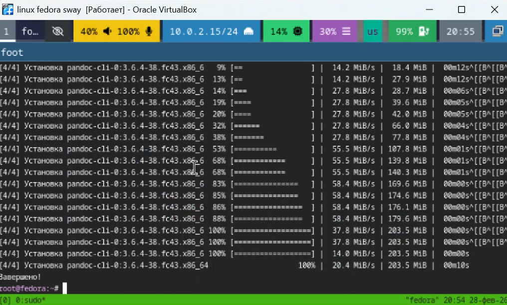{#fig-019 width=70%}

13) Установка текслайв
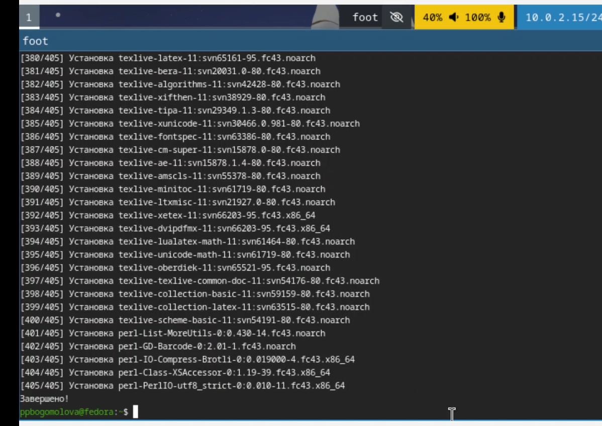{#fig-020 width=70%}

14)Вывод информации о компьютере и его внутренних частях
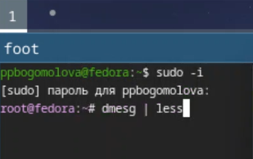{#fig-021 width=70%}
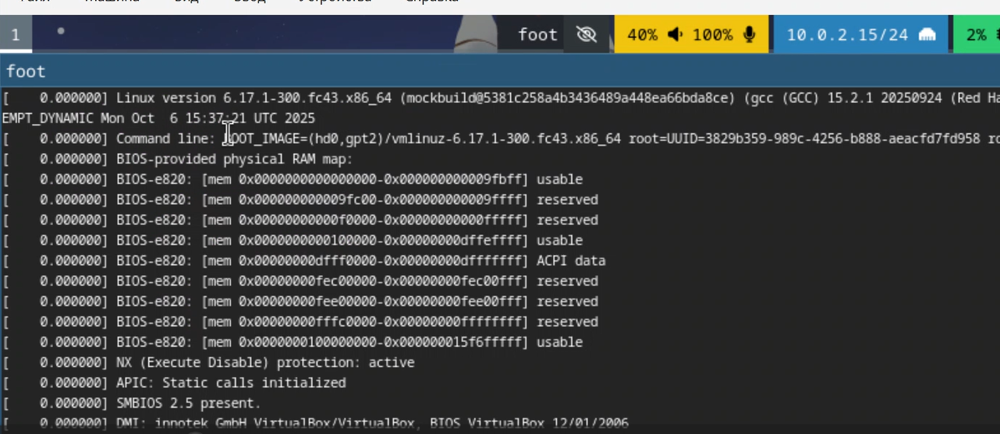{#fig-023 width=70%}
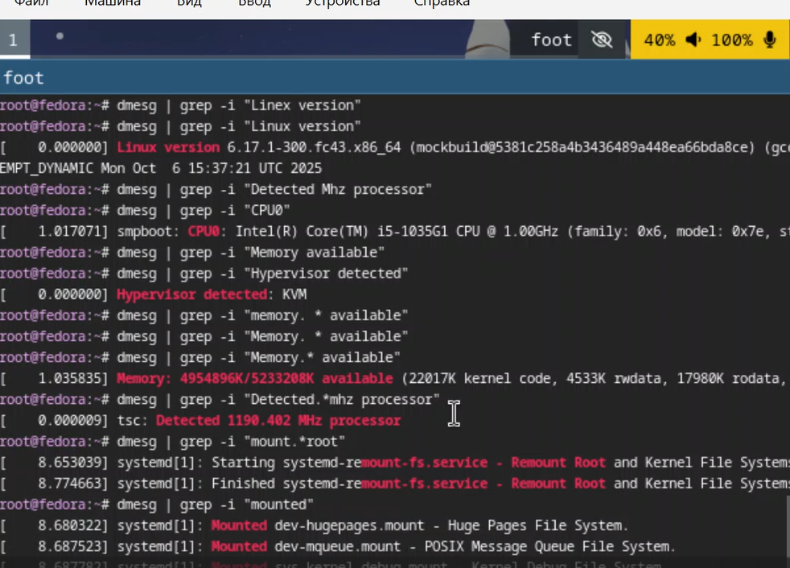{#fig-024 width=70%}

15) Установка пандок кроссреф
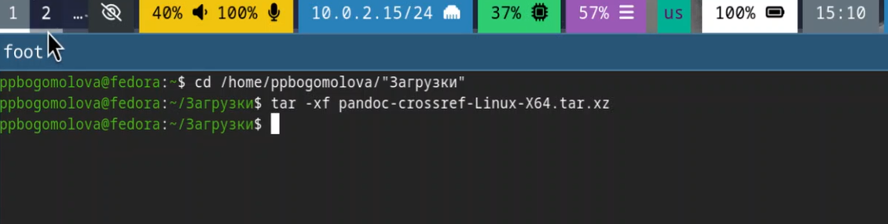{#fig-025 width=70%}
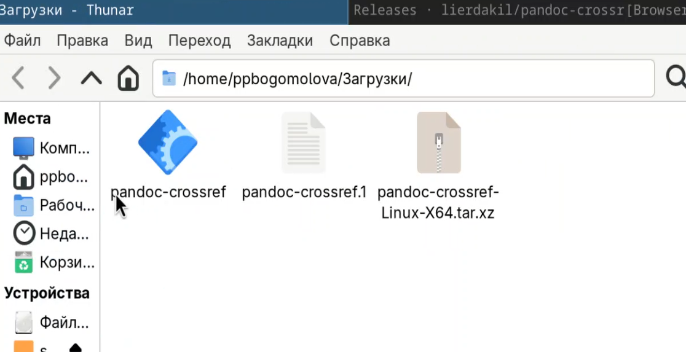{#fig-026 width=70%}
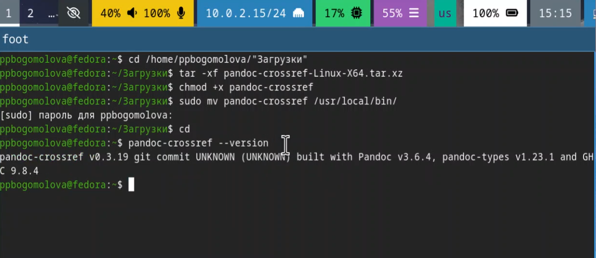{#fig-027 width=70%}

Контрольные вопросы
1. Учетная запись содержит логин, уникальный идентификатор пользователя основной группы, путь к домашней директории, пароль в зашифрованном виде и путь к командной оболочке
2. man ls или cp --help
cd /home/user/docs
ls -la
du -sh folder_name
mkdir folder, touch file, rm file, rm -r folder
chmod 755 script.sh
history
3. Файловая система-это способ организации и хранения данных на диске
4.mount или df -h
5. kill [id процесса] или kill -9 [id процесса]

# Выводы
Я установила операционную систему линукс федора свэй на виртуальную машину, научилась ее настраивать и работать  с ней

# Список литературы
Лабораторная работа 1
