---
## Author
author:
  name: Богомолова Полина Петровна
  degrees: студент
  orcid: 1032253562
  email: 1032253562@rudn.ru
  affiliation:
    - name: Российский университет дружбы народов
      country: Российская Федерация
      postal-code: 117198
      city: Москва
      address: ул. Миклухо-Маклая, д. 6

## Title
title: "Лабораторная работа №2"
subtitle: "Отчет"
license: "Богомолова Полина Петровна"
---

# Цель работы

Изучить идеологию и применение средств контроля версий.Освоить умения по работе с git.

# Задание

Создать базовую конфигурацию для работы с git, создать ключи ssh и pgp, создать подписи git, организовать рабочее пространство правильной структуры по шаблону из репозитория курса для дальнейшего выполнения и отправления заданий по архитектуре компьютеров и операционным системам

# Теоретическое введение

Системы контроля версий (Version Control System, VCS) применяются при работе нескольких человек над одним проектом. Обычно основное дерево проекта хранится в локальном или удалённом репозитории, к которому настроен доступ для участников проекта. При внесении изменений в содержание проекта система контроля версий позволяет их фиксировать, совмещать изменения, произведённые разными участниками проекта, производить откат к любой более ранней версии проекта, если это требуется.

В классических системах контроля версий используется централизованная модель, предполагающая наличие единого репозитория для хранения файлов. Выполнение большинства функций по управлению версиями осуществляется специальным сервером. Участник проекта (пользователь) перед началом работы посредством определённых команд получает нужную ему версию файлов. После внесения изменений, пользователь размещает новую версию в хранилище. При этом предыдущие версии не удаляются из центрального хранилища и к ним можно вернуться в любой момент. Сервер может сохранять не полную версию изменённых файлов, а производить так называемую дельта-компрессию — сохранять только изменения между последовательными версиями, что позволяет уменьшить объём хранимых данных.

Системы контроля версий поддерживают возможность отслеживания и разрешения конфликтов, которые могут возникнуть при работе нескольких человек над одним файлом. Можно объединить (слить) изменения, сделанные разными участниками (автоматически или вручную), вручную выбрать нужную версию, отменить изменения вовсе или заблокировать файлы для изменения. В зависимости от настроек блокировка не позволяет другим пользователям получить рабочую копию или препятствует изменению рабочей копии файла средствами файловой системы ОС, обеспечивая таким образом, привилегированный доступ только одному пользователю, работающему с файлом.

Системы контроля версий также могут обеспечивать дополнительные, более гибкие функциональные возможности. Например, они могут поддерживать работу с несколькими версиями одного файла, сохраняя общую историю изменений до точки ветвления версий и собственные истории изменений каждой ветви. Кроме того, обычно доступна информация о том, кто из участников, когда и какие изменения вносил. Обычно такого рода информация хранится в журнале изменений, доступ к которому можно ограничить.

В отличие от классических, в распределённых системах контроля версий центральный репозиторий не является обязательным.

Среди классических VCS наиболее известны CVS, Subversion, а среди распределённых — Git, Bazaar, Mercurial. Принципы их работы схожи, отличаются они в основном синтаксисом используемых в работе команд.

# Выполнение лабораторной работы

1) Перейдем в режим суперпользователя с помощью команды sudo -i.Установим гит с помощью команды dnf install git
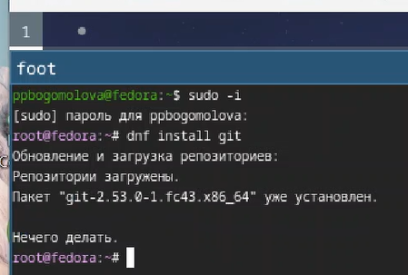{#fig-001 width=70%}

2) Выполнение базовой настройки гит. Создаем ключ ssh по алгоритму рса
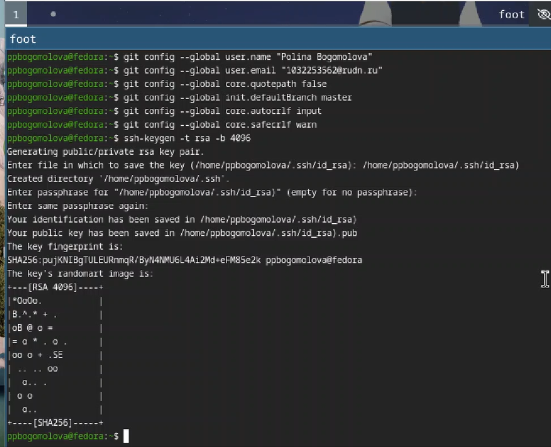{#fig-002 width=70%}

3) Создание ssh ключа по алгоритму ed25519
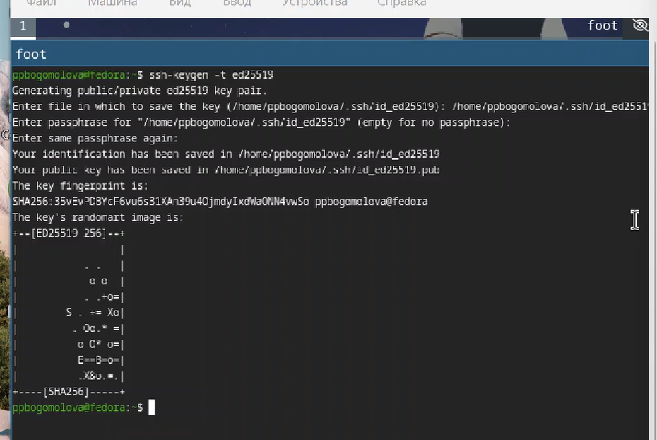{#fig-003 width=70%}

4) Выводим ключ с помощью команды cat
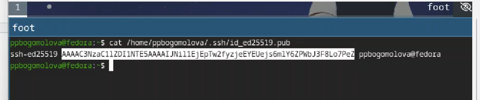{#fig-004 width=70%}

5) Добавляю ключ ssh на гитхаб
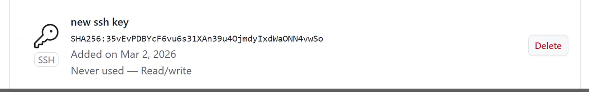{#fig-005 width=70%}

6)Генерирую gpg ключ
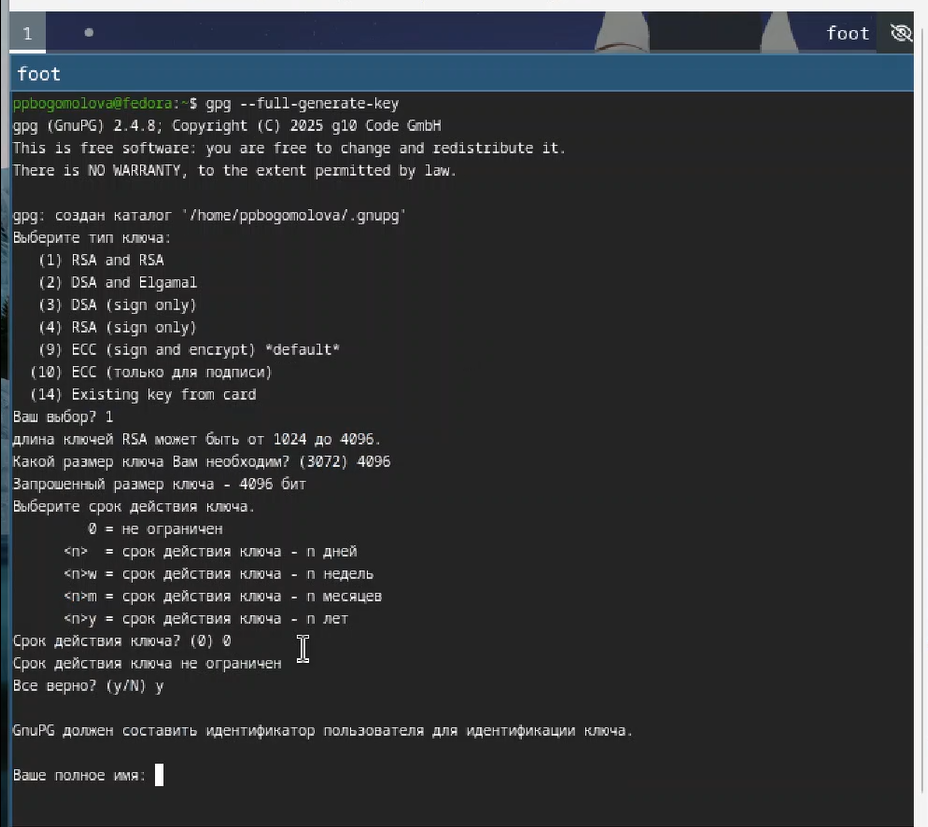{#fig-006 width=70%}

7)Создаю пароль для ключа
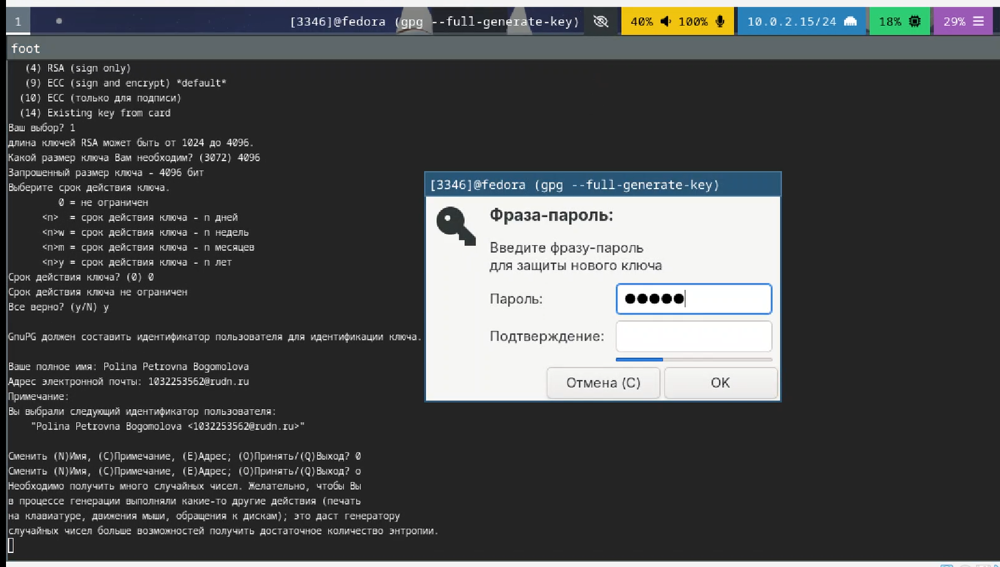{#fig-007 width=70%}

8) Успешно
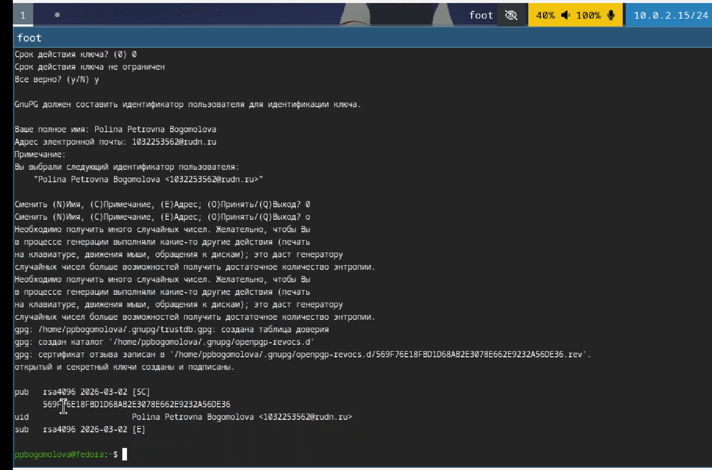{#fig-008 width=70%}

9)Устанавливаю xclip
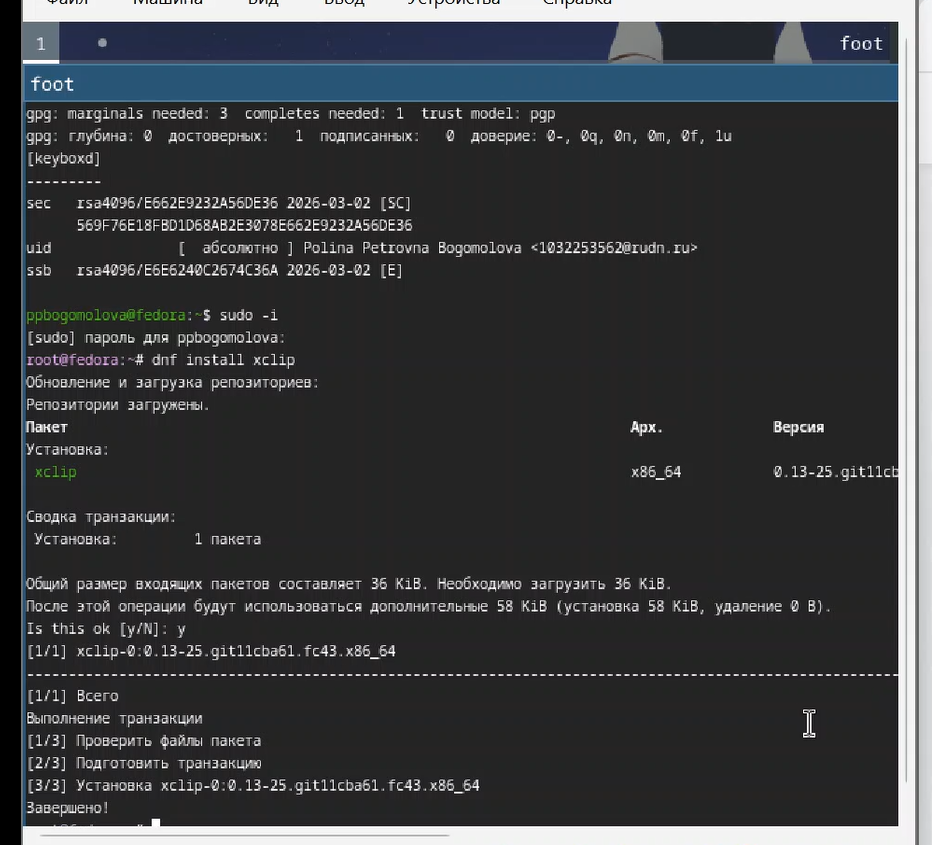{#fig-009 width=70%}

11)Выводим список ключей и копируем отпечаток приватного ключа
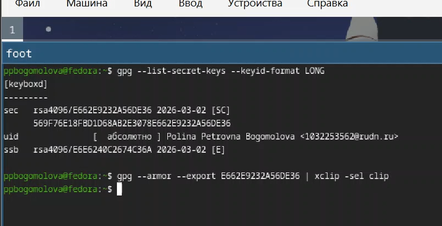{#fig-011 width=70%}

12)Gpg ключ добавляем на гитхаб
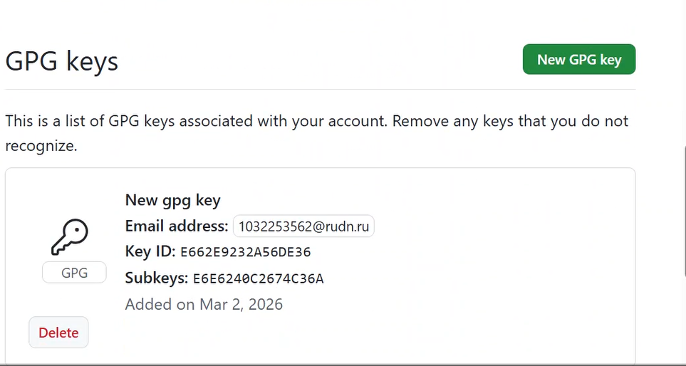{#fig-012 width=70%}

13)Настраиваем автоматические подписи коммитов гит
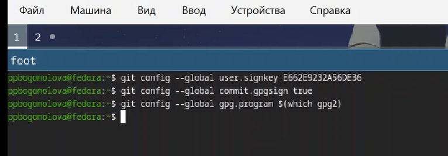{#fig-013 width=70%}

14)Устанавливаю gh
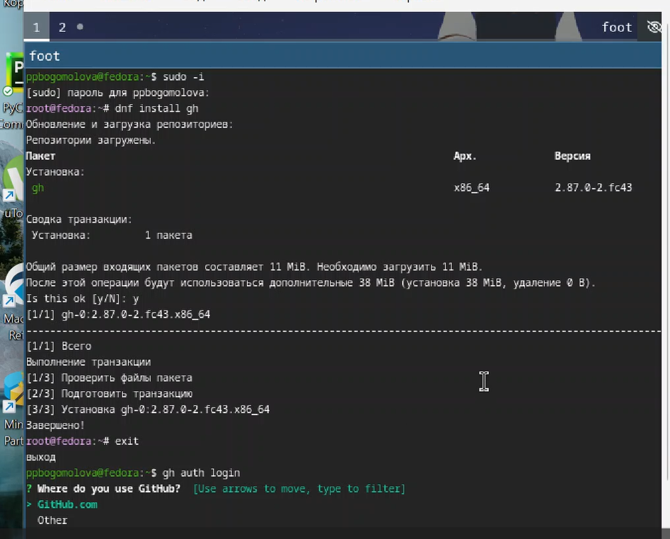{#fig-014 width=70%}

15)Авторизация в gh
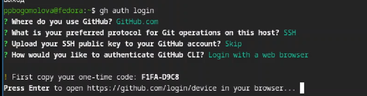{#fig-015 width=70%}

16)Активация устройства по ссылке
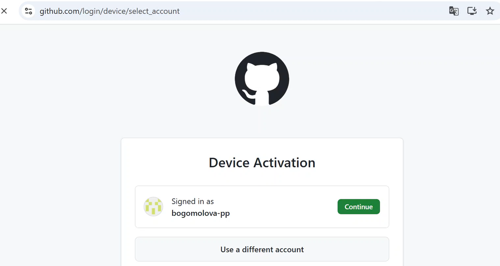{#fig-016 width=70%}

17)Создание репозитория курса на основе шаблона 
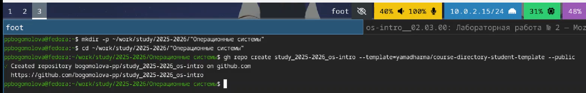{#fig-017 width=70%}

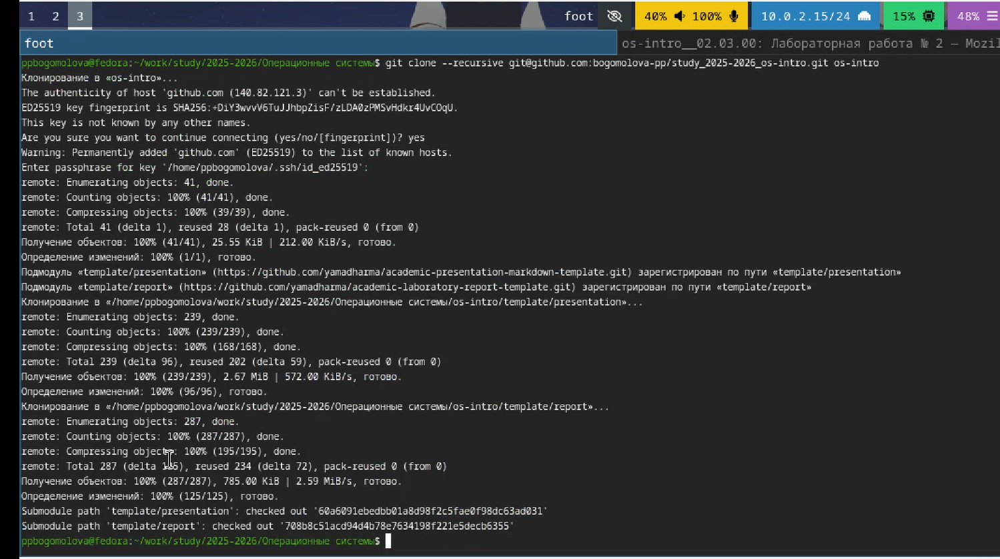{#fig-018 width=70%}

18) Настройка каталога курса
{#fig-019 width=70%}

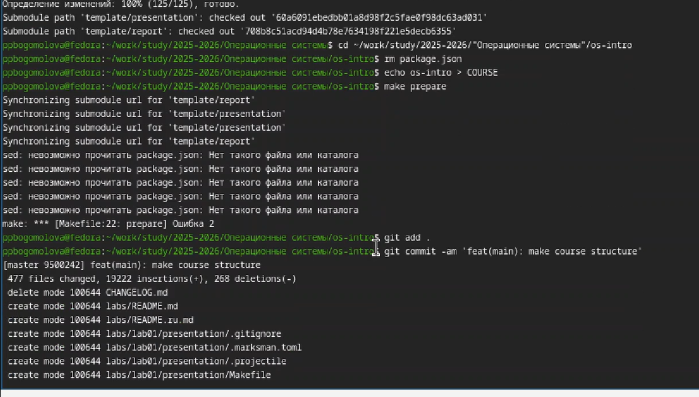{#fig-020 width=70%}

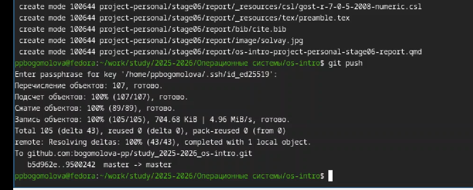{#fig-021 width=70%}

# Выводы

В результате выполнения лабораторной работы я приобрела навыки работы с git, настроила все необходимые элементы каталогов курса для дальнейших учебных задач, научилась создавать кключи shh и gpg и авторизовалась в gh

# Список литературы{.unnumbered}
[Лабораторная работа №2]<https://esystem.rudn.ru/mod/page/view.php?id=1358183#orgaf37536>

