---
## Author
author:
  name: Богомолова Полина Петровна
  degrees: студент
  orcid: 1032253562
  email: 1032253562@rudn.ru
  affiliation:
    - name: Российский университет дружбы народов
      country: Российская Федерация
      postal-code: 117198
      city: Москва
      address: ул. Миклухо-Маклая, д. 6

## Title
title: "Отчет по Лабораторной Работе №5"
subtitle: "Настройка рабочей среды"
license: 1032253562"
---

# Цель работы

Установить менеджер паролей pass и gopass,научиться работать с ними. Научиться настраивать интерфейс для работы с браузером. Научиться связывать виртуальные машины через гит для дальнейшей настройки с помощью одной команды

# Задание

Установить pass, gopass,просмотреть списсок гпг ключей, инициализировать хранилище, синхронизировать с гит, настроить интерфейс для работы с браузером,сохранить пароль и сгенерировать новый, установить дополнительно программное обеспечние, установить бинарный файл, создать собственный репоизторий с помощью утилит,подключить репозиторий к системе,научиться использовать chezmoi на нескольких машинах, настроить новую машину с помощью одной команды, выполнить ежедневные операции с chezmoi

# Теоретическое введение

Pass-это программа для безопасного хранения, управления и генерации паролей.
 
Chezmoi-это инструмент командной строки для управления конфигурационными файлами. Он позволяет синхронизировать настройки, конфигурации и персонализации между различными системами

# Выполнение лабораторной работы

1-2) Установим менеджер паролей pass 

{#fig-001 width=70%}

{#fig-002 width=70%}

3-4) Установим gopass

{#fig-003 width=70%}

{#fig-004 width=70%}

5) Просмотрим список имеющихся gpg ключей

{#fig-005 width=70%}

6) Инициализируем хранилище 

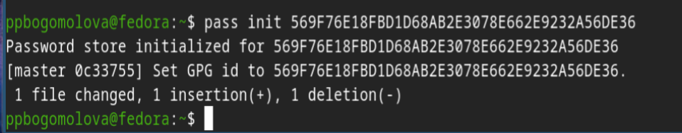{#fig-006 width=70%}

7) Создадим структуру git

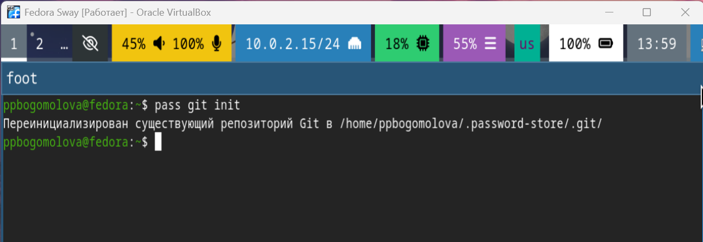{#fig-007 width=70%}

8)Зададим адрес репозитория на хостинге

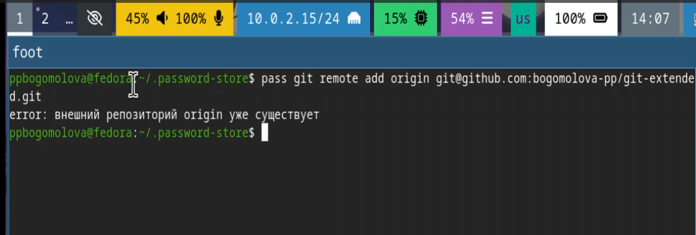{#fig-038 width=70%}

9) Выполняем синхронизацию 

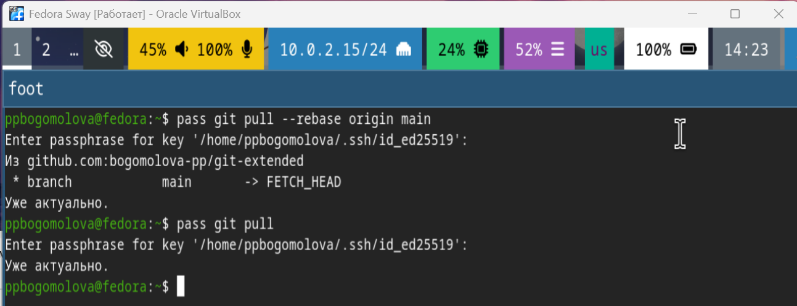{#fig-008 width=70%}

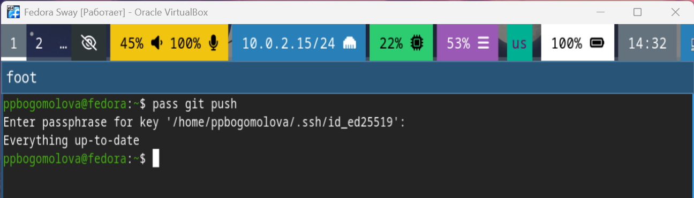{#fig-009 width=70%}

10) Прямые изменения. Следует заметить, что отслеживаются только изменения, сделанные через сам gopass (или pass).Если изменения сделаны непосредственно на файловой системе, необходимо вручную закоммитить и выложить изменения. Сделаем это вручную

{#fig-010 width=70%}

11) Проверим статус синхронизации

{#fig-011 width=70%}

12)Настройка интерфейса с броузером. Для взаимодействия с броузером используется интерфейс native messaging.Поэтому кроме плагина к броузеру устанавливается программа, обеспечивающая интерфейс native messaging.

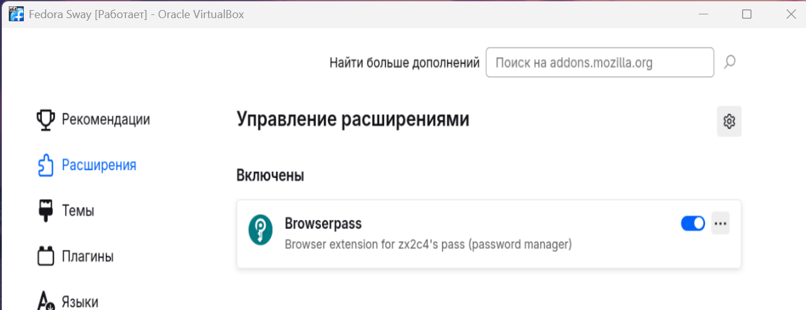{#fig-012 width=70%}

13) Подключение репозитория maximbaz/browserpass

{#fig-013 width=70%}

14-15) Установка browserpass в терминале

{#fig-014 width=70%}

{#fig-015 width=70%}

16) Создаем новый пароль password

{#fig-016 width=70%}

17) Выводим созданный пароль из хранилища паролей

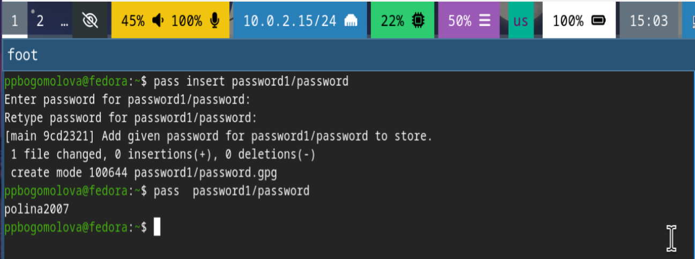{#fig-017 width=70%}

18-19) Устанавливаем дополнительное ПО

{#fig-018 width=70%}

{#fig-019 width=70%}

20) Генерация нового пароля 

{#fig-020 width=70%}

21) Подключение стороннего репозитория

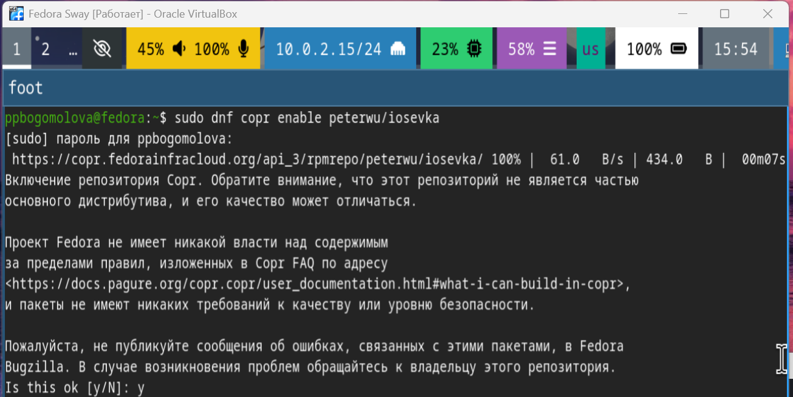{#fig-021 width=70%}

22-23) Выполняем команду search iosevka

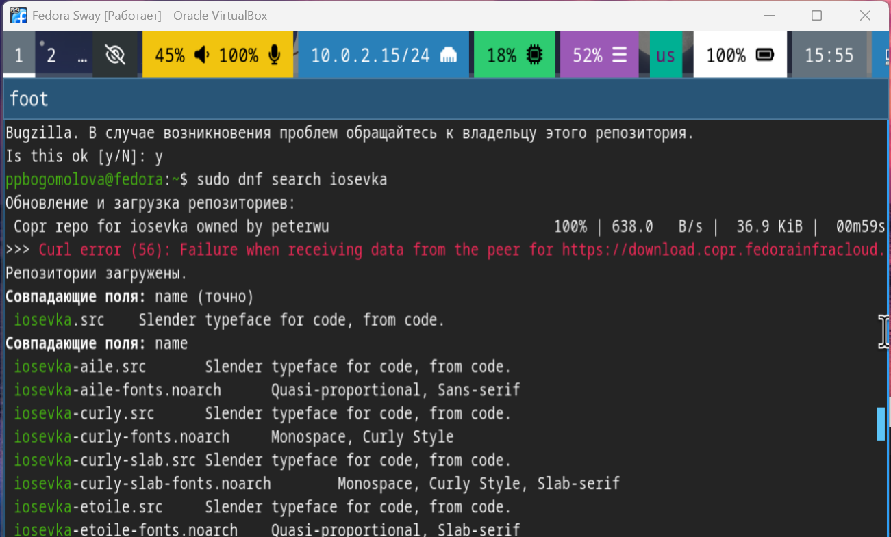{#fig-022 width=70%}

{#fig-023 width=70%}

24) Успешная установка iosevka

{#fig-024 width=70%}

25) Установка бинарного файла.Скрипт определяет архитектуру процессора и операционную систему и скачивает необходимый файл

{#fig-025 width=70%}

26) Создание репозитория для конфигурационных файлов.Будем использовать утилиты командной строки для работы с github.Создадим свой репозиторий для конфигурационных файлов на основе шаблона

{#fig-026 width=70%}

27) Инициализируем chezmoi с нашим репозиторием dotfiles

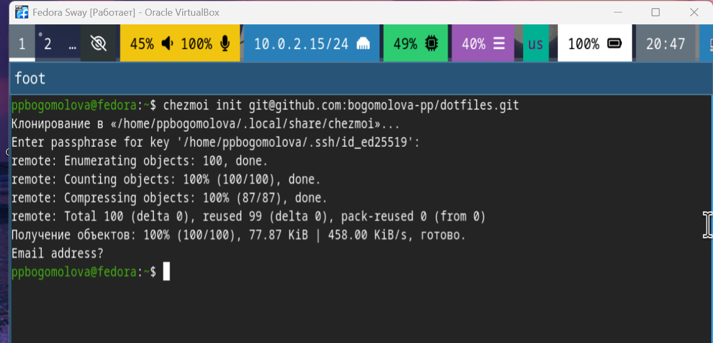{#fig-027 width=70%}

28)Проверьте, какие изменения внесёт chezmoi в домашний каталог

{#fig-039 width=70%}

{#fig-040 width=70%}

29) Использование chezmoi на нескольких машинах. На второй машине инициализируем chezmoi с нашим репозиторием dotfiles

{#fig-029 width=70%}

30) Проверьте, какие изменения внесёт chezmoi в домашний каталог

{#fig-030 width=70%}

31) Применяем изменения, которые внесет chezmoi

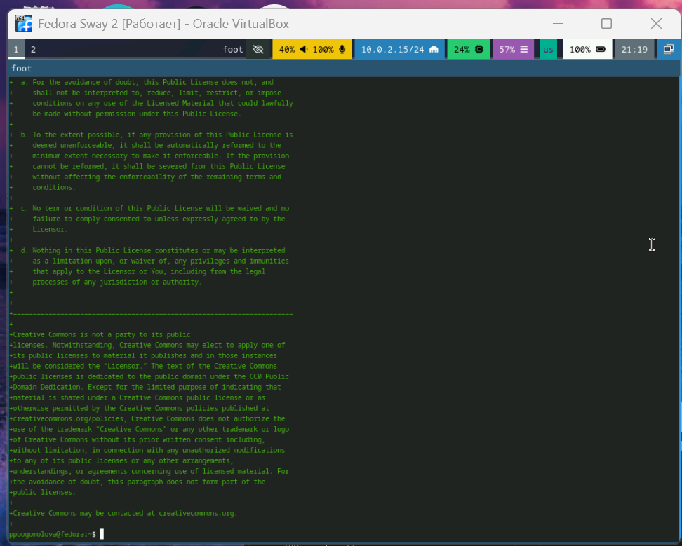{#fig-031 width=70%}

32-33) При существующем каталоге chezmoi можно получить и применить последние изменения из нашего репозитория

{#fig-032 width=70%}

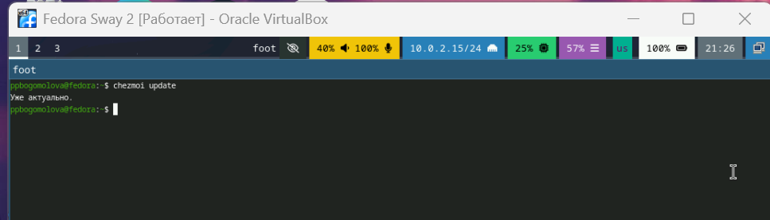{#fig-033 width=70%}

34) Настройка новой машины с помощью одной команды. Можно установить свои dotfiles на новый компьютер с помощью одной команды

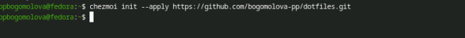{#fig-034 width=70%}

35) Выполняем команду chezmoi apply

{#fig-035 width=70%}

36) Автоматически фиксируем и отправляем изменения в репозиторий.Можно автоматически фиксировать и отправлять изменения в исходный каталог в репозиторий.Эта функция отключена по умолчанию.Чтобы включить её, добавим в файл конфигурации ~/.config/chezmoi/chezmoi.toml следующее:

    [git]
        autoCommit = true
        autoPush = true

    Всякий раз, когда в исходный каталог вносятся изменения, chezmoi фиксирует изменения с помощью автоматически сгенерированного сообщения фиксации и отправляет их в ваш репозиторий.
    Будьте осторожны при использовании autoPush. Если ваш репозиторий dotfiles является общедоступным, и вы случайно добавили секрет в виде обычного текста, этот секрет будет отправлен в ваш общедоступный репозиторий.

{#fig-036 width=70%}

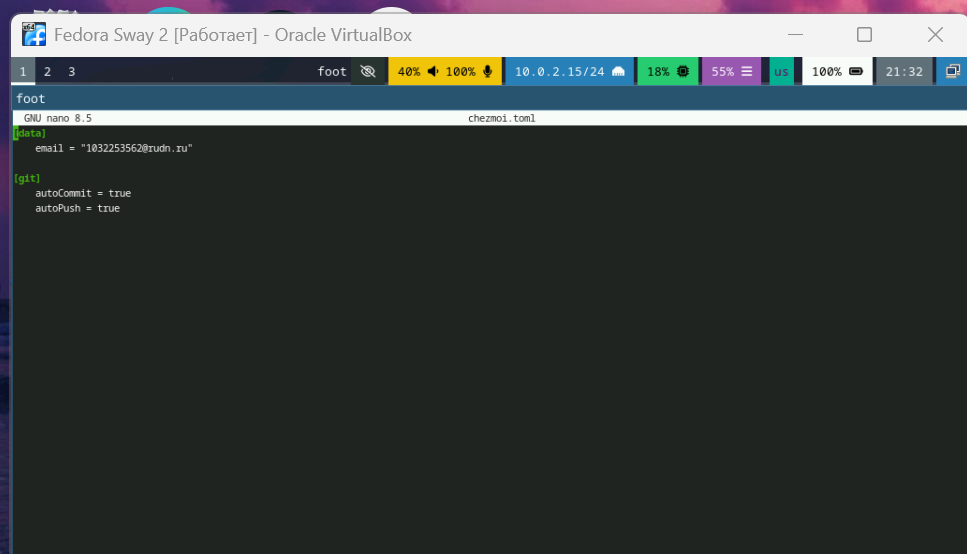{#fig-037 width=70%}

# Выводы

Мы установили менеджер паролей pass и gopass и научились работать с ними. Научились настраивать интерфейс для работы с браузером,подключать расширения для браузера. Научились связывать виртуальные машины с помощью одной команды

