# Информация о докладчике

Богомолова Полина Петровна  
ФФМиЕН  
НКАбд01-25  
1032253562

---

# Цель работы

Приобретение практических навыков взаимодействия пользователя с системой посредством командной строки.

---

# Задание

Определить полное имя домашнего каталога.  
Изучить работу команд cd, pwd и ls.  
Создать и удалить каталоги с помощью mkdir, rmdir и rm.  
Использовать команду man для изучения опций команд.  
Освоить использование истории команд.

---

# Теоретическое введение

Командой в операционной системе называется записанный по специальным правилам текст, представляющий собой указание на выполнение определённого действия в системе.

Обычно первым словом записывается имя команды, а остальные элементы строки являются аргументами или опциями, которые уточняют выполняемое действие.

Команда man используется для просмотра руководства по командам Linux.  
Команда cd применяется для перемещения по файловой системе.  
Команда pwd выводит полный путь текущего каталога.  
Команда ls показывает содержимое каталога.  
Команда mkdir используется для создания каталогов.  
Команда rm используется для удаления файлов и каталогов.  
Команда history выводит список ранее выполненных команд.

---

# Определение имени домашнего каталога

{#fig-001 width=60%}

---

# Переход в каталог /tmp

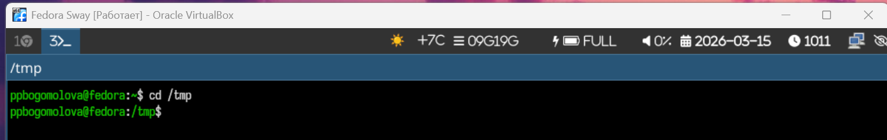{#fig-002 width=60%}

---

# Команда ls

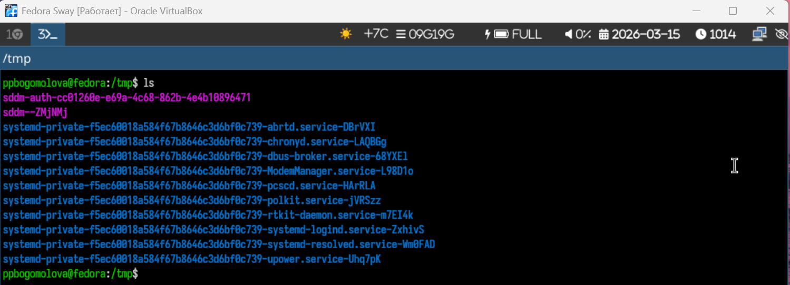{#fig-003 width=60%}

---

# Команда ls -a

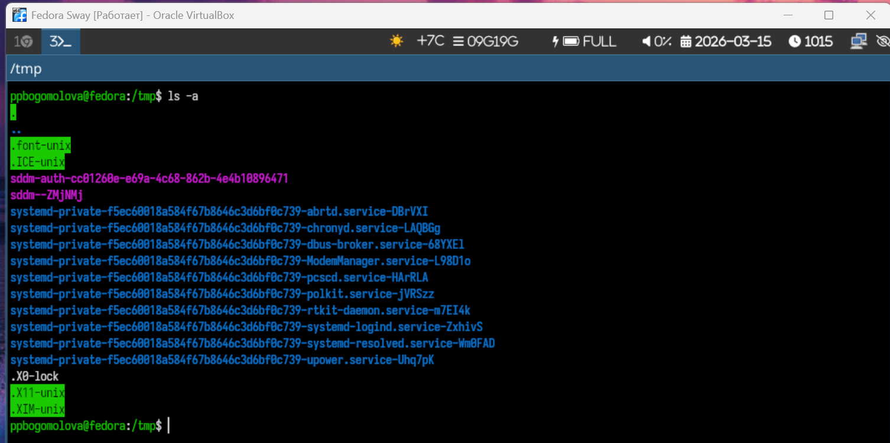{#fig-004 width=60%}

---

# Команда ls -l

{#fig-005 width=60%}

---

# Команда ls -alF

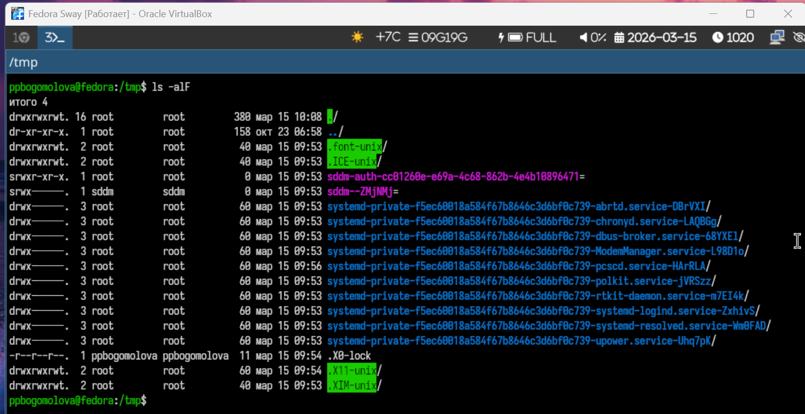{#fig-006 width=60%}

---

# Команда ls -R

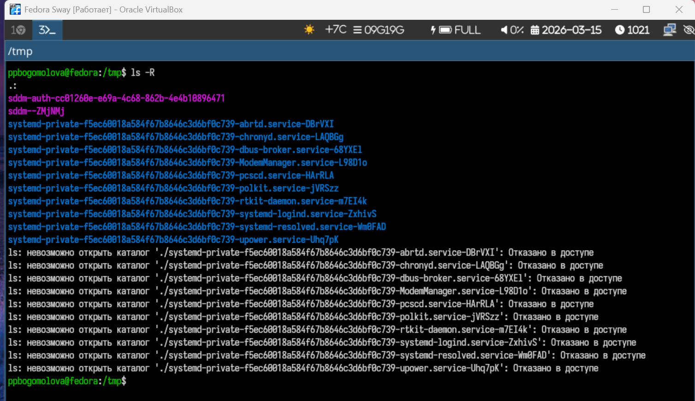{#fig-007 width=60%}

---

# Проверка каталога cron

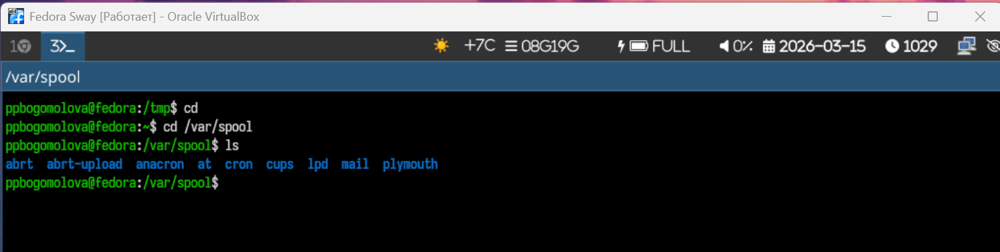{#fig-008 width=60%}

---

# Просмотр содержимого домашнего каталога

{#fig-009 width=60%}

---

# Создание каталога newdir

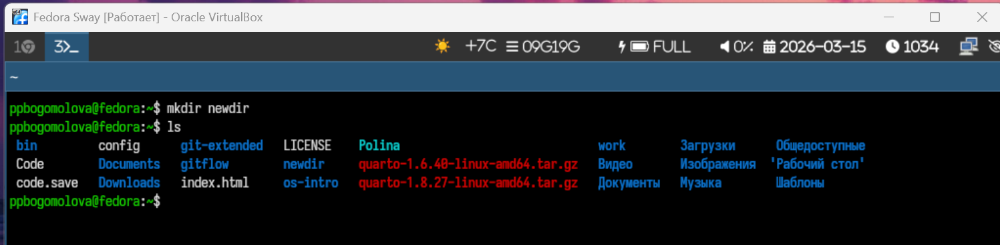{#fig-010 width=60%}

---

# Создание каталога morefun

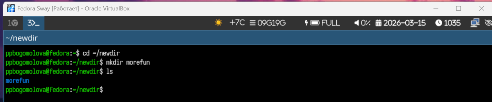{#fig-011 width=60%}

---

# Создание и удаление нескольких каталогов

{#fig-012 width=60%}

---

# Попытка удаления каталога

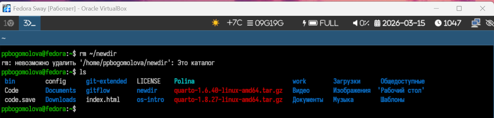{#fig-013 width=60%}

---

# Удаление каталога morefun

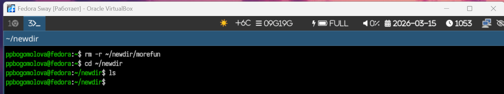{#fig-014 width=60%}

---

# Просмотр справки по команде

{#fig-015 width=60%}

---

# Использование ls -R

{#fig-016 width=60%}

---

# Поиск информации о команде

{#fig-017 width=60%}

---

# Сортировка файлов по времени изменения

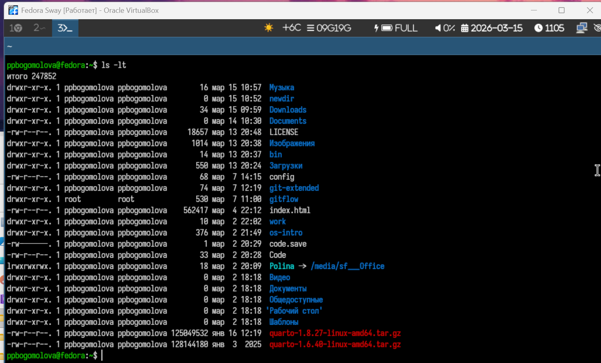{#fig-018 width=60%}

---

# Просмотр справки по команде cd

{#fig-019 width=60%}

---

# Использование команды cd

{#fig-020 width=60%}

---

# Просмотр справки по команде pwd

{#fig-021 width=60%}

---

# Использование команды pwd

{#fig-022 width=60%}

---

# Просмотр справки по команде mkdir

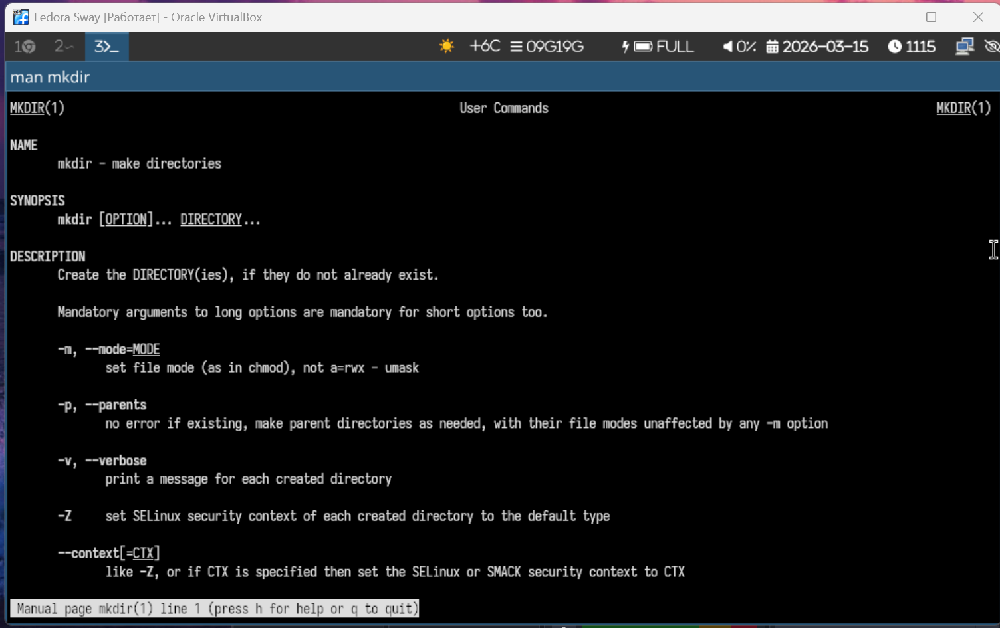{#fig-023 width=60%}

---

# Использование команды mkdir

{#fig-024 width=60%}

---

# Просмотр справки по команде rmdir

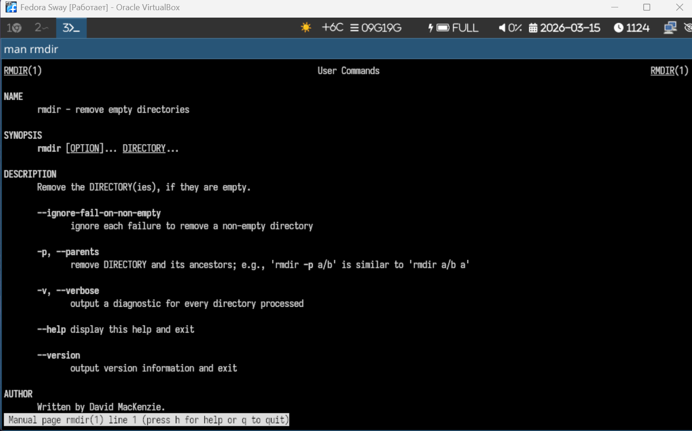{#fig-025 width=60%}

---

# Использование команды rmdir

{#fig-026 width=60%}

---

# Просмотр справки по команде rm

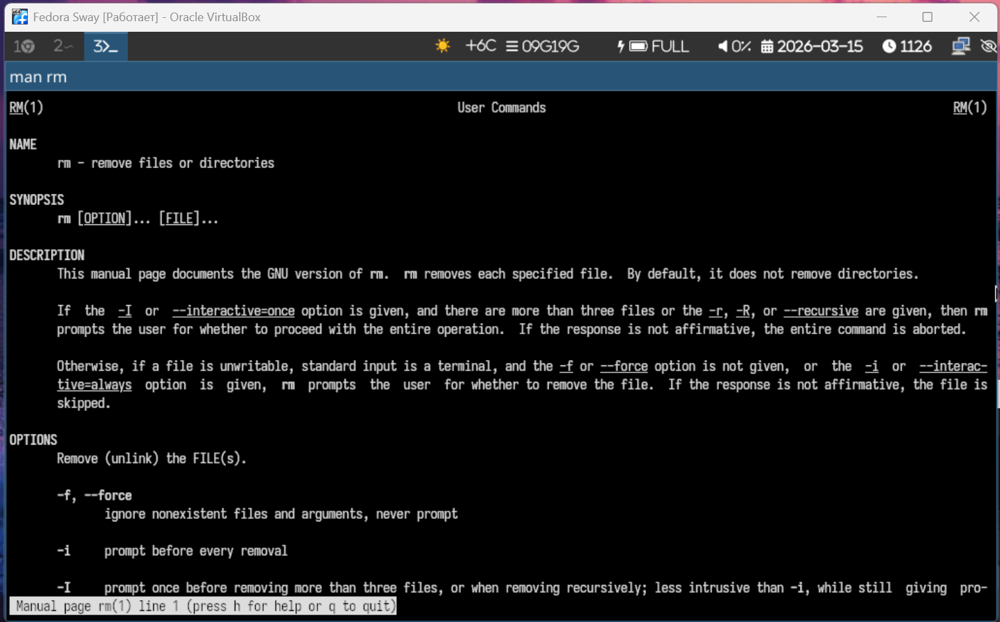{#fig-027 width=60%}

---

# Использование команды rm

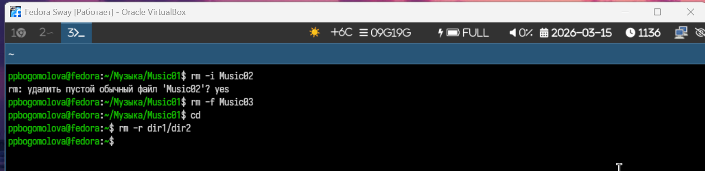{#fig-028 width=60%}

---

# Просмотр истории команд

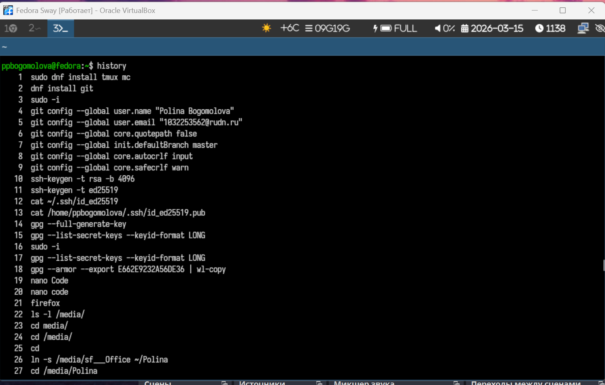{#fig-029 width=60%}

---

# Использование команд из истории

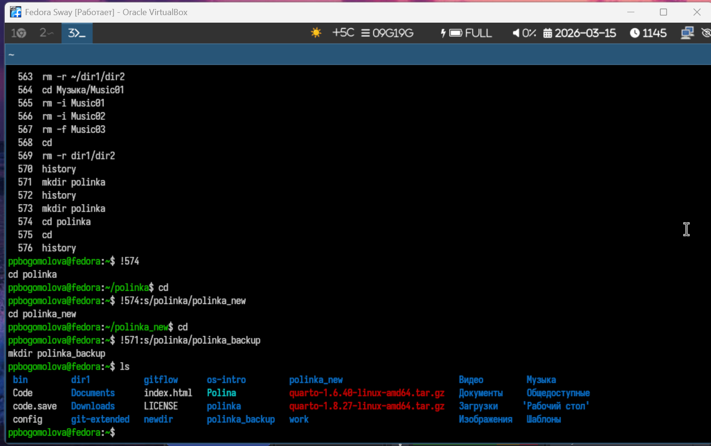{#fig-030 width=60%}

---

# Контрольные вопросы

1. Командная строка — текстовый интерфейс взаимодействия пользователя с ОС.  
2. Абсолютный путь текущего каталога определяется командой pwd, пример: /home/student/docs  
3. Тип файлов и их имена: "ls -F "
4. Показ скрытых файлов: "ls -a, ls -la " 
5. Удаление: rm файл, rmdir каталог," rm -r каталог  "
6. Просмотр последних команд: history  
7. Использование истории: "!!, !номер_команды, !начало_команды  "
8. Несколько команд в строке: "mkdir test; cd test, ls && pwd, ls || echo error  "
9. Символы экранирования: "\ (например, touch file\ name.txt)  "
10. ls -l показывает права, владельца, размер, дату изменения и имя файла  
11. Относительный путь:" cat docs/file.txt, абсолютный: cat /home/student/docs/file.txt  "
12. Информация о команде: man имя_команды, имя_команды --help, info имя_команды  
13. Автодополнение команд и файлов: клавиша Tab

---

# Выводы

В ходе выполнения лабораторной работы были получены практические навыки работы с командной строкой Unix. Изучены команды навигации, создания и удаления каталогов, просмотра содержимого, работы со справочной системой и историей команд
