---
## Author
author:
  name: Богомолова Полина Петровна
  degrees: студент
  orcid: 1032253562
  email: 1032253562@rudn.ru
  affiliation:
    - name: Российский университет дружбы народов
      country: Российская Федерация
      postal-code: 117198
      city: Москва
      address: ул. Миклухо-Маклая, д. 6

## Title
title: "Отчет по Лабораторной Работе №6"
subtitle: "Основы интерфейса взаимодействия
пользователя с системой Unix на уровне командной строки"
license: 1032253562/
---

# Цель работы

Приобретение практических навыков взаимодействия пользователя с системой по-
средством командной строки

# Задание

1. Определите полное имя вашего домашнего каталога. Далее относительно этого ката-
лога будут выполняться последующие упражнения.
2. Выполните следующие действия:
2.1. Перейдите в каталог /tmp.
2.2. Выведите на экран содержимое каталога /tmp. Для этого используйте команду ls
с различными опциями. Поясните разницу в выводимой на экран информации.
2.3. Определите, есть ли в каталоге /var/spool подкаталог с именем cron?
2.4. Перейдите в Ваш домашний каталог и выведите на экран его содержимое. Опре-
делите, кто является владельцем файлов и подкаталогов?
3. Выполните следующие действия:
3.1. В домашнем каталоге создайте новый каталог с именем newdir.
3.2. В каталоге ~/newdir создайте новый каталог с именем morefun.
3.3. В домашнем каталоге создайте одной командой три новых каталога с именами
letters, memos, misk. Затем удалите эти каталоги одной командой.
3.4. Попробуйте удалить ранее созданный каталог ~/newdir командой rm. Проверьте,
был ли каталог удалён.
3.5. Удалите каталог ~/newdir/morefun из домашнего каталога. Проверьте, был ли
каталог удалён.
4. С помощью команды man определите, какую опцию команды ls нужно использо-
вать для просмотра содержимое не только указанного каталога, но и подкаталогов,
входящих в него.
5. С помощью команды man определите набор опций команды ls, позволяющий отсорти-
ровать по времени последнего изменения выводимый список содержимого каталога
с развёрнутым описанием файлов.
6. Используйте команду man для просмотра описания следующих команд: cd, pwd, mkdir,
rmdir, rm. Поясните основные опции этих команд.
7. Используя информацию, полученную при помощи команды history, выполните мо-
дификацию и исполнение нескольких команд из буфера команд

Контрольные вопросы
1. Что такое командная строка?
2. При помощи какой команды можно определить абсолютный путь текущего каталога?
Приведите пример.
3. При помощи какой команды и каких опций можно определить только тип файлов
и их имена в текущем каталоге? Приведите примеры.
4. Каким образом отобразить информацию о скрытых файлах? Приведите примеры.
5. При помощи каких команд можно удалить файл и каталог? Можно ли это сделать
одной и той же командой? Приведите примеры.
6. Каким образом можно вывести информацию о последних выполненных пользовате-
лем командах? работы?
7. Как воспользоваться историей команд для их модифицированного выполнения? При-
ведите примеры.
8. Приведите примеры запуска нескольких команд в одной строке.
9. Дайте определение и приведите примера символов экранирования.
10. Охарактеризуйте вывод информации на экран после выполнения команды ls с опцией
l.
11. Что такое относительный путь к файлу? Приведите примеры использования относи-
тельного и абсолютного пути при выполнении какой-либо команды.
12. Как получить информацию об интересующей вас команде?
13. Какая клавиша или комбинация клавиш служит для автоматического дополнения
вводимых команд?

# Теоретическое введение

Командой в операционной системе называется записанный по
специальным правилам текст (возможно с аргументами), представляющий собой ука-
зание на выполнение какой-либо функций (или действий) в операционной системе.
Обычно первым словом идёт имя команды, остальной текст — аргументы или опции,
конкретизирующие действие.
Общий формат команд можно представить следующим образом:
<имя_команды><разделитель><аргументы>

Команда man используется для просмотра (оперативная помощь) в диа-
логовом режиме руководства (manual) по основным командам операционной системы
типа Linux

Команда cd используется для перемещения по файловой системе опера-
ционной системы типа Linux.

Для определения абсолютного пути к текущему каталогу используется
команда pwd (print working directory)

Команда ls используется для просмотра содержимого каталога.

Команда mkdir используется для создания каталогов.

Команда rm используется для удаления файлов и/или каталогов.

Для вывода на экран списка ранее выполненных команд исполь-
зуется команда history. Выводимые на экран команды в списке нумеруются. 

Eсли требуется выполнить последовательно несколько
команд, записанный в одной строке, то для этого используется символ точка с запятой

# Выполнение лабораторной работы

1) Определим полное имя вашего домашнего каталога с помощью команды pwd

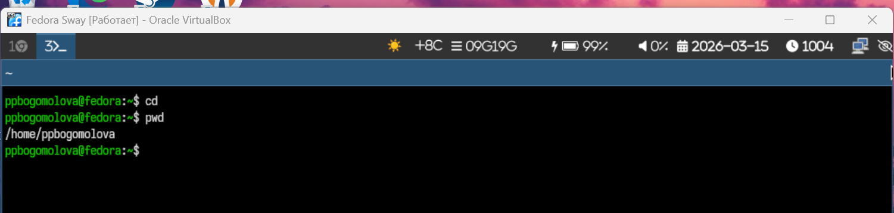{#fig-001 width=70%}

2.1) Перейдем в каталог /tmp с помощью команды cd.

{#fig-002 width=70%}

2.2) Выведем на экран содержимое каталога /tmp. Для этого используем команду ls с различными опциями.

{#fig-003 width=70%}

{#fig-004 width=70%}

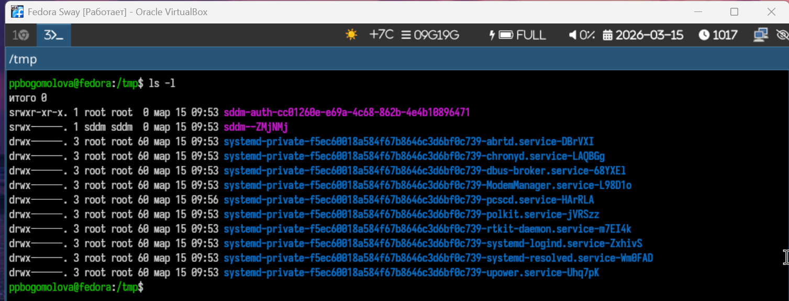{#fig-005 width=70%}

{#fig-006 width=70%}

{#fig-007 width=70%}

Команда ls показывает список файлов и папок в директории. Команда ls -a показывает все файлы, включая скрытые,начинающиеся с '.'. Команда ls -l выводит подробную информацию, права доступа, владельца, размер, дату изменения. Команда ls -alF показывает все файлы в подробном виде и помечает типы файлов. Команда ls -R выводи файлы рекурсивно, то есть показывает содержимое текущей папки и всех ее подпапок.

2.3) Определим, есть ли в каталоге /var/spool подкаталог с именем cron. Для начала перейдем в нужный католог с помощью команды cd, а затем выполним команду ls

{#fig-008 width=70%}

2.4) Перейдем в домашний каталог и выведем на экран его содержимое. Опре-
делим, кто является владельцем файлов и подкаталогов. Используем команды cd и ls -l. Владельцем некоторых файлов является ppbogomolova, а некоторых root

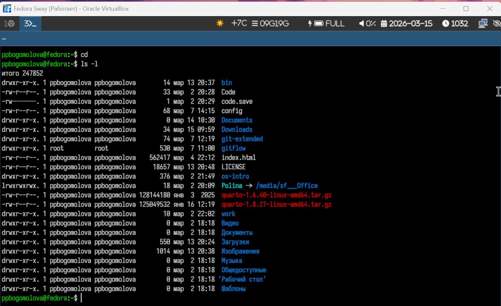{#fig-009 width=70%}

3.1)  В домашнем каталоге создадим новый каталог с именем newdir с помощью команды mkdir

{#fig-010 width=70%}

3.2) В каталоге ~/newdir создадим новый каталог с именем morefun с помощью команды mkdir

{#fig-011 width=70%}

3.3) В домашнем каталоге создадим одной командой три новых каталога с именами
letters, memos, misk. Затем удалим эти каталоги одной командой. Будем использовать команды mkdir и rm -r

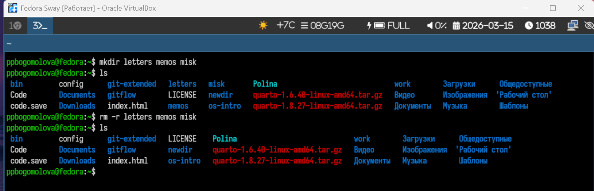{#fig-012 width=70%}

3.4) Попробуем удалить ранее созданный каталог ~/newdir командой rm. Проверим,
был ли каталог удалён. Будем использовать команды rm и ls. Каталог не был удален, так как команда рм удаляет только файлы

{#fig-013 width=70%}

3.5) Удалим каталог ~/newdir/morefun из домашнего каталога. Проверьте, был ли
каталог удалён. Удалим с помощью команды rm -r

{#fig-014 width=70%}

4) С помощью команды man определим, какую опцию команды ls нужно использо-
вать для просмотра содержимое не только указанного каталога, но и подкаталогов,
входящих в него.

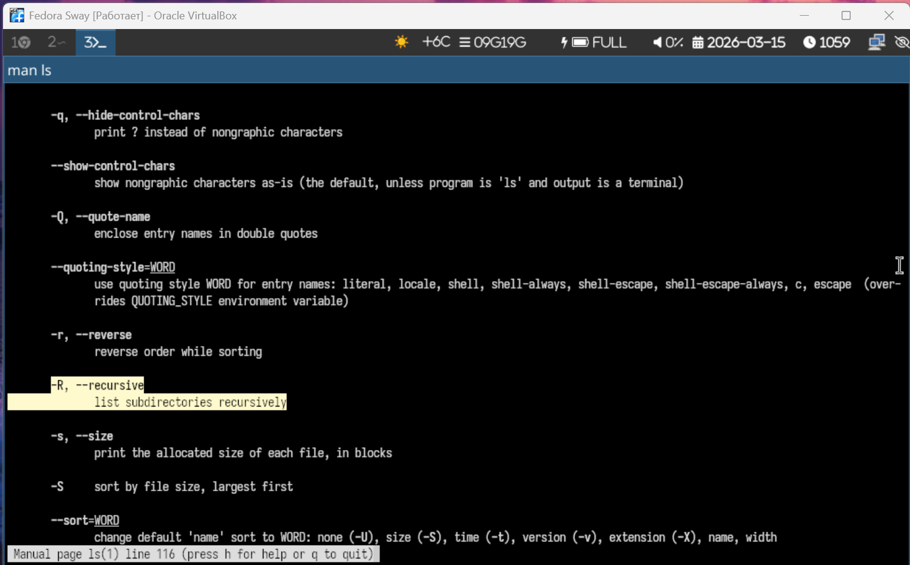{#fig-015 width=70%}

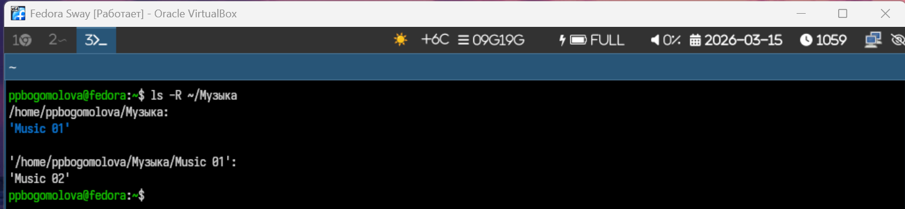{#fig-016 width=70%}

5) С помощью команды man определим набор опций команды ls, позволяющий отсорти-
ровать по времени последнего изменения выводимый список содержимого каталога
с развёрнутым описанием файлов.

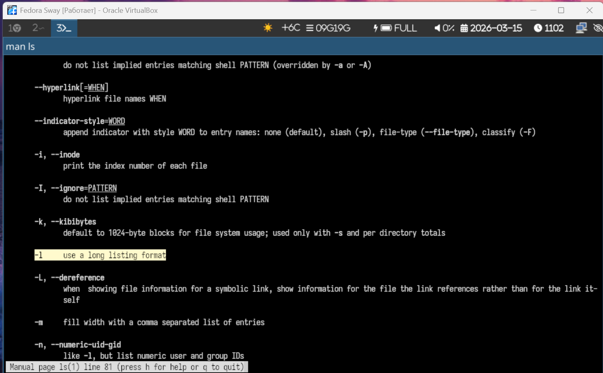{#fig-017 width=70%}

{#fig-018 width=70%}

6) Используем команду man для просмотра описания следующих команд: cd, pwd, mkdir,rmdir, rm. 

cd <каталог> переход в указанный каталог
cd .. переход в родительский каталог
cd ~ переход в домашний каталог
cd - переход в предыдущий каталог
cd / переход в корневой каталог

pwd -L показывает логический путь к текущей директории с учётом символических ссылок, pwd -P показывает физический (реальный) путь без символических ссылок, а pwd --help выводит справочную информацию по команде pwd

mkdir имя_каталога создаёт новый каталог с указанным именем. mkdir -p создаёт каталог вместе с необходимыми родительскими каталогами, если их ещё нет. mkdir -v выводит сообщение о каждом созданном каталоге. mkdir -m 755 имя_каталога создаёт каталог и сразу задаёт для него права доступа 755.

rmdir -p удаляет указанный каталог и при необходимости его пустые родительские каталоги. rmdir --verbose имя_каталога удаляет каталог и выводит сообщение о процессе удаления.

rm -i удаляет файлы с запросом подтверждения перед удалением, rm -f принудительно удаляет файлы без запроса подтверждения, rm -r удаляет каталоги и их содержимое рекурсивно

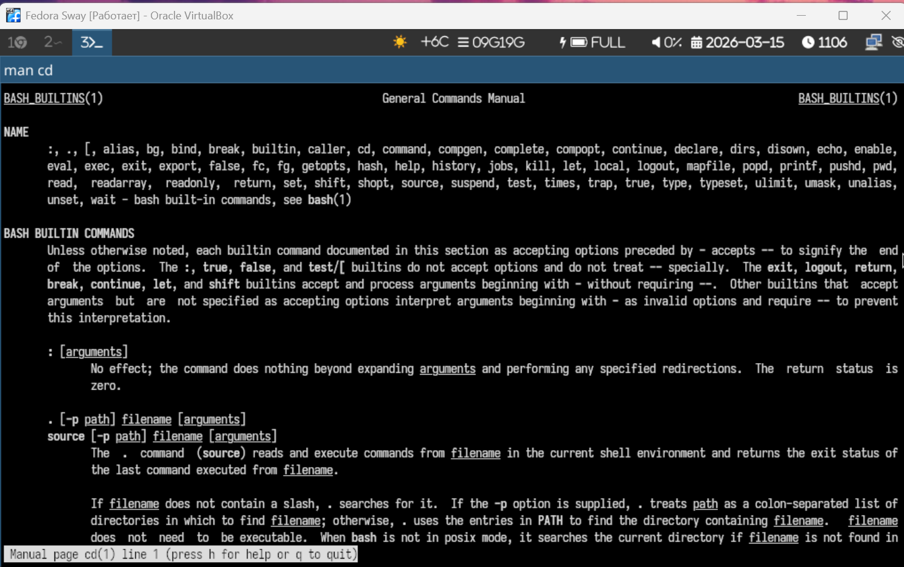{#fig-019 width=70%}

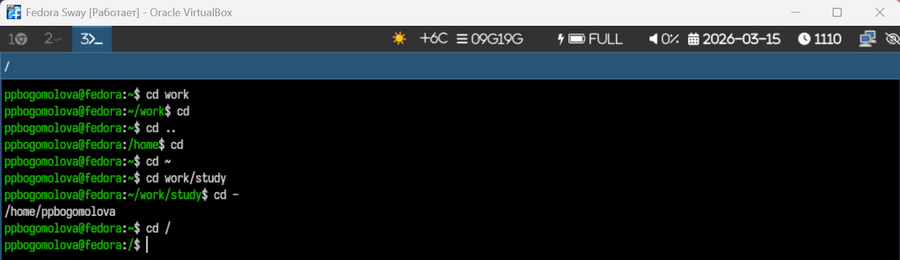{#fig-020 width=70%}

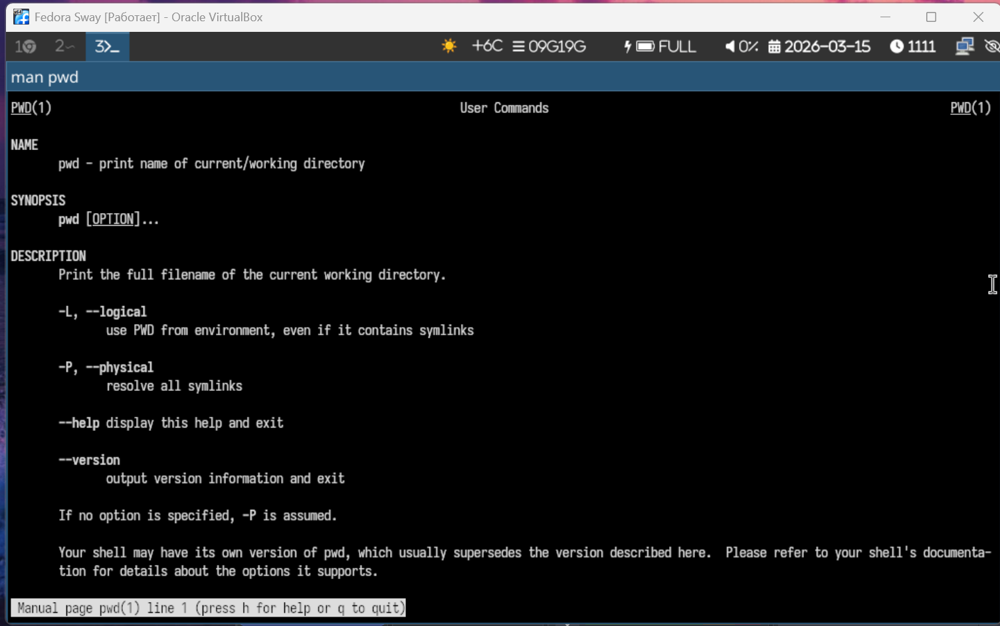{#fig-021 width=70%}

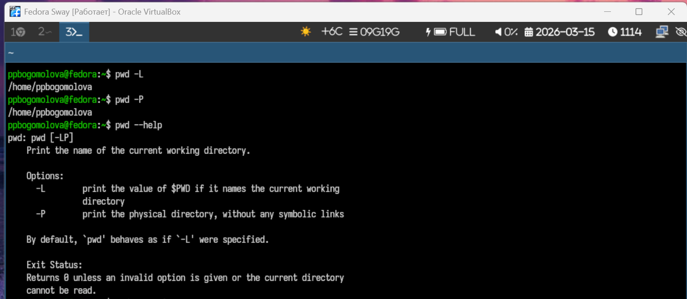{#fig-022 width=70%}

{#fig-023 width=70%}

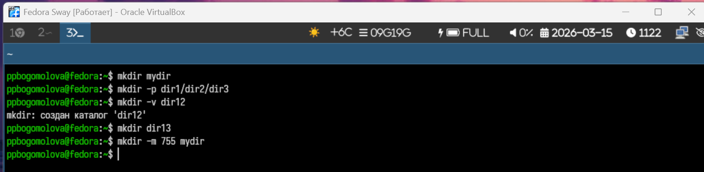{#fig-024 width=70%}

{#fig-025 width=70%}

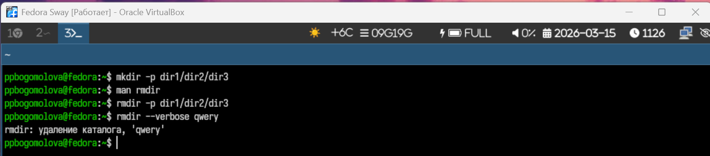{#fig-026 width=70%}

{#fig-027 width=70%}

{#fig-028 width=70%}

7) Используя информацию, полученную при помощи команды history, выполним мо-
дификацию и исполнение нескольких команд из буфера команд.

{#fig-017 width=70%}

{#fig-017 width=70%}

# Контрольные вопросы

1. Командная строка — это текстовый интерфейс взаимодействия пользователя с операционной системой. В командной строке пользователь вводит команды с клавиатуры, а система выполняет их и выводит результат на экран. Такой способ работы часто используется в операционных системах семейства Linux и Unix для управления файлами, каталогами и программами.

2. Абсолютный путь текущего каталога можно определить при помощи команды pwd (print working directory). Эта команда выводит полный путь от корневого каталога до текущего.
Пример:
pwd
Результат может быть таким: /home/student/docs.

3. Определить тип файлов и их имена в текущем каталоге можно с помощью команды ls с опцией -F. Эта опция добавляет к именам файлов специальные символы, которые показывают их тип (например, / для каталогов, * для исполняемых файлов).
Примеры:
ls -F
ls -F /home/student.

4. Чтобы отобразить скрытые файлы, используется команда ls с опцией -a. Скрытые файлы в Linux начинаются с точки (.), поэтому без этой опции они обычно не отображаются.
Примеры:
ls -a — показывает все файлы, включая скрытые.
ls -la — показывает скрытые файлы и выводит подробную информацию о них.

5. Для удаления файлов используется команда rm, а для удаления пустых каталогов — rmdir. Однако каталог можно удалить и командой rm, если использовать опцию -r, которая удаляет каталог вместе с его содержимым.
Примеры:
rm file.txt — удалить файл.
rmdir test — удалить пустой каталог.
rm -r test — удалить каталог и все файлы внутри него.

6. Информацию о последних выполненных пользователем командах можно получить с помощью команды history. Она выводит список ранее введённых команд с их порядковыми номерами.
Пример:
history.

7. Историю команд можно использовать для повторного или модифицированного выполнения команд. Это делается с помощью специальных обозначений.
Примеры:
!! — выполнить последнюю введённую команду.
!10 — выполнить команду под номером 10 из списка history.
!ls — выполнить последнюю команду, которая начинается с ls.

8. В одной строке можно запускать несколько команд, используя специальные разделители.
Примеры:
mkdir test; cd test — команды выполняются последовательно.
ls && pwd — вторая команда выполняется только если первая выполнена успешно.
ls || echo error — вторая команда выполняется, если первая завершилась с ошибкой.

9. Символы экранирования используются для того, чтобы отменить специальное значение некоторых символов в командной строке. Основным символом экранирования является обратный слэш \.
Примеры:
touch file\ name.txt — позволяет создать файл с пробелом в имени.
echo \$HOME — выводит текст $HOME, а не значение переменной.

10. Команда ls -l выводит подробную информацию о файлах и каталогах. В этом режиме отображаются права доступа к файлу, количество ссылок, имя владельца, имя группы, размер файла в байтах, дата и время последнего изменения, а также имя файла или каталога.

11. Относительный путь — это путь к файлу или каталогу относительно текущего рабочего каталога. Абсолютный путь — это полный путь, начинающийся от корневого каталога /.
Примеры:
Относительный путь: cat docs/file.txt.
Абсолютный путь: cat /home/student/docs/file.txt.

12. Информацию о любой команде можно получить несколькими способами. Чаще всего используется команда man, которая открывает руководство по команде. Также можно использовать опцию –help.
Примеры:
man ls
ls --help
info ls.

13. Для автоматического дополнения команд, имён файлов и каталогов используется клавиша Tab. Если начать вводить имя команды или файла и нажать Tab, система автоматически дополнит его, если совпадение одно, или предложит варианты, если их несколько.

# Выводы

Я приобрела практические навыки взаимодействия пользователя с системой по-
средством командной строки

