# Информация о докладчике

Богомолова Полина Петровна  
ФФМиЕН  
НКАбд01-25  
1032253562  

---

# Цель работы

Ознакомление с файловой системой Linux, её структурой, именами и содержанием каталогов.

Приобретение практических навыков применения команд для работы с файлами и каталогами.

Изучение управления процессами, проверки использования диска и обслуживания файловой системы.

---

# Задание

Выполнить примеры работы с командами Linux для работы с файлами и каталогами.

Скопировать, переместить и переименовать файлы.

Изменить права доступа с помощью команды "chmod".

Изучить команды "mount", "fsck", "mkfs" и "kill".

---

# Теоретическое введение

Файловая система Linux имеет иерархическую структуру.

Для создания файлов используется команда "touch".

Для просмотра файлов используются команды "cat" и "less".

Для копирования применяется команда "cp",  
для перемещения и переименования — "mv".

Каждый файл и каталог имеет права доступа: чтение (r), запись (w) и выполнение (x).

---

# Копирование файла abc1 в файл april

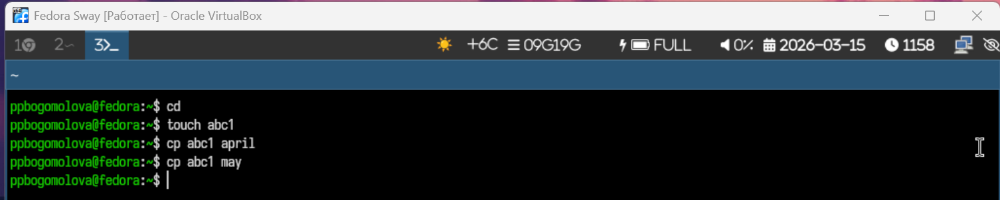{width=60%}

---

# Копирование файлов april и may

{width=60%}

---

# Копирование файлов в произвольном каталоге

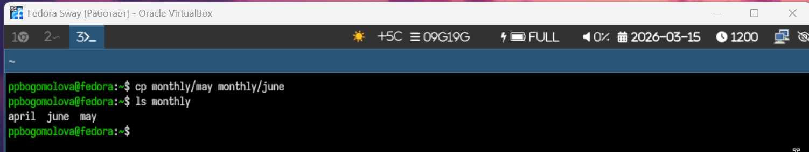{width=60%}

---

# Копирование каталогов

{width=60%}

---

# Копирование каталогов в /tmp

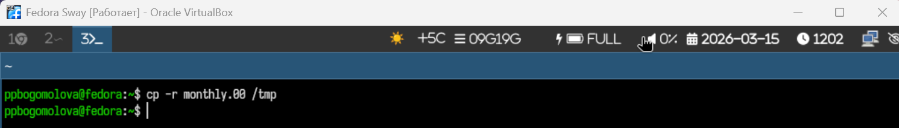{width=60%}

---

# Переименование файла

Переименование файлов в текущем каталоге. Изменить название файла april на
july в домашнем каталоге:
 Перемещение файлов в другой каталог. Переместить файл july в каталог monthly.00:
Если необходим запрос подтверждения о перезаписи файла, то нужно использовать
опцию i.
Переименование каталогов в текущем каталоге. Переименовать каталог monthly.00
в monthly.01
Перемещение каталога в другой каталог. Переместить каталог monthly.01в каталог
reports:
Переименование каталога, не являющегося текущим. Переименовать каталог
reports/monthly.01 в reports/monthly:

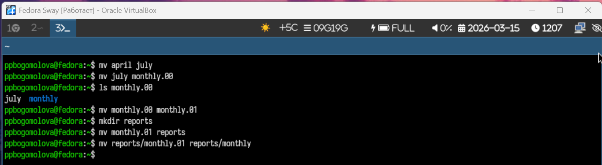{width=60%}

---

# Права

Наделяем правами

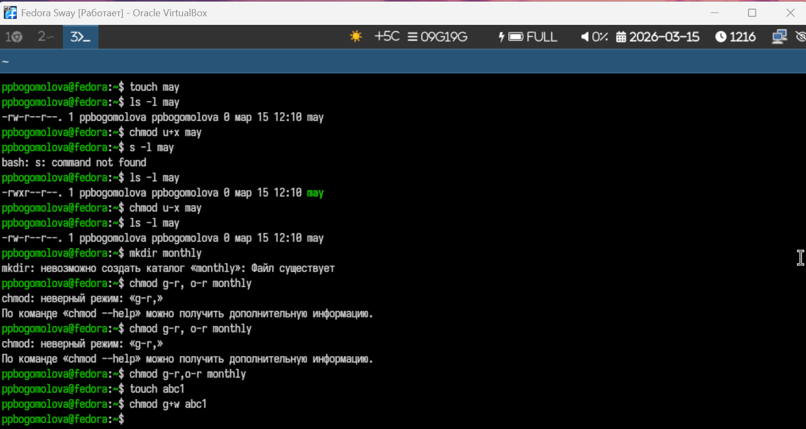{width=60%}

---

# mount

Для просмотра используемых в операционной системе файловых систем можно вос-
пользоваться командой mount без параметров.

{width=60%}

---

# Просмотр файла

Другой способ определения смонтированных в операционной системе файловых си-
стем — просмотр файла/etc/fstab. Сделать это можно например с помощью команды
cat:

{width=60%}

---

# df

Для определения объёма свободного пространства на файловой системе можно вос-
пользоваться командой df, которая выведет на экран список всех файловых систем
в соответствии с именами устройств, с указанием размера и точки монтирования. На-
пример

{width=60%}

---

# Fsck

С помощью команды fsck можно проверить (а в ряде случаев восстановить) целост-
ность файловой системы

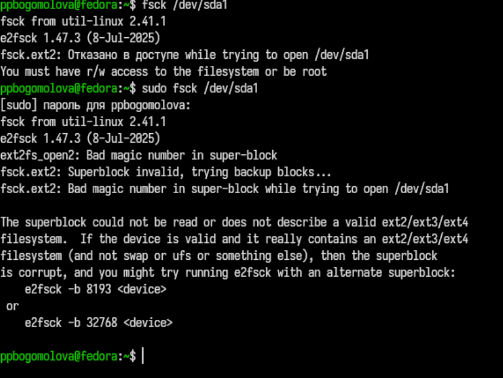{width=60%}

---

# Копирование файла в домашний каталог

Скопируем файл /usr/include/sys/io.h в домашний каталог и назовем его
equipment. Если файла io.h нет, то используйте любой другой файл в каталоге
/usr/include/sys/ вместо него.  Используем команду cp и ls для проверки

{#fig-011 width=70%}

---

# Создание директории

В домашнем каталоге создадим директорию ~/ski.plases с помощью команды mkdir

{#fig-012 width=70%}

---

# Перемещение файла в каталог

Переместим файл equipment в каталог ~/ski.plases с помощью команды mv

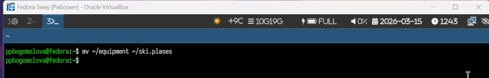{#fig-013 width=70%}

---

# Переименуем файл

Переименуем файл ~/ski.plases/equipment в ~/ski.plases/equiplist с помощью команды mv.

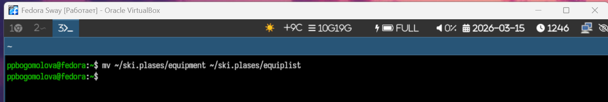{#fig-014 width=70%}

---

# Создадим и скопируем файл

Создадим в домашнем каталоге файл abc1 и скопируем его в каталог ~/ski.plases, назовите его equiplist2

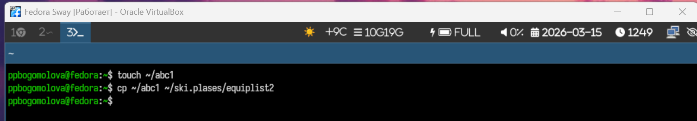{#fig-015 width=70%}

---

# Перемещение файлов в каталог

{width=60%}

---

# Создание каталога plans

{width=60%}

---

# Установка прав доступа

Права доступа были установлены с помощью команды "chmod".

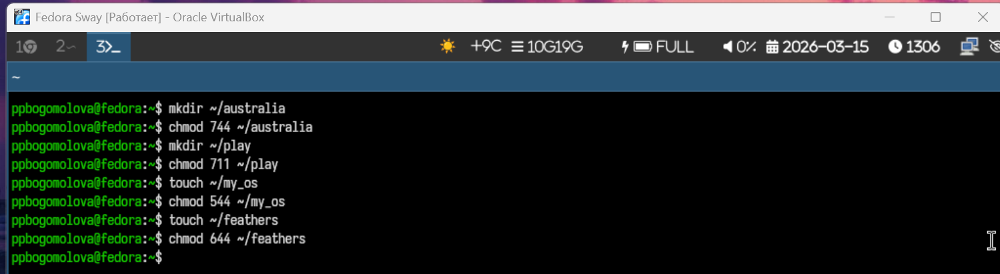{width=60%}

---

# Просмотр файла /etc/password

Для просмотра содержимого файла использована команда "cat".

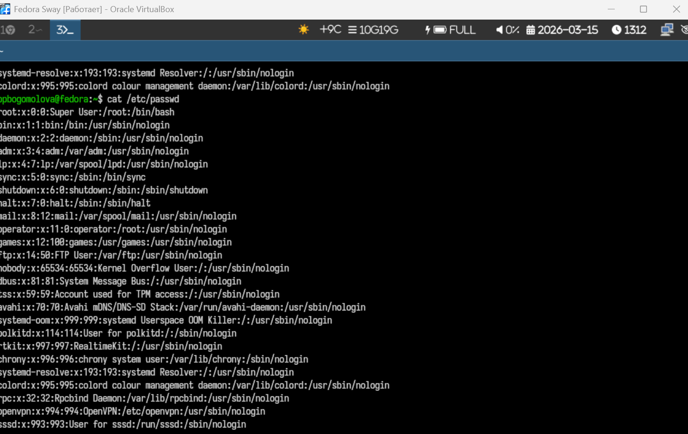{width=60%}

---

# Копирование файла feathers

Файл был скопирован командой "cp".

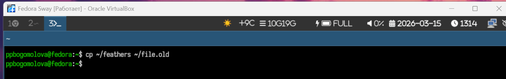{width=60%}

---

# Перемещение файла file.old

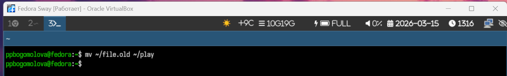{width=60%}

---

# Копирование каталога play

Для копирования каталога используется команда "cp -r".

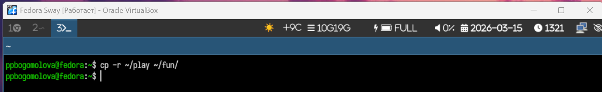{width=60%}

---

# Переименование каталога fun

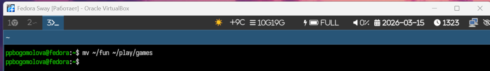{width=60%}

---

# Изменение прав доступа

Права доступаенены с помощью команды "chmod".

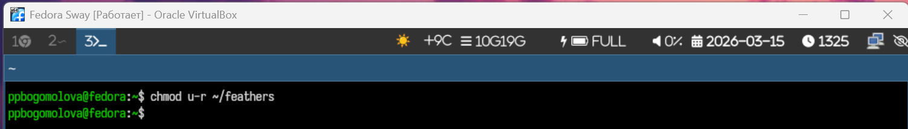{width=60%}

---

# Попытка открыть файл

Файл не открылся, потому что отсутствует право чтения.

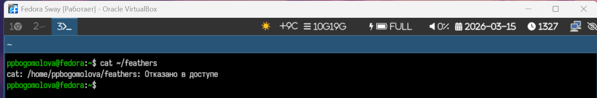{width=60%}

---

# Попытка копирования файла

Скопировать файл также невозможно без права чтения.

{width=60%}

---

# Возврат права чтения

Право чтения возвращено командой "chmod".

{width=60%}

---

# Удаление права выполнения

{width=60%}

---

# Попытка перейти в каталог

Без права выполнения перейти в каталог невозможно.

{width=60%}

---

# Возврат права выполнения

Право выполнения возвращено командой "chmod".

{width=60%}

---

# Команда "mount"

Команда "mount" используется для подключения файловых систем и разделов диска.

Пример использования:  
"sudo mount -t ext4 /dev/sdb1 /mnt"

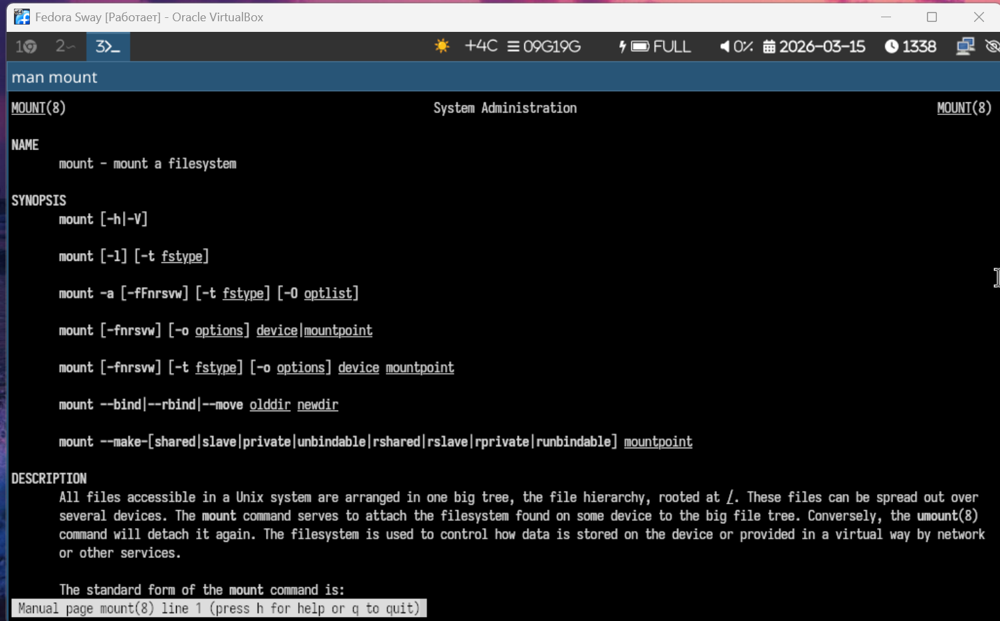{width=60%}

---

# Просмотр параметров mount

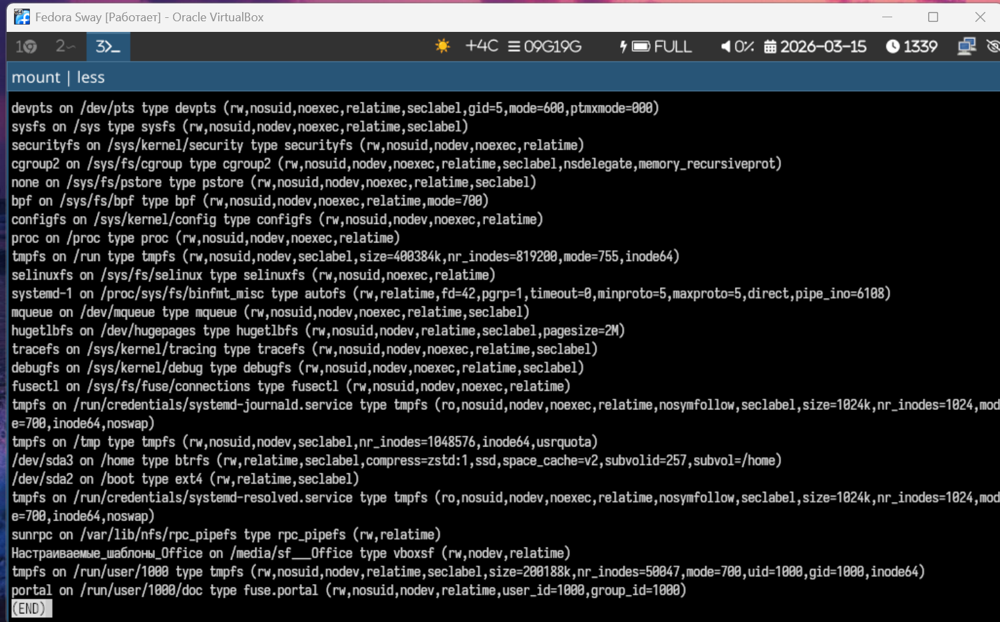{width=60%}

---

# Команда "fsck"

Команда "fsck" используется для проверки и восстановления файловой системы.

Пример использования:  
"sudo fsck -y /dev/sdb1"

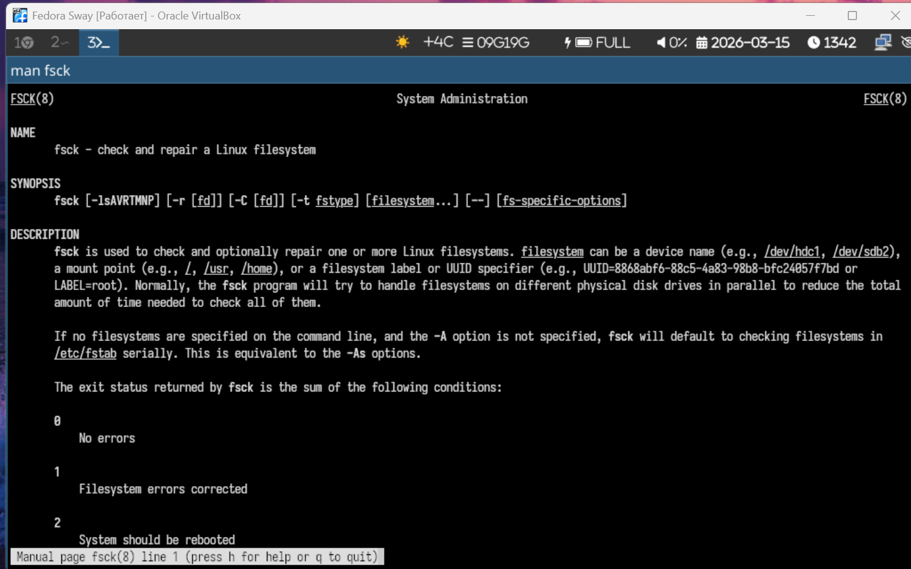{width=60%}

---

# Использование fsck

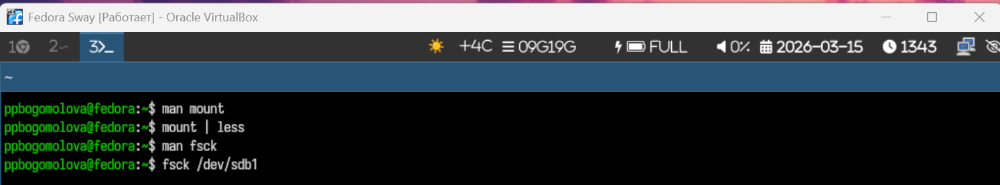{width=60%}

---

# Проверка fsck

{width=60%}

---

# Команда "mkfs"

Команда "mkfs" используется для создания новой файловой системы на разделе.

Пример использования:  
"sudo mkfs -t ext4 /dev/sdb1"

{width=60%}

---

# Использование mkfs

{width=60%}

---

# Дополнительные параметры mkfs

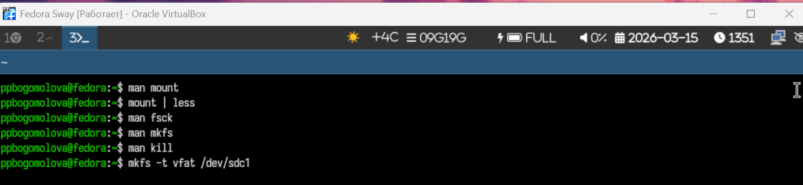{width=60%}

---

# Команда "kill"

Команда "kill" используется для завершения процессов.

Пример использования:  
"kill -9 1234"

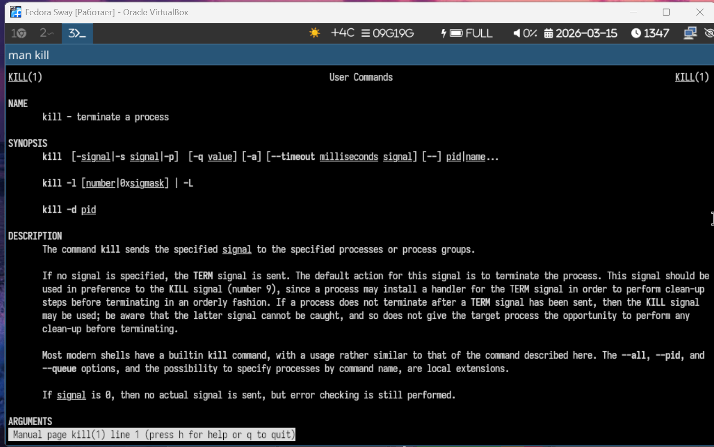{width=60%}

---

# Использование kill

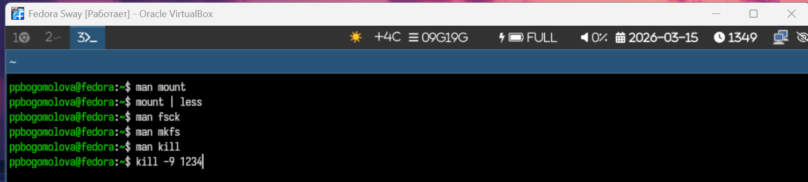{width=60%}

---

# Контрольные вопросы

1. На моём компьютере используются файловые системы NTFS для Windows и ext4 для Linux Fedora. NTFS поддерживает большие файлы, права доступа и журналирование. Файловая система ext4 является основной для Linux и обеспечивает надёжную работу системы. Также используется раздел swap для виртуальной памяти.

2. Файловая система Linux имеет иерархическую структуру с корневой директорией "/". Основные каталоги: "/bin" — системные команды, "/boot" — файлы загрузки системы, "/dev" — устройства, "/etc" — конфигурационные файлы, "/home" — домашние каталоги пользователей, "/usr" — программы и библиотеки, "/var" — журналы и изменяемые данные.

3. Чтобы содержимое файловой системы стало доступно системе, необходимо выполнить операцию монтирования с помощью команды "mount".

4. Нарушение целостности файловой системы может происходить из-за внезапного отключения питания, ошибок диска или сбоев программ. Для проверки и исправления используется команда "fsck".

5. Файловая система создаётся после создания раздела диска. Для этого используется команда "mkfs", например: "mkfs.ext4 /dev/sdb1".

6. Для просмотра текстовых файлов используются команды "cat", "less" и "more". Команда "cat" выводит файл полностью, а "less" и "more" позволяют просматривать файл постранично.

7. Команда "cp" используется для копирования файлов и каталогов. Она позволяет копировать один или несколько файлов, а также копировать каталоги с помощью опции "-r".

8. Команда "mv" используется для перемещения файлов и каталогов, а также для их переименования.

9. Права доступа определяют, кто может читать, изменять или выполнять файл. Они обозначаются символами r, w и x. Изменить права можно с помощью команды "chmod".

---

# Выводы

В ходе выполнения лабораторной работы я ознакомилась со структурой файловой системы Linux.

Изучила команды для работы с файлами и каталогами.

Освоила изменение прав доступа и управление процессами.

Также получила практические навыки использования команд "mount", "fsck", "mkfs"
