---
## Author
author:
  name: Богомолова Полина Петровна
  degrees: студент
  orcid: 1032253562
  email: 1032253562@rudn.ru
  affiliation:
    - name: Российский университет дружбы народов
      country: Российская Федерация
      postal-code: 117198
      city: Москва
      address: ул. Миклухо-Маклая, д. 6

## Title
title: "Отчет по Лабораторной Работе №7"
subtitle: "Анализ файловой системы Linux. Команды для работы с файлами и каталогами"
license: 1032253562/
---

# Цель работы

Ознакомление с файловой системой Linux, её структурой, именами и содержанием
каталогов. Приобретение практических навыков по применению команд для работы
с файлами и каталогами, по управлению процессами (и работами), по проверке исполь-
зования диска и обслуживанию файловой системы

# Задание

1. Выполните все примеры, приведённые в первой части описания лабораторной работы.
2. Выполните следующие действия, зафиксировав в отчёте по лабораторной работе
используемые при этом команды и результаты их выполнения:
2.1. Скопируйте файл /usr/include/sys/io.h в домашний каталог и назовите его
equipment. Если файла io.h нет, то используйте любой другой файл в каталоге
/usr/include/sys/ вместо него.
2.2. В домашнем каталоге создайте директорию ~/ski.plases.
2.3. Переместите файл equipment в каталог ~/ski.plases.
2.4. Переименуйте файл ~/ski.plases/equipment в ~/ski.plases/equiplist.
2.5. Создайте в домашнем каталоге файл abc1 и скопируйте его в каталог
~/ski.plases, назовите его equiplist2.
2.6. Создайте каталог с именем equipment в каталоге ~/ski.plases.
2.7. Переместите файлы ~/ski.plases/equiplist и equiplist2 в каталог
~/ski.plases/equipment.
2.8. Создайте и переместите каталог ~/newdir в каталог ~/ski.plases и назовите
его plans.
3. Определите опции команды chmod, необходимые для того, чтобы присвоить перечис-
ленным ниже файлам выделенные права доступа, считая, что в начале таких прав
нет:
3.1. drwxr--r-- ... australia
3.2. drwx--x--x ... play
3.3. -r-xr--r-- ... my_os
3.4. -rw-rw-r-- ... feathers
При необходимости создайте нужные файлы.
4. Проделайте приведённые ниже упражнения, записывая в отчёт по лабораторной
работе используемые при этом команды:
4.1. Просмотрите содержимое файла /etc/password.
4.2. Скопируйте файл ~/feathers в файл ~/file.old.
4.3. Переместите файл ~/file.old в каталог ~/play.
4.4. Скопируйте каталог ~/play в каталог ~/fun.
4.5. Переместите каталог ~/fun в каталог ~/play и назовите его games.
4.6. Лишите владельца файла ~/feathers права на чтение.
4.7. Что произойдёт, если вы попытаетесь просмотреть файл ~/feathers командой
cat?
4.8. Что произойдёт, если вы попытаетесь скопировать файл ~/feathers?
4.9. Дайте владельцу файла ~/feathers право на чтение.
4.10. Лишите владельца каталога ~/play права на выполнение.
4.11. Перейдите в каталог ~/play. Что произошло?
4.12. Дайте владельцу каталога ~/play право на выполнение.
5. Прочитайте man по командам mount, fsck, mkfs, kill и кратко их охарактеризуйте,
приведя примеры.

Контрольные вопросы

1. Дайте характеристику каждой файловой системе, существующей на жёстком диске
компьютера, на котором вы выполняли лабораторную работу.
2. Приведите общую структуру файловой системы и дайте характеристику каждой ди-
ректории первого уровня этой структуры.
3. Какая операция должна быть выполнена, чтобы содержимое некоторой файловой
системы было доступно операционной системе?
4. Назовите основные причины нарушения целостности файловой системы. Как устра-
нить повреждения файловой системы?
5. Как создаётся файловая система?
6. Дайте характеристику командам для просмотра текстовых файлов.
7. Приведите основные возможности команды cp в Linux.
54 Лабораторная работа № 5. Анализ файловой системы Linux. Команды для работы …
8. Приведите основные возможности команды mv в Linux.
9. Что такое права доступа? Как они могут быть изменены?
При ответах на вопросы используйте дополнительные источники информации по
теме.

# Теоретическое введение

Для создания текстового файла можно использовать команду touch.
Для просмотра файлов небольшого размера можно использовать команду cat.
Для просмотра файлов постранично удобнее использовать команду less.
Команда cp используется для копирования файлов и каталогов.
Команды mv и mvdir предназначены для перемещения и переименования файлов
и каталогов.

Каждый файл или каталог имеет права доступа.
В сведениях о файле или каталоге указываются:
– тип файла (символ (-) обозначает файл, а символ (d) — каталог);
– права для владельца файла (r — разрешено чтение, w — разрешена запись, x — разре-
шено выполнение, - — право доступа отсутствует);
– права для членов группы (r — разрешено чтение, w — разрешена запись, x — разрешено
выполнение, - — право доступа отсутствует);
– права для всех остальных (r — разрешено чтение, w — разрешена запись, x — разрешено
выполнение, - — право доступа отсутствует)

# Выполнение лабораторной работы

1) Выполним все примеры

1. Копирование файла в текущем каталоге. Скопировать файл ~/abc1 в файл april
и в файл may:

{#fig-001 width=70%}

2. Копирование нескольких файлов в каталог. Скопировать файлы april и may в каталог
monthly.

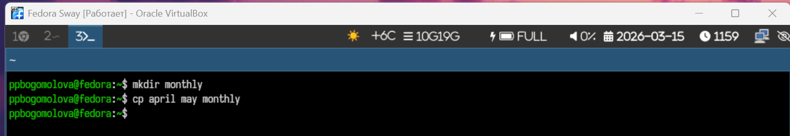{#fig-002 width=70%}

3. Копирование файлов в произвольном каталоге. Скопировать файл monthly/may в файл
с именем june

{#fig-003 width=70%}

4. Копирование каталогов в текущем каталоге. Скопировать каталог monthly в каталог
monthly.00

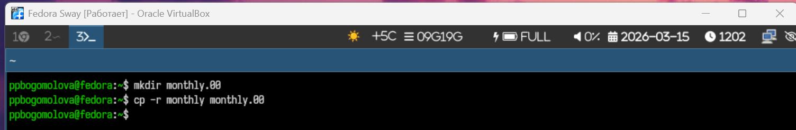{#fig-004 width=70%}

5. Копирование каталогов в произвольном каталоге. Скопировать каталог monthly.00
в каталог /tmp

{#fig-005 width=70%}

6. Переименование файлов в текущем каталоге. Изменить название файла april на
july в домашнем каталоге:
 Перемещение файлов в другой каталог. Переместить файл july в каталог monthly.00:
Если необходим запрос подтверждения о перезаписи файла, то нужно использовать
опцию i.
Переименование каталогов в текущем каталоге. Переименовать каталог monthly.00
в monthly.01
Перемещение каталога в другой каталог. Переместить каталог monthly.01в каталог
reports:
Переименование каталога, не являющегося текущим. Переименовать каталог
reports/monthly.01 в reports/monthly:

{#fig-006 width=70%}

7. Наделение правами

{#fig-007 width=70%}

8. mount

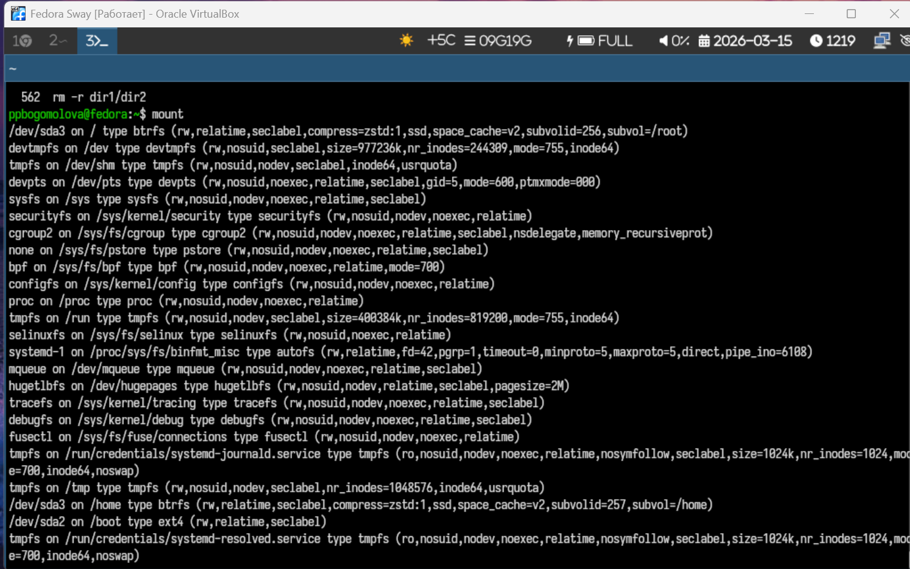{#fig-008 width=70%}

9. cat

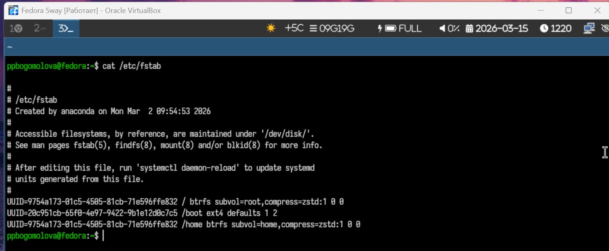{#fig-009 width=70%}

10. df

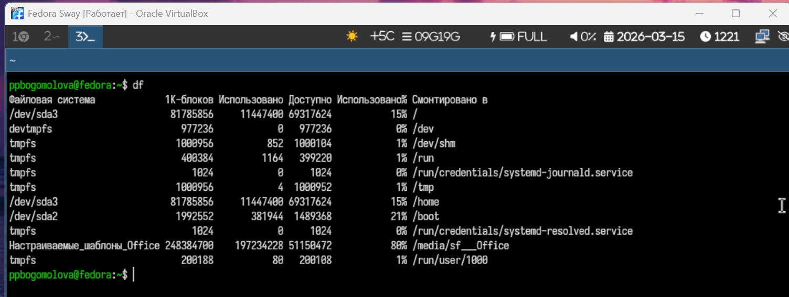{#fig-010 width=70%}

2.1) Скопируем файл /usr/include/sys/io.h в домашний каталог и назовем его
equipment. Если файла io.h нет, то используйте любой другой файл в каталоге
/usr/include/sys/ вместо него.  Используем команду cp и ls для проверки

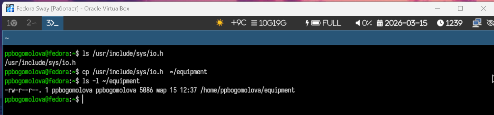{#fig-011 width=70%}

2.2)  В домашнем каталоге создадим директорию ~/ski.plases с помощью команды mkdir

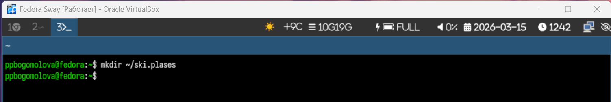{#fig-012 width=70%}

2.3) Переместим файл equipment в каталог ~/ski.plases с помощью команды mv

{#fig-013 width=70%}

2.4) Переименуем файл ~/ski.plases/equipment в ~/ski.plases/equiplist с помощью команды mv.

{#fig-014 width=70%}

2.5) Создадим в домашнем каталоге файл abc1 и скопируем его в каталог ~/ski.plases, назовите его equiplist2

{#fig-015 width=70%}

2.6) Создадим каталог с именем equipment в каталоге ~/ski.plases.

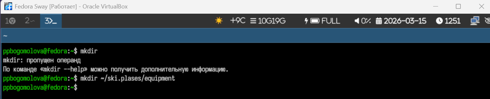{#fig-016 width=70%}

2.7) Переместим файлы ~/ski.plases/equiplist и equiplist2 в каталог ~/ski.plases/equipment.

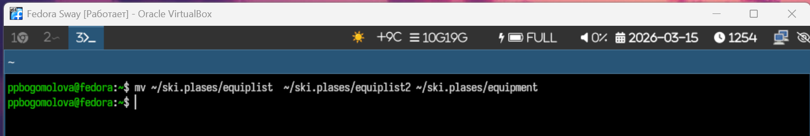{#fig-017 width=70%}

2.8) Создадим и переместим каталог ~/newdir в каталог ~/ski.plases и назовем его plans.

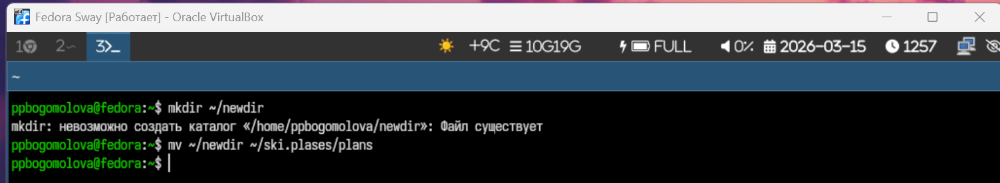{#fig-018 width=70%}

3) Определим опции команды chmod, необходимые для того, чтобы присвоить перечис-
ленным ниже файлам выделенные права доступа, считая, что в начале таких прав
нет:
3.1. drwxr--r-- ... australia
3.2. drwx--x--x ... play
3.3. -r-xr--r-- ... my_os
3.4. -rw-rw-r-- ... feathers

{#fig-019 width=70%}

4.1) Просмотрим содержимое файла /etc/password с помощью команды cat

{#fig-020 width=70%}

4.2) Скопируем файл ~/feathers в файл ~/file.old с помощью команды cp.

{#fig-021 width=70%}

4.3) Переместим файл ~/file.old в каталог ~/play с помощью команды mv

{#fig-022 width=70%}

4.4) Скопируем каталог ~/play в каталог ~/fun.

{#fig-023 width=70%}

4.5) Переместим каталог ~/fun в каталог ~/play и назовем его games.

{#fig-024 width=70%}

4.6) Лишим владельца файла ~/feathers права на чтение

{#fig-025 width=70%}

4.7) Что произойдёт, если вы попытаетесь просмотреть файл ~/feathers командой cat?
Файл открыть не получится, потому что нет прав на чтение

{#fig-026 width=70%}

4.8) Что произойдёт, если вы попытаетесь скопировать файл ~/feathers?
Скопировать файл не получится, так как нет прав на чтение

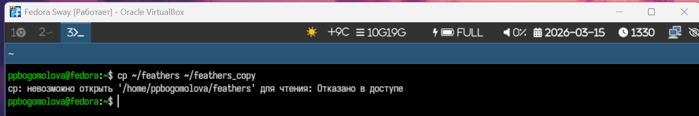{#fig-027 width=70%}

4.9) Дадим владельцу файла ~/feathers право на чтение.

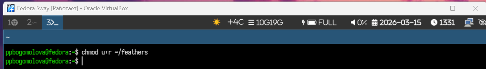{#fig-028 width=70%}

4.10) Лишим владельца каталога ~/play права на выполнение

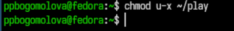{#fig-029 width=70%}

4.11) Перейдите в каталог ~/play. Что произошло?
Не получилось перейти в каталог,тк у нас нет прав на выполнение

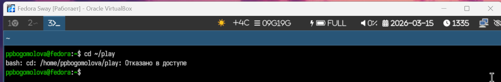{#fig-030 width=70%}

4.12) Дадим владельцу каталога ~/play право на выполнение

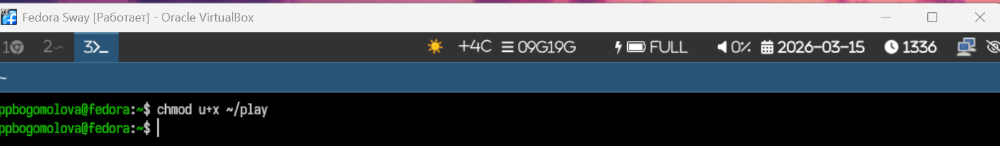{#fig-031 width=70%}

5)Прочитаем man по командам mount, fsck, mkfs, kill и кратко их охарактеризуем, приведя примеры

Команда mount нужна, чтобы подключить раздел диска или внешний носитель к системе, чтобы с ним можно было работать. Без монтирования операционная система просто не видит файлы на этом разделе. Основные опции: -t — указываешь тип файловой системы, например ext4 или vfat, -o — дополнительные параметры, например ro для только чтения или rw для чтения и записи, -a — смонтировать всё, что указано в /etc/fstab. Пример: sudo mount -t ext4 /dev/sdb1 /mnt — монтируем раздел ext4 в каталог /mnt. Ещё можно так: sudo mount -o ro /dev/sdc1 /media/usb — флешка монтируется только для чтения. Проверить, что сейчас смонтировано, можно просто набрав mount. А чтобы отключить устройство, есть команда umount.

Команда fsck проверяет файловую систему и исправляет ошибки. Она нужна, если вдруг компьютер выключился некорректно, диск начал «глючить» или система пишет, что файлы повреждены. Опции: -y — исправлять ошибки автоматически, -n — только проверка, не исправляя ничего, -f — принудительная проверка, даже если кажется, что всё нормально, -C — показывает прогресс, -V — подробный вывод. Например: sudo fsck -y /dev/sdb1 — проверяем раздел и исправляем ошибки сразу. Или sudo fsck -f /dev/sdc2 — принудительная проверка.

Команда mkfs создаёт файловую систему на разделе. Это как форматирование диска, поэтому все данные при этом удаляются. Основные опции: -t — тип файловой системы (ext4, vfat, ntfs), -c — проверка диска на битые сектора, -v — подробный вывод, -L — присвоение метки разделу, -b — размер блока. Пример: sudo mkfs -t ext4 /dev/sdb1 — создаём ext4 на разделе. Ещё: sudo mkfs.vfat -n USB_DRIVE /dev/sdc1 — делаем FAT32 на флешке и называем её USB_DRIVE. Обычно mkfs используют после того, как создали раздел через fdisk или parted.

Команда kill нужна, чтобы завершить процесс. Иногда программа зависает или грузит систему, и её нужно «убить». Основные опции: -9 — принудительно завершить процесс, -15 — корректно завершить (это по умолчанию), -l — список всех сигналов, -s — выбрать конкретный сигнал, -p — показать PID процесса. Пример: kill -9 1234 — убиваем процесс с PID 1234 принудительно, kill -15 5678 — корректно завершаем процесс с PID 5678. Ещё есть удобная команда killall firefox — она закрывает все процессы с именем firefox. Обычно сначала ищем PID через ps или top, а потом убиваем нужный процесс.

{#fig-032 width=70%}

{#fig-033 width=70%}

{#fig-034 width=70%}

{#fig-035 width=70%}

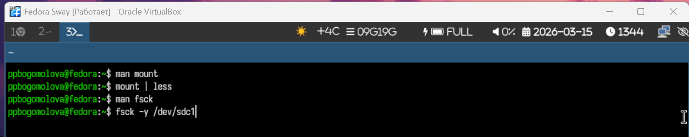{#fig-036 width=70%}

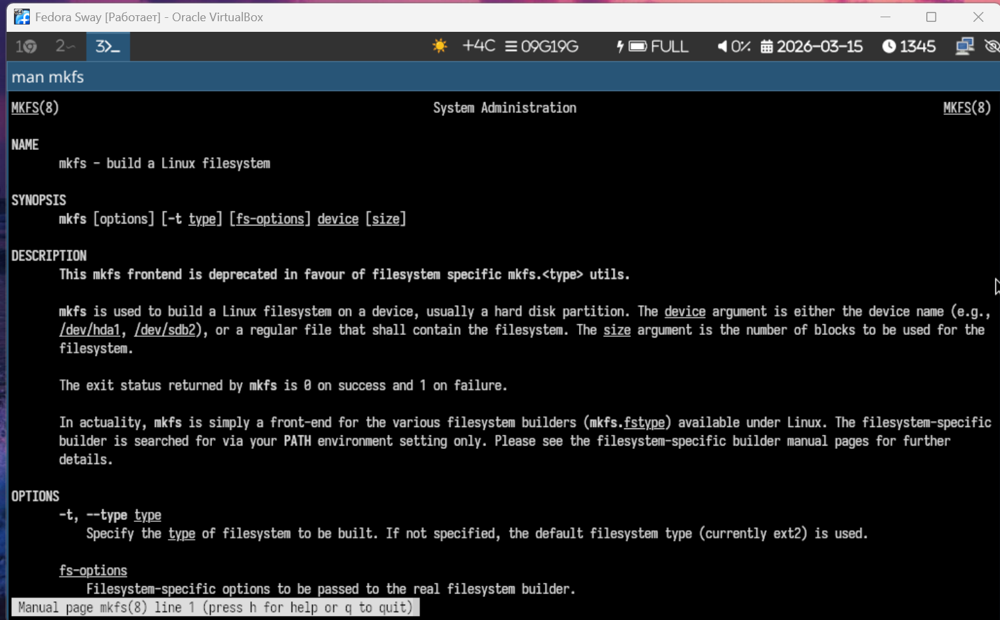{#fig-037 width=70%}

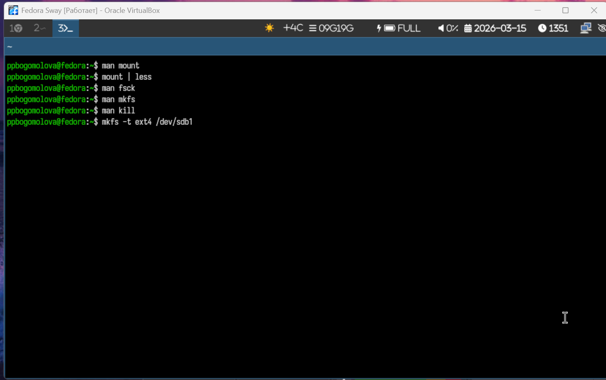{#fig-037 width=70%}

{#fig-038 width=70%}

{#fig-039 width=70%}

{#fig-041 width=70%}

# Контрольные вопросы

1. На моём компьютере установлены Windows и Linux Fedora, поэтому на жёстком диске используются несколько типов файловых систем. Для Windows основной является NTFS — она поддерживает большие файлы, права доступа и журналирование, благодаря чему файлы надёжно сохраняются даже при сбоях. Для флешек и внешних носителей иногда встречаются FAT32 и exFAT, которые позволяют обмениваться файлами между системами, но FAT32 не поддерживает файлы больше 4 ГБ. Для Linux Fedora основной раздел использует файловую систему ext4 — она тоже журналируемая, поддерживает большие файлы и разделы, а для подкачки есть отдельный swap-раздел.

2. Файловая система Linux имеет иерархическую структуру с корневой директорией /, от которой отходят все остальные. В /bin находятся базовые команды, которые нужны всем пользователям, например ls и cp. В /boot хранятся файлы загрузчика и ядро системы. /dev содержит устройства, такие как диски и терминалы. /etc — это конфигурационные файлы системы. Домашние папки пользователей находятся в /home, а домашняя папка администратора — в /root. /lib и /sbin нужны для работы программ и системных команд. Для временных файлов есть /tmp, а для логов и изменяемых данных — /var. /usr содержит программы и библиотеки для пользователей, /opt — дополнительные приложения. /media и /mnt используются для монтирования внешних носителей. /proc и /run — виртуальные папки с информацией о процессах и состоянии системы, а /srv хранит данные сервисов, например веб-сервера.

3. Чтобы система могла работать с файлами на диске, нужно выполнить операцию монтирования. В Linux это делается командой mount, которая связывает раздел диска с определённым каталогом. Например, после команды sudo mount /dev/sdb1 /mnt содержимое этого раздела становится доступным в каталоге /mnt.

4. Целостность файловой системы может нарушаться по разным причинам. Чаще всего это происходит из-за внезапного отключения питания, ошибок диска, сбоев драйверов или ошибок программ при записи файлов. Чтобы исправить повреждения, используют специальные утилиты, например fsck или e2fsck для ext4. Они проверяют систему на ошибки и при необходимости исправляют их. Если повреждения серьёзные, иногда приходится восстанавливать данные из резервной копии.

5. Файловая система создаётся на разделе диска. Сначала создаётся сам раздел с помощью утилит вроде fdisk или parted, а потом на нём создаётся файловая система командой mkfs.ext4 /dev/sdb1. После этого раздел готов к использованию и может быть смонтирован для работы системы.

6. Для просмотра текстовых файлов в Linux используют разные команды. Команда cat выводит содержимое файла полностью на экран, more и less позволяют просматривать большие файлы постранично, что удобнее при работе с объёмной информацией.

7. Команда cp используется для копирования файлов и папок. Она может копировать несколько файлов одновременно, сохранять структуру каталогов при рекурсивном копировании, сохранять права доступа и временные метки файлов.

8. Команда mv перемещает файлы и каталоги с одного места на другое, а также позволяет переименовывать их. В отличие от cp, исходные файлы после выполнения команды исчезают с прежнего места. Можно использовать опции для замены существующих файлов при перемещении.

9. Права доступа определяют, кто и что может делать с файлами и каталогами. Есть три типа прав: чтение (r), запись (w) и выполнение (x) для владельца, группы и остальных пользователей. Права можно менять командой chmod, а владельца и группу — командой chown. Это позволяет ограничивать или предоставлять доступ к файлам для разных пользователей и повышает безопасность системы.

# Выводы

Я ознакомилась с файловой системой, ее структурой, именами и содержанием каталогов. Приобрела практические навыки по применению команд для работы с файлами и каталогами, по управлению процессами и работами, поп роверке использования диска и обслуживание файловой системы

