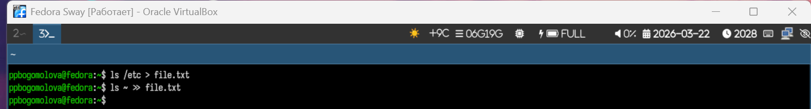
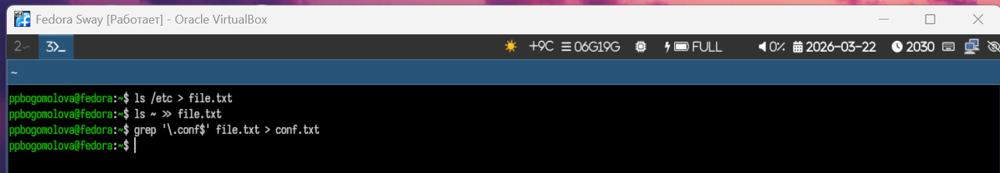
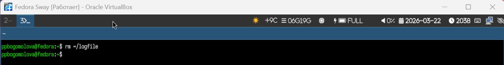
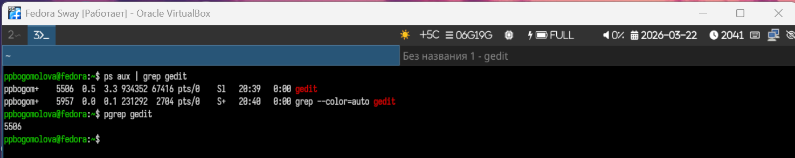
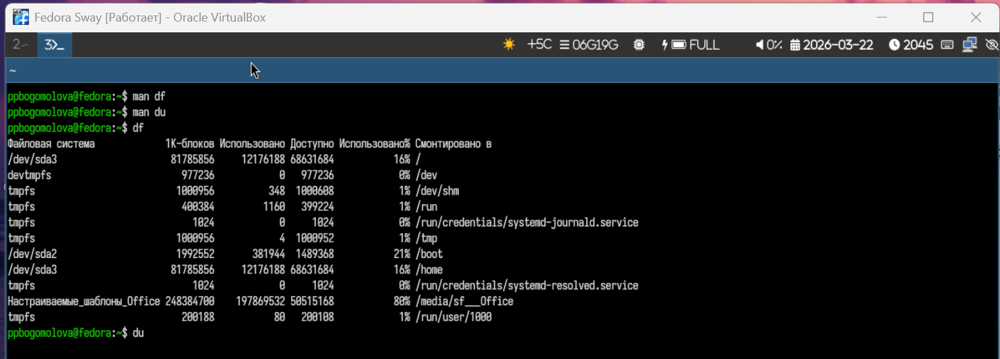
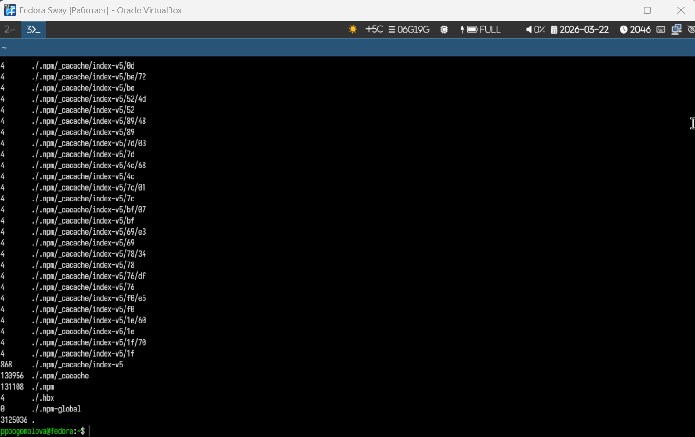

# Информация о докладчике

Богомолова Полина Петровна  
Студент, ФФМиЕН  
1032253562  

---

# Цель работы

Ознакомление с инструментами поиска файлов и фильтрации текстовых данных.  

Приобретение практических навыков:  
- управление процессами и заданиями,  
- проверка использования диска,  
- обслуживание файловых систем.  

---

# Задание

1. Войти в систему под своим пользователем.  
2. Записать в файл `file.txt` имена файлов из `/etc` и домашнего каталога.  
3. Вывести файлы с расширением `.conf` и записать их в `conf.txt`.  
4. Найти файлы в домашнем каталоге, начинающиеся с символа `c`.  
5. Постранично вывести имена файлов из `/etc`, начинающихся с `h`.  
6. Запустить фоновый процесс для записи файлов с именами, начинающимися с `log`, в `~/logfile`.  
7. Удалить `~/logfile`.  
8. Запустить `gedit` в фоновом режиме.  
9. Определить PID процесса `gedit`.  
10. Завершить процесс `gedit` с помощью `kill`.  
11. Выполнить команды `df` и `du`.  
12. Найти все директории в домашнем каталоге.  

---

# Теоретическое введение

В Linux открыты три стандартных потока:  
- stdin (0) — стандартный ввод, по умолчанию клавиатура;  
- stdout (1) — стандартный вывод, по умолчанию консоль;  
- stderr (2) — поток ошибок, по умолчанию консоль.  

Команды можно запускать в фоновом режиме с помощью `&`.  
Для поиска файлов используется команда `find`.  
Для фильтрации текстовых данных — `grep`.  
Перенаправление вывода: `>` перезаписывает файл, `>>` добавляет данные в конец.  

---

# 1. Вход в систему

{width=70%}

---

# 2. Запись файлов в file.txt

{width=70%}

---

# 3. Файлы с расширением .conf

{width=70%}

---

# 4. Файлы в домашнем каталоге, начинающиеся с "c"

{width=70%}

---

# 5. Файлы из /etc, начинающиеся с "h", постранично

{width=70%}

---

# 6. Фоновый процесс записи файлов log*

{width=70%}

---

# 7. Удаление файла ~/logfile

{width=70%}

---

# 8. Запуск gedit в фоновом режиме

{width=70%}

---

# 9. Определение PID процесса gedit

{width=70%}

---

# 10. Завершение процесса gedit

{width=70%}

---

# 11. Команды df и du

{width=40%}

{width=40%}

---

# 12. Поиск директорий в домашнем каталоге

{width=70%}

---

# Контрольные вопросы и ответы

1. **Какие потоки ввода-вывода вы знаете?**  
stdin, stdout, stderr.  

2. **Разница между > и >>?**  
`>` — перезаписывает файл, `>>` — добавляет данные в конец.  

3. **Что такое конвейер?**  
Механизм `|` для передачи вывода одной команды на ввод другой.  

4. **Что такое процесс? Чем отличается от программы?**  
Программа — пассивный файл, процесс — выполняющийся экземпляр программы с ресурсами.  

5. **Что такое PID и GID?**  
PID — идентификатор процесса, GID — идентификатор группы пользователей.  

6. **Что такое задачи и команда управления ими?**  
Задачи (jobs) — процессы в текущем shell. Управление: `jobs`, `fg`, `bg`, `kill`.  

7. **Функции top и htop?**  
Отображение загрузки CPU, памяти, активных процессов. htop интерактивный, с цветами.  

8. **Команда поиска файлов и примеры:**  
`find /home -name "file.txt"` — поиск по имени;  
`find . -size +50M` — поиск файлов больше 50 МБ.  

9. **Поиск по содержанию:**  
`grep -r "текст" .` — рекурсивный поиск текста в файлах.  

10. **Определение объема свободной памяти на диске:**  
`df -h` — человекочитаемый формат.  

11. **Определение объема домашнего каталога:**  
`du -sh ~` — суммарный размер каталога.  

12. **Удаление зависшего процесса:**  
`kill -9 [PID]` — принудительное завершение процесса.  

---

# Выводы

- Ознакомилась с инструментами поиска и фильтрации данных.  
- Освоила управление процессами и заданиями.  
- Изучила команды df и du для проверки использования диска.  
- Получила практические навыки обслуживания файловых систем. п
