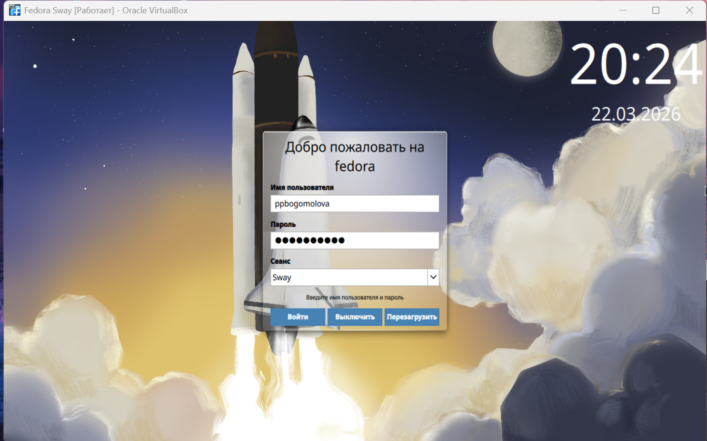
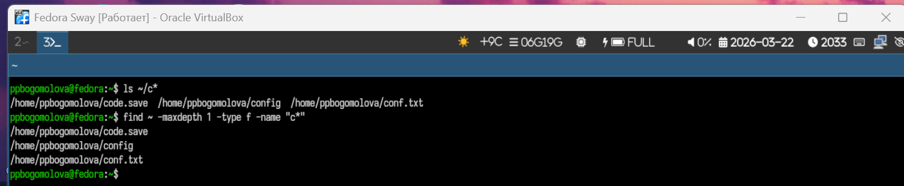
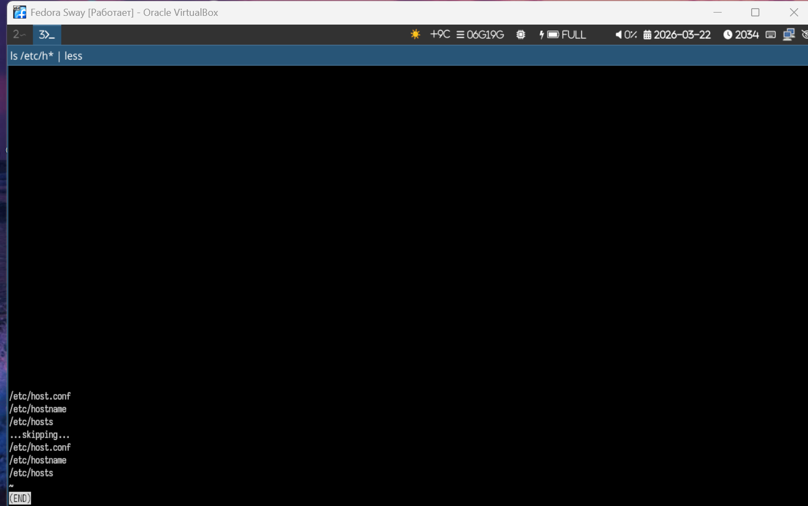
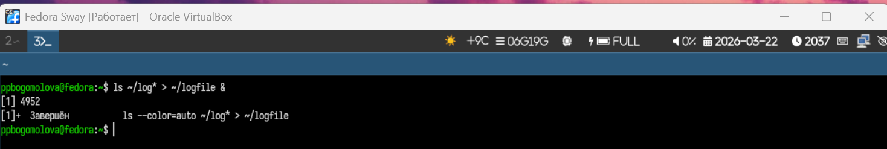
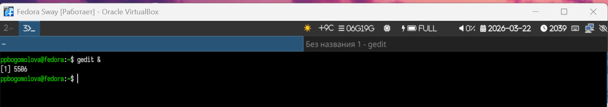
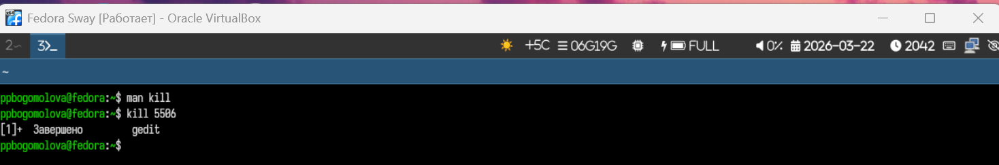
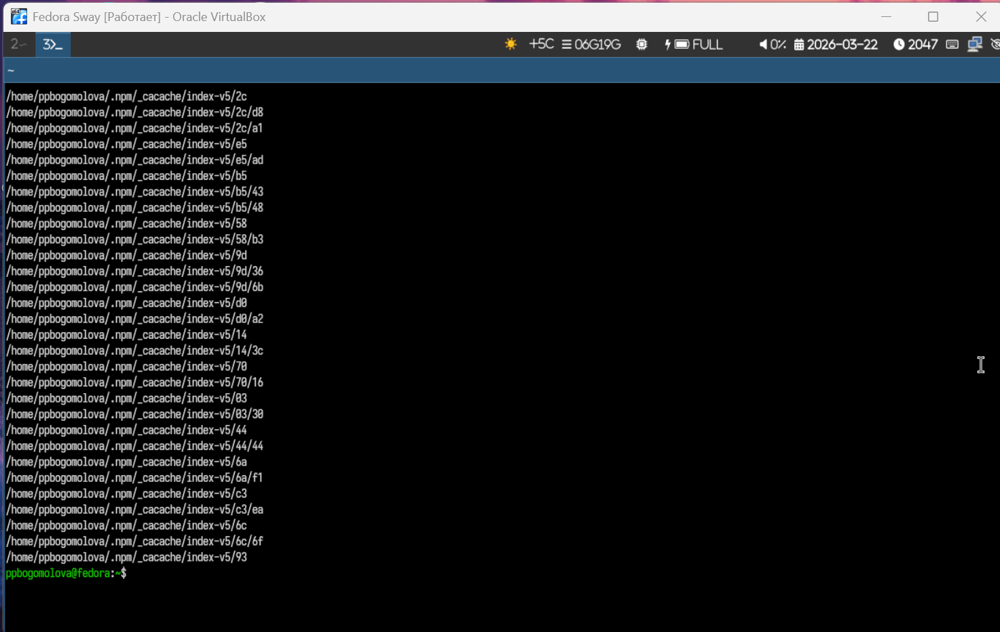

---
## Author
author:
  name: Богомолова Полина Петровна
  degrees: студент
  orcid: 1032253562
  email: 1032253562@rudn.ru
  affiliation:
    - name: Российский университет дружбы народов
      country: Российская Федерация
      postal-code: 117198
      city: Москва
      address: ул. Миклухо-Маклая, д. 6

## Title
title: "Отчет по Лабораторной Работе №8"
subtitle: "Поиск файлов. Перенаправление ввода-вывода. Просмотр запущенных процессов"
license: 1032253562/
---

# Цель работы

Ознакомление с инструментами поиска файлов и фильтрации текстовых данных.
Приобретение практических навыков: по управлению процессами (и заданиями), по
проверке использования диска и обслуживанию файловых систем.

# Задание

1. Осуществите вход в систему, используя соответствующее имя пользователя.
2. Запишите в файл file.txt названия файлов, содержащихся в каталоге /etc. Допи-
шите в этот же файл названия файлов, содержащихся в вашем домашнем каталоге.
3. Выведите имена всех файлов из file.txt, имеющих расширение .conf, после чего
запишите их в новый текстовой файл conf.txt.
4. Определите, какие файлы в вашем домашнем каталоге имеют имена, начинавшиеся
с символа c? Предложите несколько вариантов, как это сделать.
5. Выведите на экран (по странично) имена файлов из каталога /etc, начинающиеся
с символа h.
6. Запустите в фоновом режиме процесс, который будет записывать в файл ~/logfile
файлы, имена которых начинаются с log.
7. Удалите файл ~/logfile.
8. Запустите из консоли в фоновом режиме редактор gedit.
9. Определите идентификатор процесса gedit, используя команду ps, конвейер и фильтр
grep. Как ещё можно определить идентификатор процесса?
10. Прочтите справку (man) команды kill, после чего используйте её для завершения
процесса gedit.
11. Выполните команды df и du, предварительно получив более подробную информацию
об этих командах, с помощью команды man.
12. Воспользовавшись справкой команды find, выведите имена всех директорий, имею-
щихся в вашем домашнем каталоге.
 
Контрольные вопросы

1. Какие потоки ввода вывода вы знаете?
2. Объясните разницу между операцией > и >>.
3. Что такое конвейер?
4. Что такое процесс? Чем это понятие отличается от программы?
5. Что такое PID и GID?
6. Что такое задачи и какая команда позволяет ими управлять?
7. Найдите информацию об утилитах top и htop. Каковы их функции?
8. Назовите и дайте характеристику команде поиска файлов. Приведите примеры ис-
пользования этой команды.
9. Можно ли по контексту (содержанию) найти файл? Если да, то как?
10. Как определить объем свободной памяти на жёстком диске?
11. Как определить объем вашего домашнего каталога?
12. Как удалить зависший процесс?

# Теоретическое введение

В системе по умолчанию открыто три специальных потока:
– stdin — стандартный поток ввода (по умолчанию: клавиатура), файловый дескриптор
0;
– stdout — стандартный поток вывода (по умолчанию: консоль), файловый дескриптор
1;
– stderr — стандартный поток вывод сообщений об ошибках (по умолчанию: консоль),
файловый дескриптор 2.
Большинство используемых в консоли команд и программ записывают результаты
своей работы в стандартный поток вывода stdout. Например, команда ls выводит в стан-
дартный поток вывода (консоль) список файлов в текущей директории. Потоки вывода
и ввода можно перенаправлять на другие файлы или устройства. Проще всего это делается
с помощью символов >, >>, <, <<.

Команда find используется для поиска и отображения на экран имён файлов

Любую выполняющуюся в консоли команду или внешнюю программу можно запустить
в фоновом режиме. Для этого следует в конце имени команды указать знак амперсанда
&. 

# Выполнение лабораторной работы

1) Войдем в систему под своим именем пользователя ppbogomolova

{#fig-001 width=70%}

2) Запишем в файл file.txt названия файлов, содержащихся в каталоге /etc. Допишем в этот же файл названия файлов, содержащихся в домашнем каталоге с помощью команды ls и ее опций

{#fig-002 width=70%}

3) Выведем имена всех файлов из file.txt, имеющих расширение .conf, после чего запишем их в новый текстовой файл conf.txt с помощью команды grep

{#fig-003 width=70%}

4) Определите, какие файлы в вашем домашнем каталоге имеют имена, начинавшиеся с символа c? Предложите несколько вариантов, как это сделать.

{#fig-004 width=70%}

5) Выведем на экран (постранично) имена файлов из каталога /etc, начинающиеся c символа h, используя команду ls с | less

{#fig-005 width=70%}

6. Запустим в фоновом режиме процесс, который будет записывать в файл ~/logfile файлы, имена которых начинаются с log.

{#fig-006 width=70%}

7. Удалим файл ~/logfile с помощью команды rm

{#fig-007 width=70%}

8) Запустим из консоли в фоновом режиме редактор gedit с помощью gedit &

{#fig-008 width=70%}

9) Определим идентификатор процесса gedit, используя команду ps, конвейер и фильтр grep, а также применим pgrep gedit с той же целью

{#fig-009 width=70%}

10) Прочтем справку (man) команды kill, после чего используем её для завершения процесса gedit

{#fig-010 width=70%}

11) Выполним команды df и du, предварительно получив более подробную информацию об этих командах, с помощью команды man

{#fig-011 width=70%}

{#fig-012 width=70%}

12) Воспользовавшись справкой команды find, выведем имена всех директорий, имеющихся в домашнем каталоге.

{#fig-013 width=70%}

# Контрольные вопросы

1- В операционных системах семейства Linux выделяют три стандартных потока ввода-вывода, которые открываются для каждого процесса: стандартный ввод (stdin, дескриптор 0), предназначенный для получения данных программой; стандартный вывод (stdout, дескриптор 1), используемый для выдачи результатов работы; и стандартный поток ошибок (stderr, дескриптор 2), служащий для вывода диагностических и статусных сообщений отдельно от основного потока данных.

2- Разница между данными операциями заключается в способе обработки целевого файла при перенаправлении в него стандартного вывода. Операция одиночного перенаправления > выполняет перезапись файла: если файл существовал, его содержимое уничтожается и заменяется новыми данными. Операция двойного перенаправления >> работает в режиме добавления, сохраняя исходное содержимое файла и записывая новые данные в его конец.
3- Конвейер (или пайплайн) представляет собой программный механизм, обозначаемый символом вертикальной черты |, который позволяет перенаправлять стандартный вывод одной команды на стандартный ввод другой. Это обеспечивает возможность создания сложных цепочек обработки данных, в которых результат работы предыдущей утилиты становится входным параметром для последующей без использования промежуточных временных файлов.

4- Программа является пассивным объектом — это исполняемый файл, содержащий инструкции и данные, хранящийся на энергонезависимом носителе. Процесс же является активной сущностью, представляющей собой экземпляр программы в состоянии выполнения в оперативной памяти. Основное отличие заключается в том, что процесс обладает выделенными системными ресурсами, такими как адресное пространство, идентификатор, состояние выполнения и контекст процессора.

5- PID (Process Identifier) — это уникальный числовой идентификатор, присваиваемый операционной системой каждому запущенному процессу для управления его жизненным циклом. GID (Group Identifier) — это идентификатор группы пользователей, который определяет права доступа процесса к файлам и системным ресурсам в рамках модели разграничения полномочий Linux.

6- Задачами (jobs) называются процессы, запущенные непосредственно в текущем командном интерпретаторе (shell). Для управления ими используется встроенная команда jobs, отображающая список активных задач, а также команды fg (foreground) для перевода задачи в интерактивный режим, bg (background) для возобновления работы в фоновом режиме и kill для их принудительной остановки.
7- Утилиты top и htop являются системными мониторами, предназначенными для отображения информации о загрузке процессора, использовании оперативной памяти и списке наиболее активных процессов в реальном времени. Функция top является стандартным средством с текстовым интерфейсом, в то время как htop предоставляет расширенный интерактивный функционал с цветовым выделением, поддержкой управления мышью и визуализацией нагрузки по отдельным ядрам процессора.

8- Основной командой для поиска файлов по метаданным является find. Она характеризуется высокой гибкостью за счет использования различных критериев поиска: имени, размера, типа файла, прав доступа и времени модификации. Примером поиска по имени служит команда find /home -name "report.txt", а для поиска файлов размером более 50 мегабайт используется синтаксис find . -size +50M.
9- Поиск файла по его содержанию возможен с использованием утилиты grep, которая осуществляет поиск указанной строки или регулярного выражения внутри текстовых данных. Для рекурсивного поиска во всех файлах текущего каталога и подкаталогов применяется команда grep -r "искомый_текст" ., которая выведет имена файлов и соответствующие строки, содержащие заданный контекст.
10- Объем свободного пространства на разделах жесткого диска определяется с помощью команды df (disk free). Для получения данных в удобном для чтения формате (в гигабайтах и мегабайтах вместо блоков) рекомендуется использовать флаг -h, что в консоли выглядит как команда df -h.

11- Для определения объема дискового пространства, занимаемого конкретным каталогом, включая домашний, применяется команда du (disk usage). Чтобы узнать суммарный размер домашнего каталога в человекочитаемом виде, следует выполнить команду du -sh ~, где флаг -s отключает вывод информации о каждом подкаталоге, предоставляя только итоговое значение.

12- Для удаления или завершения процесса, который перестал отвечать на запросы системы, используется команда kill с указанием PID процесса. В случае невозможности стандартного завершения применяется сигнал SIGKILL (номер 9), который принудительно прекращает выполнение процесса на уровне ядра: kill -9 [PID]

# Выводы

Я ознакомилась с инструментами поиска файлов и фильтрации текстовых данных. Приобрела практические навыки по управлению процессами и заданиями и по проверке использования диска и обслуживанию файловых систем

