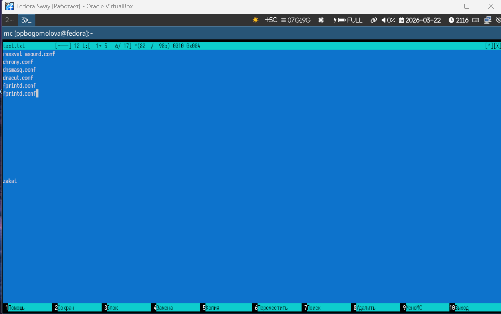

# Информация о докладчике

Богомолова Полина Петровна  
Студент, ФФМиЕН  
1032253562  

---

# Цель работы

Освоение основных возможностей командной оболочки Midnight Commander. Приоб-
ретение навыков практической работы по просмотру каталогов и файлов; манипуляций
с ними.

---

# Задание

1. Создайте текстовой файл text.txt.
2. Откройте этот файл с помощью встроенного в mc редактора.
3. Вставьте в открытый файл небольшой фрагмент текста, скопированный из любого
другого файла или Интернета.
4. Проделайте с текстом следующие манипуляции, используя горячие клавиши:
4.1. Удалите строку текста.
4.2. Выделите фрагмент текста и скопируйте его на новую строку.
4.3. Выделите фрагмент текста и перенесите его на новую строку.
4.4. Сохраните файл.
4.5. Отмените последнее действие.
4.6. Перейдите в конец файла (нажав комбинацию клавиш) и напишите некоторый
текст.
4.7. Перейдите в начало файла (нажав комбинацию клавиш) и напишите некоторый
текст.
4.8. Сохраните и закройте файл.
5. Откройте файл с исходным текстом на некотором языке программирования (напри-
мер C или Java)
6. Используя меню редактора, включите подсветку синтаксиса, если она не включена,
или выключите, если она включена.

---

# Теоретическое введение

Командная оболочка — интерфейс взаимодействия пользователя с операционной систе-
мой и программным обеспечением посредством команд.
Midnight Commander (или mc) — псевдографическая командная оболочка для UNIX/Linux
систем. Для запуска mc необходимо в командной строке набрать mc и нажать Enter .

---

# 1. Создадим текстовый файл

{width=70%}

---

# 2. Откроем файл с помощью встроенного в мс редактора

{width=70%}

---

# 3. Вставим в файл скопированный текст

{width=70%}

---

# 4. Выполняем манипуляции

{width=70%}

---

# 5. Сохраняем файл

{width=70%}

---

# 6. Открываем файл с исходным текстом на языке программирования

{width=70%}

---

# 7. Включим подсветку синтаксиса

{width=70%}

---

# Выводы

В результате выполнения работы я освоила возможности по работе с Midnight Commander
