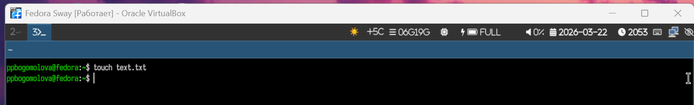
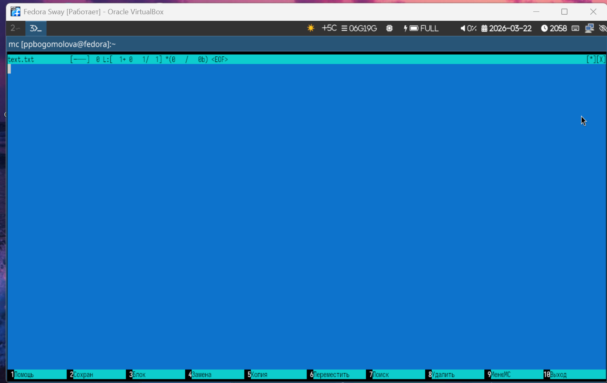
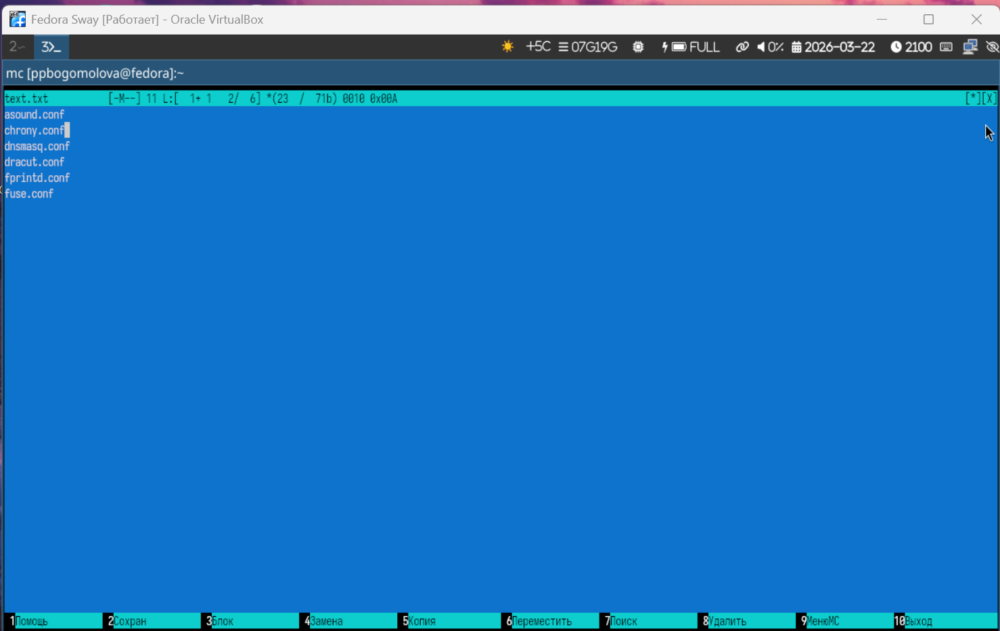
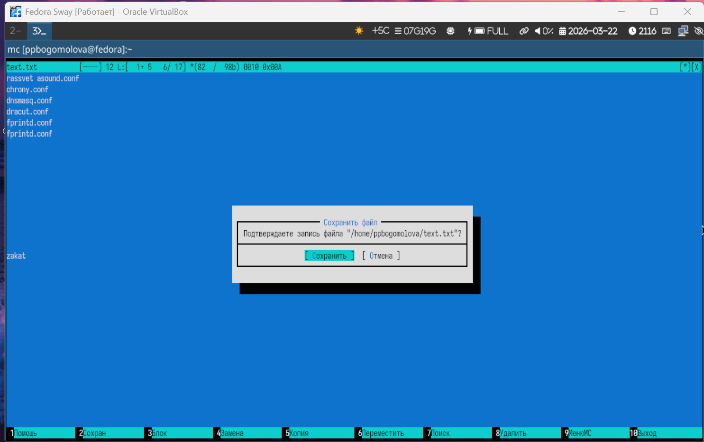
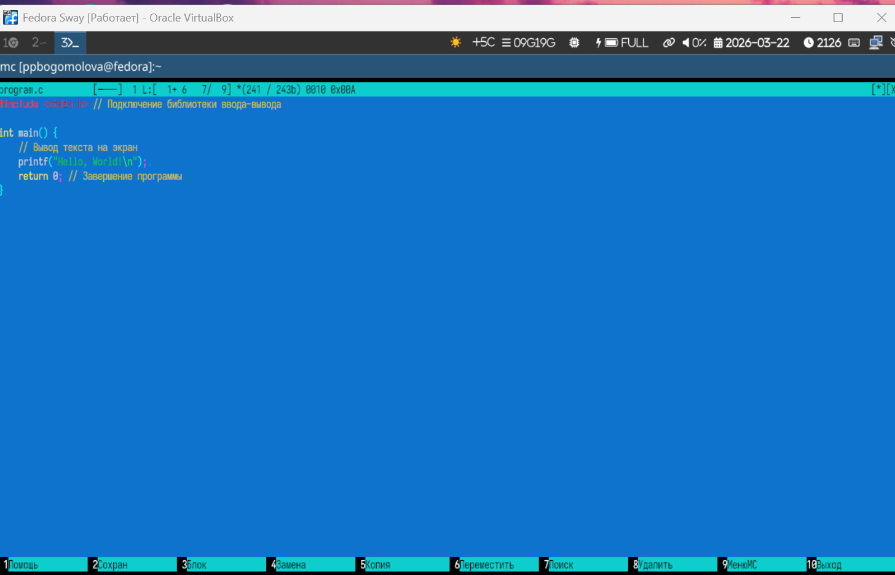
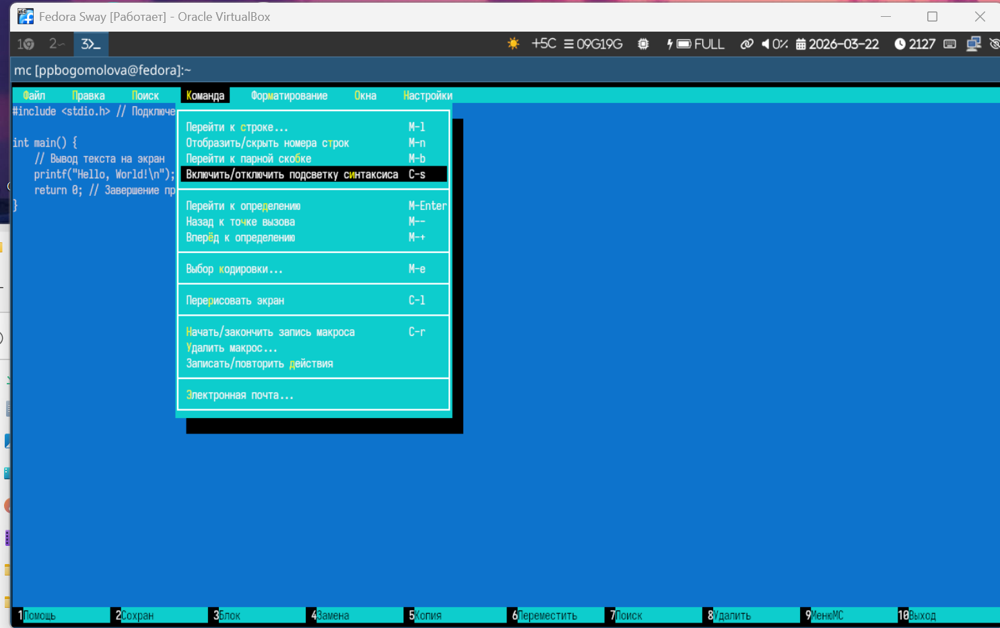

---
## Author
author:
  name: Богомолова Полина Петровна
  degrees: студент
  orcid: 1032253562
  email: 1032253562@rudn.ru
  affiliation:
    - name: Российский университет дружбы народов
      country: Российская Федерация
      postal-code: 117198
      city: Москва
      address: ул. Миклухо-Маклая, д. 6

## Title
title: "Отчет по Лабораторной Работе №9"
subtitle: "Командная оболочка Midnight Commander"
license: 1032253562/
---

# Цель работы

Освоение основных возможностей командной оболочки Midnight Commander. Приоб-
ретение навыков практической работы по просмотру каталогов и файлов; манипуляций
с ними.

# Задание

1. Создайте текстовой файл text.txt.
2. Откройте этот файл с помощью встроенного в mc редактора.
3. Вставьте в открытый файл небольшой фрагмент текста, скопированный из любого
другого файла или Интернета.
4. Проделайте с текстом следующие манипуляции, используя горячие клавиши:
4.1. Удалите строку текста.
4.2. Выделите фрагмент текста и скопируйте его на новую строку.
4.3. Выделите фрагмент текста и перенесите его на новую строку.
4.4. Сохраните файл.
4.5. Отмените последнее действие.
4.6. Перейдите в конец файла (нажав комбинацию клавиш) и напишите некоторый
текст.
4.7. Перейдите в начало файла (нажав комбинацию клавиш) и напишите некоторый
текст.
4.8. Сохраните и закройте файл.
5. Откройте файл с исходным текстом на некотором языке программирования (напри-
мер C или Java)
6. Используя меню редактора, включите подсветку синтаксиса, если она не включена,
или выключите, если она включена.

# Теоретическое введение

Командная оболочка — интерфейс взаимодействия пользователя с операционной систе-
мой и программным обеспечением посредством команд.
Midnight Commander (или mc) — псевдографическая командная оболочка для UNIX/Linux
систем. Для запуска mc необходимо в командной строке набрать mc и нажать Enter .

# Выполнение лабораторной работы

1) Создадим текстовый файл

{#fig-001 width=70%}

2) Откроем файл с помощью встроенного в мс редактора

{#fig-002 width=70%}

3) Вставим в файл скопированный текст

{#fig-003 width=70%}

4) Выполняем манипуляции

{#fig-004 width=70%}

{#fig-005 width=70%}

5) Открываем файл с исходным текстом на языке программирования

{#fig-006 width=70%}

6) Включим подсветку синтаксиса

{#fig-007 width=70%}

# Контрольные вопросы

1- Режимы работы: mc имеет два основных режима отображения панелей: Full (полный — список файлов с деталями), Brief (укороченный — только имена в две колонки) и Long (длинный — подробная информация о правах и владельце). Также есть специальные режимы: Info (информация о системе/диске), Tree (дерево каталогов) и Quick view (быстрый просмотр содержимого файла).

2- Операции через shell и mc: Почти все базовые действия дублируются. Примеры:

    Копирование: cp в shell или F5 в mc.
    Перемещение/Переименование: mv в shell или F6 в mc.
    Удаление: rm в shell или F8 в mc.
    Создание директории: mkdir в shell или F7 в mc.

3- Меню панели (Левая/Правая): Управляет отображением списка файлов. Команды включают: Listing mode (выбор формата списка), Sort order (сортировка по имени, расширению, размеру и т.д.), Filter (скрытие файлов по маске) и FTP/SFTP link (подключение к удаленным серверам).

4- Меню Файл: Содержит операции над объектами. Ключевые команды: View (просмотр, F3), Edit (правка, F4), Copy (F5), Rename/Move (F6), Make directory (F7), Delete (F8). Также здесь находятся команды изменения прав (Chmod) и владельца (Chown).

5- Меню Команда: Служит для глобальных действий. Find file (поиск файлов по маске и тексту), Directory hotlist (закладки часто посещаемых папок), Compare directories (сравнение содержимого двух панелей), Active VFS list (управление виртуальными файловыми системами).

6- Меню Настройки: Позволяет кастомизировать mc. Configuration (общие настройки интерфейса и поведения), Layout (внешний вид: бары, подсказки, функциональные клавиши), Confirmation (запросы на подтверждение действий), Appearance (выбор скина/цветовой схемы).

7- Встроенные команды mc: Это внутренние функции программы, не зависящие от внешних утилит. Например: cd (смена каталога внутри mc), view (встроенный вьюер), edit (встроенный редактор mcedit), exit (выход из программы).

8- Команды встроенного редактора (mcedit): Поддерживает стандартные операции: F2 (сохранение), F3 (выделение блока), F5 (копирование блока), F6 (перемещение блока), F8 (удаление блока), F7 (поиск), Shift+F7 (продолжить поиск).

9- Пользовательское меню: Вызывается клавишей F2. Это текстовый файл (~/.config/mc/menu), где пользователь может прописать собственные скрипты и команды для автоматизации рутинных задач, которые будут применяться к выделенным файлам.

10- Файл расширений: Средство для выполнения действий в зависимости от типа файла. Настраивается в меню «Команда» -> «Edit extension file». Позволяет задать, какой программой открывать файл (например, evince для PDF) при нажатии Enter или просмотре через F3.

# Выводы

В результате выполнения работы я освоила возможности по работе с Midnight Commander

