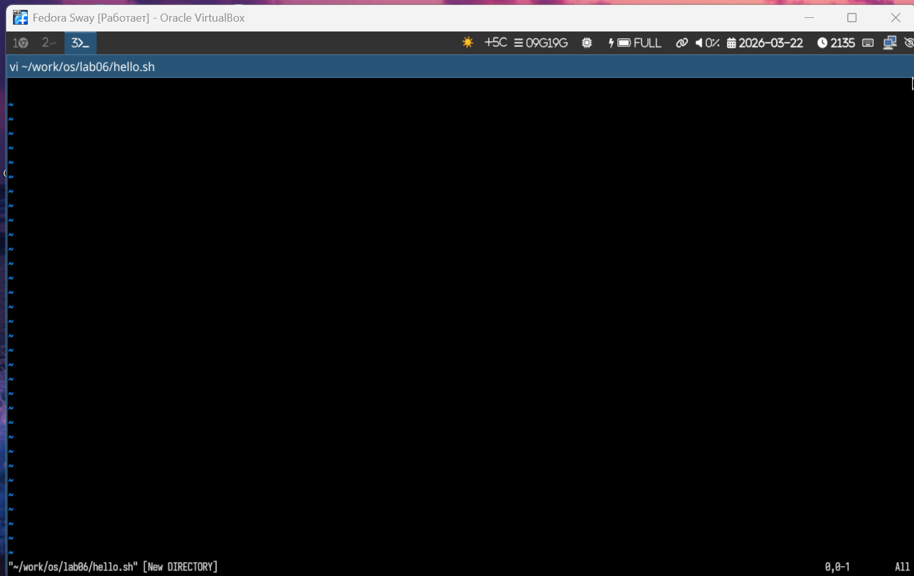
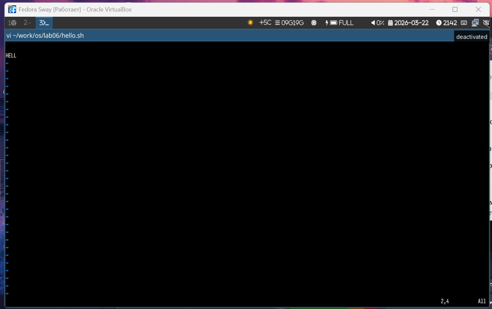
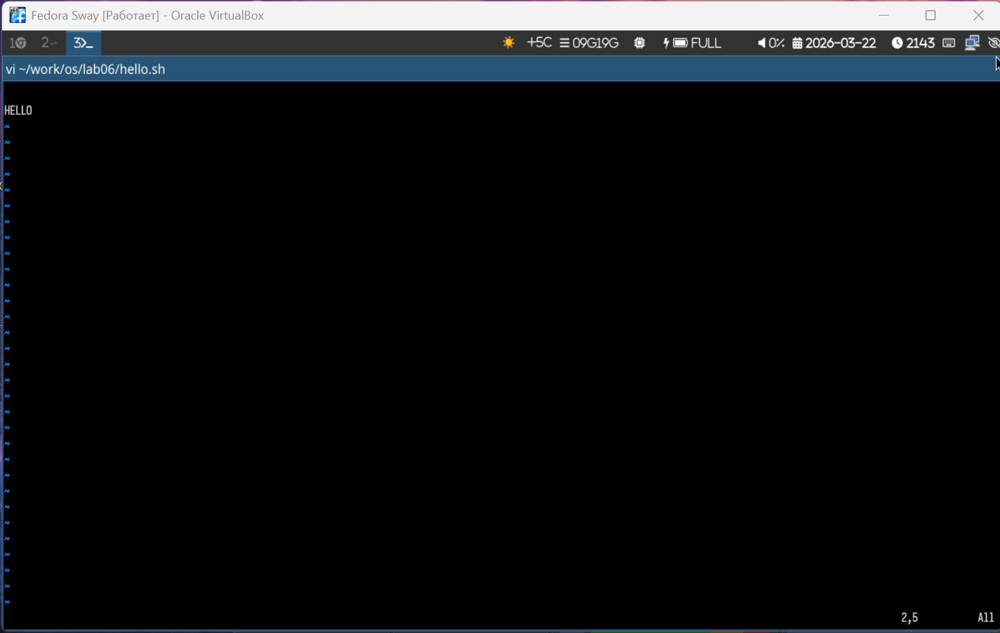
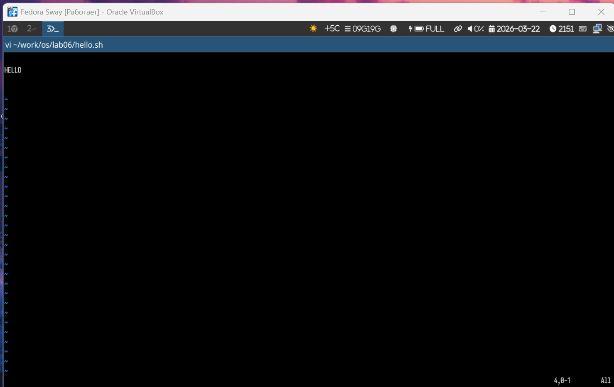
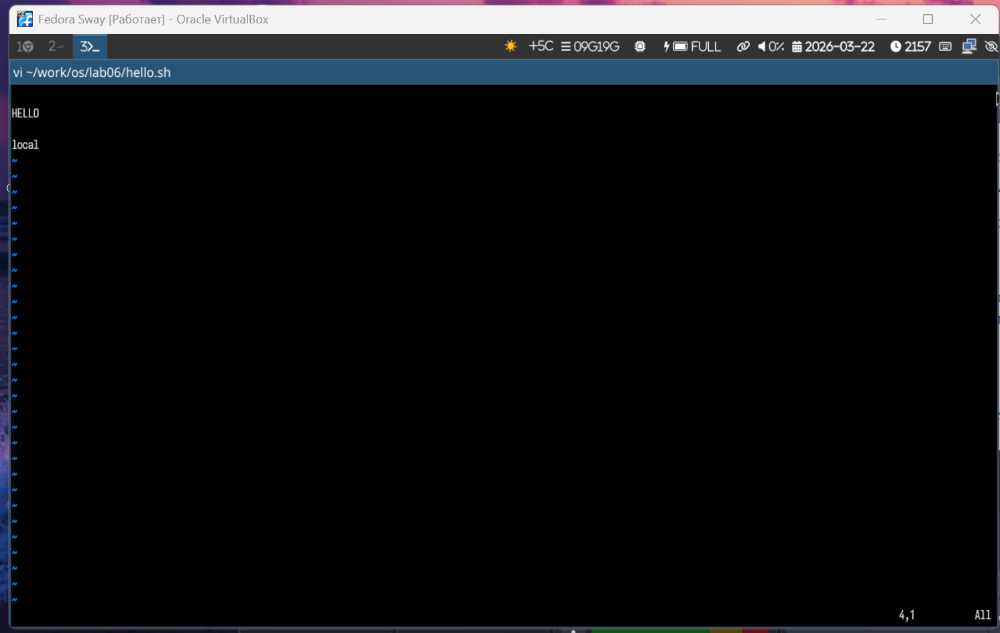
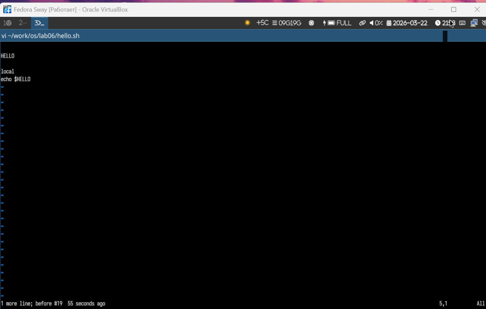
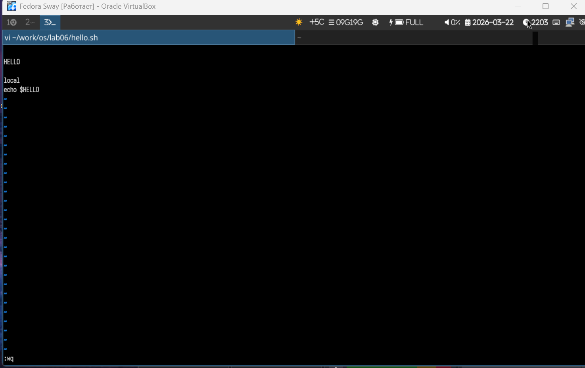

# Информация о докладчике

Богомолова Полина Петровна  
Студент, ФФМиЕН  
1032253562  

---

# Цель работы

Познакомиться с операционной системой Linux. Получить практические навыки работы с редактором vi, установленным по умолчанию практически во всех дистрибутивах.

---

# Задание

1. Вызвать vi для редактирования файла  
2. Установить курсор и выполнить навигацию  
3. Выполнить замену текста  
4. Удалить и вставить слова  
5. Добавить и удалить строки  
6. Использовать отмену изменений  
7. Сохранить изменения и выйти из редактора  

---

# Теоретическое введение

vi — стандартный текстовый редактор в Linux.

Основные режимы:
- Командный режим  
- Режим вставки  
- Режим последней строки  

Запуск редактора: vi имя_файла

Основные команды:
- i — вставка текста перед курсором  
- a — вставка текста после курсора  
- o — вставка новой строки ниже  
- dd — удалить строку  
- x — удалить символ  
- u — отмена последнего действия  
- w — переход к следующему слову  
- b — переход к предыдущему слову  
- 0 — переход в начало строки  
- $ — переход в конец строки  
- :w — сохранить файл  
- :q — выйти  
- :wq — сохранить и выйти  
- :q! — выйти без сохранения  

---

# 1. Запуск редактора vi

{width=70%}

---

# 2. Позиционирование курсора

{width=70%}

---

# 3. Замена текста HELL → HELLO

{width=70%}

---

# 4. Удаление слова LOCAL

{width=70%}

---

# 5. Вставка слова local

{width=70%}

---

# 6. Добавление новой строки

{width=70%}

---

# 7. Ввод строки echo $HELLO

{width=70%}

---

# 8. Удаление последней строки

{width=70%}

---

# 9. Отмена последнего действия

{width=70%}

---

# 10. Сохранение и выход

{width=70%}

---

# Выводы

В результате выполнения лабораторной работы были получены практические навыки работы с текстовым редактором vi: навигация по файлу, редактирование текста, использование команд вставки, удаления и сохранения.
