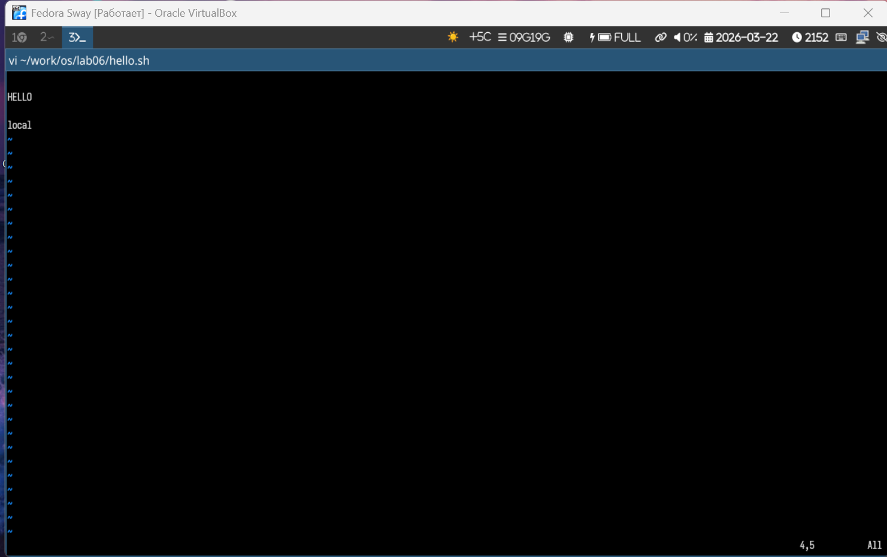
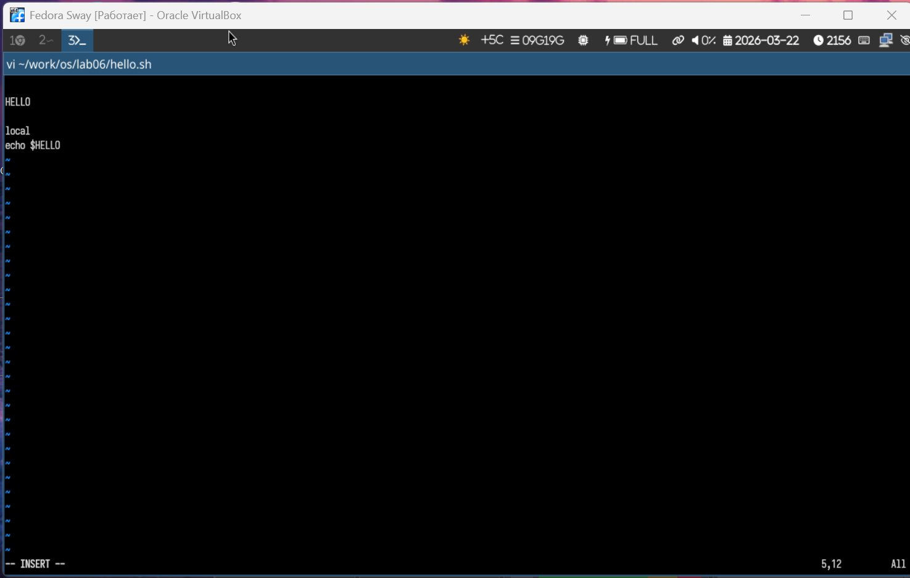
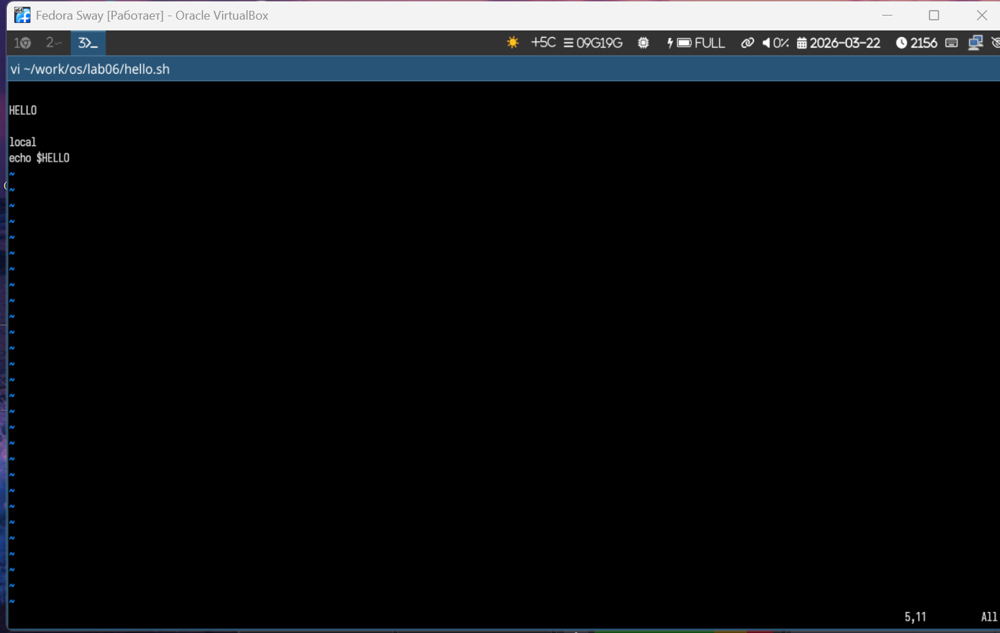

---
## Author
author:
  name: Богомолова Полина Петровна
  degrees: студент
  orcid: 1032253562
  email: 1032253562@rudn.ru
  affiliation:
    - name: Российский университет дружбы народов
      country: Российская Федерация
      postal-code: 117198
      city: Москва
      address: ул. Миклухо-Маклая, д. 6

## Title
title: "Отчет по Лабораторной Работе №10"
subtitle: "Текстовой редактор vi"
license: 1032253562/
---

# Цель работы

Познакомиться с операционной системой Linux. Получить практические навыки работы с редактором vi, установленным по умолчанию практически во всех дистрибутивах

# Задание

1. Вызовите vi на редактирование файла
vi ~/work/os/lab06/hello.sh
2. Установите курсор в конец слова HELL второй строки.
3. Перейдите в режим вставки и замените на HELLO. Нажмите Esc для возврата в команд-
ный режим.
4. Установите курсор на четвертую строку и сотрите слово LOCAL.
5. Перейдите в режим вставки и наберите следующий текст: local, нажмите Esc для
возврата в командный режим.
6. Установите курсор на последней строке файла. Вставьте после неё строку, содержащую
следующий текст: echo $HELLO.
7. Нажмите Esc для перехода в командный режим.
8. Удалите последнюю строку.
9. Введите команду отмены изменений u для отмены последней команды.
10. Введите символ : для перехода в режим последней строки. Запишите произведённые
изменения и выйдите из vi.

Контрольные вопросы

1. Дайте краткую характеристику режимам работы редактора vi.
2. Как выйти из редактора, не сохраняя произведённые изменения?
3. Назовите и дайте краткую характеристику командам позиционирования.
4. Что для редактора vi является словом?
5. Каким образом из любого места редактируемого файла перейти в начало (конец)
файла?
6. Назовите и дайте краткую характеристику основным группам команд редактирова-
ния.
7. Необходимо заполнить строку символами $. Каковы ваши действия?
8. Как отменить некорректное действие, связанное с процессом редактирования?
9. Назовите и дайте характеристику основным группам команд режима последней стро-
ки.
10. Как определить, не перемещая курсора, позицию, в которой заканчивается строка?
11. Выполните анализ опций редактора vi (сколько их, как узнать их назначение и т.д.).
12. Как определить режим работы редактора vi?
13. Постройте граф взаимосвязи режимов работы редактора vi.

# Теоретическое введение

В большинстве дистрибутивов Linux в качестве текстового редактора по умолчанию
устанавливается интерактивный экранный редактор vi (Visual display editor).

Редактор vi имеет три режима работы:

– командный режим — предназначен для ввода команд редактирования и навигации по
редактируемому файлу;
– режим вставки — предназначен для ввода содержания редактируемого файла;
– режим последней (или командной) строки — используется для записи изменений в файл
и выхода из редактора.

Для вызова редактора vi необходимо указать команду vi и имя редактируемого файла:
vi <имя_файла>

При этом в случае отсутствия файла с указанным именем будет создан такой файл.

Переход в командный режим осуществляется нажатием клавиши Esc . Для выхода из
редактора vi необходимо перейти в режим последней строки: находясь в командном
режиме, нажать Shift-; (по сути символ : — двоеточие), затем:

– набрать символы wq, если перед выходом из редактора требуется записать изменения
в файл;

– набрать символ q (или q!), если требуется выйти из редактора без сохранения.
Замечание. Следует помнить, что vi различает прописные и строчные буквы при наборе
(восприятии) команд.

8.2.1.2. Команды позиционирования

– 0 (ноль) — переход в начало строки;
– $ — переход в конец строки;
– G — переход в конец файла;
– 𝑛 G — переход на строку с номером 𝑛.

8.2.1.3. Команды перемещения по файлу

– Ctrl-d — перейти на пол-экрана вперёд;
– Ctrl-u — перейти на пол-экрана назад;
– Ctrl-f — перейти на страницу вперёд;
– Ctrl-b — перейти на страницу назад.

8.2.1.4. Команды перемещения по словам1
– W или w — перейти на слово вперёд;
– 𝑛 W или 𝑛 w — перейти на 𝑛 слов вперёд;
– b или B — перейти на слово назад;
– 𝑛 b или 𝑛 B — перейти на 𝑛 слов назад.

8.2.2. Команды редактирования

8.2.2.1. Вставка текста

– а — вставить текст после курсора;
– А — вставить текст в конец строки;
– i — вставить текст перед курсором;
– 𝑛 i — вставить текст 𝑛 раз;
– I — вставить текст в начало строки.

8.2.2.2. Вставка строки

– о — вставить строку под курсором;
– О — вставить строку над курсором.

8.2.2.3. Удаление текста

– x — удалить один символ в буфер;
– d w — удалить одно слово в буфер;
– d $ — удалить в буфер текст от курсора до конца строки;
– d 0 — удалить в буфер текст от начала строки до позиции курсора;
– d d — удалить в буфер одну строку;
– 𝑛 d d — удалить в буфер 𝑛 строк.

8.2.2.4. Отмена и повтор произведённых изменений

– u — отменить последнее изменение;
– . — повторить последнее изменение.

8.2.2.5. Копирование текста в буфер

– Y — скопировать строку в буфер;
– 𝑛 Y — скопировать 𝑛 строк в буфер;
– y w — скопировать слово в буфер.

8.2.2.6. Вставка текста из буфера

– p — вставить текст из буфера после курсора;
– P — вставить текст из буфера перед курсором.

8.2.2.7. Замена текста

– c w — заменить слово;
– 𝑛 c w — заменить 𝑛 слов;
– c $ — заменить текст от курсора до конца строки;
– r — заменить слово;
– R — заменить текст.

8.2.2.8. Поиск текста

– / текст — произвести поиск вперёд по тексту указанной строки символов текст;
– ? текст — произвести поиск назад по тексту указанной строки символов текст.

8.2.3. Команды редактирования в режиме командной строки

8.2.3.1. Копирование и перемещение текста

– : 𝑛,𝑚 d — удалить строки с 𝑛 по 𝑚;
– : 𝑖,𝑗 m 𝑘 — переместить строки с 𝑖 по 𝑗, начиная со строки 𝑘;
– : 𝑖,𝑗 t 𝑘 — копировать строки с 𝑖 по 𝑗 в строку 𝑘;
– : 𝑖,𝑗 w имя-файла — записать строки с 𝑖 по 𝑗 в файл с именем имя-файла.

8.2.3.2. Запись в файл и выход из редактора

– : w — записать изменённый текст в файл, не выходя из vi;
– : w имя-файла — записать изменённый текст в новый файл с именем имя-файла;
– : w ! имя-файла — записать изменённый текст в файл с именем имя-файла;
– : w q тавим к— записать изменения в файл и выйти из vi;
– : q — выйти из редактора vi;
– : q ! — выйти из редактора без записи;

# Выполнение лабораторной работы

1) Вызываем vi для редактирования файла: vi ~/work/os/lab06/hello.sh.

{#fig-001 width=70% fig-pos='H'}

2) Ставим курсор в конец слова HELL во второй строке.

{#fig-002 width=70% fig-pos='H'}

3) Переходим в режим вставки, пишем HELLO вместо HELL и нажимаем Esc для возврата в командный режим.

{#fig-003 width=70% fig-pos='H'}

4) Ставим курсор на четвёртую строку и удаляем слово LOCAL.

{#fig-004 width=70% fig-pos='H'}

5) Переходим в режим вставки, пишем текст local и нажимаем Esc для возврата в командный режим.

{#fig-005 width=70% fig-pos='H'}

6) Ставим курсор на последнюю строку файла и делаем вставку новой строки после неё.

{#fig-006 width=70% fig-pos='H'}

7) Пишем текст echo $HELLO и нажимаем Esc для перехода в командный режим.

{#fig-007 width=70% fig-pos='H'}

8) Удаляем последнюю строку.

{#fig-008 width=70% fig-pos='H'}

9) Пишем команду u для отмены последнего действия.

{#fig-009 width=70% fig-pos='H'}

10) Пишем символ : для перехода в режим последней строки, делаем сохранение изменений и выходим из vi.

{#fig-010 width=70% fig-pos='H'}

# Контрольные вопросы

1 — Редактор имеет три режима: командный (ввод команд для перемещения и удаления), вставки (непосредственный набор текста) и командной строки (ввод сложных команд через : внизу экрана).

2 — Нужно перейти в командный режим (Esc), нажать : и ввести q!, после чего нажать Enter.

3 — Основные клавиши: h (влево), j (вниз), k (вверх), l (вправо). Также есть w (прыжок к началу следующего слова), b (назад на начало слова) и 0 (переход в начало строки).

4 — Словом считается любая последовательность букв, цифр и знаков подчеркивания, разделенная пробелами или спецсимволами.

5 — Для перехода в начало файла в командном режиме наберите 1G или gg, для перехода в конец — заглавную G.

6 — Это команды вставки (i, a, o), удаления (x, dd), замены (r, cw) и копирования/вставки (yy, p).

7 — Находясь в режиме вставки, зажать клавишу $ до конца строки или использовать команду повтора (например, 50i$, затем Esc).

8 — В командном режиме нажать клавишу u (undo) для отмены последнего действия.

9 — Группы включают работу с файлами (:w, :q), поиск и замену (:/, :s) и настройку окружения (:set).

10 — В командном режиме ввести команду :set list. В конце каждой строки появится символ $, указывающий на её завершение.

11 — Опций несколько десятков. Посмотреть весь список можно командой :set all. Справка по конкретным опциям обычно ищется в системном руководстве man vi.

12 — Обычно по косвенным признакам: если при нажатии букв они печатаются — это вставка; если выполняются действия или слышен звуковой сигнал — командный. В современных версиях (vim) внизу пишется -- INSERT --.

13 — Граф выглядит как «звезда» с центром в командном режиме:
Командный.Вставка (через i, a, o / Esc).
Командный.Последняя строка (через : / Enter или Esc).
Напрямую из Вставки в режим Последней строки перейти нельзя.

# Выводы

В результате выполнения работы я получила практические навыки работы с текстовым редактором vi, установленным по умоланию почти во всех дистрибутивах

