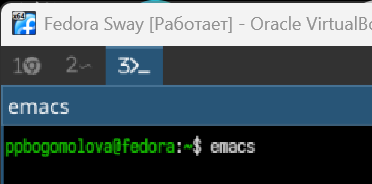
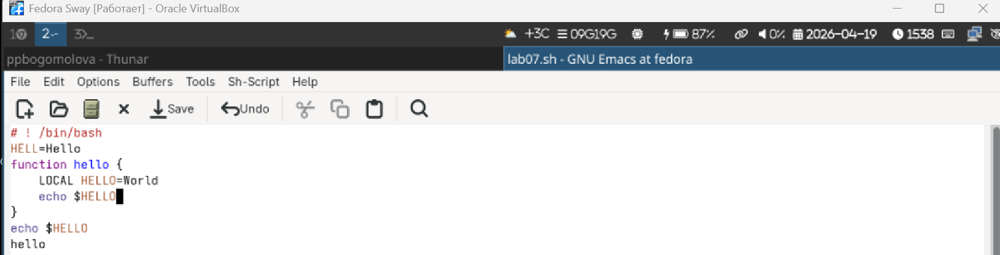
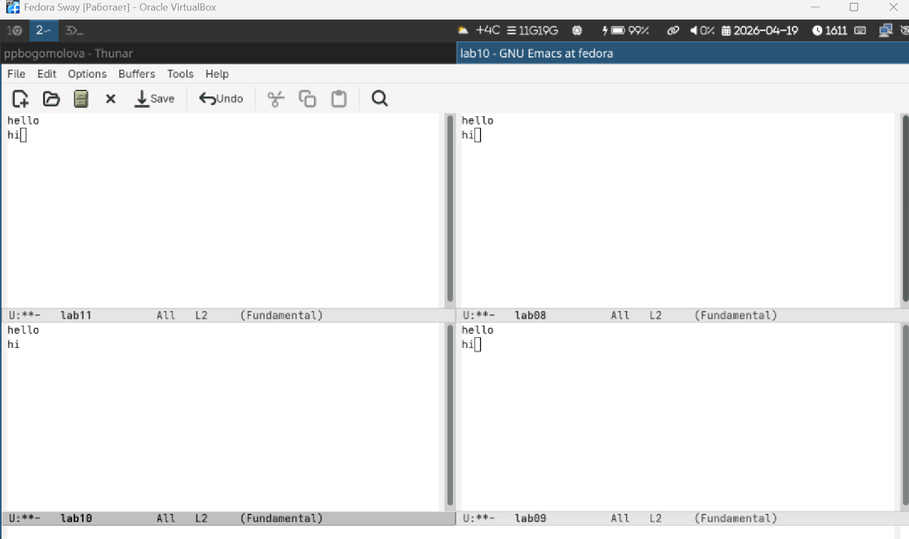
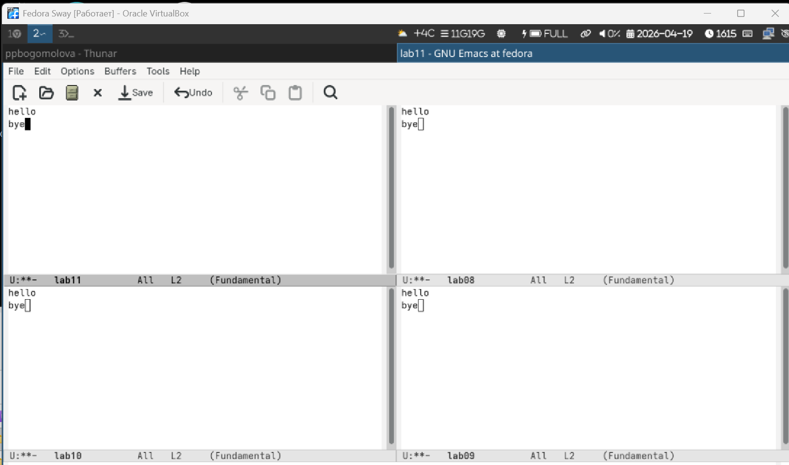

# Информация о докладчике

Богомолова Полина Петровна  
Студент, ФФМиЕН  
1032253562  

---

# Цель работы

Получить практические навыки работы с текстовым редактором Emacs в операционной системе Linux, изучить основные команды редактирования, навигации, работы с буферами и окнами.

---

# Задание

1. Открыть Emacs и создать файл  
2. Ввести и сохранить текст  
3. Выполнить редактирование текста  
4. Освоить перемещение курсора  
5. Изучить работу с буферами  
6. Изучить работу с окнами  
7. Выполнить поиск текста  
8. Выполнить замену текста  
9. Изучить режим M-s o  

---

# Теоретическое введение

Emacs - мощный текстовый редактор с расширяемой архитектурой.

Основные возможности:

- редактирование текста
- работа с буферами
- разделение окон
- поиск и замена

Основные команды:

- C-x C-f - открыть файл
- C-x C-s - сохранить файл
- C-k - вырезать строку
- C-y - вставить текст
- C-space - выделение области
- M-w - копировать
- C-w - вырезать
- C-a - начало строки
- C-e - конец строки
- C-s - поиск
- M-% - замена
- M-s o - показать все совпадения

---

# 1. Запуск Emacs и создание файла

Открываем Emacs и создаем файл lab07.sh с помощью C-x C-f. Вводим имя файла и нажимаем Enter.

{width=60%}

---

# 2. Ввод и сохранение текста

Вводим произвольный текст в файл. Затем сохраняем изменения с помощью C-x C-s.

{width=60%}

---

# 3. Редактирование текста

Выполняем действия:

- C-k - вырезаем строку
- C-y - вставляем строку
- C-space - выделяем текст
- M-w - копируем выделение
- C-w - вырезаем выделение
- C-/ - отменяем действие

{width=60%}

---

# 4. Перемещение курсора

Используем команды:

- C-a - начало строки
- C-e - конец строки
- M-< - начало файла
- M-> - конец файла

{width=40%}

---

# 5. Работа с буферами

Выполняем действия:

- C-x C-b - список буферов
- C-x o - переключение между окнами
- C-x b - переход к другому буферу
- C-x 0 - закрытие окна

{width=40%}

---

# 6. Работа с окнами

Выполняем действия:

- C-x 3 - разделение окна вертикально
- C-x 2 - разделение окна горизонтально
- перемещение между окнами
- ввод текста в каждом окне

{width=40%}

---

# 7. Поиск текста

Выполняем действия:

- C-s - запуск поиска
- C-s - переход к следующему совпадению
- C-g - выход из поиска

{width=40%}

---

# 8. Замена текста

Выполняем действия:

- M-% - запуск замены
- ввод старого текста
- ввод нового текста
- ! - замена всех совпадений

{width=40%}

---

# 9. Режим M-s o

Выполняем действия:

- запускаем M-s o
- вводим строку поиска
- получаем список всех совпадений в отдельном буфере

Отличие:

- обычный поиск C-s показывает совпадения по одному
- M-s o выводит все результаты сразу

{width=30%}

---

# Выводы

В ходе работы были изучены основные возможности Emacs: создание и редактирование файлов, работа с буферами и окнами, навигация по тексту, поиск и замена.
