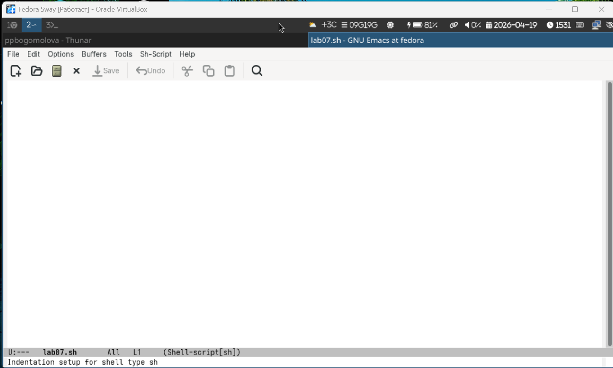
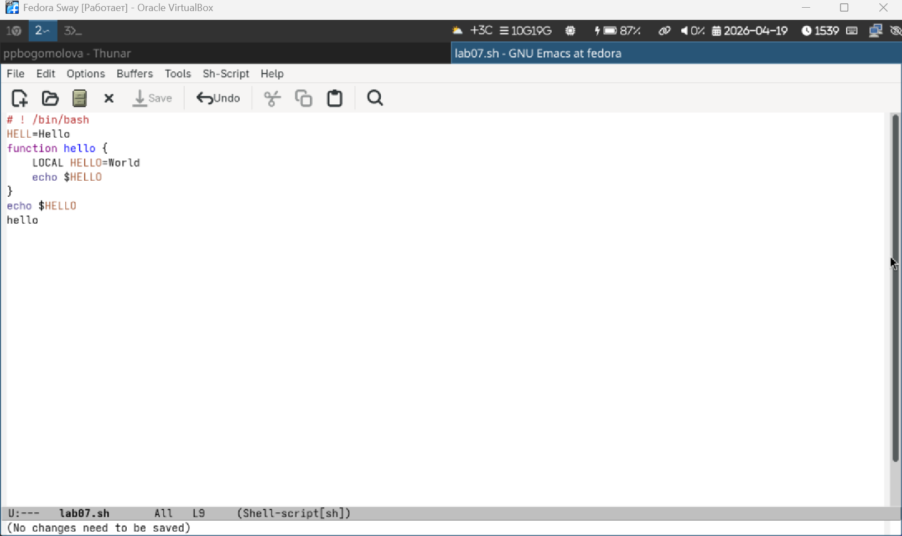
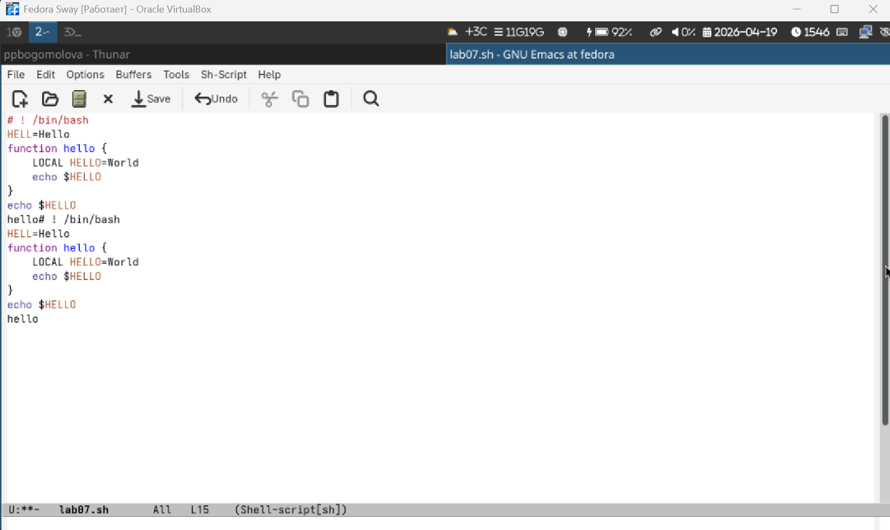
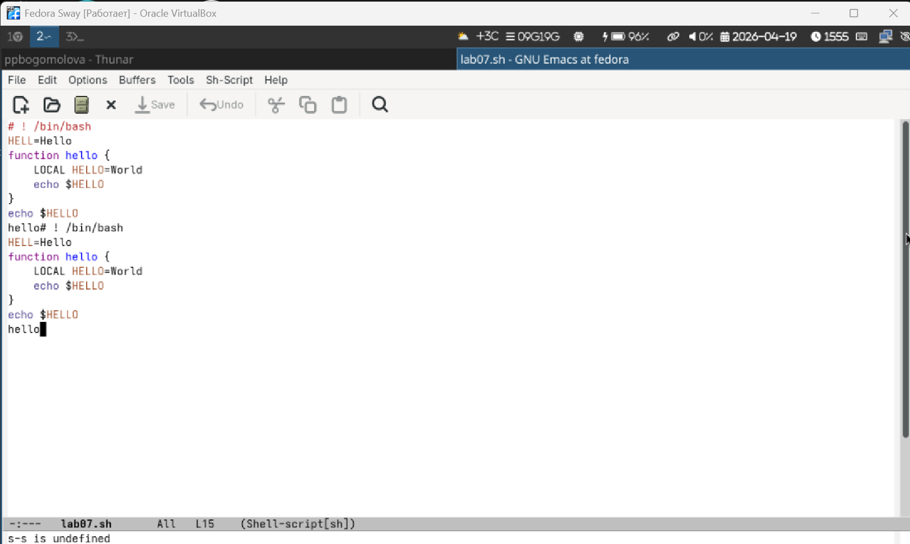
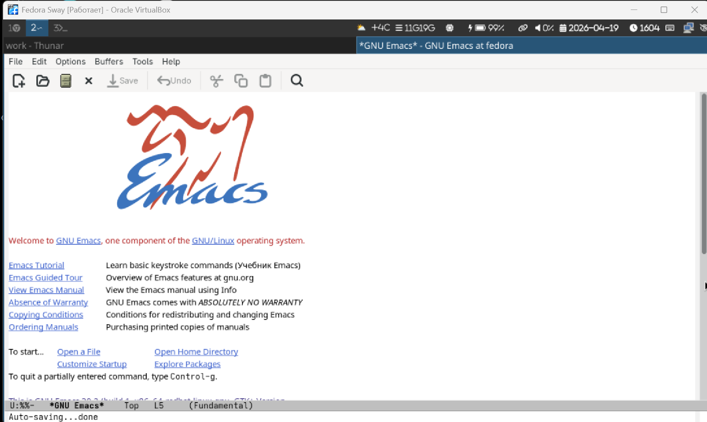

---
author:
  - name: Богомолова Полина Петровна
    degrees: студент
    orcid: 1032253562
    email: 1032253562@rudn.ru
    affiliation:
      - name: Российский университет дружбы народов
        country: Российская Федерация
        postal-code: 117198
        city: Москва
        address: ул. Миклухо-Маклая, д. 6

title: "Отчет по Лабораторной Работе №11"
subtitle: "Текстовый редактор Emacs"
---

# Цель работы

Получить практические навыки работы с текстовым редактором Emacs в операционной системе Linux.

# Теоретическое введение

Определение 1. Буфер — объект, представляющий какой-либо текст.
Буфер может содержать что угодно, например, результаты компиляции программы
или встроенные подсказки. Практически всё взаимодействие с пользователем, в том
числе интерактивное, происходит посредством буферов.

Определение 2. Фрейм соответствует окну в обычном понимании этого слова. Каждый
фрейм содержит область вывода и одно или несколько окон Emacs.

Определение 3. Окно — прямоугольная область фрейма, отображающая один из буфе-
ров.
Каждое окно имеет свою строку состояния, в которой выводится следующая информа-
ция: название буфера, его основной режим, изменялся ли текст буфера и как далеко вниз
по буферу расположен курсор. Каждый буфер находится только в одном из возможных
основных режимов. Существующие основные режимы включают режим Fundamental
(наименее специализированный), режим Text, режим Lisp, режим С, режим Texinfo
и другие. Под второстепенными режимами понимается список режимов, которые вклю-
чены в данный момент в буфере выбранного окна.

Определение 4. Область вывода — одна или несколько строк внизу фрейма, в которой
Emacs выводит различные сообщения, а также запрашивает подтверждения и дополни-
тельную информацию от пользователя.

Определение 5. Минибуфер используется для ввода дополнительной информации и все-
гда отображается в области вывода.

Определение 6. Точка вставки — место вставки (удаления) данных в буфере

# Задание

1. Открыть Emacs.  
2. Создать файл `lab07.sh`.  
3. Ввести текст.  
4. Сохранить файл.  
5. Выполнить редактирование текста.  
6. Выполнить перемещение курсора.  
7. Выполнить работу с буферами.  
8. Выполнить работу с окнами.  
9. Выполнить поиск и замену текста.

# Выполнение лабораторной работы

1) Открываем текстовый редактор Emacs.

{#fig-001 width=70% fig-pos='H'}

2) Создаем новый файл `lab07.sh`, используя `C-x C-f`, вводим имя файла и нажимаем Enter.

{#fig-002 width=70% fig-pos='H'}

3) Вводим произвольный текст в файл.

{#fig-003 width=70% fig-pos='H'}

4) Сохраняем файл с помощью `C-x C-s`.

{#fig-004 width=70% fig-pos='H'}

5) Выполняем редактирование текста:
- вырезаем строку (`C-k`);  
- вставляем ее в конце файла (`C-y`);  
- выделяем область (`C-space` и перемещение курсора);  
- копируем (`M-w`);  
- вставляем (`C-y`);  
- вырезаем выделение (`C-w`);  
- отменяем действие (`C-/`).

{#fig-005 width=70% fig-pos='H'}

6) Перемещаем курсор:
- в начало строки (`C-a`);  
- в конец строки (`C-e`);  
- в начало файла (`M-<`);  
- в конец файла (`M->`).

{#fig-006 width=70% fig-pos='H'}

7) Работаем с буферами:
- выводим список буферов (`C-x C-b`);  
- переключаемся между окнами (`C-x o`) и выбираем буфер;  
- закрываем окно (`C-x 0`);  
- переключаемся между буферами (`C-x b`).

{#fig-007 width=70% fig-pos='H'}

8) Управляем окнами:
- делим окно по вертикали (`C-x 3`);  
- затем по горизонтали (`C-x 2`);  
- переходим между окнами и вводим текст в каждом.

{#fig-008 width=70% fig-pos='H'}

9) Выполняем поиск и замену:
- запускаем поиск (`C-s`) и вводим текст;  
- переходим по совпадениям (`C-s`);  
- выходим (`C-g`);  
- выполняем замену (`M-%`) с подтверждением `!`;  
- используем режим `M-s o`, который выводит все строки с совпадениями в отдельный буфер, что позволяет видеть все результаты сразу и быстро переходить к нужному.

{#fig-009 width=70% fig-pos='H'}

# Контрольные вопросы

1. Кратко охарактеризуйте редактор emacs.  
Emacs - это многофункциональный текстовый редактор, который используется не только для редактирования текста, но и как полноценная рабочая среда. Он поддерживает программирование, работу с файлами, терминалом и другими инструментами. Расширяется с помощью языка Emacs Lisp.

2. Какие особенности делают его сложным для новичка?  
Сложность связана с большим количеством сочетаний клавиш, которые нужно запоминать. Также непривычна терминология (буферы, окна) и логика работы. Высокая настраиваемость тоже усложняет освоение.

3. Что такое буфер и окно?  
Буфер - это область памяти, где хранится текст.  
Окно - это часть экрана, в которой отображается буфер.

4. Можно ли открыть больше 10 буферов в одном окне?  
Да, количество буферов не ограничено. В одном окне отображается один буфер, но переключаться можно между любым количеством.

5. Какие буферы создаются по умолчанию?  
Создаются `scratch` и `Messages`.

6. Какие клавиши нажать для C-c | и C-c C-|?  
Для `C-c |` - нажать Ctrl+c, затем |.  
Для `C-c C-|` - удерживать Ctrl и нажать c, затем, не отпуская Ctrl, нажать |.

7. Как поделить окно на две части?  
`C-x 2` - горизонтально, `C-x 3` - вертикально.

8. Где хранятся настройки Emacs?  
В `~/.emacs` или `~/.emacs.d/init.el`.

9. Какую функцию выполняет клавиша Ctrl и можно ли ее переназначить?  
Ctrl используется для команд. Переназначение возможно через настройки.

10. Какой редактор удобнее: vi или emacs?  
Emacs удобнее для сложной работы. vi - для быстрых правок.

# Выводы

В ходе работы были освоены основные возможности редактора Emacs: редактирование, навигация, работа с буферами и окнами, поиск и замена текста.
