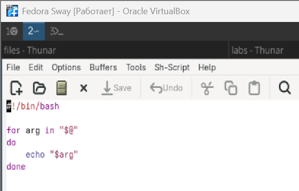
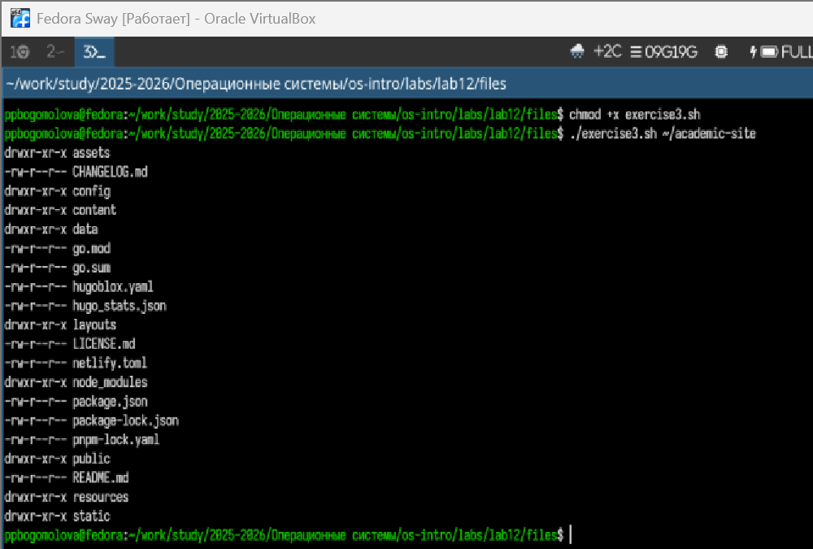
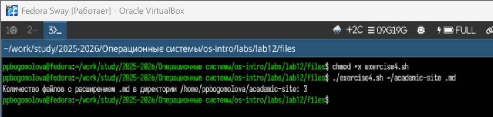

# Информация о докладчике

Богомолова Полина Петровна  
Студент, ФФМиЕН  
1032253562  

---

# Цель работы

Изучить основы программирования в оболочке ОС UNIX/Linux и научиться писать командные файлы.

---

# Задание

1. Создать скрипт для резервного копирования самого себя  
2. Реализовать обработку произвольного числа аргументов  
3. Написать аналог команды ls  
4. Подсчитать количество файлов по расширению  

---

# Теоретическое введение

Командная оболочка (shell) — это программа для взаимодействия пользователя с ОС.

Bash позволяет:

- автоматизировать задачи  
- работать с файлами и каталогами  
- использовать переменные, условия и циклы  

Командные файлы (.sh):

- содержат последовательность команд  
- выполняются интерпретатором Bash  

---

# 1. Резервное копирование скрипта

Был разработан скрипт, создающий резервную копию самого себя.

Основные моменты:

- используется получение пути к текущему файлу  
- создаётся каталог backup  
- добавляется временная метка  
- выполняется архивирование с помощью tar  

{width=60%}

---

# Результат выполнения

После запуска скрипта:

- создаётся архив  
- файл сохраняется в каталоге backup  
- имя содержит дату и время  

{width=40%}

---

# 2. Обработка аргументов

Реализован скрипт для работы с произвольным числом аргументов.

Особенности:

- используется переменная `$@`  
- применяется цикл for  
- корректная обработка аргументов с пробелами  

{width=40%}

---

# Результат выполнения

Скрипт выводит все переданные аргументы по очереди.

{width=70%}

---

# 3. Аналог команды ls

Создан скрипт, отображающий содержимое каталога.

Реализовано:

- работа с аргументом каталога  
- значение по умолчанию — текущий каталог  
- проверка существования каталога  
- вывод прав доступа к файлам  

{width=40%}

---

# Результат выполнения

Отображается:

- список файлов  
- права доступа для каждого файла  

{width=40%}

---

# 4. Подсчёт файлов по расширению

Создан скрипт для подсчёта файлов заданного типа.

Особенности:

- передача директории и расширения через аргументы  
- использование команды find  
- подсчёт через wc -l  

{width=40%}

---

# Результат выполнения

Выводится количество файлов с заданным расширением в указанной директории.

{width=70%}

---

# Выводы

В ходе лабораторной работы:

- изучены основы Bash  
- освоена работа с аргументами командной строки  
- реализованы циклы и условия  
- получен опыт работы с файловой системой  

Были приобретены навыки написания командных файлов для автоматизации задач.
