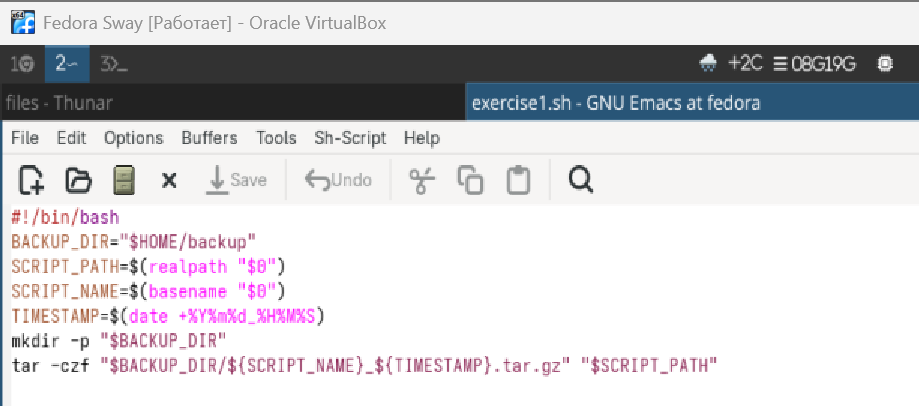
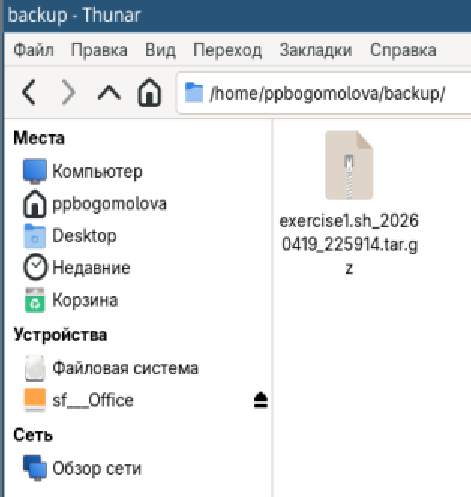
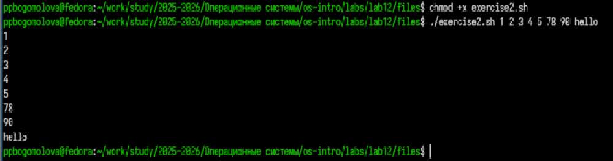
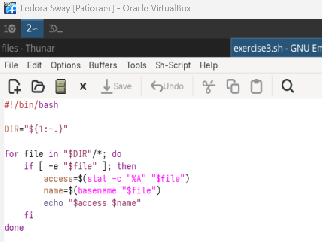
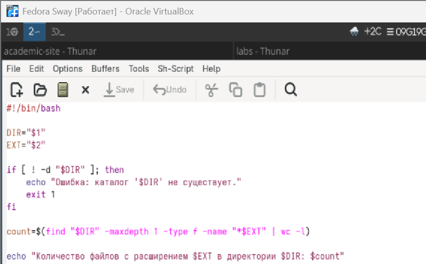

---

author:
  - name: Богомолова Полина Петровна
    degrees: студент
    orcid: 1032253562
    email: 1032253562@rudn.ru
    affiliation:
      - name: Российский университет дружбы народов
        country: Российская Федерация
        postal-code: 117198
        city: Москва
        address: ул. Миклухо-Маклая, д. 6

title: "Отчет по Лабораторной Работе №12"
subtitle: "Программирование в командном процессоре ОС UNIX. Командные файлы"

---

# Цель работы

Изучить основы программирования в оболочке ОС UNIX/Linux. Научиться писать небольшие командные файлы.

# Задание

1. Написать скрипт, который при запуске будет делать резервную копию самого себя (то есть файла, в котором содержится его исходный код) в другую директорию backup в вашем домашнем каталоге. При этом файл должен архивироваться одним из архиваторов на выбор zip, bzip2 или tar. Способ использования команд архивации необходимо узнать, изучив справку.
2. Написать пример командного файла, обрабатывающего любое произвольное число аргументов командной строки, в том числе превышающее десять. Например, скрипт может последовательно распечатывать значения всех переданных аргументов.
3. Написать командный файл — аналог команды ls (без использования самой этой команды и команды dir). Требуется, чтобы он выдавал информацию о нужном каталоге и выводил информацию о возможностях доступа к файлам этого каталога.
4. Написать командный файл, который получает в качестве аргумента командной строки формат файла (.txt, .doc, .jpg, .pdf и т.д.) и вычисляет количество таких файлов в указанной директории. Путь к директории также передаётся в виде аргумента командной строки.


# Теоретическое введение

Командный процессор (командная оболочка, интерпретатор команд shell) — это про-
грамма, позволяющая пользователю взаимодействовать с операционной системой
компьютера. В операционных системах типа UNIX/Linux наиболее часто используются
следующие реализации командных оболочек:

– оболочка Борна (Bourne shell или sh) — стандартная командная оболочка UNIX/Linux,
содержащая базовый, но при этом полный набор функций;
– С-оболочка (или csh) — надстройка на оболочкой Борна, использующая С-подобный
синтаксис команд с возможностью сохранения истории выполнения команд;
– оболочка Корна (или ksh) — напоминает оболочку С, но операторы управления програм-
мой совместимы с операторами оболочки Борна;
– BASH — сокращение от Bourne Again Shell (опять оболочка Борна), в основе своей сов-
мещает свойства оболочек С и Корна (разработка компании Free Software Foundation).
POSIX (Portable Operating System Interface for Computer Environments) — набор стандартов
описания интерфейсов взаимодействия операционной системы и прикладных программ.
Стандарты POSIX разработаны комитетом IEEE (Institute of Electrical and Electronics
Engineers) для обеспечения совместимости различных UNIX/Linux-подобных опера-
ционных систем и переносимости прикладных программ на уровне исходного кода.
POSIX-совместимые оболочки разработаны на базе оболочки Корна


# Выполнение лабораторной работы

1) Создание резервной копии скрипта

В рамках данного задания я написала скрипт, который автоматически создает резервную копию самого себя.  
В процессе работы я использовала переменные для хранения путей и имен файлов. Конструкция `$(...)` позволила мне выполнять команды внутри переменных, например получать полный путь к файлу (`realpath`) и текущее время (`date`).  
Команда `mkdir -p` используется для создания каталога, причем она не вызывает ошибку, если каталог уже существует.  
Архивация реализована с помощью команды `tar`, где ключи `-c`, `-z`, `-f` означают создание архива, сжатие и указание имени файла соответственно.

{#fig-001 width=70% fig-pos='H'}

{#fig-002 width=70% fig-pos='H'}

2) Обработка аргументов командной строки

В данном задании я реализовала скрипт, который обрабатывает произвольное количество аргументов.  
Для этого используется цикл `for`, который последовательно перебирает все значения из переменной `$@`.  
Переменная `$@` хранит все аргументы, переданные в скрипт.  
Команда `echo` выводит каждый аргумент на экран.  
Я также использовала кавычки `"$@"`, чтобы корректно обрабатывать аргументы, содержащие пробелы.

{#fig-003 width=70% fig-pos='H'}

{#fig-004 width=70% fig-pos='H'}

3) Аналог команды ls

В этом задании я написала скрипт, который частично реализует функциональность команды `ls`.  
Я использовала конструкцию `${1:-.}`, которая позволяет задать значение по умолчанию — текущий каталог, если аргумент не был передан.  
С помощью условного оператора `if` и проверки `[ -d ]` я проверяю, существует ли указанный каталог.  
Цикл `for` перебирает все файлы в каталоге.  
Команда `stat` используется для получения прав доступа к файлу, а `basename` — для получения имени файла без пути.

{#fig-005 width=70% fig-pos='H'}

{#fig-006 width=70% fig-pos='H'}

4) Подсчет файлов по расширению

В данном задании я реализовала скрипт для подсчета файлов с заданным расширением.  
Аргументы передаются через переменные `$1` и `$2`.  
Проверка `[ -d ]` используется для проверки существования каталога.  
Команда `find` выполняет поиск файлов по заданному шаблону, параметр `-type f` ограничивает поиск только файлами, а `-maxdepth 1` исключает вложенные каталоги.  
Конвейер `|` передает результат команде `wc -l`, которая считает количество строк, то есть найденных файлов.

{#fig-007 width=70% fig-pos='H'}

{#fig-008 width=70% fig-pos='H'}

# Листинги

Листинг 1:

```bash
#!/bin/bash
BACKUP_DIR="$HOME/backup"
SCRIPT
PATH=$(realpath "$0")
SCRIPT_NAME=$(basename "$0")
TIMESTAMP=$(date +%Y%m%d_%H%M%S)
mkdir -p "$BACKUP_DIR"
tar -czf "$BACKUP_DIR/${SCRIPT_NAME}_${TIMESTAMP}.tar.gz" "$SCRIPT_PATH"
```

Листинг 2:

```bash
#!/bin/bash
for arg in "$@"
do
    echo "$arg"
done
```

Листинг 3:

```bash
#!/bin/bash
DIR="${1:-.}"

if [ ! -d "$DIR" ]; then
     echo "Ошибка: каталог '$DIR' не существует."
     exit 1
fi

for file in "$DIR"/*; do
    if [ -e "$file" ]; then
        access=$(stat -c "%A" "$file")
        name=$(basename "$file")
        echo "$access $name"
    fi
done 
```    

Листинг 4:

```bash
#!/bin/bash
DIR="$1"
EXT="$2"

if [ ! -d "$DIR" ]; then
    echo "Ошибка: каталог '$DIR' не существует."
    exit 1
fi

count=$(find "$DIR" -maxdepth 1 -type f -name "*$EXT" | wc -l)

echo "Количество файлов с расширением $EXT в директории $DIR: $count"
```

# Контрольные вопросы

1. Под командной оболочкой я понимаю специальную программу, которая обеспечивает взаимодействие пользователя с операционной системой через ввод команд. Она интерпретирует введённые команды и передает их на выполнение системе. Примерами таких оболочек являются Bash, Zsh, Fish и Sh. Они отличаются синтаксисом, возможностями автодополнения, удобством настройки и функциональностью.

2. POSIX — это набор стандартов, который определяет совместимость операционных систем семейства Unix. Благодаря POSIX программы и скрипты могут работать на разных системах без изменений.

3. В языке Bash переменные определяются с помощью записи `имя=значение` без пробелов. Для обращения к переменной используется символ `$`. Массивы задаются, например, как `arr=(1 2 3)` и позволяют хранить несколько значений.

4. Оператор `let` используется для выполнения арифметических операций, например увеличения счетчика. Команда `read` позволяет считывать ввод пользователя с клавиатуры и сохранять его в переменную.

5. В Bash можно использовать основные арифметические операции: сложение, вычитание, умножение, деление, а также остаток от деления. Они применяются в конструкциях `let` или `(( ))`.

6. Конструкция `(( ))` используется для выполнения арифметических вычислений и логических проверок. Она удобна тем, что внутри нее можно писать выражения почти как в обычных языках программирования.

7. К стандартным переменным относятся `$HOME` (домашний каталог), `$PATH` (пути поиска программ), `$USER` (имя пользователя), `$PWD` (текущий каталог).

8. Метасимволы — это специальные символы оболочки, такие как `*`, `?`, `|`, `$`, которые имеют особое значение и используются для шаблонов, конвейеров и подстановок.

9. Экранирование метасимволов выполняется с помощью обратного слеша `\\` или использования кавычек, чтобы символ воспринимался как обычный текст.

10. Командные файлы создаются как обычные текстовые файлы с расширением `.sh`. Для их запуска можно использовать команду `bash имя_файла.sh` или предварительно сделать файл исполняемым с помощью `chmod +x` и запускать как `./имя_файла.sh`.

11. Функции в Bash определяются с помощью конструкции:

    function name {
      commands
    }

Они позволяют разбивать программу на логические части и переиспользовать код.

12. Чтобы определить, является ли файл каталогом или обычным файлом, используются проверки `[ -d ]` и `[ -f ]`.

13. Команда `set` используется для настройки параметров оболочки, `typeset` — для объявления переменных (чаще в других оболочках), `unset` — для удаления переменных.

14. Параметры передаются в скрипт через аргументы командной строки и доступны через переменные `$1`, `$2`, а также `$@` для всех аргументов.

15. Специальные переменные Bash включают: `$0` — имя скрипта, `$#` — количество аргументов, `$@` — все аргументы, `$?` — код завершения последней команды.

# Выводы

В ходе выполнения лабораторной работы я изучила основы написания скриптов на языке Bash, научилась работать с аргументами командной строки, условиями, циклами и файловой системой. Также я получила практический опыт использования различных команд Linux.
