# Информация о докладчике

Богомолова Полина ПетровнаСтудент, ФФМиЕН10322535621032253562@rudn.ruРоссийский университет дружбы народов

---

# Цель работы

Получить практические и теоретические знания и умения по работе с Linux.

---

# Теоретическое введение

Linux — это не какая-то одна операционная система, а целое семейство систем. Все эти системы (их еще называют дистрибутивами) имеют много общего, но разрабатываются разными компаниями или сообществами энтузиастов, поэтому у них есть и различия.

---

# Задание

Выполнить все задания 1 этапа внешнего курса «Введение в Linux».

---

# Вопрос 1

Как называется этот курс?

Название курса можно посмотреть на страничке «Мое обучение». Курс называется «Введение в Linux».

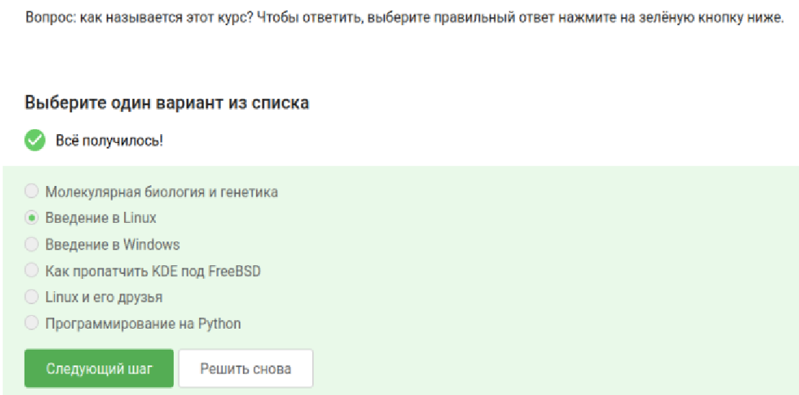{width=45%}

---

# Вопрос 2

Выберите правильные утверждения о курсе

Вся информация о курсе находится над самим заданием.

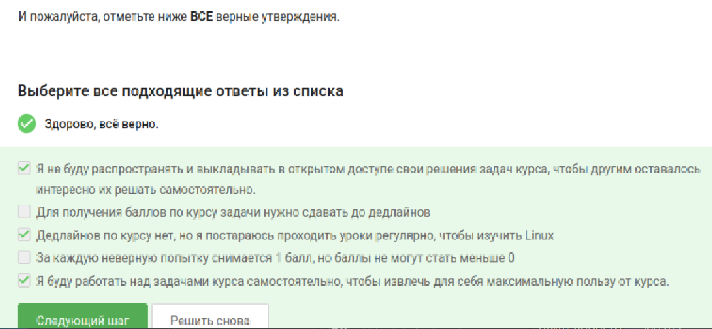{width=45%}

---

# Вопрос 3

Какую операционную систему вы обычно используете?

Я использую Windows в качестве основной системы. Также я использую Linux в учебных целях.

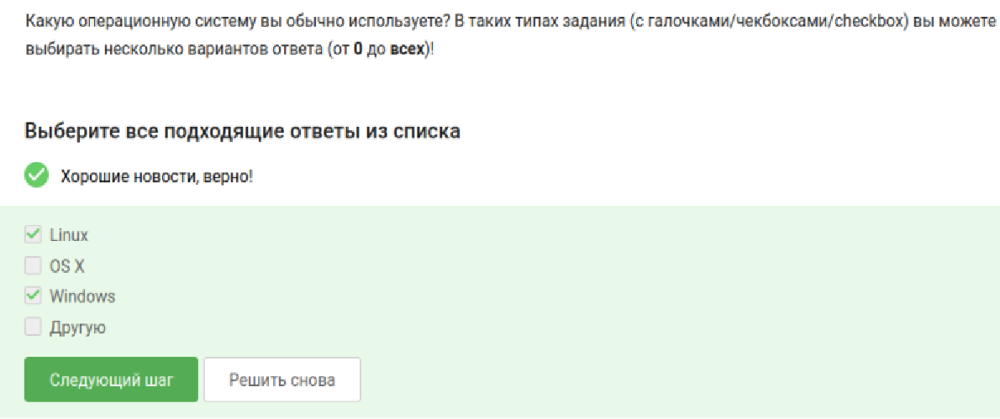{width=45%}

---

# Вопрос 4

Что такое виртуальная машина?

Виртуальная машина (ВМ) — это «компьютер внутри компьютера». Это программа, которая имитирует настоящий системный блок с процессором, памятью и жестким диском, позволяя запустить на нем полноценную операционную систему.

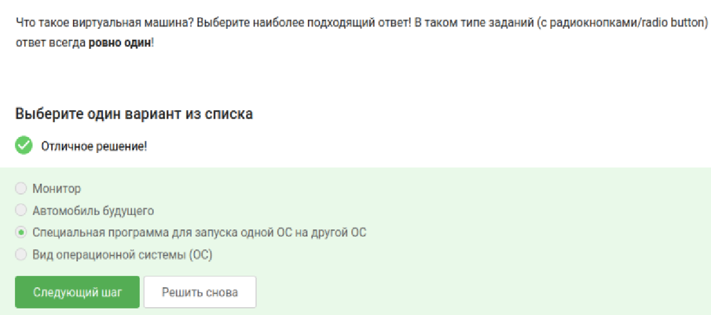{width=45%}

---

# Вопрос 5

Смогли ли вы запустить на своем компьютере Linux?

Да, я смогла не только запустить Linux, но и активно пользоваться им.

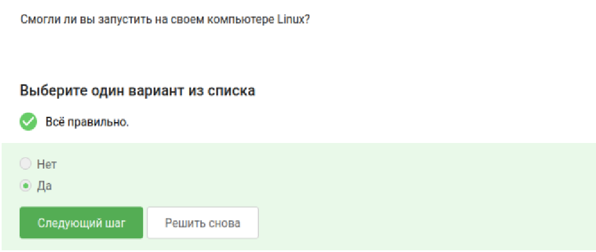{width=45%}

---

# Вопрос 6 (Задание)

Создайте документ в LibreOffice Writer и напишите в нём шрифтом FreeMono строчку: Hello, Linux! После этого сохраните этот документ в формате FODT (Flat XML).

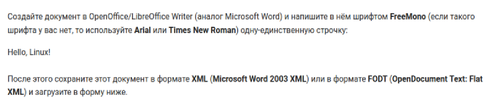{width=45%}

---

# Вопрос 6 (Ответ)

Я открыла LibreOffice Writer, напечатала фразу Hello, Linux!, выделила текст и выбрала шрифт FreeMono. В меню «Файл» → «Сохранить как» выбрала формат FODT (Flat XML) и загрузила файл в форму.

{width=45%}

---

# Вопрос 7

Какое расширение имеют установочные пакеты в Linux (Ubuntu)?

Выбранный вариант является правильным, так как Ubuntu основана на дистрибутиве Debian, который использует формат пакетов с расширением .deb.

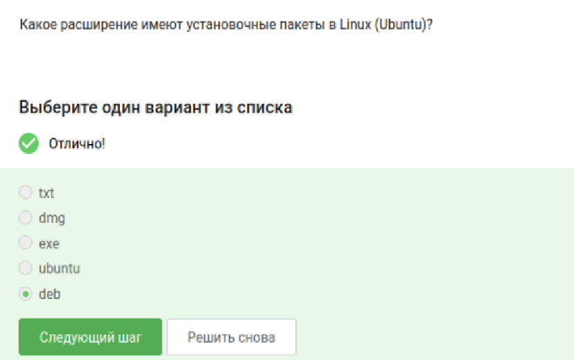{width=45%}

---

# Вопрос 8

Поставьте себе в систему плеер VLC. Запустите, откройте Help → About. Напишите первую фамилию (без имени!) из вкладки Authors.

Первым в списке значится Rémi Denis-Courmont. Имя Rémi было отброшено. Фамилия: Denis-Courmont.

{width=45%}

---

# Вопрос 9

Для чего можно использовать приложение Update Manager?

Приложение Update Manager предназначено для обновления уже установленных пакетов, обновления всей системы до нового релиза и обновления ссылок на репозитории. Оно не используется для удаления или первичной установки программ.

{width=45%}

---

# Вопрос 10

Выберите все синонимы для «командной строки».

Выбранные варианты «Терминал» и «Консоль» верны. «Термин» — научное определение, «Ассоль» — литературное имя.

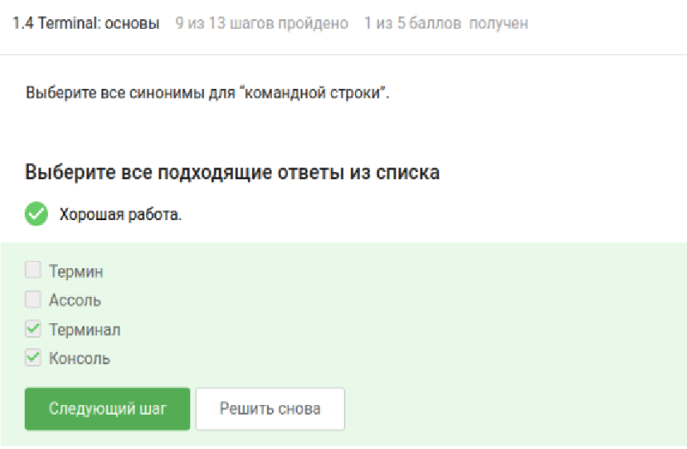{width=45%}

---

# Вопрос 11

Какая команда напечатает, в какой директории мы сейчас находимся?

Команда pwd — это сокращение от print working directory. Командная строка чувствительна к регистру, поэтому варианты PWD или Pwd не сработают.

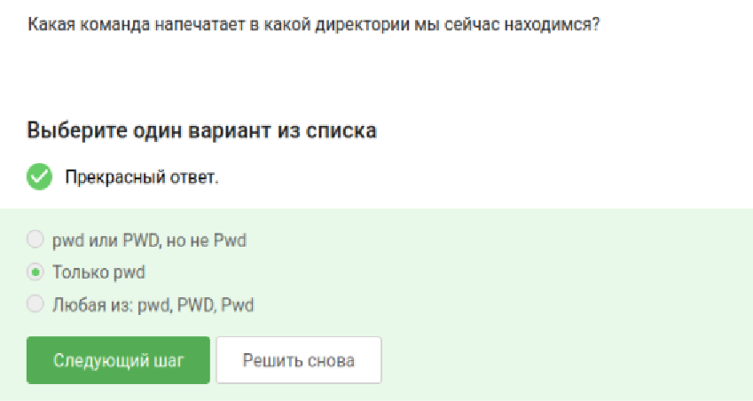{width=45%}

---

# Вопрос 12 (Задание)

Укажите, какие из следующих команд полностью эквивалентны команде ls -A --human-readable -l /some/directory

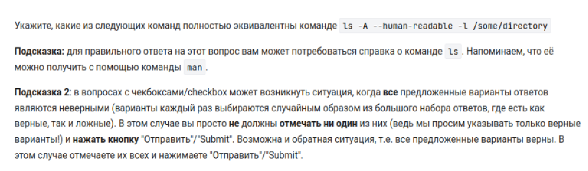{width=45%}

---

# Вопрос 12 (Ответ)

Эквивалентны варианты ls -lAh, ls -Ahl, ls -lah (с оговоркой про -a), а также вариант с полными названиями опций. Флаги можно объединять в любой последовательности.

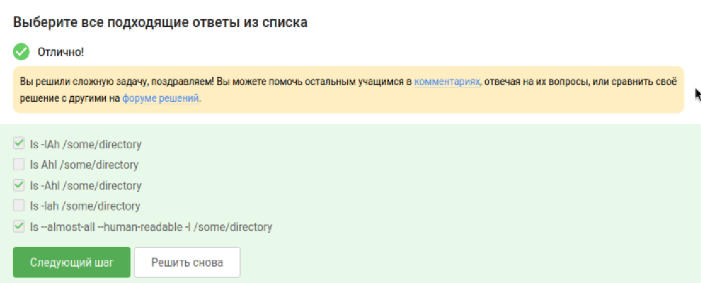{width=45%}

---

# Вопрос 13 (Задание)

Какая(ие) команды выведут содержимое /home/bi/Downloads, не показывая содержимое других директорий? (Вы находитесь в /home/bi/Documents).

{width=45%}

---

# Вопрос 13 (Ответ)

Правильные ответы: ls ~/Downloads, ls /home/bi/Downloads и ls ../Downloads.

Вариант ls ../../Downloads ошибочен, так как поднимает на два уровня вверх, в папку /home.

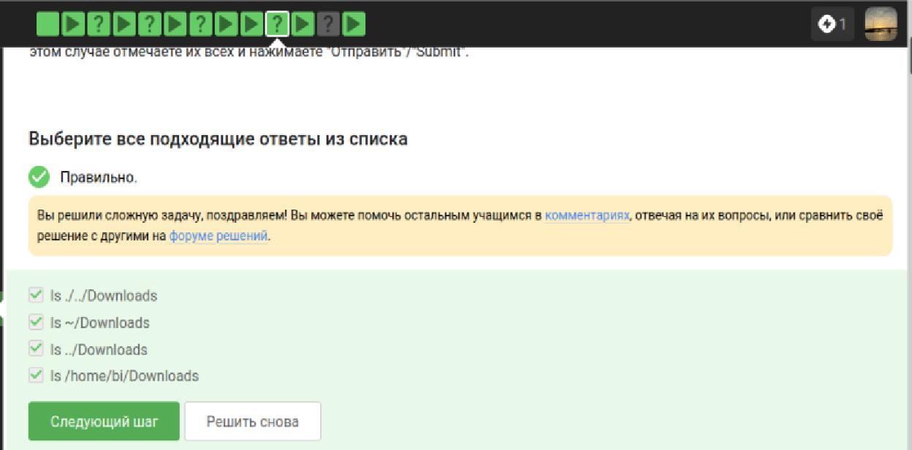{width=45%}

---

# Вопрос 14

Какая команда используется для удаления директорий?

Команда rm -r используется для удаления директорий, так как флаг -r указывает на рекурсивное действие. mkdir — создание, обычный rm — только для файлов.

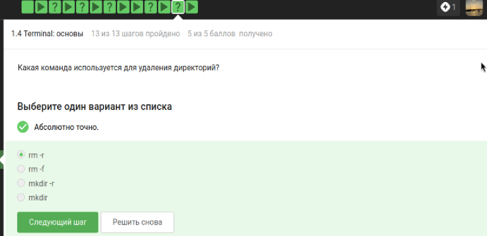{width=45%}

---

# Вопрос 15

Что произойдет, если ввести в терминал команду firefox, а затем команду exit?

Ответ «Никто не закроется». Терминал занят процессом firefox и не обрабатывает новые команды, пока браузер не будет закрыт.

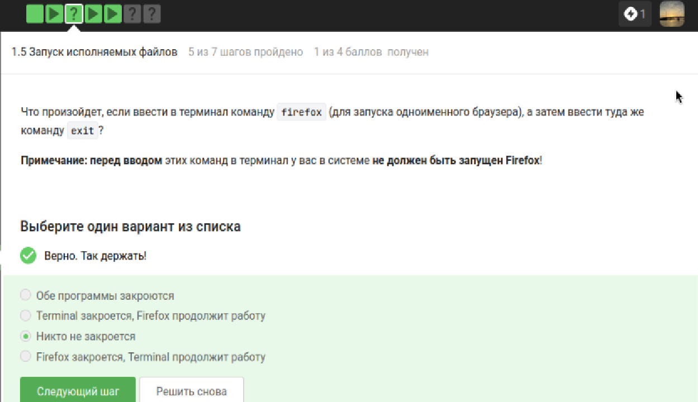{width=45%}

---

# Вопрос 16

Чему эквивалентен запуск программы с &?

Вариант «Запуск, Ctrl+Z, bg» верен. Это переводит процесс в фоновый режим. Ctrl+C — завершение, а просто Ctrl+Z оставляет процесс замороженным.

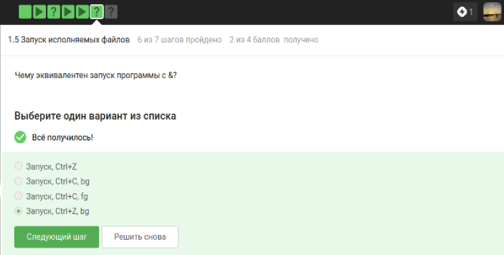{width=45%}

---

# Вопрос 17

Скачайте файл с программой, сделайте его исполняемым, запустите и скопируйте то, что он выведет на экран, в форму.

Правильным ответом является уникальная комбинация даты, времени и контрольной суммы. Просто текст команды не подходит.

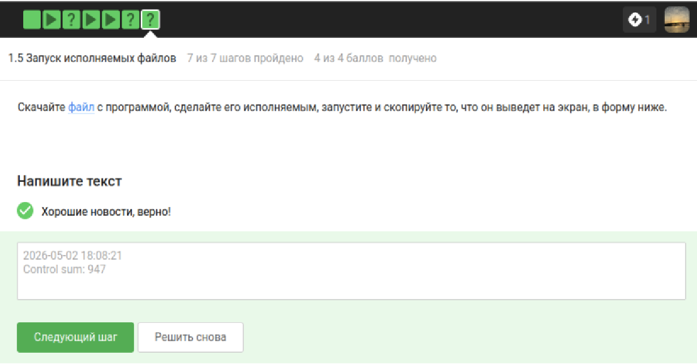{width=45%}

---

# Вопрос 18

Куда по умолчанию выводится поток ошибок из программы, запущенной в терминале?

Поток ошибок (stderr) по умолчанию выводится на экран терминала. Запись в файл происходит только при явном перенаправлении.

{width=45%}

---

# Вопрос 19

Какие (какая) из команд создадут файл file.txt и запишут в него поток ошибок программы program?

Верны команды program 2> file.txt и program 2>> file.txt. Дескриптор 2 закреплен за потоком ошибок, а символ > создает файл.

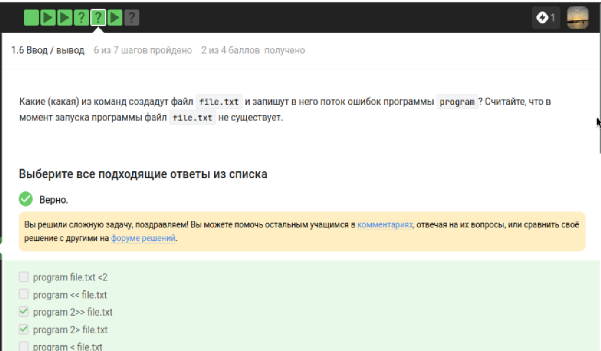{width=45%}

---

# Вопрос 20

Куда деваются сообщения об ошибках от программ, объединенных в конвейер (pipe)?

Сообщения выводятся на экран. Конвейер | передает только стандартный поток вывода (stdout), а stderr идет в терминал.

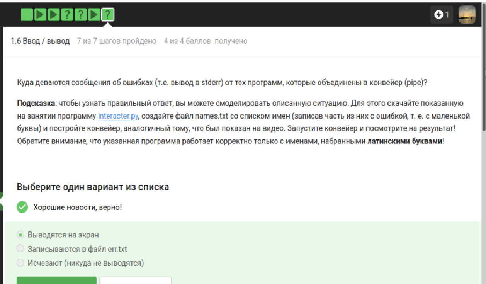{width=45%}

---

# Вопрос 21

В каком файле на диске окажется картинка, если для её скачивания были выполнены команды:

cd /home/alex/

wget -P /home/alex/Pictures -O 1.jpg http://example.com/example.jpg

Правильный ответ — /home/alex/1.jpg. Опция -O имеет приоритет и сохраняет файл под указанным именем в текущей директории, игнорируя -P.

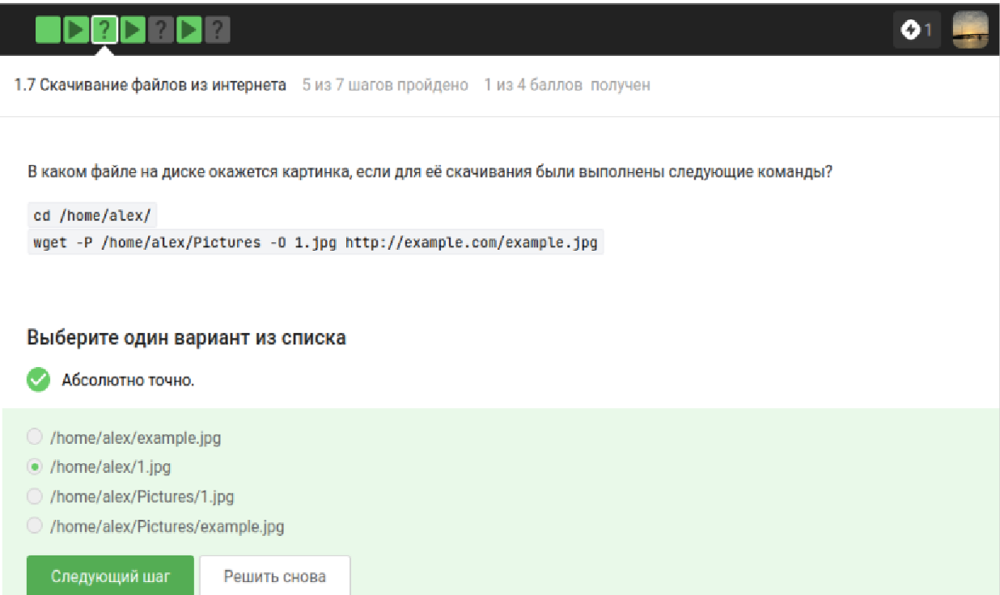{width=45%}

---

# Вопрос 22

Какую опцию нужно указать команде wget, чтобы она не выводила никаких сообщений на экран?

Правильный вариант: -q или --quiet. Этот флаг включает «тихий» режим. -v и -nv наоборот, выводят информацию.

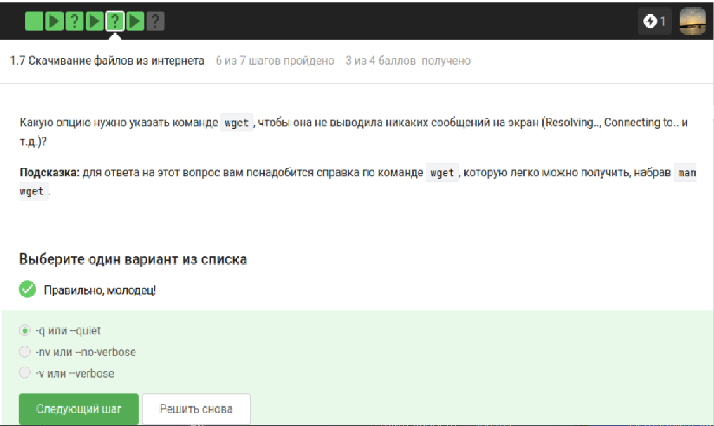{width=45%}

---

# Вопрос 23

Какие файлы будут скачаны, если запустить wget -r -l 1 -A jpg для web-страницы?

Будут скачаны jpg и временно html, но все html-файлы будут удалены после извлечения ссылок на картинки.

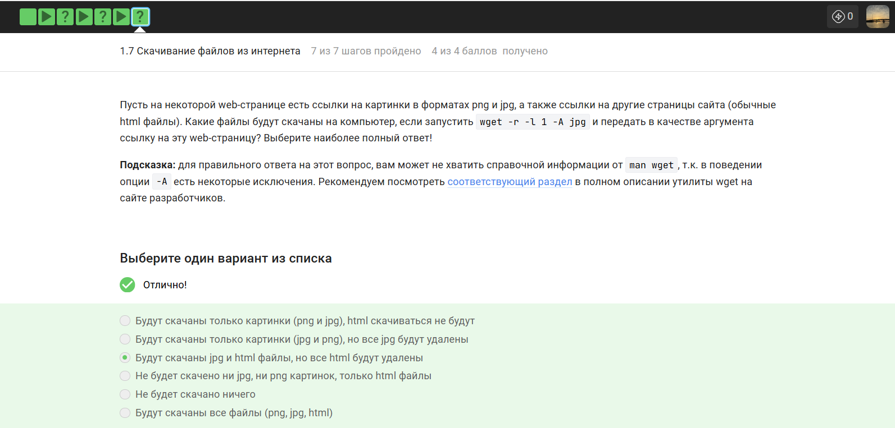{width=45%}

---

# Вопрос 24

Чем отличаются архиваторы gzip и zip?

Правильный ответ: «gzip удаляет архив после его распаковки». zip всегда оставляет исходный архив на месте.

{width=45%}

---

# Вопрос 25

Какие из перечисленных программ-архиваторов могут создать архив из директории с файлами?

Правильные ответы: tar и zip. Утилита gzip предназначена исключительно для сжатия одиночных файлов.

{width=45%}

---

# Вопрос 26

Какой набор опций нужно указать программе tar, чтобы запаковать файлы в my_archive.tar.bz2?

Правильный ответ: -cjf. c — создать, j — использовать bzip2, f — указать имя файла.

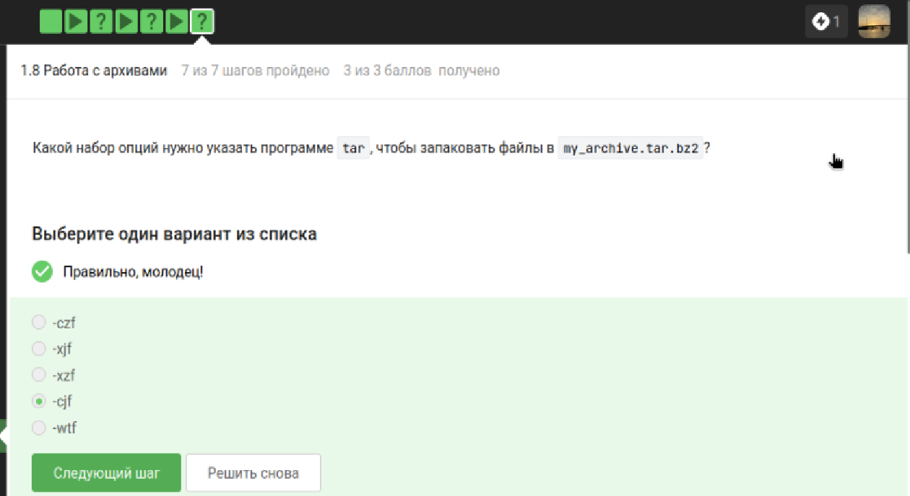{width=45%}

---

# Вопрос 27

Какая маска команды find НЕ найдет файл Alexey.jpeg?

Правильные ответы: .jpg, alexey. и .?. Команда find чувствительна к регистру, а знак вопроса заменяет ровно один символ.

{width=45%}

---

# Вопрос 28

Какие строки выведет команда grep "world" text.txt?

Правильные строки: «world», «The world is not enough», «The "world" is not enough», «The beautiful-world is not enough» и «The beautifulworld is not enough». grep ищет точное совпадение с учетом регистра.

{width=45%}

---

# Вопрос 29

Сгенерируйте файл со всеми строчками из произведений Шекспира, содержащими “love”, и загрузите его в форму.

Нужно выполнить команду grep "love" * > result.txt в папке с распакованными произведениями, чтобы собрать все нужные строки в файл.

{width=45%}

---

# Выводы

В ходе работы я освоила операционную систему Linux на более высоком уровне, научилась использовать полезные команды и работать с различными программами. Были получены навыки управления файлами, установки ПО, работы с архивами, поиска и перенаправления потоков ввода-вывода.
