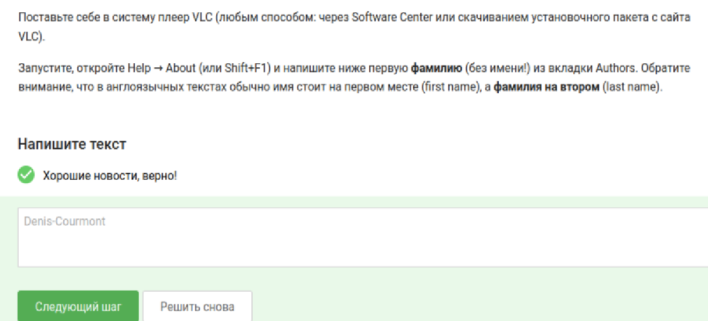
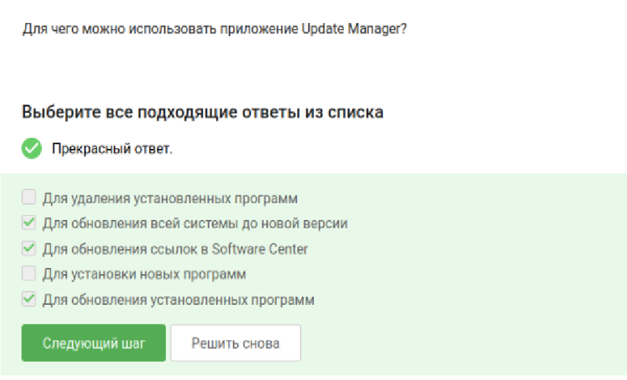
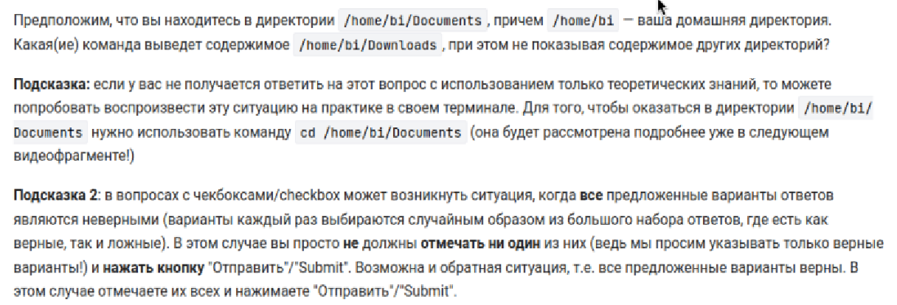
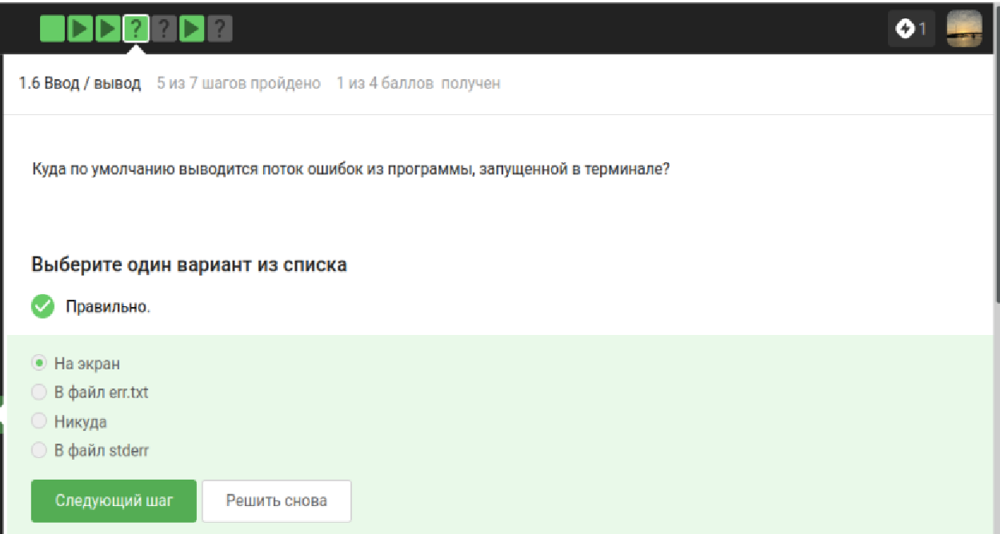
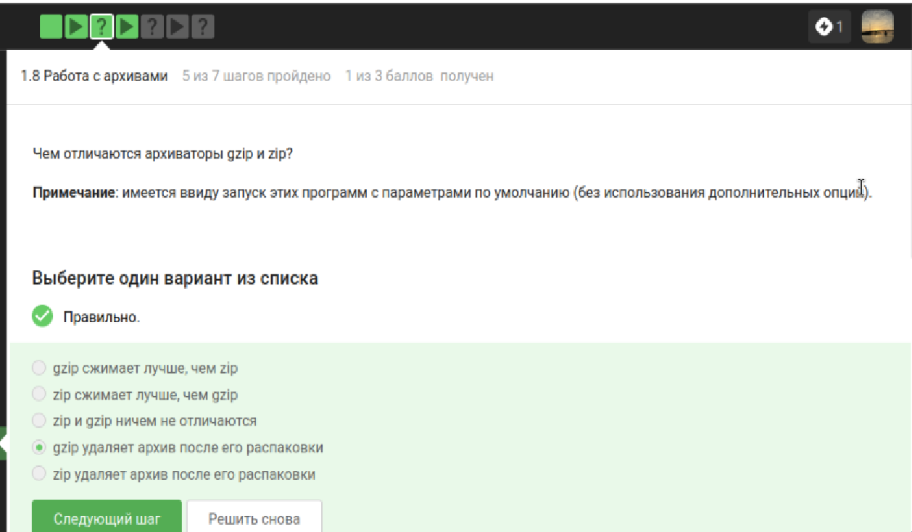
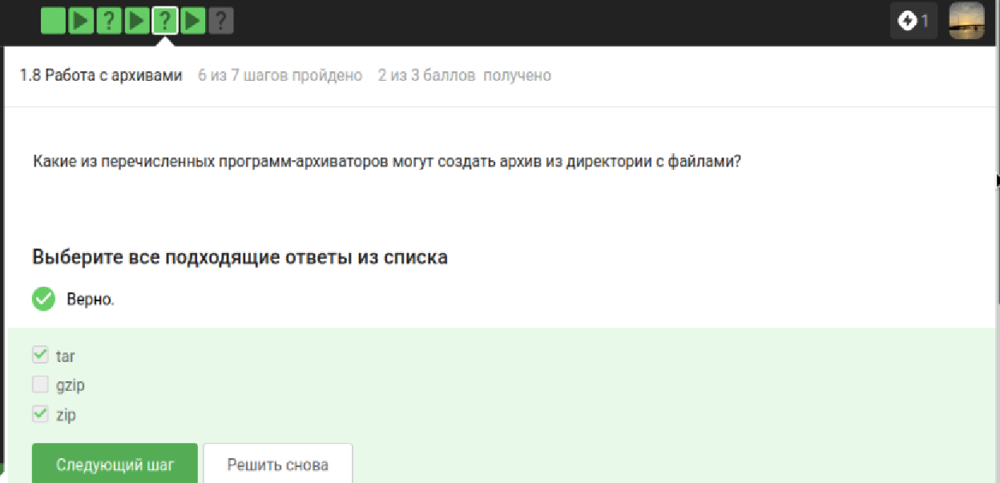
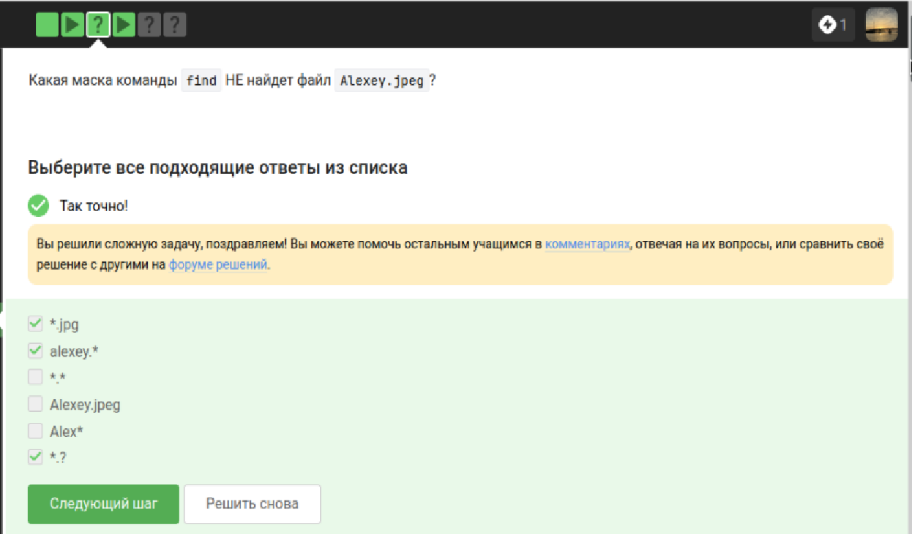
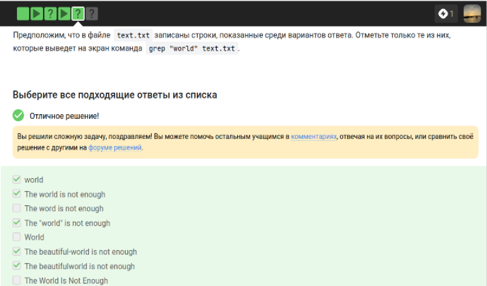
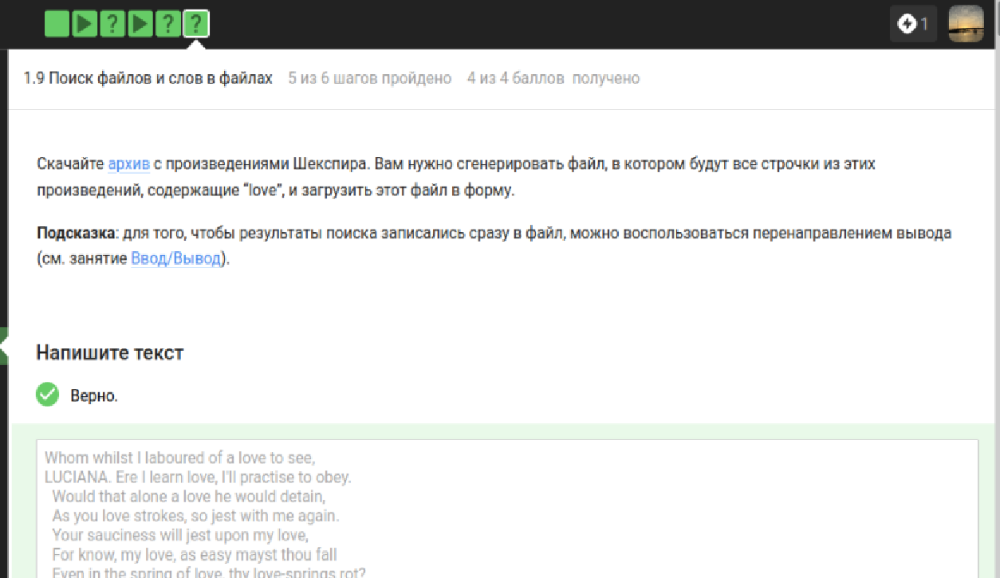

---
author:
  - name: Богомолова Полина Петровна
    degrees: студент
    orcid: 1032253562
    email: 1032253562@rudn.ru
    affiliation:
      - name: Российский университет дружбы народов
        country: Российская Федерация
        postal-code: 117198
        city: Москва
        address: ул. Миклухо-Маклая, д. 6

title: "Отчет по 1 этапу внешнего курса"
subtitle: "Внешний курс этап 1"
---

# Цель работы

Получить практические и теоретические знания и умения по работе с Linux

# Теоретическое введение

Linux — это не какая-то одна операционная система, а целое семейство систем. Все эти системы (их еще называют дистрибутивами) имеют много общего, но разрабатываются разными компаниями или сообществами энтузиастов, поэтому у них есть и различия. 

# Задание

Выполнить все задания 1 этапа внешнего курса

# Выполнение лабораторной работы

1) Как называется этот курс?

Название курса можно посмотреть на страничке "мое обучение'. Курс называется 'Введение в Linux'.

{#fig-001 width=70% fig-pos='H'}

2) Выберите правильные утверждения о курсе

Вся информация о курсе находится над самим заданием.

{#fig-002 width=70% fig-pos='H'}

3) Какую операционную систему вы обычно используете?

Я использую Windows в качестве основной системы. Также я использую Linux в учебных целях.

{#fig-003 width=70% fig-pos='H'}

4) Что такое виртуальная машина?

Виртуальная машина (ВМ) — это «компьютер внутри компьютера». Это программа, которая имитирует настоящий системный блок с процессором, памятью и жестким диском, позволяя запустить на нем полноценную операционную систему

{#fig-004 width=70% fig-pos='H'}

5) Смогли ли вы запустить на своем компьютере Linux?

Да, я смогла не только запустить Linux, но и активно пользоваться им.

{#fig-005 width=70% fig-pos='H'}

6) Создайте документ в OpenOffice/LibreOffice Writer (аналог Microsoft Word) и напишите в нём шрифтом FreeMono (если такого шрифта у вас нет, то используйте Arial или Times New Roman) одну-единственную строчку:
Hello, Linux! После этого сохраните этот документ в формате XML (Microsoft Word 2003 XML) или в формате FODT (OpenDocument Text: Flat XML) и загрузите в форму

Я открыла LibreOffice Writer и первым делом напечатала на чистом листе фразу Hello, Linux! с восклицательным знаком. Затем я выделила этот текст и в строке выбора шрифтов нашла FreeMono, чтобы всё было точно по инструкции. После этого я перешла в меню «Файл», выбрала «Сохранить как» и в выпадающем списке типов файлов кликнула на формат FODT (Flat XML). Я дала файлу название, нажала «Сохранить» и загрузила готовый документ в форму.

{#fig-006 width=70% fig-pos='H'}

{#fig-007 width=70% fig-pos='H'}

7) Какое расширение имеют установочные пакеты в Linux (Ubuntu)?

{#fig-008 width=70% fig-pos='H'}

Выбранный вариант является правильным, так как Ubuntu основана на дистрибутиве Debian, который использует формат пакетов с расширением .deb для распространения и установки программного обеспечения. Остальные варианты из списка предназначены для других целей: .exe является стандартным расширением для исполняемых файлов в Windows, .dmg используется для образов дисков в операционной системе macOS, а .txt представляет собой обычный текстовый документ. Именно формат .deb содержит в себе все необходимые файлы программы и инструкции для системы, позволяющие менеджеру пакетов Ubuntu правильно провести установку.

8) Поставьте себе в систему плеер VLC (любым способом: через Software Center или скачиванием установочного пакета с сайта VLC).
Запустите, откройте Help → About (или Shift+F1) и напишите ниже первую фамилию (без имени!) из вкладки Authors. Обратите внимание, что в англоязычных текстах обычно имя стоит на первом месте (first name), а фамилия на втором (last name).

{#fig-009 width=70% fig-pos='H'}

Для выполнения этого задания нужно было открыть плеер VLC и перейти в меню «Справка» (Help), а затем выбрать пункт «О программе» (About). На вкладке «Авторы» (Authors) самым первым в списке значится Rémi Denis-Courmont. Поскольку в инструкции требовалось указать только фамилию и учитывалось, что в англоязычных именах она обычно стоит на втором месте, имя Rémi было отброшено. Оставшаяся часть Denis-Courmont является составной фамилией этого разработчика, поэтому именно её ввод в текстовое поле позволил успешно пройти проверку.

9) Для чего можно использовать приложение Update Manager?

{#fig-010 width=70% fig-pos='H'}

Приложение Update Manager в операционной системе Ubuntu предназначено для комплексного поддержания системы в актуальном и безопасном состоянии, что объясняет выбор указанных вариантов. Оно автоматически проверяет наличие новых версий для всех уже установленных пакетов и программ, позволяя обновить их одним нажатием, а также отвечает за переход на следующий глобальный релиз всей системы, когда он становится доступен. Кроме того, процесс проверки обновлений включает в себя обновление списков репозиториев, что технически обновляет ссылки на программное обеспечение в Software Center, чтобы система всегда знала, где взять самые свежие файлы. При этом инструменты для удаления программ или первичной установки нового софта вынесены в отдельные приложения, так как задача менеджера обновлений ограничена именно обслуживанием уже существующих компонентов.

10) Выберите все синонимы для “командной строки”.

{#fig-011 width=70% fig-pos='H'}

Выбранные варианты «Терминал» и «Консоль» верны, так как в компьютерной лексике это общепринятые синонимы командной строки - текстового окна для ввода команд системе. Слово «Термин» означает лишь научное определение, а «Ассоль» является литературным именем, поэтому они не имеют отношения к интерфейсу управления компьютером. В среде Linux эти два понятия взаимозаменяемы и обозначают один и тот же инструмент для работы с системой без использования мыши.

11) Какая команда напечатает в какой директории мы сейчас находимся?

{#fig-012 width=70% fig-pos='H'}

Команда pwd - это сокращение от print working directory, и в системе Linux она всегда пишется маленькими буквами. Это связано с тем, что командная строка чувствительна к регистру, поэтому варианты PWD или Pwd будут восприняты как совершенно другие команды, которых скорее всего нет в системе. Правильный выбор подтверждает, что для вывода пути к текущей папке нужно использовать только строчное написание pwd.

12) Укажите, какие из следующих команд полностью эквивалентны команде ls -A --human-readable -l /some/directory

{#fig-013 width=70% fig-pos='H'}

{#fig-014 width=70% fig-pos='H'}

Эти варианты эквивалентны исходной команде, так как в Linux короткие флаги можно объединять в любой последовательности после одного дефиса. Флаг -A (почти все файлы) заменяет --almost-all, -h (читаемый формат размера) заменяет --human-readable, а -l отвечает за длинный формат вывода списка. Комбинации -lAh, -Ahl и -lah (если учитывать, что строчная -a просто добавит в список точки . и ..) по сути выполняют ту же работу по отображению скрытых файлов и подробной информации. Вариант с полными названиями через двойное тире также идентичен по смыслу, так как использует полные синонимы тех же самых опций.

13) Предположим, что вы находитесь в директории /home/bi/Documents, причем /home/bi — ваша домашняя директория. Какая(ие) команда выведет содержимое /home/bi/Downloads, при этом не показывая содержимое других директорий?

{#fig-015 width=70% fig-pos='H'}

{#fig-016 width=70% fig-pos='H'}

Правильными являются все ответы, так как они разными способами указывают путь к одной и той же папке относительно текущего местоположения. Команда ls ~/Downloads использует символ тильды как короткий синоним домашней директории пользователя, а ls /home/bi/Downloads обращается к папке напрямую через полный абсолютный путь от корня системы. Вариант ls ../Downloads работает за счет того, что две точки поднимают нас на один уровень вверх из Documents в домашнюю папку bi, где и находится Downloads. Последний вариант ls ../../Downloads ошибочен, так как он поднимает нас слишком высоко - в общую папку /home, где нужной директории Downloads просто не существует.

14) Какая команда используется для удаления директорий?

{#fig-017 width=70% fig-pos='H'}

Команда rm -r выбрана правильно, потому что само название rm происходит от слова remove - удалить, а добавочный флаг -r указывает на рекурсивное действие. Это значит, что программа зайдет внутрь папки и удалит все ее содержимое вместе с самой директорией. Без этого флага обычная команда удаления выдаст ошибку при попытке стереть папку. При этом команда mkdir служит для создания новых директорий, а не для их уничтожения, поэтому такие варианты здесь не подходят.

15) Что произойдет, если ввести в терминал команду firefox (для запуска одноименного браузера), а затем ввести туда же команду exit?

{#fig-018 width=70% fig-pos='H'}

Ответ «Никто не закроется» правильный, потому что запуск графического приложения вроде firefox напрямую в консоли занимает текущую сессию и блокирует командную строку. Пока браузер открыт, терминал «занят» этим процессом и не может обрабатывать новые команды, поэтому напечатанное слово exit просто останется текстом в буфере и не будет выполнено системой. В итоге управление не вернется к оболочке, и обе программы останутся в исходном состоянии - браузер будет работать, а окно терминала останется открытым в режиме ожидания завершения процесса.

16) Чему эквивалентен запуск программы с &?

{#fig-019 width=70% fig-pos='H'}

Вариант «Запуск, Ctrl+Z, bg» верен, так как это единственный способ перевести уже запущенный процесс в фоновый режим, сохранив его работоспособность, что и делает символ & при старте. Остальные варианты ошибочны по следующим причинам: сочетание Ctrl+Z без последующей команды bg просто оставляет программу в «замороженном» состоянии, когда она не работает и не реагирует на действия пользователя. Варианты с Ctrl+C в принципе не подходят, так как эта комбинация посылает сигнал прерывания (SIGINT), который полностью принудительно завершает работу программы, а не переводит ее куда-либо. Команды fg и bg после закрытия программы через Ctrl+C не сработают, так как возвращать или запускать в фоне будет уже нечего.

17) Скачайте файл с программой, сделайте его исполняемым, запустите и скопируйте то, что он выведет на экран, в форму

{#fig-020 width=70% fig-pos='H'}

Для выполнения этого задания необходимо было скачать файл, наделить его правами на запуск и выполнить в терминале. Правильным ответом является уникальная комбинация даты, времени и контрольной суммы, которую программа генерирует при запуске. Другие варианты (например, просто название файла, текст самой команды или пустая строка) не подходят, так как система проверяет именно результат работы кода. Если вы просто впишете «chmod +x» или название скрипта, это будет лишь описанием действия, а не самим ответом. Ошибка часто возникает, если пользователь пытается открыть файл текстовым редактором вместо запуска - в этом случае он видит исходный код, а не нужное числовое значение, которое программа вычисляет в момент работы.

18) Куда по умолчанию выводится поток ошибок из программы, запущенной в терминале?

{#fig-021 width=70% fig-pos='H'}

Поток ошибок (stderr) по умолчанию выводится на экран терминала, чтобы пользователь мог мгновенно увидеть сообщения о сбоях в работе программы. Вариант «В файл err.txt» не является стандартным поведением системы - запись в файл происходит только в том случае, если пользователь сам вручную перенаправил туда поток с помощью специальных символов вроде 2>. Ответ «Никуда» ошибочен, так как полное скрытие ошибок сделало бы невозможной диагностику проблем без дополнительных настроек (перенаправления в /dev/null). Вариант «В файл stderr» также неверен, поскольку stderr - это название самого абстрактного потока данных внутри системы, а не имя конкретного физического файла на диске, куда данные попадали бы сами по себе.

19) Какие (какая) из команд создадут файл file.txt и запишут в него поток ошибок программы program? Считайте, что в момент запуска программы файл file.txt не существует

{#fig-022 width=70% fig-pos='H'}

Команды program 2> file.txt и program 2>> file.txt выбраны верно, так как дескриптор 2 в системе Linux жестко закреплен за потоком ошибок, а символ стрелки вправо указывает на перенаправление этого потока в файл. Поскольку по условию файла не существует, обе команды сначала создадут его, а затем запишут туда сообщения об ошибках. Другие варианты ошибочны, потому что program >> file.txt без указания цифры перенаправляет только стандартный поток вывода (результат успешной работы), игнорируя ошибки. Команды со стрелками влево, такие как program < file.txt или program << file.txt, служат для ввода данных из файла в программу, а не для записи в него. Наконец, конструкция program file.txt <2 является синтаксически неверной и не выполнит требуемую задачу по сохранению диагностических сообщений.

20) Куда деваются сообщения об ошибках (т.е. вывод в stderr) от тех программ, которые объединены в конвейер (pipe)?

{#fig-023 width=70% fig-pos='H'}

Правильный ответ - «Выводятся на экран», так как стандартный символ конвейера | перехватывает и передает следующей команде только поток stdout. Поток ошибок stderr при этом остается свободным и по умолчанию направляется в окно терминала, чтобы пользователь сразу видел проблемы. Вариант с файлом err.txt неправильный, потому что Linux не создает такие файлы сам по себе без прямой команды пользователя. Версия о том, что сообщения исчезают, тоже неверна, так как система всегда выводит информацию, если ее намеренно не заглушили перенаправлением в пустоту.

21) В каком файле на диске окажется картинка, если для её скачивания были выполнены следующие команды?

cd /home/alex/
wget -P /home/alex/Pictures -O 1.jpg http://example.com/example.jpg

Правильный ответ - /home/alex/1.jpg, так как опция -O (заглавная буква О) имеет приоритет и заставляет wget сохранить файл именно под указанным именем в текущую рабочую директорию. Поскольку первой командой был выполнен переход в /home/alex/, именно там и появится файл 1.jpg. Остальные варианты неверны, потому что опция -P игнорируется, когда задано конкретное имя файла через -O с относительным путем, поэтому папка Pictures в итоговом пути не участвует. Варианты с названием example.jpg ошибочны, так как это оригинальное имя из ссылки полностью заменяется тем, что пользователь указал после флага переименования.

{#fig-024 width=70% fig-pos='H'}

22) Какую опцию нужно указать команде wget, чтобы она не выводила никаких сообщений на экран (Resolving.., Connecting to.. и т.д.)?

{#fig-025 width=70% fig-pos='H'}

Правильный вариант -q или --quiet выбран верно, так как эта опция переводит wget в полностью «тихий» режим, отключая абсолютно все сообщения о ходе загрузки, подключении и прогрессе. Остальные ответы не подходят, потому что флаг -v или --verbose, наоборот, включает максимально подробный вывод всех действий программы, что является противоположностью требуемого. Вариант -nv или --no-verbose лишь частично сокращает объем информации, убирая детали, но все равно оставляет базовые сообщения об ошибках и завершении операции, поэтому он не обеспечивает полную тишину в терминале.

23) Пусть на некоторой web-странице есть ссылки на картинки в форматах png и jpg, а также ссылки на другие страницы сайта (обычные html файлы). Какие файлы будут скачаны на компьютер, если запустить wget -r -l 1 -A jpg и передать в качестве аргумента ссылку на эту web-страницу? 

{#fig-026 width=70% fig-pos='H'}

Правильный ответ - «Будут скачаны jpg и html файлы, но все html будут удалены» - обусловлен особенностью работы wget при рекурсивном скачивании с фильтрами. Когда вы используете флаг -r (рекурсия) и ограничиваете типы файлов через -A jpg, программе все равно нужно сначала скачать html-страницы, чтобы проанализировать их код и найти там ссылки на нужные вам картинки. После того как wget извлечет все ссылки на jpg и скачает их, он автоматически удалит вспомогательные html-файлы, так как они не соответствуют заданному фильтру. Остальные варианты неверны, так как первый и четвертый пункты игнорируют техническую необходимость скачивания html для поиска ссылок, а вариант со скачиванием png ошибочен, потому что этот формат не указан в списке разрешенных через флаг -A. Вариант о том, что ничего не будет скачано или скачается всё без удаления, противоречит алгоритму работы утилиты, которая строго следует правилам фильтрации после завершения анализа структуры сайта.

24) Чем отличаются архиваторы gzip и zip? 

{#fig-027 width=70% fig-pos='H'}

Правильный ответ - «gzip удаляет архив после его распаковки», так как это стандартное поведение данной утилиты в Linux: при распаковке файла .gz оригинал стирается, оставляя только извлеченное содержимое. Напротив, zip работает более привычно для пользователей Windows и сохраняет исходный архив после извлечения файлов. Остальные варианты неверны, так как алгоритмы сжатия у них практически одинаковые и разница в качестве сжатия незначительна. Утверждение, что они ничем не отличаются, ошибочно именно из-за логики работы с файлами: gzip предназначен для сжатия одиночных файлов (часто в связке с tar), а zip - это полноценный упаковщик множества файлов в один архив. Вариант про удаление архива утилитой zip также ложный, поскольку она всегда оставляет файл архива на месте.

25) Какие из перечисленных программ-архиваторов могут создать архив из директории с файлами?

{#fig-028 width=70% fig-pos='H'}

Правильными ответами являются tar и zip, так как эти инструменты специально разработаны для объединения целых директорий и множества разных файлов в один общий архив. Программа tar является классическим упаковщиком в Linux, а zip позволяет не только собрать файлы вместе, но и сразу их сжать для экономии места. Вариант gzip считается неправильным, потому что эта утилита предназначена исключительно для сжатия одиночных файлов. Она технически не умеет брать папку и превращать ее в один файл-архив - для этого ее всегда используют вместе с tar, создавая знакомые многим архивы .tar.gz.

26) Какой набор опций нужно указать программе tar, чтобы запаковать файлы в my_archive.tar.bz2?

{#fig-029 width=70% fig-pos='H'}

Правильный ответ -cjf выбран верно, так как каждая буква в этом наборе отвечает за конкретное действие: -c создает новый архив (create), -j задействует алгоритм сжатия bzip2 (что соответствует расширению .bz2), а -f позволяет указать имя файла архива. Остальные варианты не подходят, потому что комбинация -czf использует сжатие gzip вместо нужного bzip2. Варианты -xjf и -xzf вообще не создают архивы, так как флаг -x предназначен для извлечения данных (extract).

27) Какая маска команды find НЕ найдет файл Alexey.jpeg?

{#fig-030 width=70% fig-pos='H'}

Правильными ответами являются .jpg, alexey. и *.? потому что команда find в Linux по умолчанию чувствительна к регистру символов. Маска .jpg не найдет файл, так как расширение у него jpeg (четыре буквы вместо трех), а маска alexey. не сработает из-за маленькой первой буквы в имени. Вариант .? также не подходит, поскольку знак вопроса заменяет ровно один символ, а после точки в названии идет четыре знака. Остальные варианты не выбраны, так как они успешно находят файл: Alexey.jpeg полностью совпадает с именем, Alex захватывает все файлы, начинающиеся с нужного сочетания букв, а универсальная маска . видит любые файлы, в названии которых есть хотя бы одна точка.

28) Предположим, что в файле  text.txt записаны строки, показанные среди вариантов ответа. Отметьте только те из них, которые выведет на экран команда  grep "world" text.txt

{#fig-031 width=70% fig-pos='H'}

Правильными являются варианты «world», «The world is not enough», «The "world" is not enough», «The beautiful-world is not enough» и «The beautifulworld is not enough», так как команда grep в Linux по умолчанию ищет точное совпадение подстроки с учетом регистра. Все эти строки содержат слово world, написанное именно маленькими буквами, при этом наличие кавычек, дефисов или отсутствие пробелов вокруг искомого слова не мешает поиску. Остальные варианты ошибочны, потому что в строках «The word is not enough», «World» (с большой буквы) и «The World Is Not Enough» нужное слово либо отсутствует (word вместо world), либо написано с заглавной буквы, что для стандартного grep делает их совершенно другими и неподходящими под запрос.

29)  Cкачайте архив с произведениями Шекспира. Вам нужно сгенерировать файл, в котором будут все строчки из этих произведений, содержащие “love”, и загрузить этот файл в форму. 

{#fig-031 width=70% fig-pos='H'}

Для выполнения этого задания необходимо использовать команду grep для поиска слова "love" и оператор перенаправления > для сохранения результата в новый файл. Правильная последовательность действий выглядит так: сначала нужно распаковать скачанный архив с произведениями, затем открыть терминал в папке с текстовыми файлами и выполнить команду grep "love" * > result.txt. Это позволит собрать все строки со словом "love" изо всех файлов в один итоговый документ. Другие способы, такие как ручное копирование строк или использование текстовых редакторов, будут ошибочными, так как в произведениях Шекспира тысячи строк с этим словом, и собрать их вручную без ошибок практически невозможно. Также неправильным будет использование команды без кавычек или без указания символа * (звездочка), так как в первом случае поиск может сработать некорректно при наличии спецсимволов, а во втором — поиск ограничится только одним файлом вместо всей папки.

# Выводы

В ходе работы были я освоила операционную систему Линукс на более высоком уровне, научилась использовать полезные команды, научилась пользоваться различными программами
