# Информация о докладчике

Богомолова Полина ПетровнаСтудент, ФФМиЕН10322535621032253562@rudn.ruРоссийский университет дружбы народов

---

# Цель работы

Получить практические и теоретические знания и умения по работе с Linux.

---

# Задание

Выполнить все задания 2 этапа внешнего курса «Введение в Linux».

---

# Вопрос 1

Для каких задач можно использовать удаленный сервер?

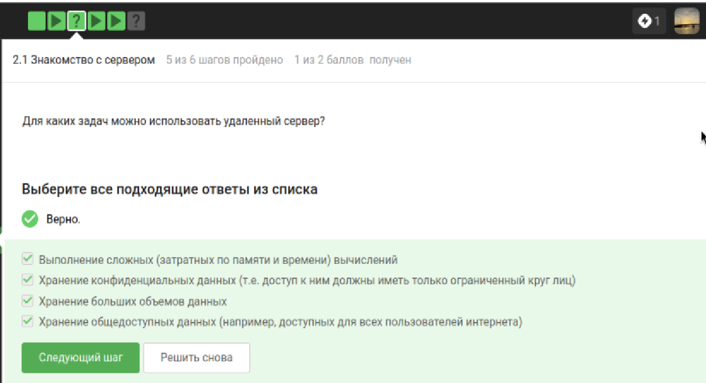{width=45%}

Все ответы верны. Серверы подходят для сложных расчётов, хранения секретных и больших данных, размещения публичных файлов.

---

# Вопрос 2

Какой ключ можно без опаски пересылать: id_rsa или id_rsa.pub?

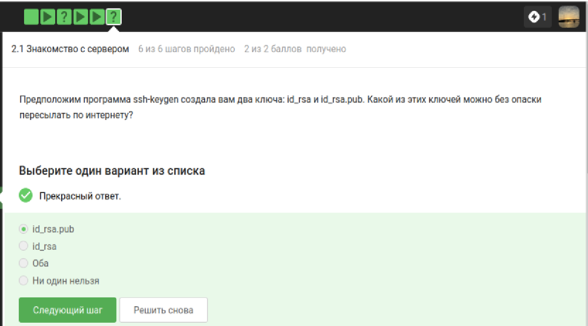{width=45%}

id_rsa.pub — открытый ключ для свободной передачи. id_rsa — секретный, пересылать нельзя.

---

# Вопрос 3

Какая команда скопирует папку stepic на сервер?

{width=45%}

scp -r stepic username@server:~/. Флаг -r для рекурсивного копирования.

---

# Вопрос 4

Что делать, если apt-get install не находит пакет?

{width=45%}

sudo apt-get update обновляет списки пакетов. Проверить интернет-соединение.

---

# Вопрос 5

Для чего нужна FileZilla?

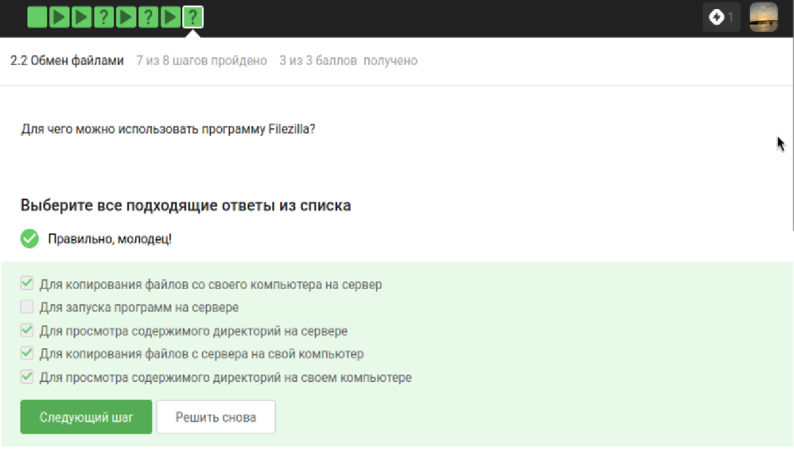{width=45%}

Копирование файлов между компьютером и сервером, просмотр содержимого папок.

---

# Вопрос 6

Как запустить на сервере программу, требующую экран?

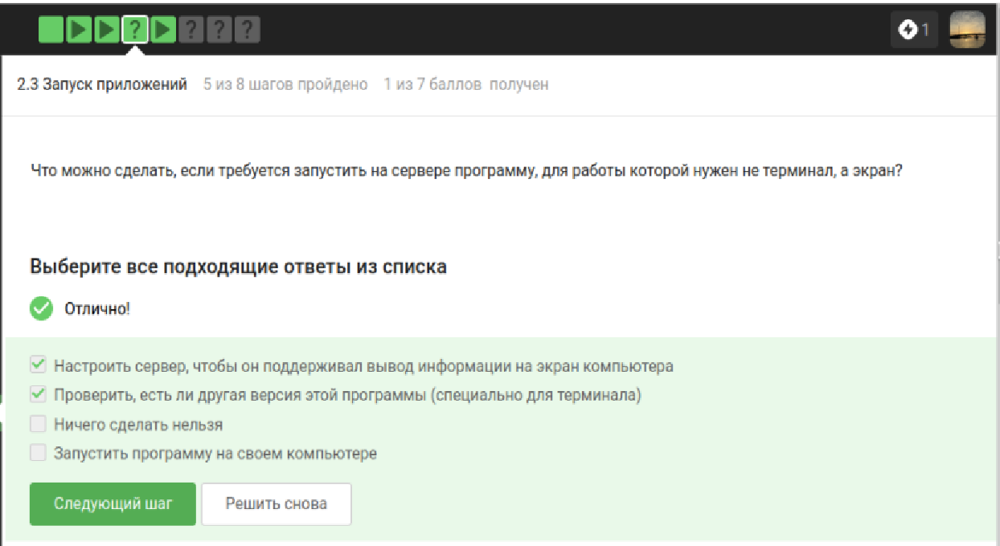{width=45%}

Настроить вывод графики или найти консольную версию.

---

# Вопрос 7

Как вызвать справку о программе?

{width=45%}

man program, program --help, help program.

---

# Вопрос 8 (Задание)

Какие форматы принимает FastQC на вход?

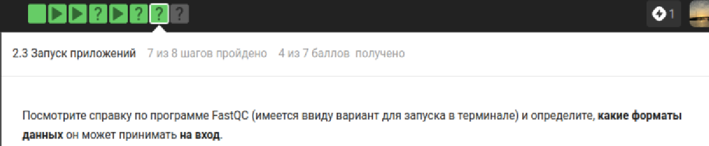{width=45%}

---

# Вопрос 8 (Ответ)

{width=45%}

Только bam, sam.

---

# Вопрос 9 (Задание)

Команда для множественного выравнивания в Clustal.

{width=45%}

---

# Вопрос 9 (Ответ)

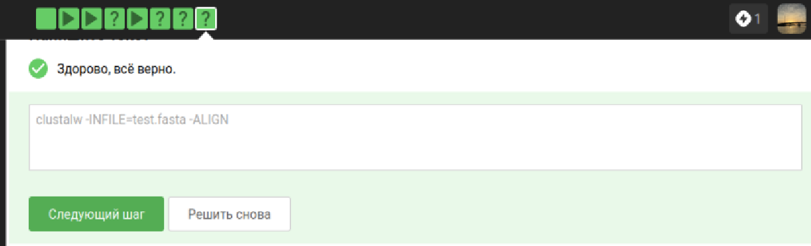{width=45%}

clustalw -INFILE=test.fasta -ALIGN.

---

# Вопрос 10 (Задание)

Что покажет jobs после команд?

{width=45%}

---

# Вопрос 10 (Ответ)

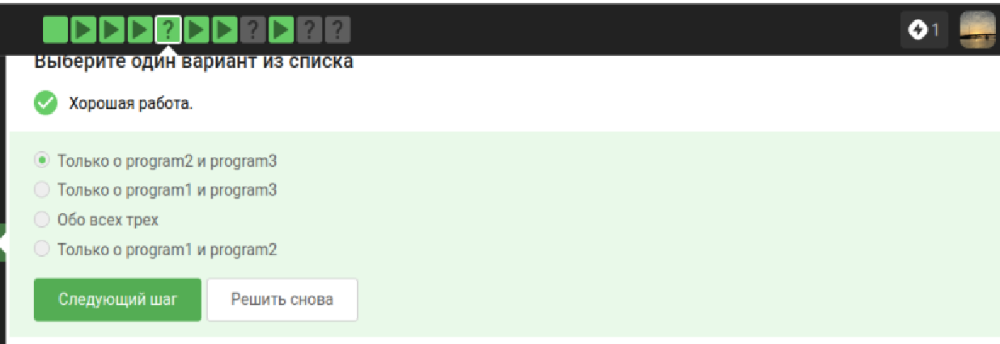{width=45%}

Только program2 и program3.

---

# Вопрос 11

Одинаковые ли идентификаторы в jobs, top и ps?

{width=45%}

Одинаковые только у ps и top (PID). jobs выводит номер задачи.

---

# Вопрос 12

Как мгновенно завершить остановленный процесс?

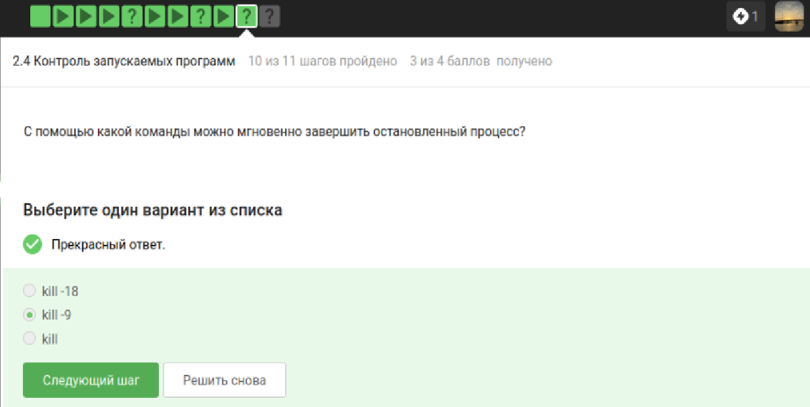{width=45%}

kill -9 (SIGKILL).

---

# Вопрос 13

Что даст kill для приостановленного процесса?

{width=45%}

Завершение начнётся после продолжения работы.

---

# Вопрос 14

Сколько CPU использует остановленное приложение?

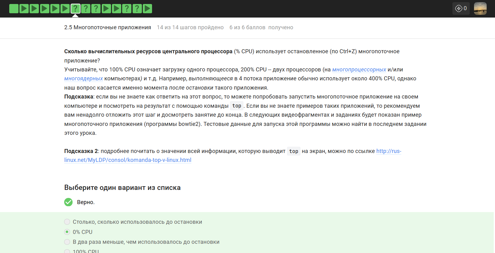{width=45%}

0% CPU.

---

# Вопрос 15 (Задание)

Сколько памяти занимает остановленное приложение?

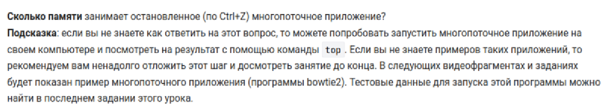{width=45%}

---

# Вопрос 15 (Ответ)

{width=45%}

Столько же, сколько до остановки.

---

# Вопрос 16 (Задание)

Как завершить один поток?

{width=45%}

---

# Вопрос 16 (Ответ)

{width=45%}

Никак.

---

# Вопрос 17

Какие шаги bowtie2 можно выполнить в несколько потоков?

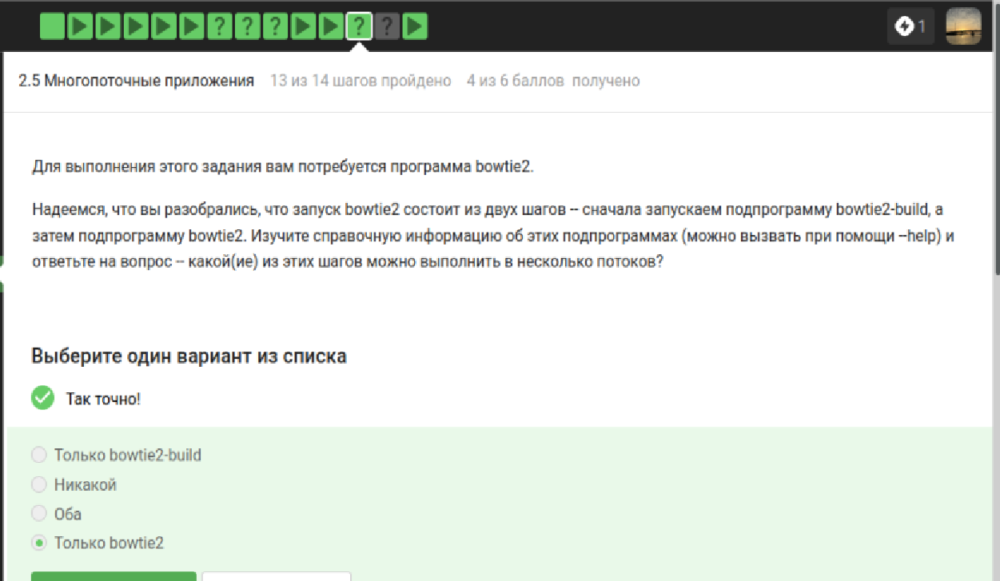{width=45%}

Только bowtie2.

---

# Вопрос 18 (Задание)

Запустить bowtie2, stderr в файл.

{width=45%}

---

# Вопрос 18 (Ответ)

{width=45%}

2054 reads, 100% aligned.

---

# Вопрос 19

Что будет при fg в другой вкладке?

{width=45%}

Терминал сообщит об отсутствии процесса.

---

# Вопрос 20

Что будет при exit в последней вкладке tmux?

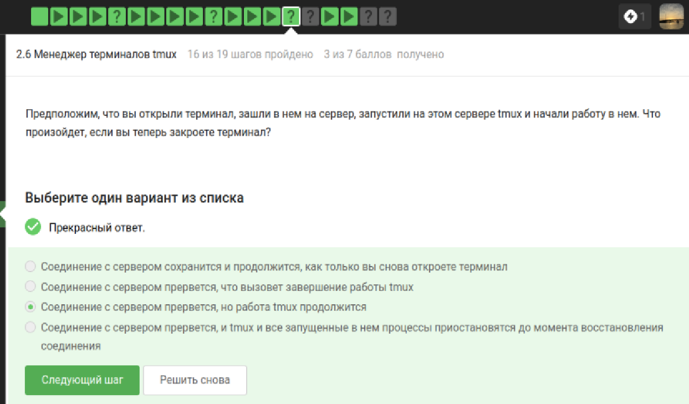{width=45%}

tmux завершит работу.

---

# Вопрос 21

Что будет при закрытии терминала с tmux на сервере?

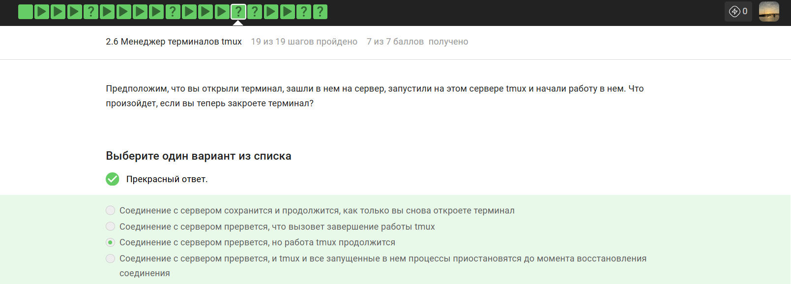{width=45%}

Соединение прервётся, tmux продолжит работу.

---

# Вопрос 22

Что будет при закрытии вкладки tmux с фоновым процессом?

{width=45%}

Вкладка закроется вместе с процессом.

---

# Вопрос 23

Какая команда переименовывает вкладку в tmux?

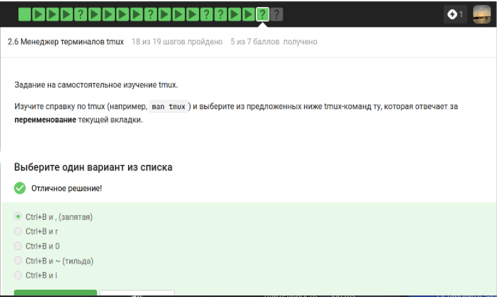{width=45%}

Ctrl+B и , (запятая).

---

# Вопрос 24 (Задание)

Верные утверждения о разделении вкладок.

{width=45%}

---

# Вопрос 24 (Ответ)

{width=45%}

Верно: вкладку можно разделять многократно.

---

# Выводы

Освоила Linux на более высоком уровне: серверы, процессы, tmux.
