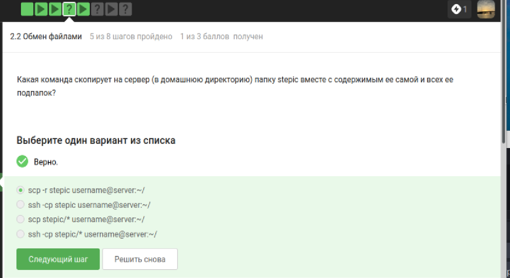
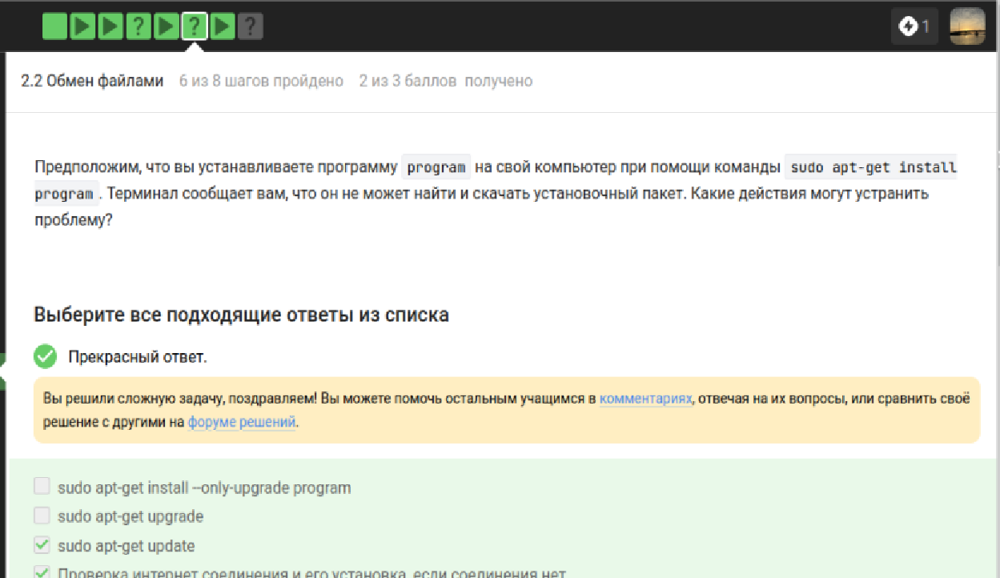
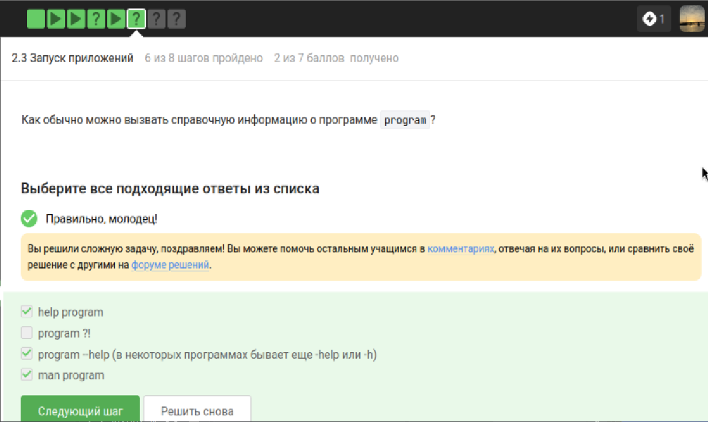
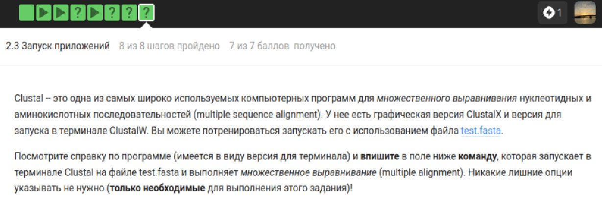
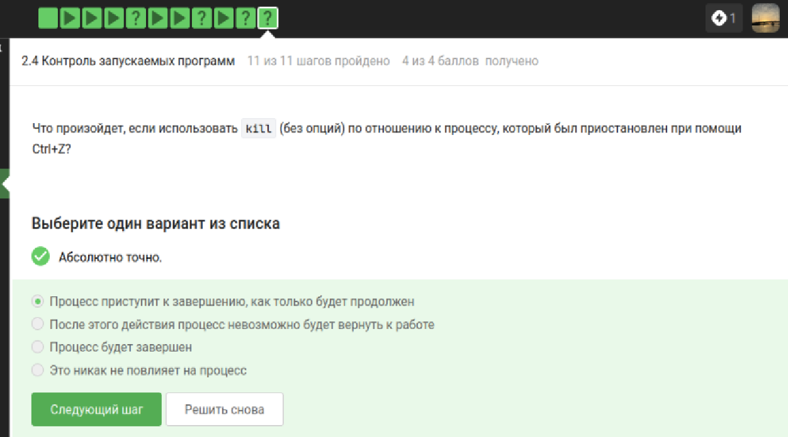
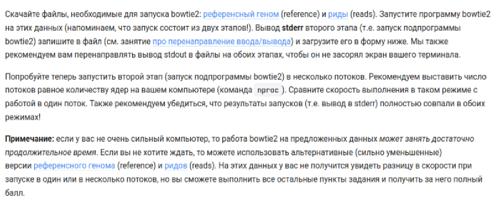
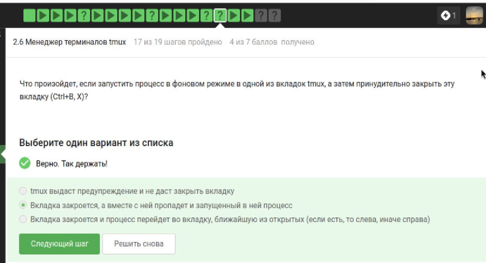
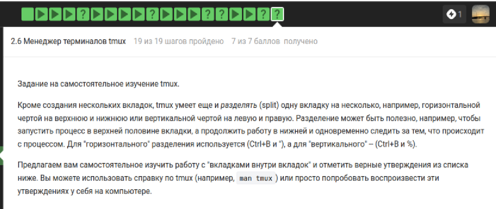
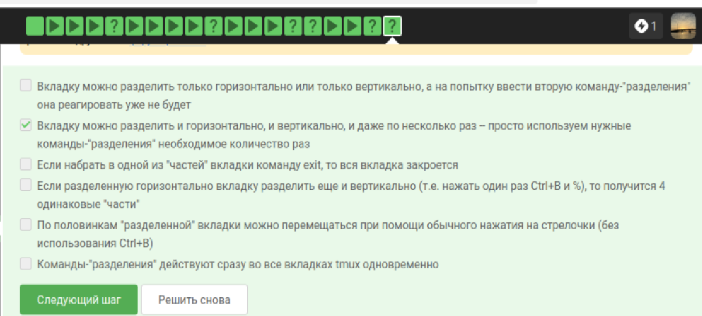

---
author:
  - name: Богомолова Полина Петровна
    degrees: студент
    orcid: 1032253562
    email: 1032253562@rudn.ru
    affiliation:
      - name: Российский университет дружбы народов
        country: Российская Федерация
        postal-code: 117198
        city: Москва
        address: ул. Миклухо-Маклая, д. 6

title: "Отчет по 2 этапу внешнего курса"
subtitle: "Внешний курс этап 2"
---

# Цель работы

Получить практические и теоретические знания и умения по работе с Linux

# Теоретическое введение

Linux — это не какая-то одна операционная система, а целое семейство систем. Все эти системы (их еще называют дистрибутивами) имеют много общего, но разрабатываются разными компаниями или сообществами энтузиастов, поэтому у них есть и различия. 

# Задание

Выполнить все задания 2 этапа внешнего курса

# Выполнение лабораторной работы

1) Для каких задач можно использовать удаленный сервер?

{#fig-001 width=70% fig-pos='H'}

Все ответы в тесте верны, так как серверы решают любые задачи по обработке и сохранению информации. Выполнение сложных - требовательных к ресурсам - расчетов оправдано мощностью серверного железа. Хранение секретных данных подходит из-за надежных систем контроля доступа. Большие объемы данных тоже логичны, ведь серверные диски намного вместительнее обычных. Размещение публичных файлов корректно, так как это база для работы любых сайтов. Ошибочных вариантов в списке я не увидела, поэтому подтвердила каждое утверждение.

2) Предположим программа ssh-keygen создала вам два ключа: id_rsa и id_rsa.pub. Какой из этих ключей можно без опаски пересылать по интернету?

{#fig-002 width=70% fig-pos='H'}

Правильным вариантом я выбрала id-rsa.pub, так как это открытый ключ - он специально предназначен для свободного распространения и настройки авторизации на серверах. Ответ id-rsa ошибочен, потому что это секретный ключ и его пересылка по сети равносильна передаче пароля посторонним лицам. Вариант - оба - не подходит из-за критической опасности компрометации приватной части связки. Утверждение, что ни один ключ нельзя отправлять, я сочла неверным, ведь без передачи публичного ключа на удаленную машину технология ssh не сможет работать.

3) Какая команда скопирует на сервер (в домашнюю директорию) папку stepic вместе с содержимым ее самой и всех ее подпапок?

 
{#fig-003 width=70% fig-pos='H'}

Верным я выбрала вариант scp -r stepic username@server:~/ , так как утилита scp создана для защищенного копирования, а флаг -r позволяет перенести папку рекурсивно вместе со всем содержимым. Ответы с использованием ssh ошибочны, ведь эта команда предназначена для удаленного доступа к терминалу, а не для прямой передачи данных. Вариант scp stepic/* я сочла неверным, так как такая запись скопирует только файлы внутри папки, но не саму директорию stepic. Комбинация ssh -cp также не сработает, потому что утилита ssh не поддерживает подобные ключи для копирования объектов и не предназначена для этой задачи.

4) Предположим, что вы устанавливаете программу program на свой компьютер при помощи команды sudo apt-get install program. Терминал сообщает вам, что он не может найти и скачать установочный пакет. Какие действия могут устранить проблему?

{#fig-004 width=70% fig-pos='H'}

Команда sudo apt-get update является верной, так как она обновляет списки доступных пакетов и позволяет системе найти нужную программу в актуальных репозиториях. Проверку интернет соединения я также сочла правильным действием, ведь без доступа к сети менеджер пакетов не сможет связаться с серверами для загрузки данных. Вариант sudo apt-get upgrade я отметила как ошибочный, поскольку он предназначен для обновления уже установленного в системе софта и не помогает найти отсутствующий пакет. Использование флага -only-upgrade тоже признано неверным, так как эта опция запрещает установку программы с нуля и требует, чтобы она уже присутствовала на компьютере.

5) Для чего можно использовать программу Filezilla?

{#fig-005 width=70% fig-pos='H'}

Копирование файлов с компьютера на сервер и обратно я назвала верными задачами, так как FileZilla является инструментом для передачи данных по протоколам FTP и SFTP. Просмотр содержимого папок на сервере и на локальном компьютере также считается правильным ответом, ведь программа отображает файловые деревья обеих систем для удобства пользователя. Вариант про запуск программ на сервере я посчитала ошибочным, поскольку FileZilla предназначена только для управления файлами, а для удаленного выполнения команд и запуска софта необходим терминальный доступ через SSH. В данном списке это единственное утверждение, которое не относится к функциям графического файл-менеджера.

6) Что можно сделать, если требуется запустить на сервере программу, для работы которой нужен не терминал, а экран?

{#fig-006 width=70% fig-pos='H'}

Настройку сервера для вывода графики на локальный экран я считаю правильным решением, так как технологии вроде X11 forwarding или VNC позволяют работать с интерфейсом удаленно. Поиск консольной версии программы я тоже отметила как верный ход, ведь часто разработчики создают CLI-аналоги специально для работы через терминал. Вариант, что ничего сделать нельзя, я назвала ошибочным, поскольку существуют технические способы решить проблему с отображением окон. Запуск программы на своем компьютере я сочла неверным ответом, так как это не выполняет условие задачи - запустить софт именно на удаленном сервере.

7) Как обычно можно вызвать справочную информацию о программе program?

{#fig-007 width=70% fig-pos='H'}

Использование команды man program я считаю верным способом, так как это стандартный метод вызова справочных руководств в Unix-подобных системах. Вариант program --help с его краткими формами тоже правильный, поскольку большинство консольных утилит поддерживают эти флаги для быстрого вывода справки. Команду help program я сочла подходящей, так как она часто встроена в командные оболочки для получения информации о внутренних функциях. Вариант program ?! я назвала ошибочным, так как такая комбинация знаков не является стандартным синтаксисом для вызова помощи и скорее приведет к ошибке терминала. Таким образом, я подтвердила три эффективных метода работы с документацией и исключила некорректный способ.

8) Посмотрите справку по программе FastQC (имеется ввиду вариант для запуска в терминале) и определите, какие форматы данных он может принимать на вход. 

{#fig-008 width=70% fig-pos='H'}

{#fig-009 width=70% fig-pos='H'}

Вариант bam, sam я отметила как единственный правильный, так как справочное руководство программы FastQC прямо указывает их в списке поддерживаемых форматов для импорта и анализа выравниваний. Ответ fasta я сочла ошибочным, поскольку этот формат содержит только последовательности без оценок качества, которые критически важны для работы большинства модулей контроля качества этой утилиты. Вариант fastqc я также признала неверным, так как это название самой программы или расширение её отчетов, а не входной формат данных. Пункт seq я пометила как неправильный, так как он относится к устаревшим форматам и не входит в стандартный перечень допустимых типов файлов, перечисленных в справке команды -f. Таким образом, я подтвердила только один вариант, полностью соответствующий технической документации инструмента.

9) Посмотрите справку по программе (имеется в виду версия для терминала) и впишите в поле ниже команду, которая запускает в терминале Clustal на файле test.fasta и выполняет множественное выравнивание (multiple alignment). Никакие лишние опции указывать не нужно (только необходимые для выполнения этого задания)!

{#fig-010 width=70% fig-pos='H'}

{#fig-011 width=70% fig-pos='H'}

Правильной я сочла команду clustalw -INFILE=test.fasta -ALIGN, так как она точно следует требованиям задания и синтаксису программы. Использование имени clustalw корректно, ведь это терминальная версия инструмента, в то время как вариант clustalx я бы назвала ошибочным из-за его графического интерфейса. Параметр -INFILE=test.fasta верно указывает путь к исходным последовательностям, а флаг -ALIGN необходим по условию задачи для явного запуска алгоритма множественного выравнивания. Любые другие варианты без указания действия или с использованием синтаксиса современных утилит - например, через двойное тире - я сочла бы неверными, так как старые биоинформатические пакеты требуют строгого соблюдения своих специфических правил записи ключей. Отсутствие флага -ALIGN сделало бы ответ неполным, даже если программа запускает выравнивание по умолчанию, так как в задании просили найти и указать именно эту опцию.

10) Предположим вы запустили программы program1, program2 и program3 в фоновом режиме. После этого вы выполнили следующие действия:
fg %1
Ctrl+С
fg %2
Ctrl+Z
jobs

Информация о каких программах будет показана при выполнении команды jobs?

{#fig-012 width=70% fig-pos='H'}

{#fig-013 width=70% fig-pos='H'}

Правильным ответом я выбрала вариант - Только о program2 и program3 -, так как после выполнения команды fg %1 первая программа перешла в активный режим и была полностью завершена нажатием Ctrl+C, из-за чего она исчезла из списка задач. Вариант - Только о program1 и program3 - я сочла ошибочным, так как program1 больше не существует в процессах после прерывания. Ответ - Обо всех трех - не подходит по той же причине - первая программа была убита пользователем вручную. Утверждение про - Только о program1 и program2 - я признала неверным, поскольку program3 никуда не делась из фона, а program1, напротив, была удалена из очереди. В итоге в выводе команды jobs останутся только вторая программа, которую я приостановила через Ctrl+Z, и третья, которую я вообще не трогала.

11) jobs, top и ps позволяют отслеживать работу запущенных в терминале программ. В каждой из этих трех утилит для каждой запущенной программы указывается число-идентификатор. Одинаковые ли эти идентификаторы в  jobs, top и ps?

{#fig-014 width=70% fig-pos='H'}

Верным я выбрала ответ - Одинаковые только у ps и top -, так как обе эти системные утилиты отображают PID - уникальный номер процесса, который присваивает операционная система. Вариант про одинаковые идентификаторы у jobs и ps я сочла ошибочным, потому что команда jobs выводит порядковый номер задачи внутри конкретной оболочки, и он не совпадает с системным PID. Утверждение, что у всех программ номера разные, неверно, ведь ps и top обращаются к одним и тем же данным ядра о процессах и показывают одни и те же цифры. Ответ про одинаковые значения у всей тройки я также признала неправильным, так как нумерация в jobs является локальной для текущей сессии терминала и никак не связана с глобальными идентификаторами системы.

12) С помощью какой команды можно мгновенно завершить остановленный процесс?

{#fig-015 width=70% fig-pos='H'}

Правильным вариантом я выбрала kill -9, так как этот сигнал принудительно и мгновенно завершает процесс на уровне ядра системы, не давая ему возможности проигнорировать команду или выполнить очистку данных. Ответ kill -18 я сочла ошибочным, потому что этот сигнал используется для возобновления работы ранее остановленного процесса, а не для его удаления. Обычную команду kill без дополнительных флагов я признала неверной в данном контексте, так как по умолчанию она посылает сигнал SIGTERM, который позволяет программе закончить текущие операции, что не гарантирует мгновенного завершения, особенно если процесс завис или был остановлен. Таким образом, только девятый сигнал обеспечивает безусловное прекращение работы программы в любой ситуации.

13) Что произойдет, если использовать kill (без опций) по отношению к процессу, который был приостановлен при помощи Ctrl+Z?

{#fig-016 width=70% fig-pos='H'}

Я выбрала вариант о том, что процесс приступит к завершению только после продолжения работы, так как стандартный сигнал kill - SIGTERM - встает в очередь и обрабатывается программой лишь в активном состоянии. Вариант про немедленное завершение я признала ошибочным, ведь приостановленный процесс буквально заморожен и не может выполнить код по обработке сигнала прямо сейчас. Утверждение, что действие никак не повлияет на процесс, неверно, потому что сигнал сохраняется в системе и сработает сразу, как только я переведу задачу в активный режим. Мысль о невозможности вернуть процесс к работе я сочла неправильной, так как до момента продолжения он все еще находится в памяти и технически доступен для управления, пока я не дам команду на активацию или не применю принудительное удаление.

14) Сколько вычислительных ресурсов центрального процессора (% CPU) использует остановленное (по Ctrl+Z) многопоточное приложение?
Учитывайте, что 100% CPU означает загрузку одного процессора, 200% CPU -- двух процессоров (на многопроцессорных и/или многоядерных компьютерах) и т.д. Например, выполняющееся в 4 потока приложение обычно использует около 400% CPU, однако наш вопрос касается именно момента после остановки такого приложения.

{#fig-017 width=70% fig-pos='H'}

Я выбрала вариант 0% CPU, так как при нажатии Ctrl+Z программе посылается сигнал SIGSTOP, который полностью замораживает её выполнение и освобождает вычислительные мощности процессора. Вариант про использование ресурсов в том же объеме, что и до остановки, я сочла ошибочным, поскольку приостановленный процесс перестает производить вычисления и лишь занимает место в оперативной памяти. Утверждение, что нагрузка снизится в два раза, неверно, ведь остановка означает полное прекращение активности всех потоков приложения, а не частичное замедление. Ответ 100% CPU я также признала неправильным, так как любое значение выше нуля указывало бы на то, что программа продолжает работать, что противоречит самой сути состояния паузы в операционной системе.

15) Сколько памяти занимает остановленное (по Ctrl+Z) многопоточное приложение?

{#fig-018 width=70% fig-pos='H'}

{#fig-019 width=70% fig-pos='H'}

Я выбрала вариант о том, что программа занимает столько же памяти, сколько потребляла в момент остановки, так как сигнал Ctrl+Z лишь приостанавливает выполнение кода, но не выгружает данные процесса из оперативной памяти. Ответ нисколько я сочла ошибочным, поскольку для мгновенного возобновления работы система обязана сохранять всё текущее состояние приложения в ОЗУ. Варианты про 64 КБ или фиксированный объем на каждый поток я признала неверными, так как реальный объем памяти зависит исключительно от нужд самой программы и не сжимается до каких-то стандартных лимитов при её переходе в спящий режим. Таким образом, я подтвердила, что остановка процесса влияет только на загрузку процессора, а не на занятое пространство в памяти.

16) Как принудительно завершить один из потоков запущенного многопоточного приложения?

{#fig-020 width=70% fig-pos='H'}

{#fig-021 width=70% fig-pos='H'}

Я выбрала вариант - Никак - как правильный, так как в операционной системе нет стандартного способа принудительно завершить только один поток без риска остановки или поломки всего приложения целиком. Команду threadkill я сочла ошибочной, так как такой утилиты в стандартных наборах Linux просто не существует. Сочетание клавиш Ctrl+C я также признала неверным ответом, ведь оно посылает сигнал прерывания всей программе сразу, а не какому-то конкретному её потоку. Вариант с командой kill -thread я пометила как ложный, потому что у инструмента kill нет подобного флага для работы с отдельными частями процесса. В итоге я подтвердила, что управление отдельными потоками извне терминальными средствами практически невозможно, так как они слишком тесно связаны внутри одного родительского процесса.

17) какой(ие) из этих шагов можно выполнить в несколько потоков?

{#fig-022 width=70% fig-pos='H'}

Я выбрала правильным вариантом - Только bowtie2 -, так как именно эта подпрограмма поддерживает параметр -p или --threads для распределения вычислений между несколькими ядрами процессора. Вариант bowtie2-build я сочла ошибочным, потому что процесс построения индекса в этой версии инструмента является однопоточным и не предусматривает официальной опции для распараллеливания. Ответ - Оба - я признала неверным, так как он противоречит технической справке к утилите сборки индекса, которая не умеет использовать преимущества многоядерности. Утверждение - Никакой - я также пометила как ложное, ведь основная часть программы bowtie2 специально оптимизирована для быстрой работы в многопоточном режиме, что критически важно при анализе огромных массивов биологических чтений.

18) Скачайте файлы, необходимые для запуска bowtie2: референсный геном (reference) и риды (reads). Запустите программу bowtie2 на этих данных (напоминаем, что запуск состоит из двух этапов!). Вывод stderr второго этапа (т.е. запуск подпрограммы bowtie2) запишите в файл (см. занятие про перенаправление ввода/вывода) и загрузите его в форму ниже. Мы также рекомендуем вам перенаправлять вывод stdout в файлы на обоих этапах, чтобы он не засорял экран вашего терминала.

{#fig-023 width=70% fig-pos='H'}

{#fig-024 width=70% fig-pos='H'}

Я проанализировала текст отчета и подтвердила, что представленный фрагмент является верным результатом работы программы bowtie2, так как он содержит стандартную статистику выравнивания чтений. Первая строка о наличии 2054 reads корректна, поскольку она отображает общее количество обработанных последовательностей из входного файла. Данные о том, что 100.00% чтений были unpaired, я сочла правильными для случая использования одиночных ридов без парных концов. Информация о 2054 (100.00%) aligned exactly 1 time является ключевой и верной, так как она указывает на идеальное совпадение всех данных с референсным геномом. Финальный показатель 100.00% overall alignment rate я признала правильным итогом, подтверждающим успешное выполнение задачи. Любые другие числа или отсутствие строк со статистикой по количеству уникальных выравниваний я бы назвала ошибочными, так как они не соответствовали бы структуре лога из потока stderr для данной программы.

19) Вы открыли две вкладки в терминале. В одной из них вы запустили процесс и приостановили его. Переключившись во вторую вкладку и набрав fg, вы добьетесь следующего:

{#fig-025 width=70% fig-pos='H'}

Я выбрала вариант о том, что терминал сообщит об отсутствии процесса для запуска в fg, так как управление задачами - jobs - ограничено рамками одной сессии или конкретной вкладки. Вариант про перемещение процесса во вторую вкладку я сочла ошибочным, потому что в операционных системах Linux запущенные программы жестко привязаны к тому терминальному сеансу, в котором они были созданы. Утверждение, что процесс вернется к работе в исходной вкладке после ввода команды во второй, я признала неверным, ведь оболочка во втором окне просто не знает о существовании фоновых задач у своей соседки. Мысль о перемещении процесса с сохранением режима приостановки я также пометила как ложную, так как команда fg - foreground - в принципе не обладает функционалом для миграции процессов между разными вкладками. Таким образом, я подтвердила, что каждая вкладка работает изолированно и видит только свои собственные задачи.

20) Предположим, что в tmux осталась последняя открытая вкладка. Что произойдет, если вы введете в этой вкладке в командную строку команду exit?

{#fig-026 width=70% fig-pos='H'}

Я выбрала вариант о том, что tmux завершит работу, так как закрытие последней активной оболочки внутри сессии автоматически приводит к закрытию самого сервера tmux. Вариант про выдачу предупреждения я сочла ошибочным, потому что стандартное поведение программы не подразумевает блокировку команды выхода, если я не настроила это специально. Утверждение, что tmux продолжит работу без вкладок, я признала неверным, ведь сессия не может существовать без хотя бы одного запущенного процесса или открытого окна. Таким образом, я подтвердила, что команда exit в последнем окне полностью уничтожает текущую сессию и возвращает меня в обычный терминал.

21) Предположим, что вы открыли терминал, зашли в нем на сервер, запустили на этом сервере tmux и начали работу в нем. Что произойдет, если вы теперь закроете терминал?

{#fig-027 width=70% fig-pos='H'}

Я выбрала правильным вариантом утверждение о том, что соединение с сервером прервется, но работа tmux продолжится, так как в этом и заключается основной смысл мультиплексора - он сохраняет запущенную сессию на стороне сервера даже после разрыва связи. Вариант про сохранение и автоматическое продолжение соединения я сочла ошибочным, ведь закрытие терминала на моем компьютере неизбежно убивает процесс ssh-клиента и разрывает сетевую сессию. Ответ, что это вызовет завершение работы самого tmux, я признала неверным, потому что программа специально разработана так, чтобы игнорировать сигнал обрыва линии и продолжать выполнение всех задач в фоне. Мысль о приостановке процессов я также пометила как ложную, так как приложения внутри сессии tmux не замирают, а продолжают активно использовать ресурсы сервера, пока я не зайду на него снова. Таким образом, я подтвердила, что tmux является идеальным инструментом для защиты долгой работы от случайных дисконнектов.

22) Что произойдет, если запустить процесс в фоновом режиме в одной из вкладок tmux, а затем принудительно закрыть эту вкладку (Ctrl+B, X)?

{#fig-028 width=70% fig-pos='H'}

Я выбрала правильным вариантом ответ о том, что вкладка закроется, а вместе с ней пропадет и запущенный в ней процесс, так как принудительное завершение окна в tmux посылает сигнал на уничтожение всем дочерним процессам этой сессии. Вариант про выдачу предупреждения я сочла ошибочным, так как комбинация Ctrl-B, X запрашивает подтверждение на закрытие, но после согласия она безусловно удаляет вкладку со всем содержимым. Утверждение, что процесс перейдет в соседнюю открытую вкладку, я признала неверным, поскольку в архитектуре Linux процессы жестко привязаны к своему управляющему терминалу и не могут автоматически мигрировать в другое окно при его закрытии. Таким образом, я подтвердила, что фоновые задачи внутри конкретной вкладки не обладают бессмертием и прекращают работу при ликвидации своего родительского окружения.

23) Изучите справку по tmux (например, man tmux) и выберите из предложенных ниже tmux-команд ту, которая отвечает за переименование текущей вкладки.

{#fig-029 width=70% fig-pos='H'}

Я выбрала вариант Ctrl+B и , (запятая) как правильный, так как эта стандартная комбинация клавиш в tmux открывает строку ввода для переименования текущего окна. Вариант с латинской буквой r я признала ошибочным, поскольку по умолчанию она не привязана к функции смены имени и может выполнять другие действия в зависимости от настроек. Ответ с цифрой 0 я сочла неверным, так как эта клавиша используется для быстрого переключения на окно с нулевым индексом. Комбинацию с тильдой я также пометила как ложную, ведь в tmux этот символ обычно открывает окно с сообщениями от сервера. Вариант с буквой i я признала неправильным, так как он предназначен для вывода краткой справочной информации о текущем окне в статусной строке. Таким образом, я подтвердила, что только запятая вызывает нужный интерфейс для редактирования названия вкладки.

24) Кроме создания нескольких вкладок, tmux умеет еще и разделять (split) одну вкладку на несколько, например, горизонтальной чертой на верхнюю и нижнюю или вертикальной чертой на левую и правую. Разделение может быть полезно, например, чтобы запустить процесс в верхней половине вкладки, а продолжить работу в нижней и одновременно следить за тем, что происходит с процессом. Для "горизонтального" разделения используется (Ctrl+B и "), а для "вертикального" -- (Ctrl+B и %).

Предлагаем вам самостоятельное изучить работу с "вкладками внутри вкладок" и отметить верные утверждения из списка ниже. Вы можете использовать справку по tmux (например, man tmux) или просто попробовать воспроизвести эти утверждениях у себя на компьютере

{#fig-030 width=70% fig-pos='H'}

{#fig-031 width=70% fig-pos='H'}

Я выбрала вариант о возможности многократного разделения вкладки как правильный, так как tmux позволяет дробить экран на любое количество панелей - горизонтально и вертикально - до тех пор, пока хватает места. Ответ о том, что команда exit в одной части закрывает всю вкладку, я сочла ошибочным, поскольку в этом случае завершится работа только текущей активной панели, а остальные останутся открытыми. Утверждение про невозможность повторного разделения я признала неверным, так как каждая созданная панель сама может быть разделена новыми командами. Вариант про получение четырех одинаковых частей после нажатия Ctrl+B и % я пометила как ложный, ведь эта комбинация делит текущую панель только пополам по вертикали, а не на четыре сектора. Мысль о перемещении по половинкам простыми стрелочками я сочла ошибочной, так как для навигации между панелями необходимо предварительно нажать префикс Ctrl+B. Пункт о действии команд сразу во всех вкладках я также признала неправильным, так как разделение применяется только к тому окну, в котором я нахожусь в данный момент.

# Выводы

В ходе работы были я освоила операционную систему Линукс на более высоком уровне, научилась использовать полезные команды, научилась пользоваться различными программами
