# Информация о докладчике

Богомолова Полина ПетровнаСтудент, ФФМиЕН10322535621032253562@rudn.ruРоссийский университет дружбы народов

---

# Цель работы

Получить практические и теоретические знания и умения по работе с Linux

---

# Задание

Выполнить все задания 3 этапа внешнего курса

---

# Вопрос 1

Какую клавишу(и) нужно нажать на клавиатуре, чтобы выйти из редактора vim? Считайте, что вы только что открыли файл и вам сразу понадобилось выйти из редактора.

{width=45%}

Выбран вариант ":", затем "q", затем "Enter". После открытия vim в обычном режиме, для выхода нужен переход в командный режим через двоеточие и ввод q. Нажатие "q" без двоеточия запускает запись макроса. Ctrl+x работает в nano, но не в vim. Заглавная Q переводит в режим Ex.

---

# Вопрос 2

При перемещении в vim "по словам" есть разница между word (w, e, b) и WORD (W, E, B). Отметьте все верные утверждения про строку: Strange_  TEXT  is_here. 2=2 YES!

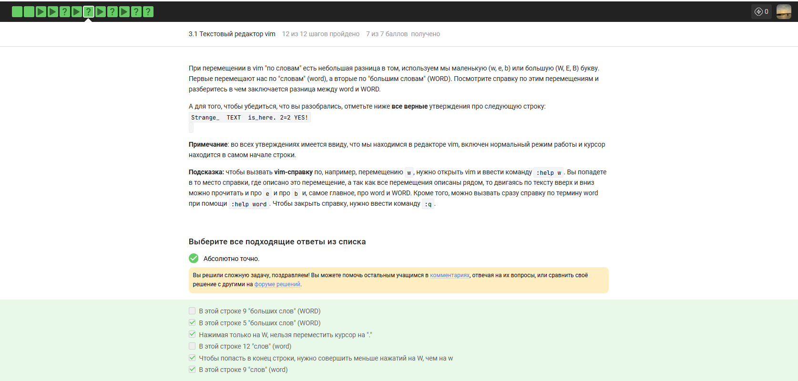{width=45%}

В строке 5 WORD (разделены пробелами): Strange_, TEXT, is_here., 2=2, YES!. Обычных word — 9, так как знаки пунктуации считаются отдельно. На точку нельзя попасть через W, курсор перепрыгнет к 2=2. Нажатий W нужно меньше, чем w. Утверждения про 9 WORD и 12 word неверны.

---

# Вопрос 3

Строку "one two three four five" нужно преобразовать в "three four four four five". Какие наборы нажатий выполнят такое редактирование?

{width=45%}

Верно: d2wwywPp (удаляет два слова и вставляет four), d2w$bifour four<Esc> (удаляет начало и дописывает текст), d2wwifour four<Esc> (аналогично через режим вставки), xxxxxxxxwywPp (посимвольное удаление восьми знаков), ddithree four four four five<Esc> (полная очистка и набор заново). Неверно: x2wwywPp (удалён только один символ).

---

# Вопрос 4

Заменить во всём файле только первое вхождение Windows на Linux в каждой строке. Укажите команду полностью.

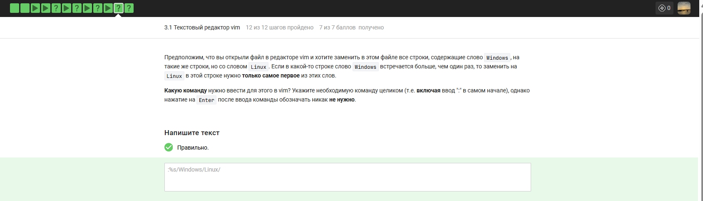{width=45%}

:%s/Windows/Linux/ — символ % для всего файла, отсутствие g заменяет только первое вхождение. :s/... — только текущая строка. :%s/.../g — все вхождения. :%s/windows/Linux/ не сработает из-за регистра.

---

# Вопрос 5

Ознакомьтесь с режимом выделения (Visual) в vim. Отметьте все верные утверждения.

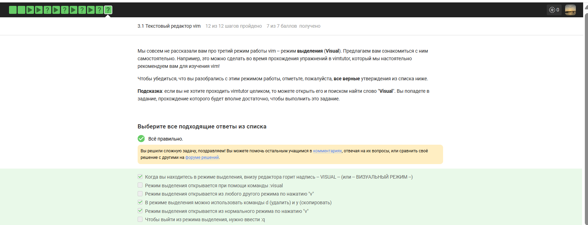{width=45%}

Верно: внизу отображается -- VISUAL --, d и y работают на выделенном блоке, вход по v из нормального режима. Неверно: команды :visual нет, v из другого режима не сработает без Esc, выход через :q закроет редактор, а не режим.

---

# Вопрос 6

Вы в bash набрали A1, A2, A3, запустили sh (B1, B2, B3), затем bash (C1, C2, C3). Какие команды появятся в истории по стрелкам?

{width=45%}

Только из набора С. Каждая оболочка хранит историю в памяти, дочерний bash не видит команды родительских процессов. Наборы A и B остались в памяти предыдущих оболочек. Набор B принадлежит sh, у которой своя история.

---

# Вопрос 7

Скрипт запущен в /home/bi/Documents/:

#!/bin/bash

cd /home/bi/

touch file1.txt

cd /home/bi/Desktop/

Абсолютный путь до file1.txt?

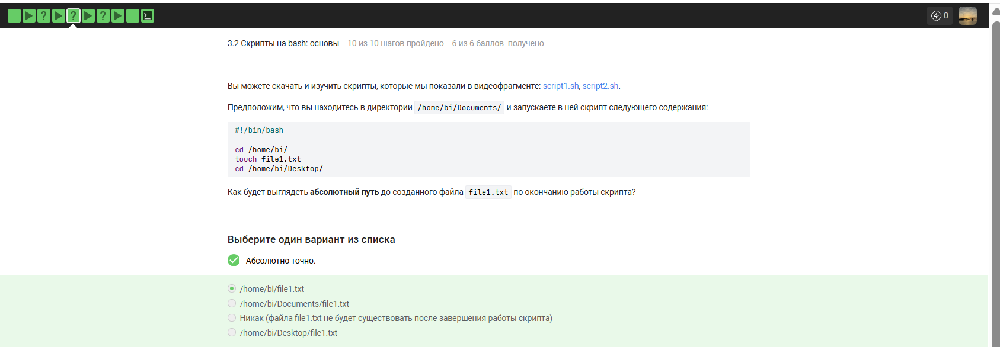{width=45%}

/home/bi/file1.txt. Команда touch выполняется после cd /home/bi/, файл создаётся там. Переход в Desktop происходит позже и не влияет на размещение. Файл существует, touch создаёт объекты на диске.

---

# Вопрос 8

Какие строки могут быть именами переменных в bash?

{width=45%}

Верно: variable123 (буквы и цифры, цифра не в начале), _variable (подчёркивание разрешено). Неверно: var-i-able (дефис — оператор), 123variable (цифра в начале), vari/able (слэш для путей), variab$$le (доллар для подстановки), var@iable (символ не из набора).

---

# Вопрос 9

Скрипт принимает два аргумента и выводит: Arguments are: $1=первый_аргумент $2=второй_аргумент

{width=45%}

echo "Arguments are: \$1=$1 \$2=$2" — слэш экранирует первый доллар, выводя текст \$1, второй доллар подставляет значение. Без экранирования оба доллара раскроются. Одинарные кавычки не раскрывают переменные.

---

# Вопрос 10

Впишите в if [[ ... ]] условие, которое всегда выводит "True", независимо от переменных и аргументов.

{width=45%}

Всегда True: $var1 == $var2 || $var1 != $var2 (покрывает все случаи), 5 -ge 5 (константа), !(4 -le 3) (отрицание ложного), -z "" (проверка пустой строки). Не всегда: $var1 == $var2 && $var1 != $var2 (противоречие), $# -gt 0 (зависит от аргументов).

---

# Вопрос 11

Скрипт с var=3 и var=5:

if [[ $var -gt 5 ]]; then echo "one"

elif [[ $var -lt 3 ]]; then echo "two"

elif [[ $var -eq 4 ]]; then echo "three"

else echo "four"; fi

Что выведется?

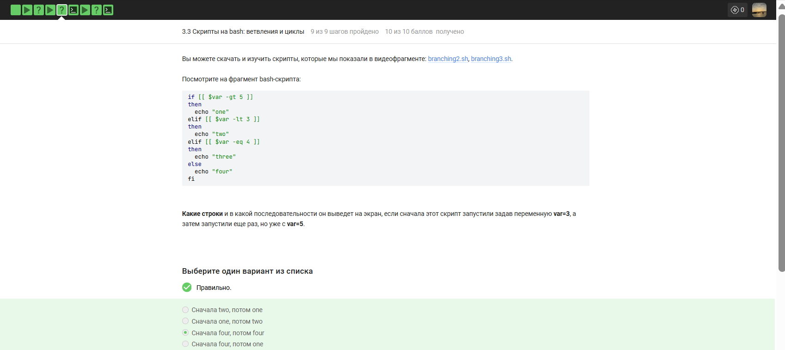{width=45%}

При var=3: не >5, не <3, не =4 → else → "four". При var=5: не >5, не <3, не =4 → else → "four". Ответ: сначала four, потом four.

---

# Вопрос 12

Скрипт принимает число студентов (0 – ∞) и выводит сообщение по правилам.

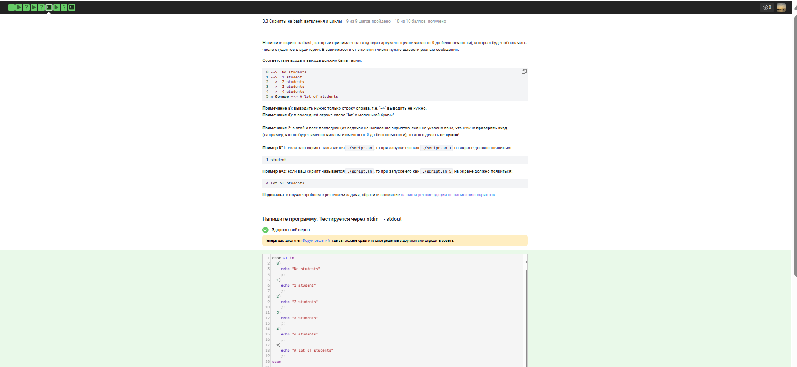{width=45%}

case $1 in

  0) echo "No students";;

  1) echo "1 student";;

  [2-4]) echo "$1 students";;

  *) echo "A lot of students";;

esac

case перебирает $1. Для 0 — No students, для 1 — 1 student. Шаблон [2-4] покрывает числа 2-4. Шаблон * для всех остальных, включая 5 и выше. Две точки с запятой обязательны.

---

# Вопрос 13

for str in a , b , c_d; do

  echo "start"

  if [[ $str > "c" ]]; then continue; fi

  echo "finish"

done

Сколько раз выведется start и finish?

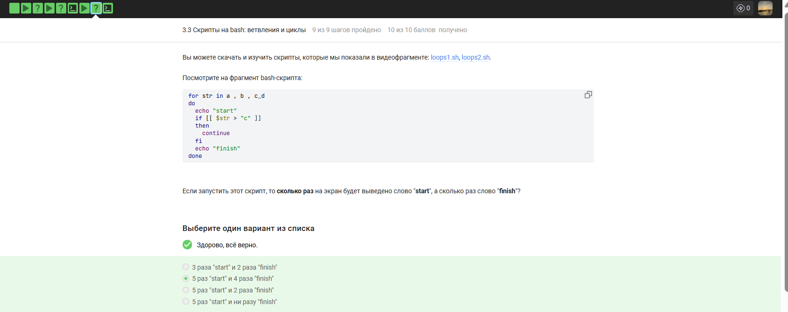{width=45%}

Пять элементов: a, запятая, b, запятая, c_d. start — 5 раз. Условие $str > "c" истинно только для c_d, continue пропускает finish. finish выводится 4 раза.

---

# Вопрос 14

Скрипт: бесконечный опрос имени и возраста, определяет группу (child ≤16, youth 17-25, adult >25). Пустое имя или возраст 0 — выход с "bye".

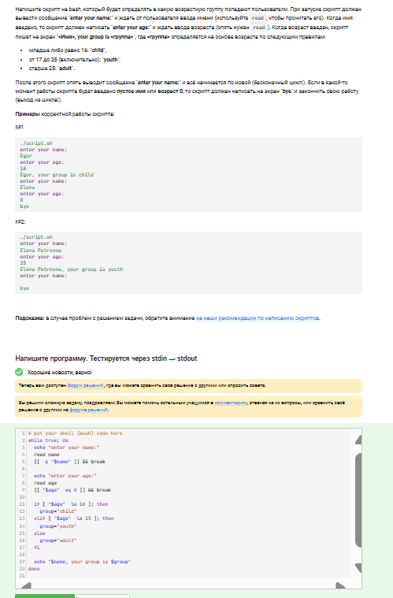{width=45%}

while true; do

  read -p "enter your name: " name

  [[ -z "$name" ]] && { echo "bye"; break; }

  read -p "enter your age: " age

  [[ "$age" -eq 0 ]] && { echo "bye"; break; }

  if [[ $age -le 16 ]]; then group="child"

  elif [[ $age -le 25 ]]; then group="youth"

  else group="adult"; fi

  echo "$name, your group is $group"

done

Цикл while true бесконечен. Пустое имя или возраст 0 прерывают цикл с выводом bye. Ветвление if-elif-else распределяет по группам. Кавычки защищают от пробелов.

---

# Вопрос 15

Какие инструкции увеличат a на b (a=10, b=5 → a=15)?

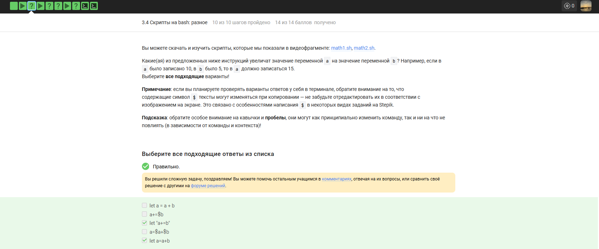{width=45%}

Верно: let a = a + b (арифметическое выражение), a+=$b (сокращённый синтаксис), let "a+=b" (кавычки объединяют аргумент), let a=a+b (базовая форма). Неверно: a=$a+$b (строковая конкатенация, результат "10+5").

---

# Вопрос 16

Скрипт в /home/bi/Documents/:

#!/bin/bash

cd /home/bi/

echo "`pwd`"

Что выведется?

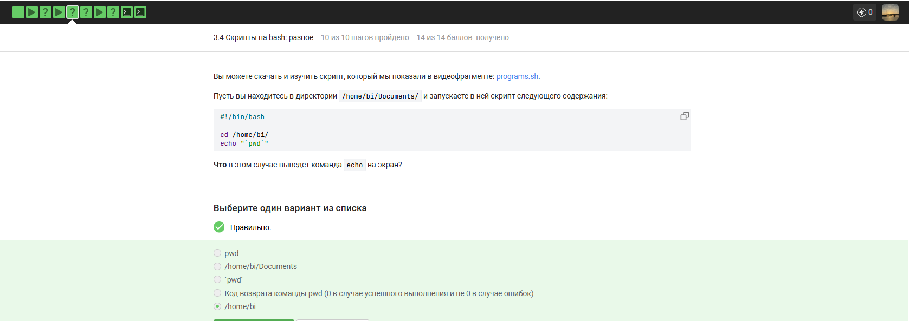{width=45%}

/home/bi. cd меняет директорию. Обратные кавычки выполняют pwd и подставляют результат. Вывод не pwd как текст, не /home/bi/Documents (директория сменена), не код возврата (кавычки захватывают stdout).

---

# Вопрос 17

Как проверить код возврата program, которая пишет в stdout? Выберите верные конструкции if.

{width=45%}

Верно: program; if [[ $? -eq 0 ]] ($? хранит код возврата), if `program > some_file.txt` (перенаправление убирает stdout). Неверно: var=`program`; if [[ $var -eq 0 ]] (сравнивается вывод, а не код), if [[ `program` -eq 0 ]] (текст сравнивается с нулём).

---

# Вопрос 18

counter () {

  local let "c1+=$1"

  let "c2+=${1}*2"

}

Вывод echo "counters are $c1 and $c2" после 10 вызовов с 1..10.

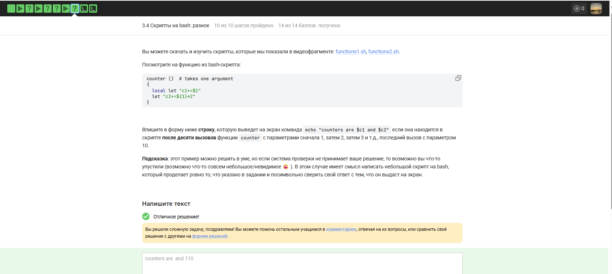{width=45%}

c1 — local, в глобальной области пуста. c2 — глобальная, накапливает сумму удвоенных аргументов: 2*(1+2+...+10) = 110. Вывод: counters are  and 110.

---

# Вопрос 19

Скрипт для НОД (алгоритм Евклида). Ввод двух чисел, пустая строка — выход.

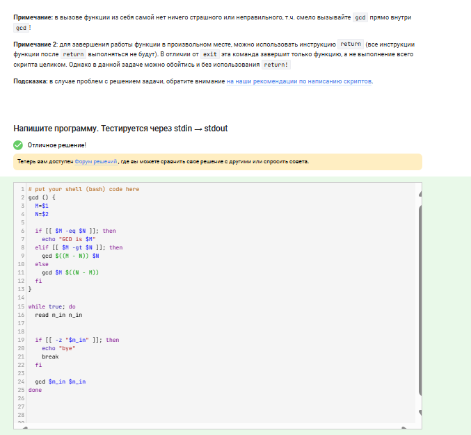{width=45%}

gcd() {

  if [[ $1 -eq $2 ]]; then echo "GCD is $1"

  elif [[ $1 -gt $2 ]]; then gcd $(($1-$2)) $2

  else gcd $1 $(($2-$1)); fi

}

while true; do

  read m n

  [[ -z "$m" ]] && { echo "bye"; break; }

  gcd $m $n

done

Функция gcd рекурсивна: если равны — вывод, если M>N — вызов с (M-N, N), иначе — (M, N-M). Цикл читает два числа, пустая строка прерывает.

---

# Вопрос 20

Калькулятор на bash. Команды: exit, операнд операция операнд (+,-,*,/,%,**), иначе error.

{width=45%}

while true; do

  read num1 op num2 rest

  [[ "$num1" == "exit" ]] && { echo "bye"; break; }

  if [[ ! "$num1" =~ ^-?[0-9]+$ || ! "$num2" =~ ^-?[0-9]+$ || -n "$rest" ]]; then

    echo "error"; break

  fi

  case $op in

    "+") let res=num1+num2;;

    "-") let res=num1-num2;;

    "*") let res=num1*num2;;

    "/") let res=num1/num2;;

    "%") let res=num1%num2;;

    "**") let res=num1**num2;;

    *) echo "error"; break;;

  esac

  echo "$res"

done

Цикл читает выражение. exit завершает. Проверка через регулярки: операнды — целые числа, rest пуст. case выполняет операцию через let. Неизвестный оператор — error.

---

# Вопрос 21

В /home/bi файлы: Star_Wars.avi, star_trek_OST.mp3, STARS.txt, stardust.mpeg, Eddard_Stark_biography.txt. Какие найдет find -iname "star*", но не найдет -name "star*"?

{width=45%}

Star_Wars.avi и STARS.txt — -iname игнорирует регистр, -name ищет только строчные. star_trek_OST.mp3 и stardust.mpeg найдут обе команды. Eddard_Stark_biography.txt не начинается со star.

---

# Вопрос 22

Верные утверждения про -path и -name команды find.

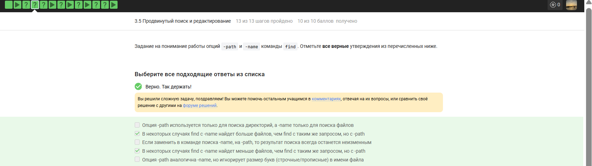{width=45%}

Верно: -name может найти больше или меньше, чем -path, так как -name ищет в имени, -path — во всём пути. Неверно: привязка к типу объекта (обе работают с файлами и папками), результат всегда одинаков (разная область поиска), -path игнорирует регистр (нужны -ipath и -iname).

---

# Вопрос 23

Структура: /home/bi/dir1/file1, dir1/dir2/file2, dir1/dir2/dir3/file3.

find /home/bi -mindepth 2 -maxdepth 3 -name "file*"

{width=45%}

file1 на глубине 2, file2 на глубине 3 — оба в диапазоне. file3 на глубине 4, превышает maxdepth 3. Найдены file1 и file2.

---

# Вопрос 24

Файл из 10 строк, в каждой "word". Какая команда создаст наибольший results.txt?

grep "word", grep -A 1, grep -B 1, grep -C 1.

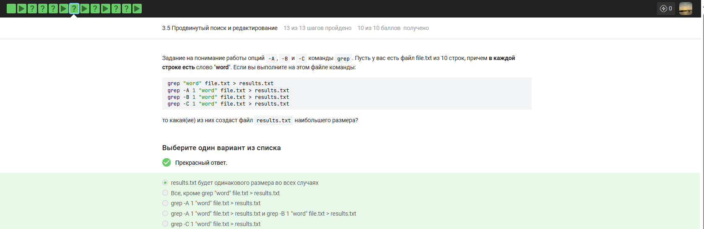{width=45%}

Все команды создадут файл одинакового размера. Все 10 строк уже содержат word, опции контекста не добавляют новых уникальных строк. В results.txt всегда 10 строк.

---

# Вопрос 25

Какие строки выведет grep -E "[xklXKL]?[uU]buntu$" text.txt?

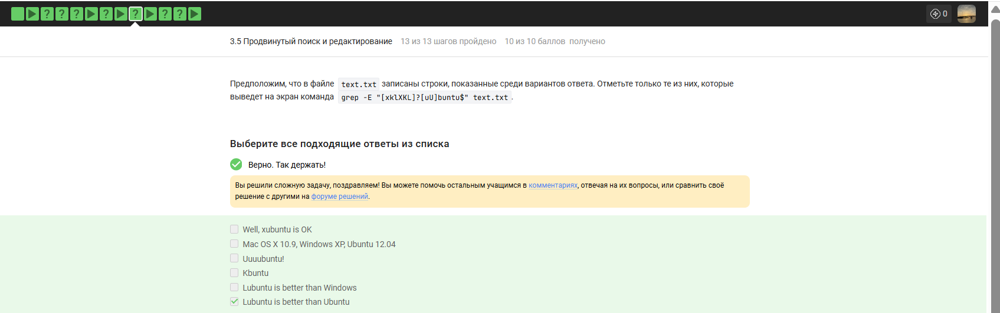{width=45%}

Kubuntu (K в наборе, Ubuntu в конце), Lubuntu is better than Ubuntu (заканчивается на Ubuntu). Не подходят: xubuntu в середине строки, строки с цифрами или знаками в конце, Windows в конце.

---

# Вопрос 26

Что будет, если в sed -n "/[a-z]*/p" text.txt убрать -n?

{width=45%}

Каждая строка выведется дважды: автоматическая печать sed плюс команда p. Шаблон [a-z]* соответствует любому количеству строчных букв, включая ноль, поэтому совпадают все строки.

---

# Вопрос 27

Инструкция sed, заменяющая "аббревиатуры" (≥2 заглавные буквы, окружённые пробелами) на "abbreviation" в input.txt, вывод в edited.txt.

{width=45%}

sed 's/ [A-Z]\{2,\} / abbreviation /g' input.txt > edited.txt

Шаблон ищет пробел, две или более заглавных буквы, пробел. Флаг g — глобальная замена. Результат в edited.txt.

---

# Вопрос 28

Какую опцию указать в gnuplot, чтобы графики не закрывались?

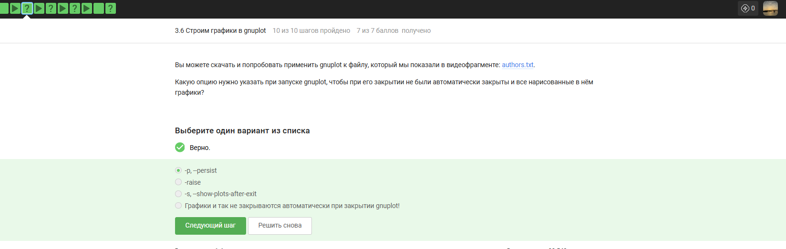{width=45%}

-p, --persist — оставляет окна открытыми после завершения gnuplot. Без опции окна закрываются. -raise управляет фокусом, а не сохранением.

---

# Вопрос 29

data.csv с 10 числами в двух столбцах, без заголовков. Команды:

set key autotitle columnhead

plot 'data.csv' using 1:2

Название ряда и сколько точек?

{width=45%}

Название — первое значение из второго столбца. Первая строка стала заголовком и исключена. Точек — 9. 10 точек неверно, заголовок из первого столбца неверно.

---

# Вопрос 30

Скрипт gnuplot: три деления на оси X в координатах x1, x2, x3 с подписями "point N, value <значение>".

{width=45%}

set xtics ("point 1, value ".x1 x1, "point 2, value ".x2 x2, "point 3, value ".x3 x3)

Каждая метка: текст через конкатенацию, затем координата. Скобки группируют список. Запятые разделяют метки.

---

# Вопрос 31

Изменить move.rot: зеркально отразить по горизонтали, вращение в обратную сторону, в 2 раза быстрее.

{width=45%}

a=a+1

zrot=(zrot+350)%360

set view xrot,zrot

splot -x**2-y**2

pause 0.1

if (a<50) reread

a считает кадры. zrot сдвиг на 350° (эквивалент -10°) — обратное вращение, шаг 10° — удвоение скорости. splot с минусом — зеркальное отражение. Пауза 0.1, всего 50 итераций.

---

# Вопрос 32

Установить права rwxrw-r-- (было r--r--r--). Выберите верные команды.

{width=45%}

Верно: chmod 764, chmod a+wx; chmod o-wx; chmod g-x, chmod ug+w; chmod u+x, chmod u+wx; chmod g+w. Неверно: chmod u-wx (удаление прав), chmod 467 (r--rw-rwx).

---

# Вопрос 33

Директория dir (root:root, rwxr-xr-x). После какой команды user из group group сможет создать файл?

{width=45%}

sudo chown user:group dir — полная смена владельца и группы, user получает rwx. Просто chown :group не даст записи (у группы r-x). chmod g+w без смены группы не поможет. Без sudo прав нет.

---

# Вопрос 34

Какие характеристики файла считает wc?

{width=45%}

Строки (-l), длина самой длинной строки (-L), слова (-w), символы (-m) и байты (-c). Предложения — нет, wc не распознаёт пунктуацию.

---

# Вопрос 35

Команда для вывода размера текущей директории в удобном формате.

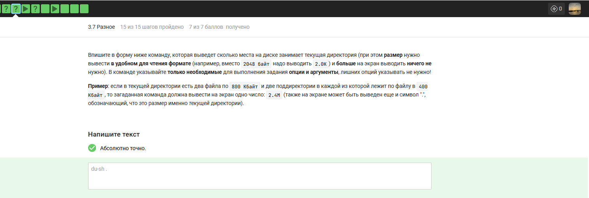{width=45%}

du -sh .

-s — итоговая сумма без детализации. -h — человекочитаемый формат. Точка — текущая директория.

---

# Вопрос 36

Максимально короткая команда для создания dir1, dir2, dir3.

{width=45%}

mkdir dir{1..3}

Фигурные скобки раскрывают последовательность 1-3, подставляя в имя dir. Одна команда создаёт три директории.

---

# Выводы

Освоила Linux на более высоком уровне, научилась использовать полезные команды и программы.
