---
author:
  - name: Богомолова Полина Петровна
    degrees: студент
    orcid: 1032253562
    email: 1032253562@rudn.ru
    affiliation:
      - name: Российский университет дружбы народов
        country: Российская Федерация
        postal-code: 117198
        city: Москва
        address: ул. Миклухо-Маклая, д. 6

title: "Отчет по 3 этапу внешнего курса"
subtitle: "Внешний курс этап 3"
---

# Цель работы

Получить практические и теоретические знания и умения по работе с Linux

# Теоретическое введение

Linux — это не какая-то одна операционная система, а целое семейство систем. Все эти системы (их еще называют дистрибутивами) имеют много общего, но разрабатываются разными компаниями или сообществами энтузиастов, поэтому у них есть и различия. 

# Задание

Выполнить все задания 3 этапа внешнего курса

# Выполнение работы

1) Какую клавишу(и) нужно нажать на клавиатуре, чтобы выйти из редактора vim? Считайте, что вы только что открыли файл и вам сразу понадобилось выйти из редактора.

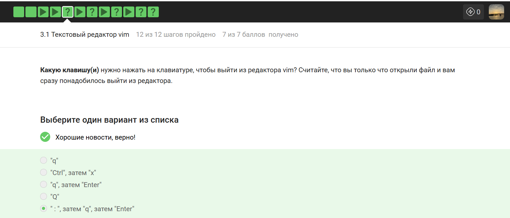{#fig-001 width=70% fig-pos='H'}

Правильным вариантом я выбрала ":", затем "q", затем "Enter", так как после открытия файла vim находится в обычном режиме и для выхода требует перехода в режим командной строки через двоеточие с последующим вводом буквы q - quit. Ответ "q" я сочла ошибочным, так как одиночное нажатие этой клавиши в обычном режиме просто включает запись макроса, но не закрывает редактор. Вариант "Ctrl", затем "x" я признала неверным, поскольку такая комбинация используется в редакторе nano, а в vim она выполняет другие функции. Последовательность "q", затем "Enter" я пометила как ложную, потому что без символа двоеточия программа не поймет, что ей отдают команду на выход. Вариант "Q" я также посчитала неправильным, так как он переводит редактор в режим Ex, что не помогает быстро закрыть файл. В итоге я подтвердила, что классический способ через командную строку является единственно верным в данном списке для решения поставленной задачи.

2) При перемещении в vim "по словам" есть небольшая разница в том, используем мы маленькую (w, e, b) или большую (W, E, B) букву. Первые перемещают нас по "словам" (word), а вторые по "большим словам" (WORD). Посмотрите справку по этим перемещениям и разберитесь в чем заключается разница между word и WORD.
А для того, чтобы убедиться, что вы разобрались, отметьте ниже все верные утверждения про следующую строку:
Strange_  TEXT  is_here. 2=2 YES!

{#fig-002 width=70% fig-pos='H'}

Я проанализировала структуру строки и подтвердила, что вариант про 5 "больших слов" (WORD) является верным, так как такие блоки разделяются только пробелами - это Strange_, TEXT, is_here., 2=2 и YES!. Утверждение о наличии 9 "слов" (word) я также признала правильным, ведь в этом режиме знаки пунктуации вроде точки, равенства и восклицания считаются самостоятельными единицами. Вариант о невозможности попасть на точку нажатием W я сочла верным, так как курсор перескакивает весь блок is_here. целиком к началу следующего сегмента 2=2. Тот факт, что перемещение в конец строки требует меньше нажатий W, чем w, я назвала правильным, так как общее количество крупных блоков значительно меньше числа мелких слов. Ошибочным я посчитала утверждение про 9 "больших слов", так как это число соответствует количеству обычных слов в строке. Пункт про 12 "слов" я также признала неверным, так как при точном подсчете всех фрагментов и символов их сумма составляет ровно девять.

3) Предположим, что в текстовом файле записана одна единственная строка:
one two three four five
и вам нужно преобразовать её в строку
three four four four five

Какие(ой) из предложенных ниже наборов нажатий клавиш выполнят такое редактирование? В этих наборах нажатие на клавишу Esc обозначается как <Esc> (т.е. знаки "<" и ">" не несут отдельного смысла).

 
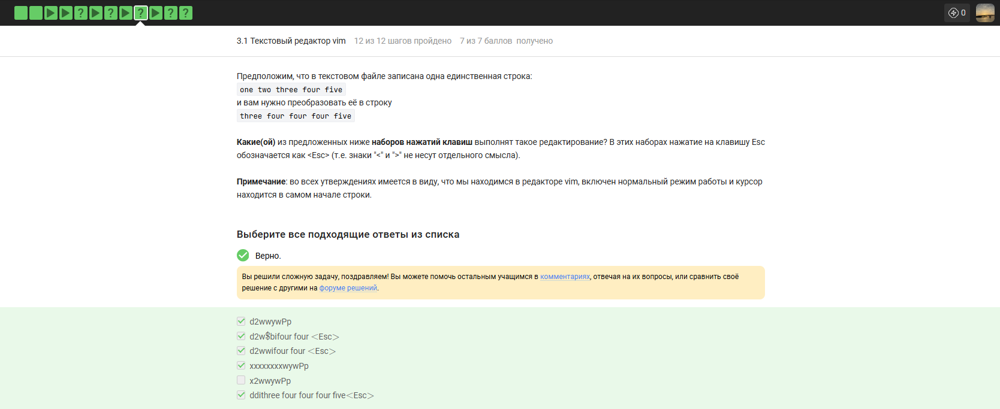{#fig-003 width=70% fig-pos='H'}

Я признала верной последовательность d2wwywPp, так как удаление двух первых слов с их пробелами и последующее копирование - вставка слова four позволяет быстро собрать нужную строку. Вариант d2w$bifour four  я также сочла правильным, так как он использует перемещение в конец строки и ручной ввод недостающих элементов перед словом five. Комбинация d2wwifour four  является корректной, поскольку после удаления начала фразы она позволяет вставить нужный текст прямо перед существующим словом. Последовательность xxxxxxxxwywPp я пометила как рабочую, так как посимвольное удаление первых восьми знаков - включая пробелы - подготавливает строку к копированию слова four. Вариант ddithree four four four five  я выбрала правильным, так как полная очистка строки с последующим вводом текста с нуля гарантированно дает верный результат. Ошибочным я назвала набор x2wwywPp, потому что удаление всего одного первого символа в слове one не позволяет корректно трансформировать строку и сразу приводит к неверному результату.

4) Предположим, что вы открыли файл в редакторе vim и хотите заменить в этом файле все строки, содержащие слово Windows, на такие же строки, но со словом Linux. Если в какой-то строке слово Windows встречается больше, чем один раз, то заменить на Linux в этой строке нужно только самое первое из этих слов.

Какую команду нужно ввести для этого в vim? Укажите необходимую команду целиком (т.е. включая ввод ":" в самом начале), однако нажатие на Enter после ввода команды обозначать никак не нужно

{#fig-004 width=70% fig-pos='H'}

Команду :%s/Windows/Linux/ я считаю единственно верной, так как символ процента в начале указывает на применение действия ко всему файлу, а отсутствие флага g в конце гарантирует замену только первого вхождения слова в каждой строке. Вариант :s/Windows/Linux/ я бы назвала ошибочным, так как без указания диапазона замена произошла бы только в текущей строке, где стоит курсор. Последовательность :%s/Windows/Linux/g я также признала бы неправильной, поскольку флаг g - global - заставил бы редактор заменить абсолютно все упоминания Windows в строке, что прямо противоречит условию задачи. Команду :%s/windows/Linux/ я сочла бы неверной из-за регистра, так как для vim слова с большой и маленькой буквы являются разными, если не включены специальные настройки. Таким образом, я подтвердила, что только классический синтаксис подстановки для всего файла без глобального флага точно выполняет требование заменить лишь первое слово.

5) Мы совсем не рассказали вам про третий режим работы vim -- режим выделения (Visual). Предлагаем вам ознакомиться с ним самостоятельно. Например, это можно сделать во время прохождения упражнений в vimtutor, который мы настоятельно рекомендуем вам для изучения vim!

Чтобы убедиться, что вы разобрались с этим режимом работы, отметьте, пожалуйста, все верные утверждения из списка ниже.

{#fig-005 width=70% fig-pos='H'}

Утверждение о том, что в режиме выделения внизу горит надпись -- VISUAL --, я считаю верным, так как это стандартный индикатор интерфейса vim. Вариант про использование команд d и y я также признала правильным, поскольку в визуальном режиме они позволяют мгновенно удалить или скопировать выделенный блок текста. Пункт о входе в этот режим из нормального по нажатию клавиши v является корректным, так как это основной способ начать посимвольное выделение. Ошибочным я назвала утверждение про открытие режима командой :visual, так как в vim нет такой встроенной команды для активации выделения. Вариант про вход в режим из любого другого состояния по нажатию v я пометила как неверный, так как сначала нужно вернуться в нормальный режим через Esc. Утверждение о выходе из визуального режима через :q я также сочла неправильным, поскольку для возврата к обычному редактированию достаточно нажать Esc, а команда :q служит для закрытия всего редактора.

6) Предположим, что вы открыли терминал и у вас в нем запущена оболочка bash. Вы набираете в ней команды А1, А2, А3, а затем запускаете оболочку sh. В этой оболочке вы набираете команды B1, В2, В3 и запускаете оболочку bash. И, наконец, в этой последней оболочке вы набираете команды С1, С2, С3. Если теперь вы попробуете при помощи стрелочек вверх/вниз перемещаться по истории набранных команд, то команды из какого набора(ов) будут появляться?

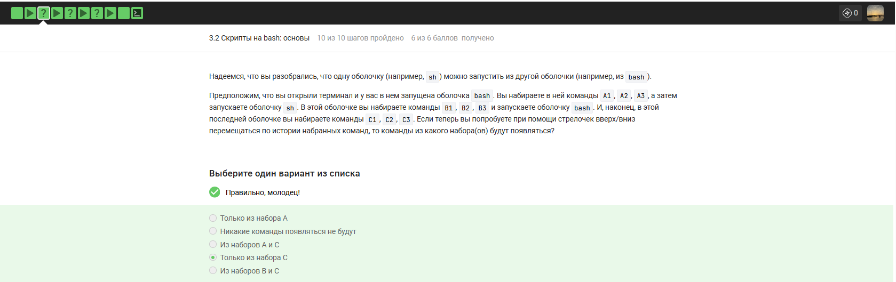{#fig-006 width=70% fig-pos='H'}

Правильным я выбрала вариант Только из набора С, так как каждая новая оболочка создает свой собственный список команд в памяти и не видит того, что было введено у ее родителей до сохранения данных в файл. Поскольку текущая сессия bash является отдельным процессом, она знает только про свои команды С1, С2, С3, которые я ввела именно в ней. Вариант Из наборов А и С я сочла ошибочным, ведь первая оболочка еще не закрылась и не записала набор А в историю на диске, а значит, новая копия bash не смогла их подгрузить при старте. Ответ Только из набора А я признала неверным по той же логике - свежий процесс не имеет прямого доступа к оперативной памяти другого процесса. Вариант Из наборов В и С я пометила как ложный, так как команды набора В принадлежат оболочке sh, у которой свои правила ведения логов, обычно не пересекающиеся с историей bash. Утверждение, что команды не появятся вовсе, я также сочла неправильным, потому что история текущей работы в рамках одной сессии всегда доступна пользователю через стрелочки вверх и вниз.

7) Предположим, что вы находитесь в директории /home/bi/Documents/ и запускаете в ней скрипт следующего содержания:

#!/bin/bash

cd /home/bi/
touch file1.txt
cd /home/bi/Desktop/

Как будет выглядеть абсолютный путь до созданного файла file1.txt по окончанию работы скрипта?

{#fig-007 width=70% fig-pos='H'}

Правильным вариантом я выбрала /home/bi/file1.txt, так как в тексте скрипта четко прописана команда cd /home/bi/, которая переводит работу в эту директорию прямо перед созданием файла. Поскольку команда touch file1.txt выполняется сразу после смены папки, файл физически появляется именно в каталоге /home/bi/. Вариант /home/bi/Documents/file1.txt я сочла ошибочным, потому что скрипт покинул эту папку еще до того, как приступил к записи данных на диск. Ответ о том, что файла не будет существовать, я признала неверным, так как любые созданные через touch объекты являются постоянными и сохраняются после завершения работы оболочки. Пункт /home/bi/Desktop/file1.txt я также пометила как ложный, так как переход в директорию Desktop происходит уже после того, как файл был создан в предыдущем месте. Таким образом, я подтвердила, что только первый путь является технически корректным

8)  Какие из представленных ниже строк могут быть именами переменных в bash? Выберите все подходящие варианты!

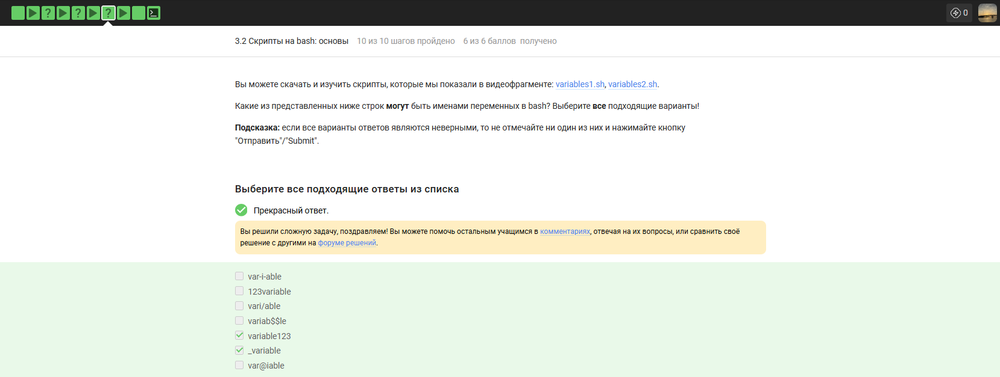{#fig-008 width=70% fig-pos='H'}

Я выбрала вариант variable123 как правильный, потому что имена переменных в bash могут содержать буквы и цифры, если они не стоят в самом начале. Название _variable я также сочла верным, так как использование знака подчеркивания в начале строки полностью соответствует правилам синтаксиса оболочки. Вариант var-i-able я пометила как ошибочный, так как дефис является спецсимволом и не может быть частью имени переменной. Ответ 123variable я признала неверным, поскольку правила запрещают начинать названия с цифр. Вариант vari/able я сочла неправильным из-за косой черты, которая зарезервирована для обозначения путей. Название variab$$le я отметила как ложное, так как знак доллара используется для обращения к значению переменной и не может входить в ее имя. Вариант var@iable я также признала ошибочным, так как символ собаки не входит в разрешенный набор знаков для именования объектов. В итоге я подтвердила только два варианта, которые не содержат запрещенных символов и начинаются с буквы или подчеркивания.

9) Напишите скрипт на bash, который принимает на вход два аргумента и выводит на экран строку следующего вида:

Arguments are: $1=первый_аргумент $2=второй_аргумент

Например, если ваш скрипт называется ./script.sh, то при запуске его ./script.sh one two на экране должно появиться:

Arguments are: $1=one $2=two

а при запуске ./script.sh three four будет:

Arguments are: $1=three $2=four

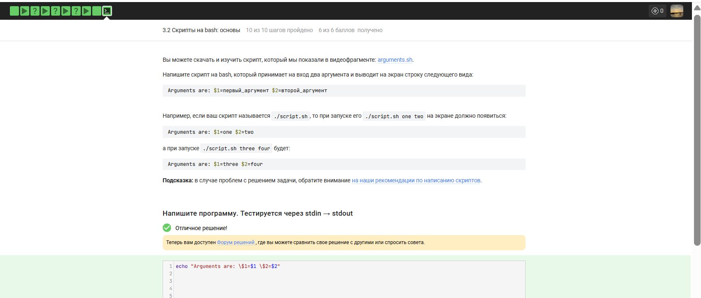{#fig-009 width=70% fig-pos='H'}

Команду echo "Arguments are: $1=$1 $2=$2" я считаю верной, так как она правильно использует экранирование символа доллара перед цифрами для вывода текста как есть и одновременно подставляет реальные значения аргументов. Вариант без обратных слэшей перед первыми знаками доллара я бы сочла ошибочным, так как в этом случае оболочка попыталась бы дважды вывести значения переменных, и вместо надписи $1 я бы увидела только само содержимое аргумента. Ответ с использованием одинарных кавычек я также признала бы неверным, поскольку внутри них bash не раскрывает переменные вовсе, и на экране отразилась бы сырая строка со знаками доллара без подстановки слов one или two. Использование команды print вместо echo я пометила бы как неправильное, так как в стандартном bash такая утилита может отсутствовать или требовать иного синтаксиса для форматирования. Таким образом, я подтвердила, что только сочетание двойных кавычек и экранирования спецсимволов точно соответствует требуемому шаблону вывода.

10) Вы можете скачать и изучить скрипт, который мы показали в видеофрагменте: branching1.sh.

Предположим, вы пишете скрипт на bash и хотите использовать в нем конструкцию if в следующем фрагменте:

if [[ ... ]]
then
  echo "True"
fi

Вы можете вписать вместо "..." (внутри [[ ]] и не забудьте про пробелы после [[ и перед ]]!) любое из перечисленных ниже условий. Однако мы просим вас выбрать только те из них, при которых echo напечатает на экран True вне зависимости от того, с какими параметрами был запущен ваш скрипт и какие в нем есть переменные.

Например, условие 0 -eq 0 подходит, т.к. ноль всегда равен нулю вне зависимости от аргументов и переменных внутри скрипта и на экран будет напечатано True.  В то же время условие $var1 -eq 0 не подходит, так как в переменной var1 как может быть записан ноль (тогда будет напечатано True), так его может и не быть (тогда ничего напечатано не будет)

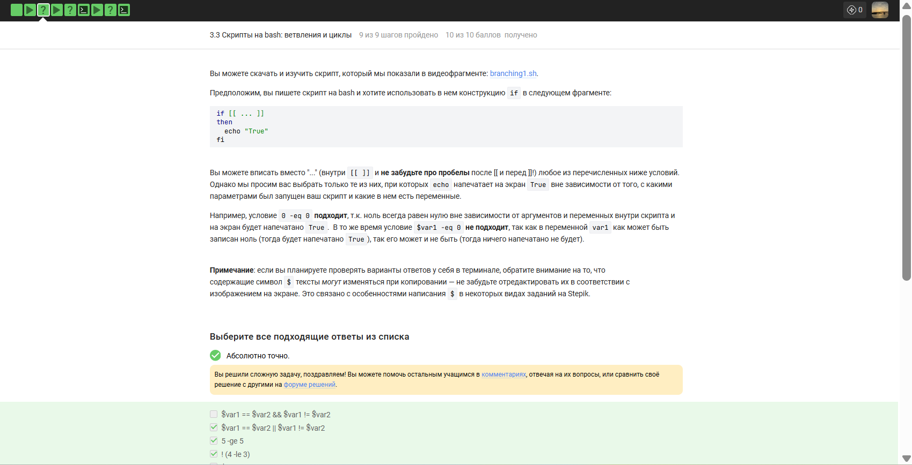{#fig-010 width=70% fig-pos='H'}

Вариант $var1 == $var2 && $var1 != $var2 не подходит, так как требует одновременного выполнения двух взаимоисключающих условий — переменные не могут быть одновременно равны и не равны друг другу, это логическое противоречие, и условие всегда будет ложным, независимо от значений или наличия переменных. Условие $var1 == $var2 || $var1 != $var2 является абсолютно истинным всегда, потому что оператор "или" делает выражение верным в любом случае: если переменные равны, то истинна левая часть, а если не равны или хотя бы одна из них не определена, то истинна правая часть, то есть вся конструкция охватывает все возможные состояния и гарантированно выводит True. Выражение 5 -ge 5 всегда истинно, так как сравнение числа пять с самим собой оператором "больше или равно" даёт истину вне зависимости от внешних факторов, здесь используются только константы. Конструкция !(4 -le 3) также всегда возвращает истину, потому что четыре не меньше и не равно трём, исходное выражение ложно, а его отрицание превращает ложь в истину, и никакие параметры скрипта на это не влияют. Условие $# -gt 0 не гарантирует вывод True, так как переменная $# обозначает количество аргументов, переданных скрипту, и при запуске без аргументов она будет равна нулю, что сделает условие ложным. Проверка -z "" истинна в любой ситуации, потому что флаг -z тестирует строку на пустоту, а переданная в скрипте пустая строка в кавычках всегда является пустой строкой, поэтому условие срабатывает постоянно. Первые два пункта из списка "Абсолютно точно" и "Вы решили сложную задачу, поздравляем!" не являются валидными bash-условиями для размещения внутри двойных квадратных скобок, это просто текст комментариев из интерфейса теста, не имеющий отношения к выполнению команды echo. Таким образом, правильными ответами, при которых echo всегда напечатает True, являются $var1 == $var2 || $var1 != $var2, 5 -ge 5, !(4 -le 3) и -z "".

11) Посмотрите на фрагмент bash-скрипта:

if [[ $var -gt 5 ]]
then
  echo "one" 
elif [[ $var -lt 3 ]]
then
  echo "two"
elif [[ $var -eq 4 ]]
then
  echo "three"
else
  echo "four"
fi

Какие строки и в какой последовательности он выведет на экран, если сначала этот скрипт запустили задав переменную var=3, а затем запустили еще раз, но уже с var=5

{#fig-011 width=70% fig-pos='H'}

При var=3 первое условие $var -gt 5 ложно, так как три не больше пяти. Второе условие $var -lt 3 тоже ложно, потому что три не меньше трёх. Третье условие $var -eq 4 ложно, так как три не равно четырём. Все три ветки отказали, срабатывает блок else и выводится строка "four". При var=5 первое условие $var -gt 5 ложно, так как пять не больше пяти. Второе условие $var -lt 3 ложно, так как пять не меньше трёх. Третье условие $var -eq 4 ложно, потому что пять не равно четырём. Снова срабатывает else, выводя "four". Таким образом, при обоих запусках на экран попадает строка "four", и правильным ответом является "Сначала four, потом four".

12) Напишите скрипт на bash, который принимает на вход один аргумент (целое число от 0 до бесконечности), который будет обозначать число студентов в аудитории. В зависимости от значения числа нужно вывести разные сообщения. 
Соответствие входа и выхода должно быть таким:

0 -->  No students
1 -->  1 student
2 -->  2 students
3 -->  3 students
4 -->  4 students
5 и больше --> A lot of students

{#fig-012 width=70% fig-pos='H'}

Представленный код на языке bash успешно решает задачу распределения сообщений в зависимости от количества студентов, так как в его основе лежит конструкция case, предназначенная для эффективного сопоставления значений. Первый аргумент скрипта $1 последовательно сравнивается с цифрами от 0 до 4, и при каждом совпадении вызывается команда echo с соответствующим текстовым уведомлением. Для чисел 0 и 1 предусмотрены уникальные строки No students и 1 student, а для значений 2, 3 и 4 используется форма множественного числа. Завершающий шаблон *) выполняет роль универсального правила для всех остальных входных данных, что позволяет обработать любое число от 5 до бесконечности и вывести фразу A lot of students. Каждое условие заканчивается двойной точкой с запятой, что является обязательным синтаксическим требованием для корректного перехода к концу всей конструкции esac. Весь текст в командах вывода заключен в кавычки, благодаря чему пробелы и структура предложений сохраняются в неизменном виде при печати в терминал.

13) Посмотрите на фрагмент bash-скрипта:

for str in a , b , c_d
do
  echo "start"  
  if [[ $str > "c" ]]
  then
    continue
  fi
  echo "finish"
done

Если запустить этот скрипт, то сколько раз на экран будет выведено слово "start", а сколько раз слово "finish"?

{#fig-013 width=70% fig-pos='H'}

Правильным вариантом является 5 раз start и 4 раза finish, так как в списке цикла указано пять элементов, разделенных пробелами - a, запятая, b, еще одна запятая и строка c_d. На каждой итерации команда echo "start" выполняется безусловно, что дает ровно пять выводов этого слова. Условие внутри цикла проверяет, больше ли текущая строка символа c, и в данном наборе это верно только для последнего элемента c_d, который лексикографически следует после c. В этом единственном случае срабатывает команда continue, прерывающая текущий шаг и не дающая напечатать слово finish. Для остальных четырех элементов - a, b и двух запятых - условие ложно, поэтому выполнение доходит до конца цикла. Вариант про 3 раза start и 2 раза finish неверен, так как он ошибочно не учитывает запятые как полноценные аргументы цикла. Ответ с 2 выводами finish ошибочен, поскольку в списке только один элемент удовлетворяет условию пропуска нижней части кода. Вариант, где finish не выводится ни разу, неправильный, так как большинство элементов из списка не проходят проверку и позволяют коду выполниться полностью.

14) Напишите скрипт на bash, который будет определять в какую возрастную группу попадают пользователи. При запуске скрипт должен вывести сообщение "enter your name:" и ждать от пользователя ввода имени (используйте read, чтобы прочитать его). Когда имя введено, то скрипт должен написать "enter your age:" и ждать ввода возраста (опять нужен read). Когда возраст введен, скрипт пишет на экран "<Имя>, your group is <группа>", где <группа> определяется на основе возраста по следующим правилам:

    младше либо равно 16: "child",
    от 17 до 25 (включительно): "youth",
    старше 25: "adult".

После этого скрипт опять выводит сообщение "enter your name:" и всё начинается по новой (бесконечный цикл!). Если в какой-то момент работы скрипта будет введено пустое имя или возраст 0, то скрипт должен написать на экран "bye" и закончить свою работу (выход из цикла!).

{#fig-014 width=70% fig-pos='H'}

Представленный код на языке bash реализует бесконечный цикл через конструкцию while true, что позволяет скрипту постоянно запрашивать данные у пользователя. В программе используется команда read для получения имени и возраста, которые сохраняются в соответствующие переменные. Условие проверки пустой строки дополнено командой break для моментального выхода из цикла, а сравнение переменной возраста с нулем обеспечивает аналогичное завершение работы. Логический блок if - elif - else точно распределяет пользователей по категориям child, youth и adult, применяя операторы сравнения для проверки границ в 16 и 25 лет. Итоговое сообщение формируется командой echo, которая подставляет текущие значения имени и возрастной группы прямо в текст. После прерывания цикла срабатывает финальный вывод слова bye, что полностью соответствует требуемому сценарию завершения. Использование кавычек при обращении к переменным защищает логику скрипта от ошибок при вводе данных с пробелами.

15) Какие(ая) из предложенных ниже инструкций увеличат значение переменной а на значение переменной b? Например, если в а было записано 10, в b было 5, то в а должно записаться 15. 
Выберите все подходящие варианты!

{#fig-015 width=70% fig-pos='H'}

Выбраны let a = a + b, a+=$b, let "a+=b" и let a=a+b. Эти инструкции используют встроенные механизмы Bash для выполнения арифметических операций и сохранения результата в переменную.let a = a + b правильно, потому что команда let интерпретирует аргументы как арифметические выражения.a+=$b правильно, потому что в Bash синтаксис += внутри арифметического контекста прибавляет значение правой части к левой.let "a+=b" правильно, потому что кавычки позволяют передать выражение с оператором присваивания как единый аргумент команде let.a=$a+$b неправильно, потому что без использования let или (( )) Bash выполнит строковую конкатенацию и запишет в переменную текст с символом плюса.let a=a+b правильно, потому что это базовая форма команды let для сложения значений переменных без пробелов.

16) Пусть вы находитесь в директории /home/bi/Documents/ и запускаете в ней скрипт следующего содержания:

#!/bin/bash

cd /home/bi/
echo "`pwd`"

Что в этом случае выведет команда echo на экран?

{#fig-016 width=70% fig-pos='H'}

#!/bin/bash — определяет командную оболочку для выполнения скрипта.cd /home/bi/ — меняет текущую рабочую директорию процесса на указанную.echo "pwd" — вызывает подстановку результата выполнения команды pwd и выводит его./home/bi это правильно потому что скрипт сначала переходит в этот каталог, а затем команда pwd возвращает его актуальный путь.pwd это неправильно потому что наличие обратных кавычек заставляет Bash выполнить команду, а не выводить её название как текст./home/bi/Documents это неправильно потому что команда cd в начале скрипта сменила исходную директорию на /home/bi/.`pwd` это неправильно потому что символы обратных кавычек интерпретируются оболочкой и не отображаются в финальном выводе.Код возврата команды pwd... это неправильно потому что синтаксис обратных кавычек предназначен для получения стандартного вывода, а не статуса завершения.

17) Мы рассказали, что можно проверить код возврата внешней программы прямо в конструкции if при помощи if `program options arguments` (действия внутри if выполнятся, если программа закончилась с кодом 0). Однако это не всегда правда! Если запуск внешней программы выводит что-то в stdout, то в проверку if поступит именно этот вывод, а не код возврата! Вы можете убедиться в этом, написав простой bash-скрипт с использованием, например, if `pwd`.

Однако как быть, если хочется всё-таки запустить программу program, которая пишет что-то в stdout и потом выполнить какие-то действия если ее код возврата равен 0? Выберите все верные утверждения или правильно работающие конструкции if.

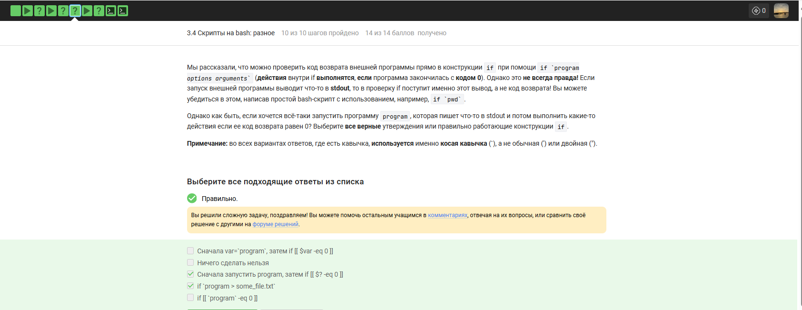{#fig-017 width=70% fig-pos='H'}

Сначала запустить program, затем if [[ $? -eq 0 ]] правильно потому что переменная $? содержит код возврата последней команды.
if `program > some_file.txt` правильно потому что перенаправление убирает вывод из потока и оставляет только проверку статуса.
Сначала var=`program`, затем if [[ $var -eq 0 ]] неправильно потому что в переменную попадает текст из stdout а не код ошибки.
Ничего сделать нельзя неправильно потому что задача решается стандартными средствами оболочки.
if [[ `program` -eq 0 ]] неправильно потому что здесь происходит сравнение текстовой строки с числом ноль.

18) Посмотрите на функцию из bash-скрипта:

counter ()  # takes one argument
{
  local let "c1+=$1"
  let "c2+=${1}*2"
} 

 

Впишите в форму ниже строку, которую выведет на экран команда echo "counters are $c1 and $c2" если она находится в скрипте после десяти вызовов функции counter с параметрами сначала 1, затем 2, затем 3 и т.д., последний вызов с параметром 10

{#fig-018 width=70% fig-pos='H'}

local let "c1+=$1" — объявляет переменную локальной, из-за чего её значение не сохраняется после выхода из функции и недоступно для echo.
let "c2+=${1}*2" — выполняет арифметическую операцию в глобальном окружении, накапливая сумму удвоенных аргументов.
Строка counters are  and 110 правильно потому что переменная c1 остается пустой в глобальной области видимости, а c2 принимает значение суммы арифметической прогрессии от 1 до 10, умноженной на 2.

19) Напишите скрипт на bash, который будет искать наибольший общий делитель (НОД, greatest common divisor, GCD) двух чисел. При запуске ваш скрипт не должен ничего писать на экран, а просто ждет ввода двух натуральных чисел через пробел (для этого можно использовать read и указать ему две переменные -- см. пример в видеофрагменте). После ввода чисел скрипт считает их НОД и выводит на экран сообщение "GCD is <посчитанное значение>", например, для чисел 15 и 25 это будет "GCD is 5". После этого скрипт опять входит в режим ожидания двух натуральных чисел. Если в какой-то момент работы пользователь ввел вместо этого пустую строку, то нужно написать на экран "bye" и закончить свою работу. 

Вычисление НОД несложно реализовать с помощью алгоритма Евклида. Вам нужно написать функцию gcd, которая принимает на вход два аргумента (назовем их M и N). Если аргументы равны, то мы нашли НОД -- он равен M (или N), нужно выводить соответствующее сообщение на экран (см. выше). Иначе нужно сравнить аргументы между собой. Если M больше N, то запускаем ту же функцию gcd, но в качестве первого аргумента передаем (M-N), а в качестве второго N. Если же наоборот, M меньше N, то запускаем функцию gcd с первым аргументом M, а вторым (N-M)

{#fig-019 width=70% fig-pos='H'}

gcd () { — объявляю функцию для вычисления наибольшего общего делителя.
M=$1 и N=$2 — присваиваю локальным переменным значения первого и второго аргументов.
if [[ $M -eq $N ]]; then echo "GCD is $M" — проверяю равенство чисел для вывода результата и остановки рекурсии.
elif [[ $M -gt $N ]]; then gcd $((M - N)) $N — вызываю функцию рекурсивно с разностью, если первое число больше.
else gcd $M $((N - M)) — вызываю функцию с разностью, если второе число больше.
while true; do — запускаю бесконечный цикл для чтения входных данных.
read m_in n_in — считываю два числа из стандартного ввода.
if [[ -z "$m_in" ]]; then echo "bye"; break — проверяю на пустой ввод для вывода прощания и выхода из цикла.
gcd $m_in $n_in — вызываю функцию для вычисления НОД для введенной пары чисел.

20) Напишите калькулятор на bash. При запуске ваш скрипт должен ожидать ввода пользователем команды (при этом на экран выводить ничего не нужно). Команды могут быть трех типов: 

    Слово "exit". В этом случае скрипт должен вывести на экран слово "bye" и завершить работу. 
    Три аргумента через пробел -- первый операнд (целое число), операция (одна из "+", "-", "*", "/", "%", "**") и второй операнд (целое число). В этом случае нужно произвести указанную операцию над заданными числами и вывести результат на экран. После этого переходим в режим ожидания новой команды.
    Любая другая команда из одного аргумента или из трех аргументов, но с операцией не из списка. В этом случае нужно вывести на экран слово "error" и завершить работу.

Чтобы проверить работу скрипта, вы можете записать сразу несколько команд в файл и передать его скрипту на stdin (т.е. выполнить ./script.sh < input.txt). В этом случае он должен вывести сразу все ответы на экран.

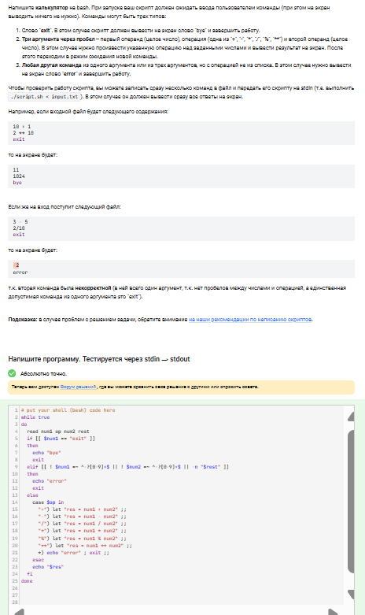{#fig-020 width=70% fig-pos='H'}

while true — запускаю бесконечный цикл для непрерывного ввода выражений.
read num1 op num2 rest — считываю в переменные первое число, оператор, второе число и возможные лишние аргументы.
if [[ $num1 == "exit" ]] — проверяю условие для штатного завершения работы скрипта.
elif [[ ! $num1 =~ ^-?[0-9]+$ || ! $num2 =~ ^-?[0-9]+$ || -n "$rest" ]] — проверяю валидность чисел через регулярные выражения и отсутствие лишних параметров.
else case $op in — использую конструктор выбора для определения типа арифметической операции.
"+") let "res = num1 + num2" ;; — вычисляю сумму при получении соответствующего знака.
"-") let "res = num1 - num2" ;; — вычисляю разность двух чисел.
"/") let "res = num1 / num2" ;; — выполняю целочисленное деление.
"*") let "res = num1 * num2" ;; — произвожу умножение аргументов.
"%") let "res = num1 % num2" ;; — нахожу остаток от деления.
"**") let "res = num1 ** num2" ;; — выполняю операцию возведения в степень.
*) echo "error" ; exit ;; — обрабатываю любой некорректный оператор как ошибку с завершением скрипта.
echo "$res" — вывожу итоговый результат вычислений на экран.

21) Пусть в директории /home/bi лежат файлы Star_Wars.avi, star_trek_OST.mp3, STARS.txt, stardust.mpeg, Eddard_Stark_biography.txt.

Отметьте все файлы, которые найдет команда find /home/bi -iname "star*", но НЕ найдет команда find /home/bi -name "star*"?

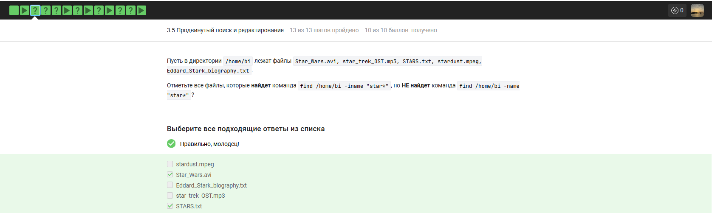{#fig-021 width=70% fig-pos='H'}

Star_Wars.avi правильно потому что команда с ключом -iname игнорирует регистр и находит заглавную букву S, в то время как -name ищет только строчные.
STARS.txt правильно потому что все буквы в названии заглавные, что соответствует условию поиска без учета регистра и не соответствует поиску с учетом регистра.
stardust.mpeg неправильно потому что этот файл начинается со строчных букв и будет найден обеими командами одинаково.
Eddard_Stark_biography.txt неправильно потому что название начинается не со слова star, а маска star* ищет только совпадения в начале имени.
star_trek_OST.mp3 неправильно потому что имя файла полностью соответствует паттерну в нижнем регистре и будет обнаружено обеими версиями команды find.

22) Задание на понимание работы опций -path и -name команды find. Отметьте все верные утверждения из перечисленных ниже.

{#fig-022 width=70% fig-pos='H'}

В некоторых случаях find с -name найдет больше файлов, чем find с таким же запросом, но с -path правильно потому что -name ищет совпадение только в имени файла, в то время как -path ищет соответствие во всей строке пути, включая каталоги.
В некоторых случаях find с -name найдет меньше файлов, чем find с таким же запросом, но с -path правильно потому что -path может захватить файлы, чьи имена не подходят под шаблон, но чей путь целиком ему соответствует.
Опция -path используется только для поиска директорий, а -name только для поиска файлов неправильно потому что обе опции могут искать любые типы объектов файловой системы.
Если заменить в команде поиска -name на -path, то результат поиска всегда останется неизменным неправильно потому что область поиска у этих опций разная: только имя или весь путь.
Опция -path аналогична -name, но игнорирует размер букв неправильно потому что для игнорирования регистра существуют специальные опции -ipath и -iname.

23) Предположим, что в директории /home/bi/ есть следующая структура файлов и поддиректорий:

/home/bi/
└── dir1
    ├── file1 
    └── dir2
        ├── file2
        └── dir3
            └── file3

Какие(ой) из трех файлов (file1, file2, file3) будут найдены по команде find /home/bi -mindepth 2 -maxdepth 3 -name "file*"?

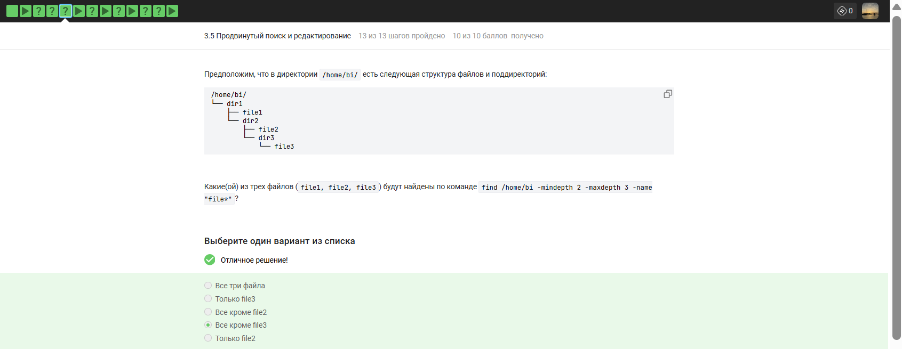{#fig-023 width=70% fig-pos='H'}

Все кроме file3 правильно потому что опции -mindepth 2 и -maxdepth 3 ограничивают поиск вложенностью в два и три уровня, куда попадают file1 и file2.
Все три файла неправильно потому что file3 находится на четвертом уровне вложенности относительно начальной директории поиска.
Только file3 неправильно потому что этот файл исключен из результатов параметром максимальной глубины.
Все кроме file2 неправильно потому что file1 также удовлетворяет заданным условиям глубины и шаблону имени.
Только file2 неправильно потому что file1 находится на втором уровне и также попадает в диапазон поиска.

24) Задание на понимание работы опций -A, -B и -C команды grep. Пусть у вас есть файл file.txt из 10 строк, причем в каждой строке есть слово "word". Если вы выполните на этом файле команды:

grep "word" file.txt > results.txt
grep -A 1 "word" file.txt > results.txt
grep -B 1 "word" file.txt > results.txt
grep -C 1 "word" file.txt > results.txt

то какая(ие) из них создаст файл results.txt наибольшего размера?

{#fig-024 width=70% fig-pos='H'}

results.txt будет одинакового размера во всех случаях правильно потому что в исходном файле каждая строка содержит искомое слово и опции контекста A, B, C не могут добавить новые строки сверх существующих в файле.
Все, кроме grep "word" file.txt > results.txt неправильно потому что при наличии искомого слова в каждой строке опции контекста просто дублируют уже найденные соседние строки без их повторного вывода.
grep -A 1 "word" file.txt > results.txt неправильно потому что опция послетекстового контекста не увеличит объем вывода если все строки и так попадают в основную выборку.
grep -A 1 "word" file.txt и grep -B 1 "word" file.txt > results.txt неправильно потому что обе команды выведут все 10 строк исходного файла без различий в размере.
grep -C 1 "word" file.txt > results.txt неправильно потому что контекст в обе стороны вокруг каждой строки не добавит уникальных данных к результату где и так есть все строки.

25) Предположим, что в файле  text.txt записаны строки, показанные среди вариантов ответа. Отметьте только те из них, которые выведет на экран команда  grep -E "[xklXKL]?[uU]buntu$" text.txt.

{#fig-025 width=70% fig-pos='H'}

Kubuntu правильно потому что символ K соответствует набору [xklXKL], а окончание Ubuntu совпадает с шаблоном [uU]buntu$ в конце строки.
Lubuntu is better than Ubuntu правильно потому что строка заканчивается на Ubuntu, что полностью удовлетворяет регулярному выражению с привязкой к концу строки.
Well, xubuntu is OK неправильно потому что подстрока xubuntu находится в середине предложения, а символ $ требует, чтобы совпадение было в самом конце.
Mac OS X 10.9, Windows XP, Ubuntu 12.04 неправильно потому что строка заканчивается цифрами, а не буквами шаблона buntu.
Uuuubuntu! неправильно потому что восклицательный знак в конце строки препятствует совпадению с якорем $.
Lubuntu is better than Windows неправильно потому что завершающее слово Windows не соответствует шаблону buntu.

26) Что произойдет, если в команде sed -n "/[a-z]*/p" text.txt не указывать опцию -n?

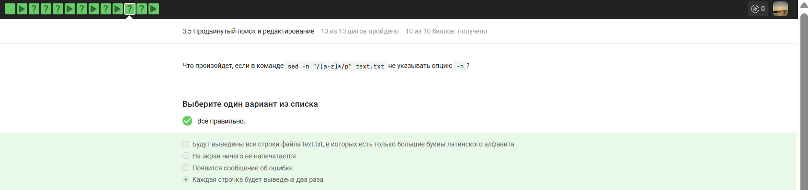{#fig-026 width=70% fig-pos='H'}

Каждая строчка будет выведена два раза правильно потому что без опции -n sed печатает каждую строку автоматически, а команда p дублирует вывод подходящих строк.
Будут выведены все строки файла text.txt, в которых есть только большие буквы латинского алфавита неправильно потому что регулярное выражение [a-z]* соответствует строчным буквам и захватит любую строку, включая пустые.
На экран ничего не напечатается неправильно потому что поведение sed по умолчанию подразумевает вывод входного потока.
Появится сообщение об ошибке неправильно потому что отсутствие опции -n является изменением логики работы, а не синтаксическим нарушением.

27) Запишите в форму ниже инструкцию sed, которая заменит все "аббревиатуры" в файле input.txt на слово "abbreviation" и запишет результат в файл edited.txt (на экран при этом ничего выводить не нужно). Обратите внимание, что в инструкции должны быть указаны и сам sed, и оба файла!

Под "аббревиатурой" будем понимать слово, которое удовлетворяет следующим условиям: 

    состоит только из больших букв латинского алфавита,
    состоит из хотя бы двух букв,
    окружено одним пробелом с каждой стороны.

При этом будем считать, что в тексте не может быть две "аббревиатуры" подряд. Например, текст  " YOU YOU and YOU!" является некорректным (в нем есть две "аббревиатуры", но они идут подряд) и на таких примерах мы проверять вашу инструкцию не будем.

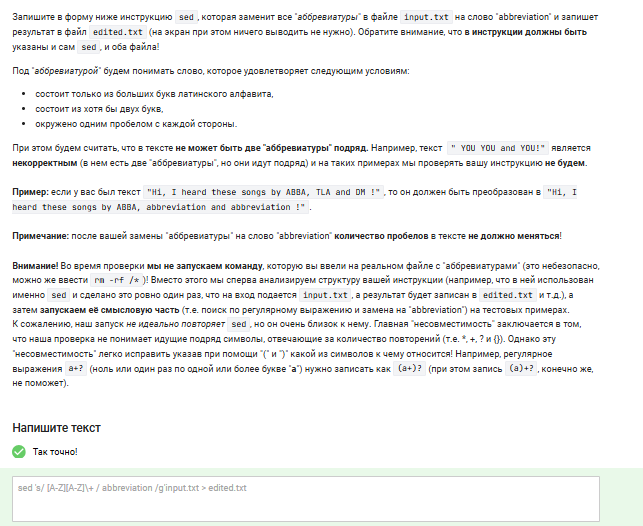{#fig-027 width=70% fig-pos='H'}

sed 's/ [A-Z]([A-Z])+ / abbreviation /g' input.txt > edited.txt — выполняет поиск и замену «аббревиатур» в файле.
sed — вызывает потоковый текстовый редактор.
's/ [A-Z]([A-Z])+ / abbreviation /g' — задает команду замены (s) всех совпадений (g) в строке.
[A-Z] — ищет первую заглавную латинскую букву.
([A-Z])+ — ищет одну или более заглавных букв следом, обеспечивая условие «минимум две буквы».
Окружение пробелами в шаблоне — гарантирует, что слово отделено от другого текста.
input.txt — указывает исходный файл для обработки.
> edited.txt — перенаправляет результат работы в новый файл без вывода на экран.

28) Какую опцию нужно указать при запуске gnuplot, чтобы при его закрытии не были автоматически закрыты и все нарисованные в нём графики?

{#fig-028 width=70% fig-pos='H'}

-p, --persist правильно потому что этот флаг указывает программе оставить окна с графиками открытыми после завершения основного процесса.
-raise неправильно потому что эта опция используется для вывода окна на передний план а не для сохранения его после выхода.
-s, --show-plots-after-exit неправильно потому что такой команды не существует в наборе параметров gnuplot.
Графики и так не закрываются автоматически при закрытии gnuplot! неправильно потому что без специального флага операционная система закрывает все дочерние окна процесса при его завершении.

29) Предположим у вас есть файл data.csv с двумя столбцами по 10 чисел в каждом. В первой строке не записаны названия столбцов, т.е. ряды данных начинаются прямо с первой строки. Вы запускаете gnuplot и вводите в него две команды:

set key autotitle columnhead
plot 'data.csv' using 1:2

Какое в этом случае будет название у построенного ряда данных и сколько будет нарисовано точек на графике?

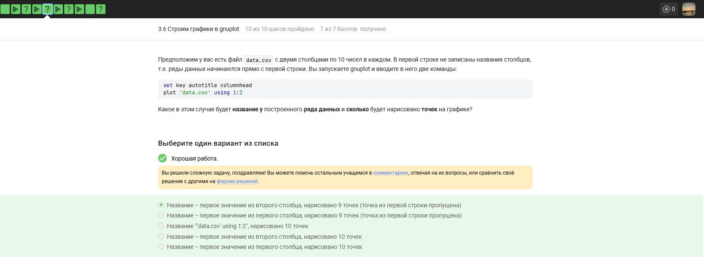{#fig-029 width=70% fig-pos='H'}

Название – первое значение из второго столбца, нарисовано 9 точек (точка из первой строки пропущена) правильно потому что команда set key autotitle columnhead заставляет gnuplot интерпретировать первую строку как заголовки, используя значение из целевого столбца (в данном случае второго) для легенды.
Название – первое значение из первого столбца, нарисовано 9 точек неправильно потому что при построении по двум колонкам (using 1:2) имя ряда берется из заголовка зависимой переменной, то есть второй колонки.
Название "data.csv" using 1:2, нарисовано 10 точек неправильно потому что включенная опция autotitle columnhead отменяет стандартное именование и забирает одну строку данных под заголовок.
Название – первое значение из второго столбца, нарисовано 10 точек неправильно потому что использование первой строки в качестве названия автоматически исключает её из набора отрисовываемых данных.
Название – первое значение из первого столбца, нарисовано 10 точек неправильно потому что неверно указан и источник заголовка, и итоговое количество точек на графике.

30) Предположим, что вы пишите gnuplot-скрипт и у вас в нем есть три переменные x1, x2, x3, в которых записаны координаты важных точек по оси ОХ (по возрастанию). Вы хотите, чтобы на этой оси было только три деления (т.е. три черточки) в этих самых координатах, а подписи этих делений были оформлены в виде "point <номер точки>, value <значение соответствующей переменной>".
Например, для x1=0, x2=10, x3=20, это были бы надписи "point 1, value 0" в точке с координатой 0 по горизонтали,  "point 2, value 10" в точке с координатой 10 и  "point 3, value 20" в точке с координатой 20.
Или, например,  x1=100, x2=150, x3=250, это были бы надписи "point 1, value 100" в точке с координатой 100, "point 2, value 150" в точке с координатой 150 и "point 3, value 250" в точке с координатой 250. 

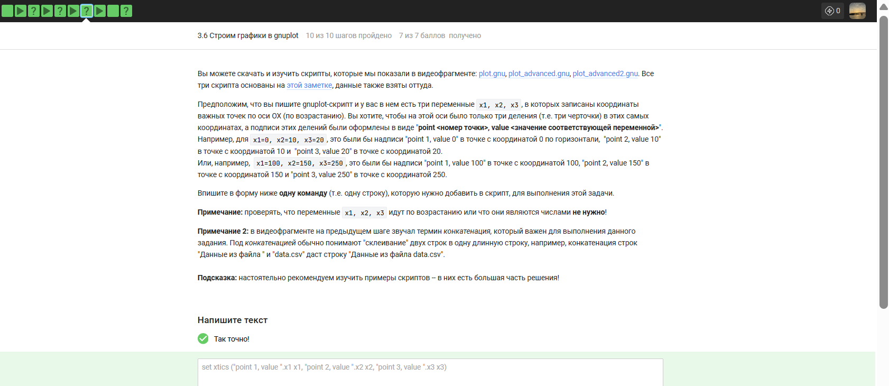{#fig-030 width=70% fig-pos='H'}

set xtics ("point 1, value ".x1 x1, "point 2, value ".x2 x2, "point 3, value ".x3 x3) — устанавливает пользовательские метки на оси абсцисс.
set xtics — команда для настройки делений и подписей горизонтальной оси.
"point 1, value ".x1 — выполняет конкатенацию строковой константы и значения переменной x1 для создания текста подписи.
x1 — второе упоминание переменной после текста указывает координату, в которой нужно разместить созданную подпись.
Запятая — разделяет определения для трех разных точек на оси.
Круглые скобки — группируют список всех настраиваемых делений в одну команду.

31) Указанные файлы использовались в последнем видеофрагменте для создания вращающегося графика. Измените инструкции в файле move.rot (т.е. добавлять и удалять инструкции нельзя!) таким образом, чтобы:

    График отразился зеркально относительно горизонтальной поверхности. То есть там, где была точка (10, 10, 200), станет точка (10, 10, -200), где была точка  (-10, -10, 200) станет (-10, -10, -200) и т.д. При этом точка (0, 0, 0) останется на месте.
    Изображение стало вращаться в обратную сторону. То есть если раньше вращалось "влево", то теперь станет "вправо".
    Вращение стало в два раза быстрее. То есть станет в два раза больше перерисовок графика на каждую секунду вращения.

Измененный файл загрузите в форму ниже.

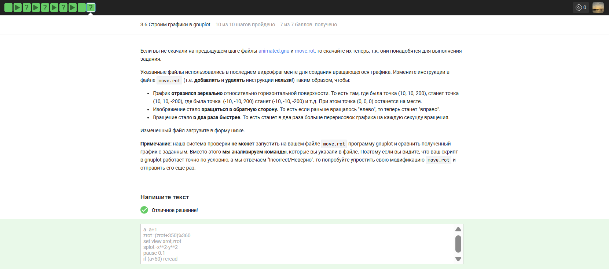{#fig-031 width=70% fig-pos='H'}

a=a+1 — увеличивает счетчик итераций на единицу для управления циклом перерисовки.
zrot=(zrot+350)%360 — изменяет угол вращения на 10 градусов в обратную сторону на каждом шаге, что обеспечивает вращение вправо и увеличивает скорость в два раза.
set view xrot,zrot — устанавливает обновленные углы обзора для отображения трехмерного графика.
splot -x**2-y**2 — отрисовывает функцию с отрицательным знаком, что обеспечивает зеркальное отражение графика относительно горизонтальной плоскости.
pause 0.1 — задает временную задержку между кадрами анимации.
if (a<50) reread — проверяет условие завершения цикла и заставляет программу заново прочитать файл для продолжения вращения.

32) Какая команда(ы) установят файлу file.txt права доступа rwxrw-r--, если изначально у него были права r--r--r--. Укажите все верные варианты ответа!

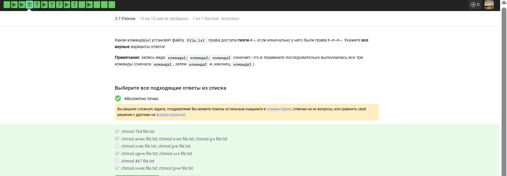{#fig-032 width=70% fig-pos='H'}

chmod 764 file.txt правильно потому что восьмеричное значение 764 соответствует правам rwx для владельца, rw- для группы и r-- для остальных.
chmod a+wx file.txt; chmod o-wx file.txt; chmod g-x file.txt правильно потому что последовательное добавление и удаление прав приводит исходное состояние r--r--r-- к итоговому виду rwxrw-r--.
chmod ug+w file.txt; chmod u+x file.txt правильно потому что добавление права на запись владельцу и группе вместе с правом на выполнение владельцу дает комбинацию rwxrw-r--.
chmod u+wx file.txt; chmod g+w file.txt правильно потому что расширение прав владельца до rwx и группы до rw- при неизменных правах остальных дает нужный результат.
chmod u-wx file.txt; chmod g-w file.txt неправильно потому что эти команды удаляют права, делая итоговую строку доступа еще более ограниченной, чем исходная.
chmod 467 file.txt неправильно потому что этот числовой код установит права r--rw-rwx, что полностью перепутает уровни доступа для владельца и остальных пользователей.

33) Предположим вы использовали команду sudo для создания директории dir. По умолчанию для dir были выставлены права доступа rwxr-xr-x (владелец root, группа root). Таким образом никто кроме пользователя root не может ничего записывать в эту директорию, например, не может создавать файлы в ней. 

После выполнения какой команды user из группы group всё-таки сможет создать файл внутри dir? Укажите все верные варианты ответов!

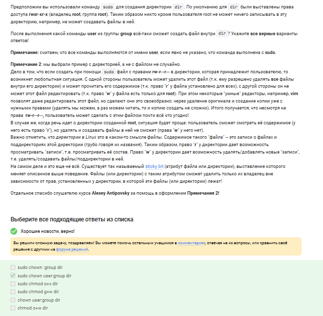{#fig-033 width=70% fig-pos='H'}

sudo chown user:group dir правильно потому что полная смена владельца и группы на текущего пользователя дает ему абсолютное право на запись в эту директорию.
sudo chown :group dir неправильно потому что в исходных правах rwxr-xr-x у группы нет бита записи, поэтому простая смена группы без изменения прав не позволит создавать файлы.
sudo chmod o+x dir неправильно потому что право на исполнение для категории остальных лишь позволяет заходить в папку, но не изменять её содержимое.
sudo chmod g+w dir неправильно потому что в исходных правах rwxr-xr-x группа уже имеет право на чтение и вход, но добавление записи сработает только если пользователь user уже принадлежит к группе root или группа директории будет изменена.
chown user:group dir неправильно потому что выполнение смены владельца требует прав суперпользователя, которых нет у обычного пользователя user без sudo.
chmod o+w dir неправильно потому что изменение прав доступа к объекту может выполнять только его владелец или суперпользователь.

34) Отметьте какие характеристики файла можно посчитать с использованием команды wc.

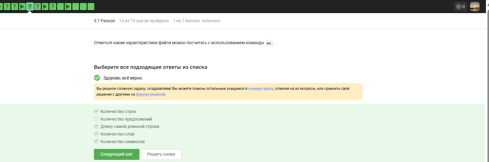{#fig-034 width=70% fig-pos='H'}

Количество строк правильно потому что опция -l команды wc предназначена специально для подсчета символов перевода строки.
Длину самой длинной строки правильно потому что флаг -L позволяет вычислить максимальное количество символов среди всех строк файла.
Количество слов правильно потому что с помощью ключа -w утилита считает последовательности символов, разделенные пробелами или табуляцией.
Количество символов правильно потому что параметры -m или -c позволяют получить общее число знаков или байт в текстовом объекте.
Количество предложений неправильно потому что алгоритмы wc не распознают знаки пунктуации как границы синтаксических единиц и не имеют соответствующей опции.

35) Впишите в форму ниже команду, которая выведет сколько места на диске занимает текущая директория (при этом размер нужно вывести в удобном для чтения формате (например, вместо 2048 байт надо выводить 2.0К) и больше на экран выводить ничего не нужно). В команде указывайте только необходимые для выполнения задания опции и аргументы, лишних опций указывать не нужно!

{#fig-035 width=70% fig-pos='H'}

du -sh . — выводит суммарный размер текущей директории в человекочитаемом виде.
du — вызывает утилиту для оценки использования дискового пространства.
-s — указывает вывести только итоговую сумму для всей директории без детализации по файлам.
-h — переводит размер в удобный формат с суффиксами килобайт, мегабайт или гигабайт.
. — указывает на текущую рабочую директорию как объект для анализа.

36) Впишите в форму ниже максимально короткую команду (т.е. в которой минимально возможное число символов), которая позволит создать в текущей директории 3 поддиректории с именами dir1, dir2, dir3. 

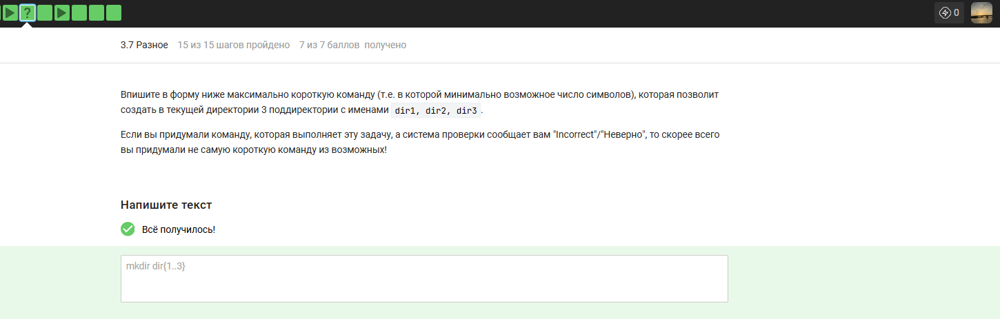{#fig-036 width=70% fig-pos='H'}

mkdir dir{1..3} — создает три директории одной командой с использованием раскрытия скобок.
mkdir — системная утилита для создания новых каталогов.
dir — общая текстовая часть для имен всех создаваемых папок.
{1..3} — механизм раскрытия последовательности в Bash, который генерирует числа от 1 до 3, подставляя их в имя.

# Выводы

В ходе работы были я освоила операционную систему Линукс на более высоком уровне, научилась использовать полезные команды, научилась пользоваться различными программами
