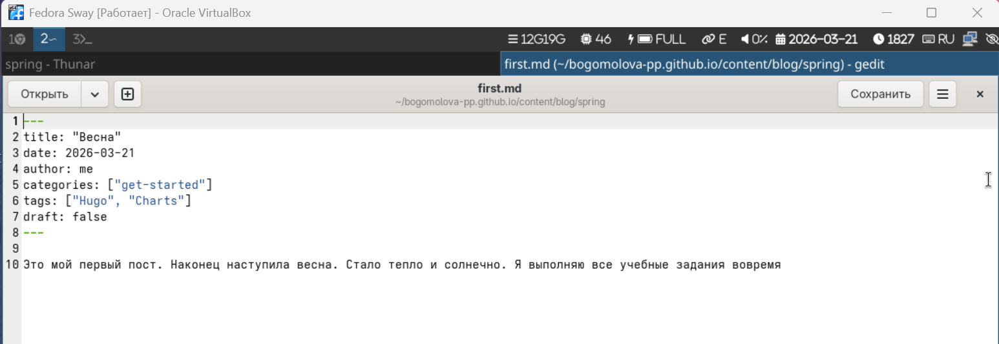
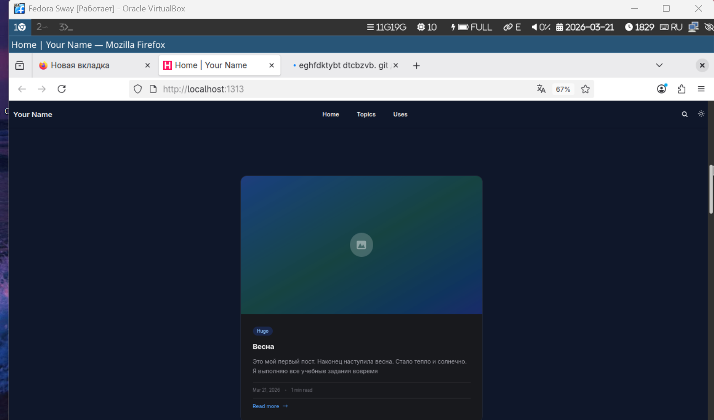
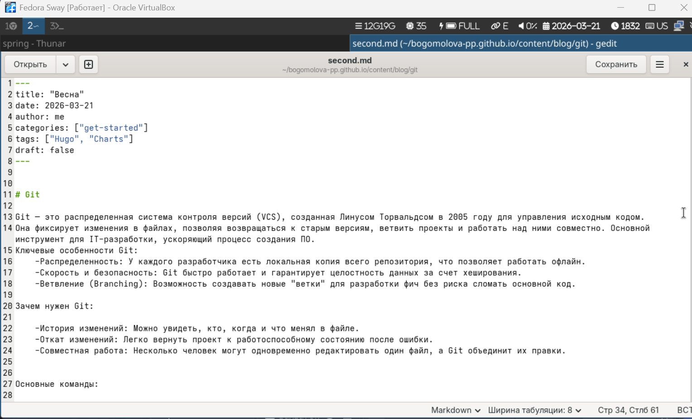
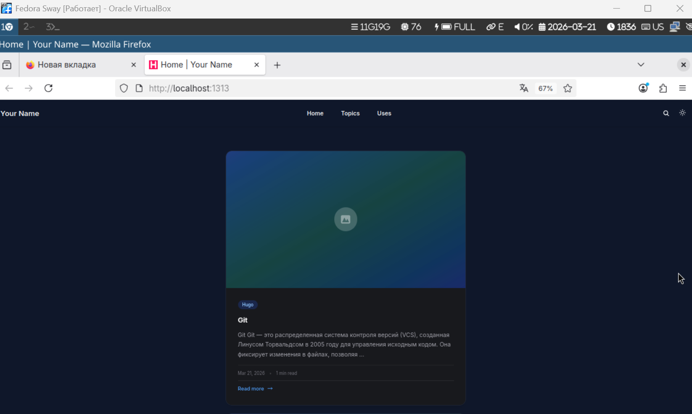

# Информация о докладчике

Богомолова Полина Петровна,
ФФМиЕН,
НКАбд01-25,
1032253562
---

# Цель работы

Научиться создавать и редактировать сайт

---

# Задание

Разместить фото, сделать краткое описание, интеересы, образование, пост по прошедшей неделе, пост на тему гит

---

# Информация

Напишем информацию о владельце сайта, добавим ее и фото на сайт

{#fig-001 width=50%}

--- 

# Сайт

Откроем сайт с помощью команды hbx dev и посмотрим, все ли было добавлено

{#fig-002 width=50%}

---

# Пост 1

{#fig-003 width=50%}

---

# Пост на сайте

{#fig-004 width=50%}

---

# Пост 2

{#fig-005 width=50%}

---

# Пост 2
{#fig-006 width=50%}

---

# Пост 2 на сайте

{#fig-007 width=50%}

---

# Выводы

Мы научились работать с сайтом, редактировать его и создавать новые посты
