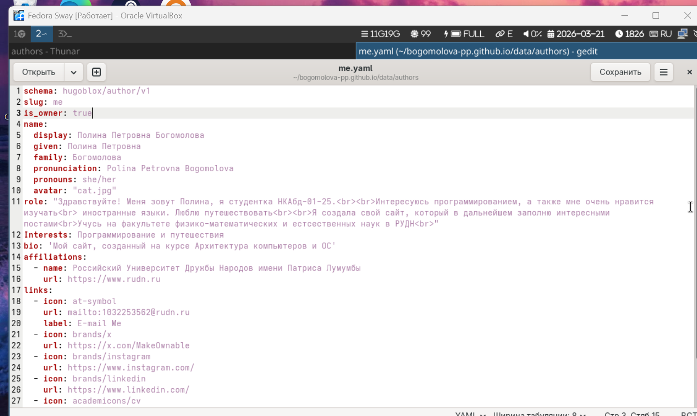
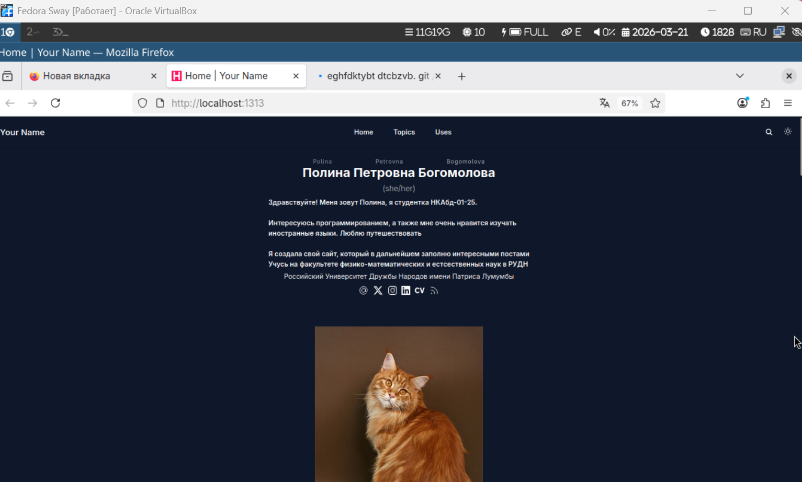
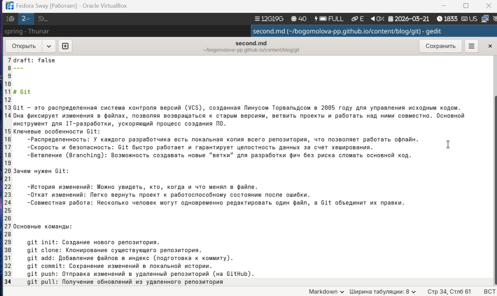

---
## Author
author:
  name: Богомолова Полина Петровна
  orcid: НКАбд-01-25
  email: 1032253562@rudn.ru
  affiliation:
    - name: Российский университет дружбы народов
      country: Российская Федерация
      postal-code: 117198
      city: Москва
      address: ул. Миклухо-Маклая, д. 6

## Title
title: "Отчет по 2 этапу проекта"
subtitle: "Создание сайта"
license: "CC BY"
---

# Цель работы
Научиться создавать и редактировать сайт

# Задание

Разместить фото, сделать краткое описание, интеересы, образование, пост по прошедшей неделе, пост на тему гит

# Выполнение лабораторной работы

1) Напишем информацию о владельце сайта, добавим ее и фото на сайт

{#fig-001 width=70%}

2) Откроем сайт с помощью команды hbx dev и посмотрим, все ли было добавлено

{#fig-002 width=70%}

3) Создадим файл для первого поста, который будет о прошедшей неделе

{#fig-003 width=70%}

4) Откроем сайт и посмотрим, добавился ли наш пост

{#fig-004 width=70%}

5) Напишем файл со вторым постом о гит

{#fig-005 width=70%}

{#fig-006 width=70%}

7) Зайдем на сайт и проверим, создался ли наш новый пост о гит

{#fig-007 width=70%}

# Выводы

Мы научились создавать и редактировать сайт 

