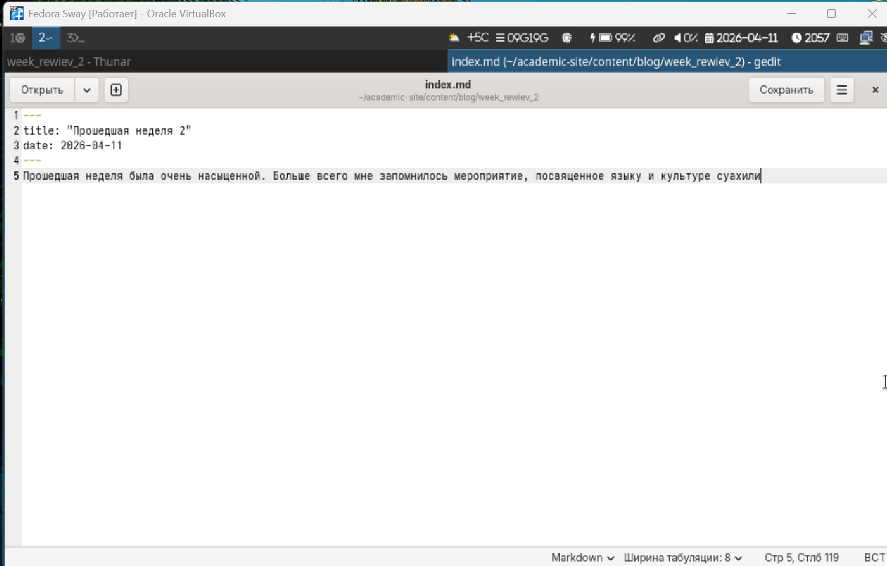
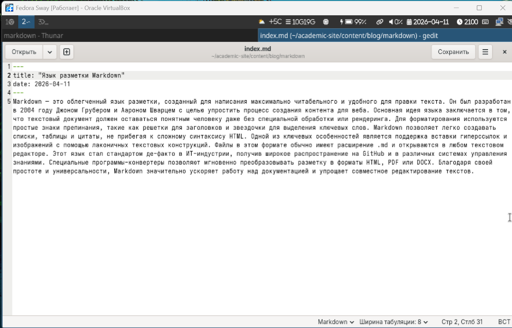
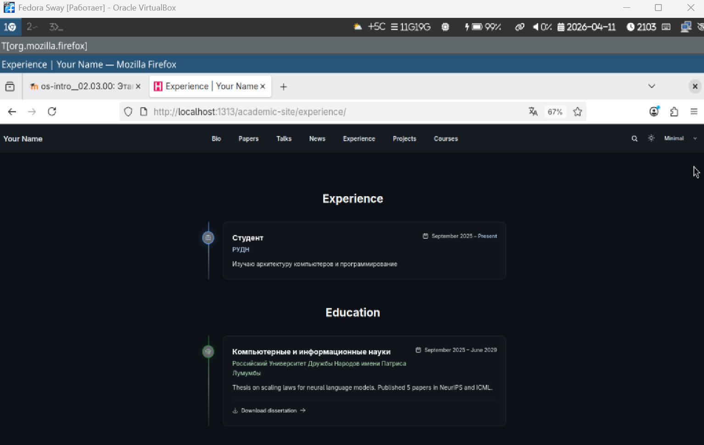
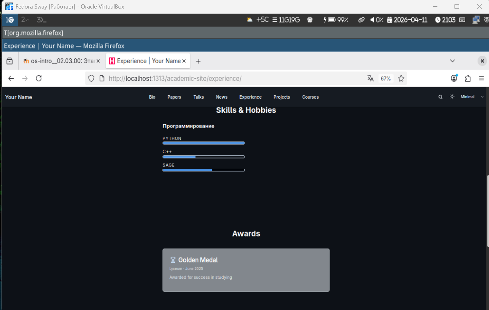

# Информация о докладчике

Богомолова Полина Петровна,
ФФМиЕН,
НКАбд01-25,
1032253562
---

# Цель работы

Научиться редактировать сайт

---

# Задание

Добавить на сайт информацию о достижениях, навыках и об опыте. Создать 2 поста. 1 из них по прошлой неделе, второй по теме на выбор

---

# Информация

Добавление информации

{#fig-001 width=50%}

--- 

# Пост по прошедшей неделе

{#fig-002 width=50%}

---

# Пост про язык разметки markdown

{#fig-003 width=50%}

---

# Сайт

{#fig-004 width=50%}

---

# Сайт

{#fig-005 width=50%}

---

# Сайт
{#fig-006 width=50%}

---

# Сайт

{#fig-007 width=50%}

---

# Выводы

Мы научились работать с сайтом, редактировать его и создавать новые посты
