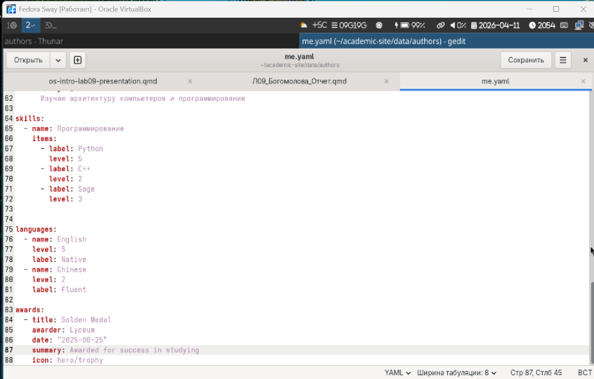
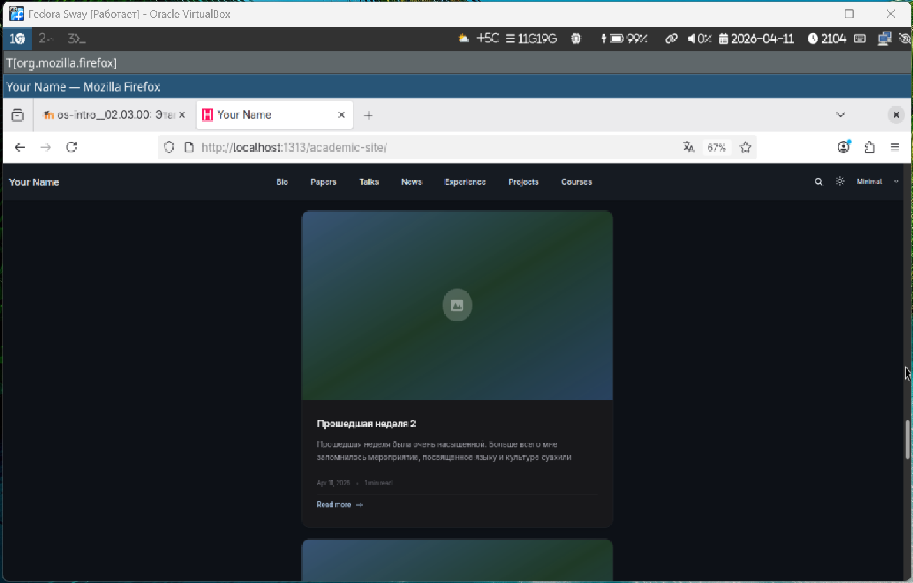
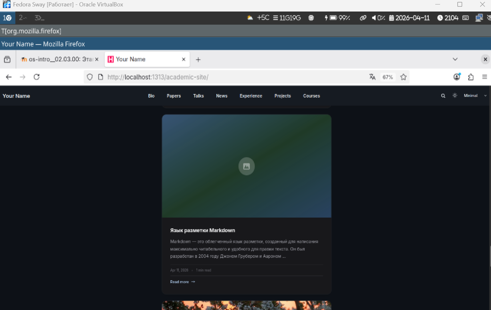

---
## Author
author:
  name: Богомолова Полина Петровна
  orcid: НКАбд-01-25
  email: 1032253562@rudn.ru
  affiliation:
    - name: Российский университет дружбы народов
      country: Российская Федерация
      postal-code: 117198
      city: Москва
      address: ул. Миклухо-Маклая, д. 6

## Title
title: "Отчет по 3 этапу проекта"
subtitle: "Создание сайта"
license: "CC BY"
---

# Цель работы
Научиться редактировать сайт

# Задание

Добавить на сайт информацию о достижениях, навыках и об опыте. Создать 2 поста. 1 из них по прошлой неделе, второй по теме на выбор

# Выполнение 3 этапа проекта

1) Добавляем информацию

{#fig-001 width=70%}

2) Создаем пост по прошедшей неделе

{#fig-002 width=70%}

3) Создадим пост по языку разметки markdown

{#fig-003 width=70%}

4) Просматриваем сайт

{#fig-004 width=70%}

5) Просматриваем сайт

{#fig-005 width=70%}

6) Просматриваем сайт

{#fig-006 width=70%}

7) Просматриваем сайт

{#fig-007 width=70%}

  

# Выводы

Мы научились редактировать сайт 

