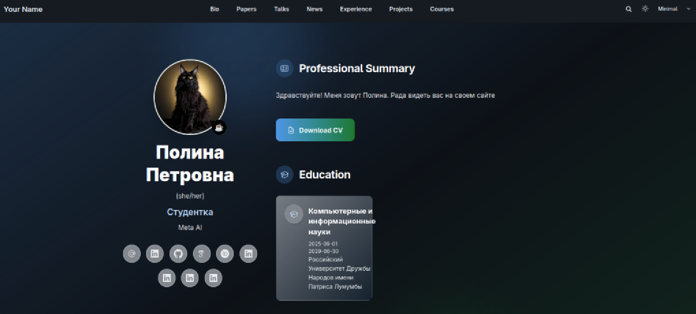
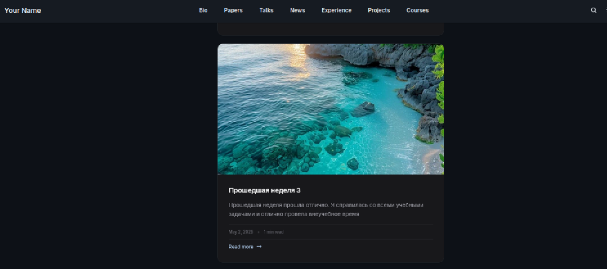
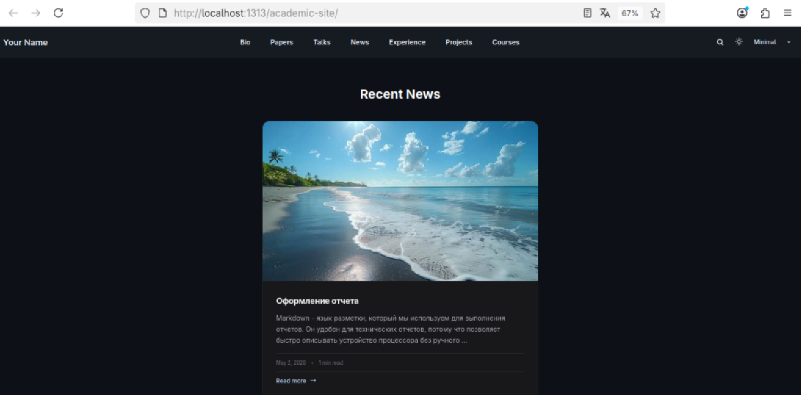

# Информация о докладчике

Богомолова Полина Петровна,
ФФМиЕН,
НКАбд01-25,
1032253562
---

# Цель работы

Научиться редактировать сайт

---

# Задание

Добавить к сайту ссылки на научные и библиометрические ресурсы.

Зарегистрироваться на соответствующих ресурсах и разместить на них ссылки на сайте:

eLibrary : https://elibrary.ru/;

Google Scholar : https://scholar.google.com/;

ORCID : https://orcid.org/;

Mendeley : https://www.mendeley.com/;

ResearchGate : https://www.researchgate.net/;

Academia.edu : https://www.academia.edu/;

arXiv : https://arxiv.org/;

github : https://github.com/.

Сделать пост по прошедшей неделе.

Добавить пост на тему по выбору:

- Оформление отчёта.

- Создание презентаций.

- Работа с библиографией.

---

# Ссылки на ресурсы

Добавление информации

{#fig-001 width=50%}

--- 

# Пост по прошедшей неделе

{#fig-002 width=50%}

---

# Пост про оформление отчета

{#fig-003 width=50%}

---

# Выводы

Мы научились работать с сайтом, редактировать его и создавать новые посты
